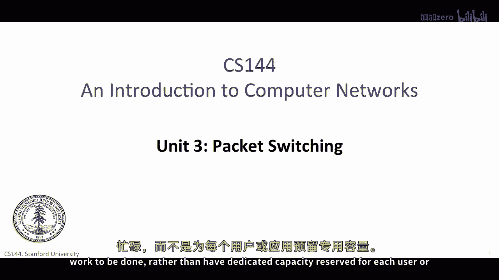

# 计算机网络课程 P51：分组交换技术回顾 📦

在本节课中，我们将一起回顾分组交换技术的核心概念。分组交换是现代网络（包括互联网）的基础，理解其工作原理对于掌握网络动态至关重要。我们将从分组交换的基本原理开始，逐步深入到数据包延迟的构成、队列模型以及网络如何提供服务质量保证。

---

## 概述：为什么是分组交换？ 🤔

我们从探讨现代网络（包括互联网）为何基于分组交换技术开始。分组交换在理论上简单，因为每个数据包都是一个包含数据的独立单位。它携带到达其目的地所需的所有信息。

分组交换在效率上高效，因为它能保持链路的忙碌状态。每当有数据传输需求时，网络就会工作，而不是为特定用户或应用程序保留专用容量。此外，分组交换有助于网络快速从故障中恢复。其简单的转发范式——每个路由器中不维护每个流的状态——使得在链路或路由器故障后能更容易地快速重新路由数据。

---

## 分组交换的动态特性与数学基础 📊

分组交换的动态特性决定了互联网的许多定时和执行特性。因此，对数据包动态有深入的理解非常重要。主要的数学思想并不复杂，现在掌握它们有助于建立强大的直觉。

你现在已经知道，为什么在两个相同的源主机和目的主机之间传输的两个数据包可能会遇到不同的延迟。尽管它们在每个链路上传输的时间相同，但这些数据包可能走不同的路径，并在路由器中经历不同的**队列延迟**。

---

## 数据包延迟的三大组成部分 ⏱️

在深入探讨的过程中，理解数据包延迟的三个主要组成部分至关重要：**分组化延迟**、**传播延迟**和**队列延迟**，并且需要理解导致这些延迟的物理过程。

你应该养成画草图的习惯，并使用简单的确定性队列模型。这是一个简单的几何构造，能让你可视化正在发生的事情。它告诉我们路由器为什么需要缓冲区，并让我们思考缓冲区应该设置多大。它还告诉我们，流媒体应用需要**播放缓冲区**，以便为用户提供平滑的聆听或观看体验。当我们研究流量控制时，也会使用相同的方法。

---

## 超越简单的先到先服务 🔄

最后，我们使用简单的确定性模型来学习网络如何超越简单的“先到先服务”数据包交付。分组交换网络可以保证每个流接收的速率，甚至限制数据包从网络一端到另一端的延迟。这需要一些仔细的思考。

不要害怕这些概念一开始难以掌握。在第一部分有一些困难的概念，但它们很重要。如果你能理解分组交换网络如何提供速率和延迟保证，那么你就对分组交换的工作有了深入的理解。

---

## 本单元核心知识点总结 📚

你在这个单元中学到了很多。以下是核心知识点的总结：

### 1. 数据包延迟的构成
一个数据包从源主机到目的主机的旅行时间由三个组件决定：
*   **分组化延迟**：在每个链路上传输数据包所需的时间。公式为：`分组化延迟 = 数据包大小（比特） / 链路带宽（比特/秒）`。
*   **传播延迟**：比特在物理介质（如电缆或空气）中传播到链路另一端所需的时间。公式为：`传播延迟 = 距离 / 传播速度`。
*   **队列延迟**：数据包在路由器缓冲区中等待转发的时间。这是延迟的可变部分，取决于网络当前的繁忙程度。

确保你明白**传播延迟**和**分组化延迟**之间的差异，因为这是导致混淆的常见原因。

### 2. 播放缓冲区的作用
实时流媒体应用（如Skype、YouTube和Netflix）需要向我们的耳朵和眼睛持续提供实时语音和视频，尽管网络在不可预测的时间交付数据包。所有流媒体应用都使用**播放缓冲区**来平滑数据包延迟的各种变化，从而可以向用户连续播放视频和音频，而不必频繁暂停等待新数据。你学会了如何设计一个播放缓冲区，也理解了互联网无法完全避免暂停的原因（例如，当数据包经历较大延迟导致播放缓冲区耗尽时）。

### 3. 确定性队列模型
路由器中的排队是一个复杂的主题。我们希望你能够对队列的演变有一些直觉。**确定性队列模型**是对队列中数据包的几何表示，它让我们可以可视化队列随时间的演变。使用这个模型来帮助你建立关于数学如何工作的直觉是一个很好的习惯。

### 4. 速率与延迟保证
确定性队列模型帮助我们理解速率保证。例如，网络服务提供商可以通过在路由器中为特定流量（如来自斯坦福大学的所有数据包）设置专用队列并分配特定带宽（如10 Gbps），来保证其最小服务速率。这个想法可以扩展以提供**延迟保证**。通过控制队列的服务速度和限制队列的长度，我们可以限制数据包在队列中的最大延迟。

### 5. 数据包交换与转发
正如你所看到的，以太网交换机和互联网路由器的工作方式非常相似。当一个数据包到达时，它会在**转发表**中查找目的地地址。如果找到匹配项，它就将数据包转发到相应的出站链路，并在出站链路忙碌时将其存储在缓冲区中。互联网路由器和以太网交换机在使用的地址类型（如IP地址 vs MAC地址）以及转发表的组织方式上有所不同，并且互联网路由器会减少TTL字段以防止路由循环。但从高层次来看，数据包交换机大致以相同的方式工作。

---

## 学习成果与应用 🎯

你在这个单元中学到的东西将在许多方面帮助你：
*   你可以根据网络描述（链路速度、长度、数据包大小）计算数据包从源到目的地的固定延迟部分。
*   你可以通过绘制队列图来可视化可变的队列延迟，这是网络中可变端到端延迟最常见的原因。
*   你可以解释数据包交换机（如以太网交换机或互联网路由器）的工作原理。
*   你可以为实时应用设计一个播放缓冲区。
*   你可以解释一个通过数据包交换机的数据流如何能够以最小保证速率进行交付。

---

本节课中，我们一起回顾了分组交换技术的核心原理、数据包延迟的构成、队列模型以及网络服务质量的基本概念。掌握这些知识，是理解更复杂网络协议和现象的重要基石。