# P53：p52 4-1 Congestion Control - Basics - 加加zero - BV1qotgeXE8D

在接下来的几段视频中，我们将探讨流量控制，流量控制是网络领域的一个非常重要主题，因为每当我们有一个网络，特别是分组交换网络，如互联网，它总会遇到流量拥堵，无论是短期还是长期。

控制这种拥堵以防止网络崩溃是非常重要的，因此，我们将学习什么是流量拥堵，嗯，如何控制它，流量控制的基本方法。

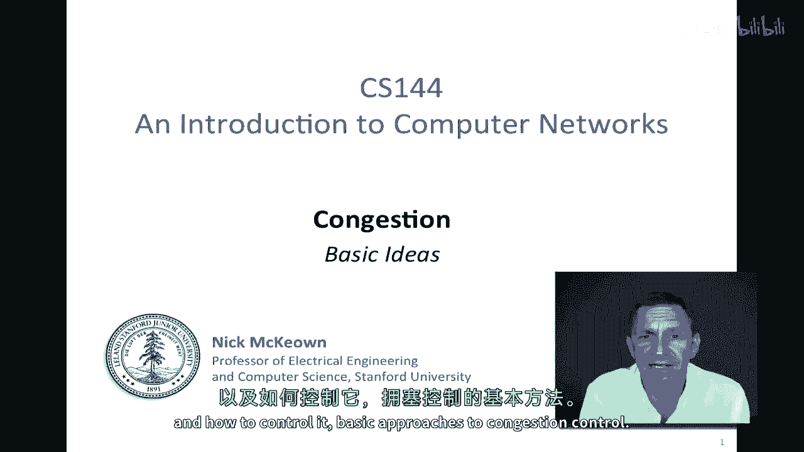

然后，我们将专门研究互联网上的情况，嗯，流量控制发生在TCP协议内部，TCP有明确的流量控制支持，我们将研究它如何做到这一点，以及它如何随时间演变，然后，我们将探讨这些决策的一些后果。

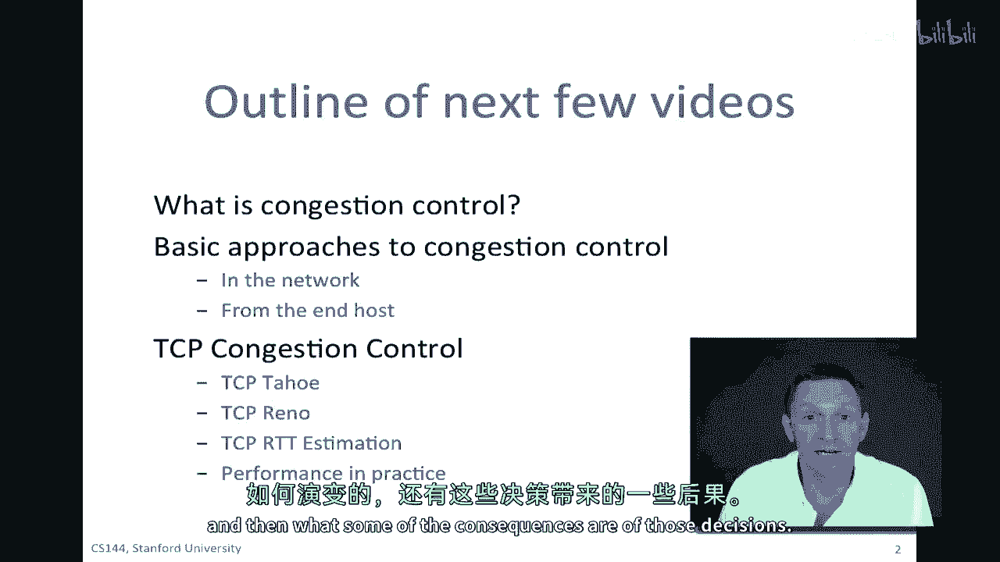

让我们从思考什么是流量拥堵开始，流量拥堵可能发生在多个时间尺度上，我将在这里提供三个例子，第一个是在非常短的时间尺度上，当包在路由器中碰撞时，例如，想象我们有两个包，第一个在这里以红色到达。

第二个稍后到达，都目的地相同，因为它们同时到达，其中一个可以离开，另一个将被排队，在路由器中会出现暂时的队列堆积，第二个流量拥堵的公式是在稍长的时间尺度上，即在流量级别。

在往返时间或多个往返时间的时间尺度上，如果你认为流量是一个通信，如TCP流量，通信在一个较长的时期内进行，在多个往返时间内，例如，下载网页或发送电子邮件，然后流量的速率可能会改变。

我在这里显示了一个红色的和一个绿色的，这些可能都在路由器的缓冲区中通过，试图通过相同的出站链接，如果他们的总速率超过了出站链接速率，在这里似乎就是这样，然后缓冲区会堆积，最终会溢出，因此。

我们需要做些什么来防止这些流量继续，压倒那个链接，否则我们就会丢一大批包，并在网络性能中引发崩溃，第三种类型在时间尺度上更长，大约是人类的时间尺度，当峰值时段有太多用户使用链接时。

这可能是一个连接到非常繁忙的Web服务器如CNN的链接，或Google，Google，早晨人们可能会来，都想在同一时间通过链接阅读咖啡，可能会压倒它，所以这将在更长的时间尺度上，是我们最感兴趣的一种。

当我们谈论流量控制时，是这个在中间的一种，我们将研究如何控制TCP流的拥堵，特别是，持续时间超过往返时间的流量，我们有机会向发送者发送消息或向发送者发送信息，或对于发送者。

仅仅学习它应该改变网络中的数据量，以防止路由器持续拥堵的发生。

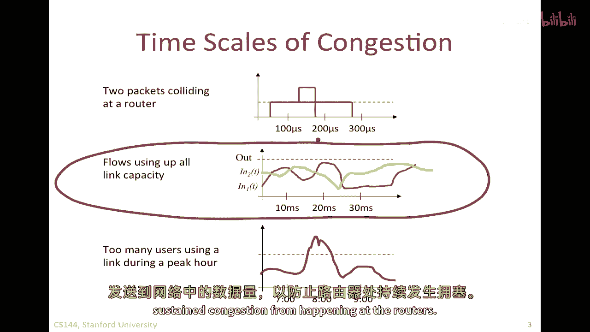

让我们再深入一点，并思考拥堵的含义，以例子来说，我们看这里，源A和B都被训练发送到同一个目的地X，流量，他们都想要持续以12兆比特/秒的速度发送，但路由器到X的链接，只能以12兆比特/秒的速度发送。

顺便说一句，这里的数字12并没有魔法，只是因为它会使数学更容易，A有一个同意持续发送12的速率，B可以发送持续发送12的速率，这里，这是路由器缓冲区的出发率，以及离开链接之前的率只能发送12。

如果我们看，嗯，在我们的确定性队列模型中，并假设这是持续速率，所以这将是t，这将是累积的，累积数据集，所以我们会只是想到这个，作为链接上累积的比特，我们将有一个t，它将以12兆比特/秒的速率累积。

所以这个的梯度是12兆比特/秒，所以a2的t也将是12兆比特/秒，我不会尝试将那个叠加上去，但是d of t也会这样，如果我们看一个一加上一个二，所以这将是一个一加上一个二。

当然这里让我来用不同的颜色画这个，这将是d of t，然后我们可以看到会有一个q会积累q of t，而q of t只是一直在增长和增长，这将会一直增长，因为到达率超过了离开率。

所以因此最终包会被丢弃并重新传输，请注意，这些传输将增加网络中的交通量，因为这些重传，向下这里将发送更多的流量，并且会使其更加拥堵，所以拥堵实际上可以产生反馈效应，使事情变得更坏。

通过引起更多的流量被发送到网络中，这也意味着嗯，那，那到达率在这里，尽管它将是一个持续的到达率进入队列，但它必须，在某种意义上，被截断，因为离开的速率显然不能超过每秒十二兆比特，现在让我们假设一下。

如果缓冲区是无限的。

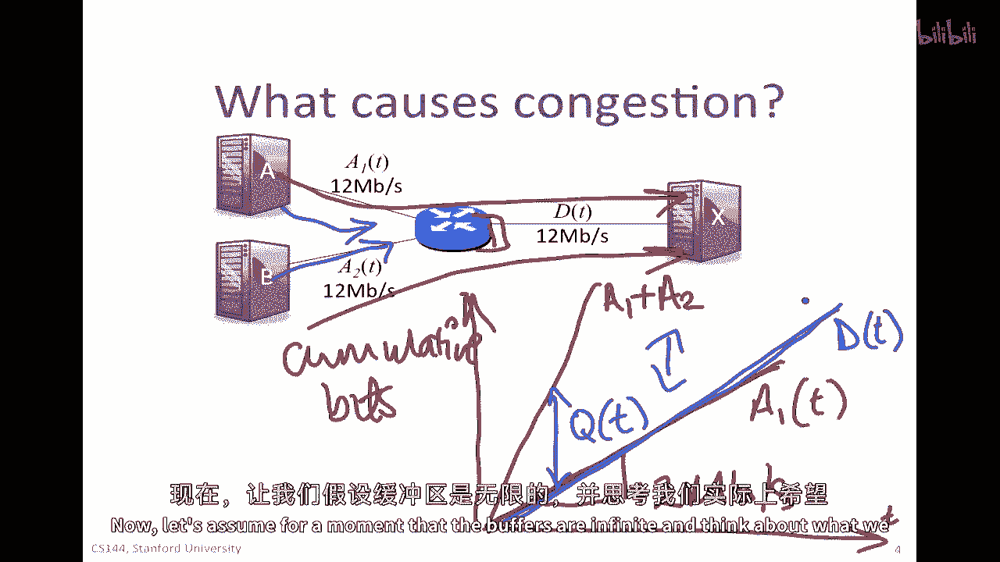

嗯，思考一下我们实际上在这里想要发生的事情，假设而不是一个t，这是率r1，第一个a想要发送的，我们将这个称为r2，并且我们说这里的速率是我们的，当然，这些都是可能的值，在实际操作中，"可以合理期待"。

如果r一和r二都大于r除以二，"然后我们会给每个人"，"我们将实际为每个人分配率r的一半"，"所以如果他们都想要超过那出链接的一半"，那么，似乎他们两人都应该得到r的平方除以二的结果。

"所以这个例子非常简单"，总的来说，网络中的拥堵可能在任一点发生，只要有一个流量，两个流量，或者任何数量的流量，一些流量可能在这个特定的拥堵路由器处遇到瓶颈，嗯，而其他的可能不会，他们可能有流量。

这些流量可能在网络中的其他某个路由器处遇到拥堵。

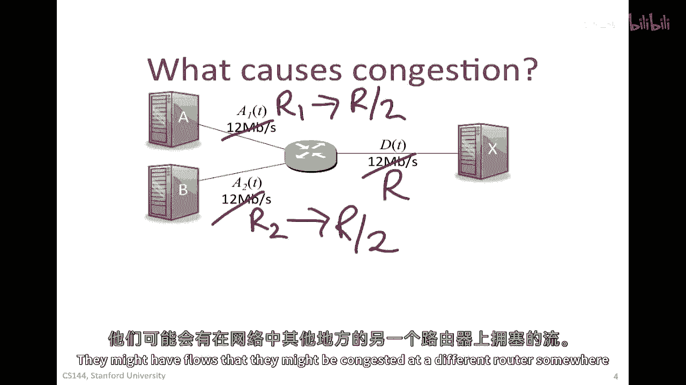

所以让我们看一个稍微复杂的例子，首先我们来看看正在发生的事情，嗯，我们已经有了一些，再次使用源a和b，想要发送每秒12兆比特，我们现在有了第三个源，想要发送每秒12兆比特，我们现在有了第二个路由器。

以及所有的链接，这里的两个链接都是再次每秒12兆比特，首先注意，肯定会有包被丢弃，如果来自a、b和c的流量以持续每秒12兆瓦特的速度运行，显然网络中有拥堵，它们都可以贡献于这种拥堵，其次注意。

来自a和b的任何包，如果通过第一个路由器，然后在第二个路由器中被丢弃，如果它们是因为第二个链接的拥堵而被丢弃的，将是网络流量的浪费，换句话说，他们已经使用了这里宝贵的拥堵资源，如果他们在这里被丢弃。

那么发送它们的意义并不大，因此，思考如何将信息返回给源是有价值的，以便不再通过网络发送不必要的流量，只是为了在下游路由器中被丢弃，第三注意，最后一个链接的分配并不明显。

如果路由器只是每个瓶颈处均匀分配使用，换句话说，我们分为五五开，那么在这个点这里，通过这条链接这里，我们将看到来自a的6兆比特和来自b的6兆比特每秒，如果我们在这里分为五五开。

那么我们将看到来自c的6兆比特每秒，我们将看到第二路由器输入的一半，所以我们将看到来自a的3兆比特和来自b的3兆比特，总计为12兆比特，这不清楚这就是我们想要的，它可能我们实际上想要每个都得到4。

这可能是一个更合理的事情，以便他们各自获得那个最后一个路由器的相等访问权，因此，我们需要思考如何分配可用的容量，现在让我们让它稍微复杂一些，想象我们有一个额外的发送者，D想要只发送每秒1兆比特。

所以d想要发送比a的速率低，比其他所有人的速率都低，那么它应该被允许以什么速率发送，我们可能会说每个人都应该以低于他们请求的速率发送，因为链接拥堵，换句话说，因为链接在这里会拥堵。

因为这里有12兆比特的流量，因为总共有24兆比特，三十六，三十七兆比特每秒，想要流经的，每个人都应该以慢速作为，因此，另一方面，我们可以说，因为d要求少于其公平份额的链接，所以这里有一个链接。

并且有四个因为它们要求少于每秒三兆比特，也许我们应该给它全部一个，所以我们将在公平性的定义中看到更多的例子，一会儿。

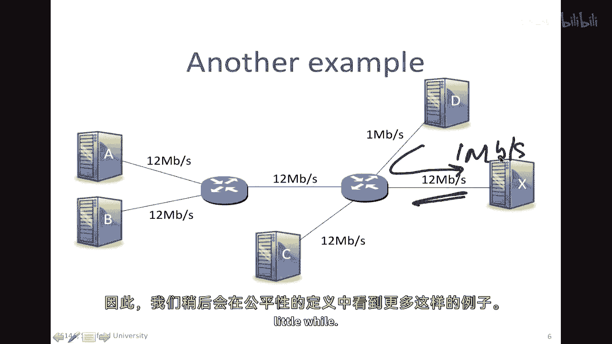

需要注意的是，包交换网络中的拥堵是不可避免的，我的意思，从理论上说，这可能是一件好事，我们使用包交换，因为它有效地利用链接，因为统计复用，因此，路由器的缓冲区经常被占用，并且很可能溢出，实际上。

如果缓冲区总是空的，那么链接将大部分时间保持安静，因此，延迟将低，但我们对网络的使用将低，因此，我们将以低效的方式使用网络，如果缓冲区总是被占用，虽然延迟高，我们将看到网络被高效使用，因为它将始终忙碌。

所以我们将看到拥堵是，嗯，它是网络的一个真正不可避免的属性，有一点拥堵是好事，因为它保持网络的使用率高，我们只需要能够控制它来停止我们，嗯，不要让延迟太高，不要让丢包太高，使网络变得无法使用。

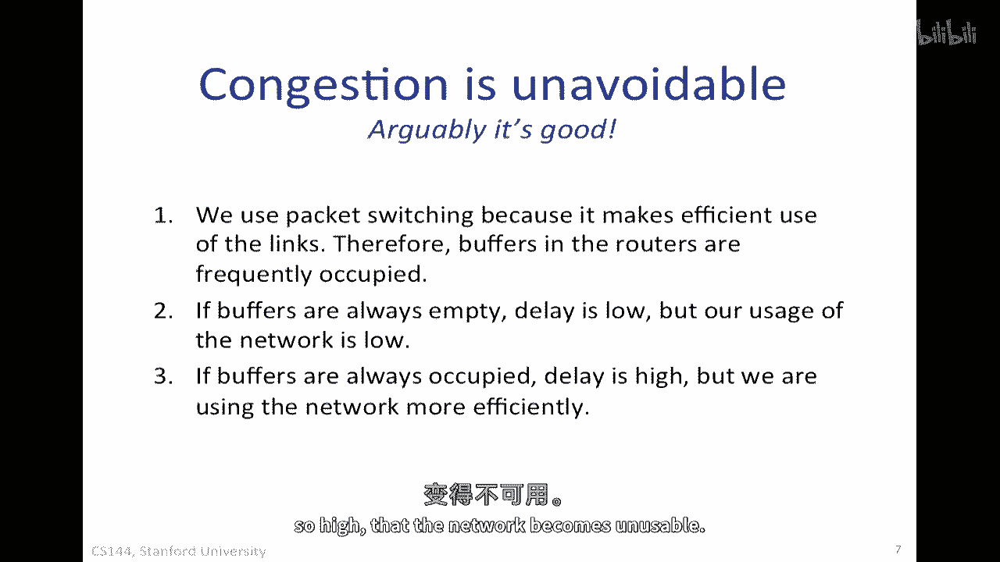

我们已经看到的一些观察，拥堵是必然的，而且从理论上说是可取的。

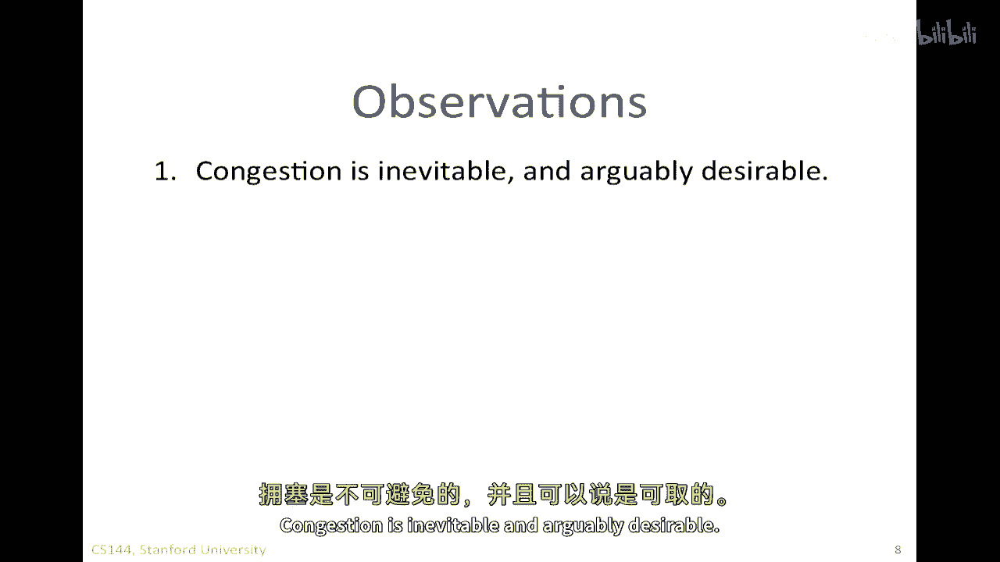

拥堵发生在不同的时间尺度上，从包碰撞到一些流量的出现，发送太快，出现在人群密集的地方，出现在网络中，如果包被丢弃，重传可能会使拥堵甚至更糟，当包被丢弃时，它们在被丢弃之前在上游浪费了资源，这是不好的。

我们需要公平性的定义来确定我们想要如何共享瓶颈链接，下一个。

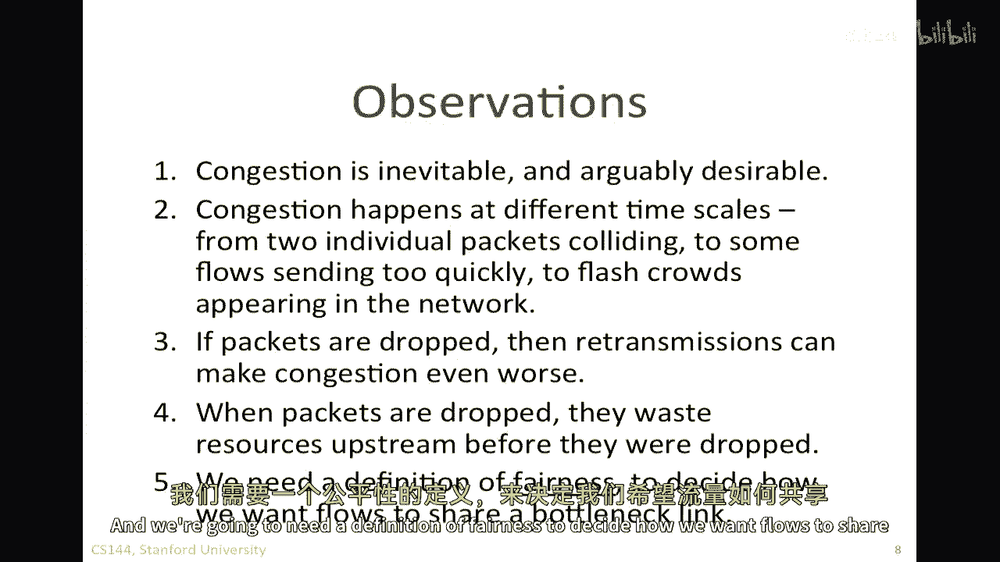

我们将探索我们希望在网络中看到的公平性类型，因为这将帮助我们思考如何设计一个拥塞控制机制，所以让我们考虑一个例子，当我有一个包含三个路由器的网络时，这里有三个通过链接连接的路由器。

我假设第一条链接的速率是二，第二条链接的速率是一，然后我将有三个源，A、B和C都连接，他们将通过网络发送这样的数据流，第一个通过第二个路由器的是蜜蜂，然后，C的流量在第二个路由器停止。

然后通过第三个路由器出去，所以，问题是如何公平地分配速率，如果他们都想通过网络发送最大速率，让我们考虑我们将分配给这些的速率，这些流量，第一个分配是1，在其中，我将给一个流量分配0。25，成为一个流量。

看到一点七五的速率，然后看到一点七五的速率，我没有在任何一个上超过速率，这里有一个总和，这里有两个总和，这里的总吞吐量是一点七五，再加上零点七九，二点五是二点七五，现在让我来考虑一个不同的速度分配。

我也会叫这个，在这个速度分配中，我分配一点五，我分配C一点五，而且我要给B1。5分，这总共有1。5分，再加上0。5分就是2。5分，所以实际上整体吞吐量更低，但如果你看这里链接，这基本上是网络的瓶颈链接。

我给了同样的分数，因为我必须给A，所以我们可能会说这一个更公平，所以这里有一个公平性和吞吐量之间的权衡，一种我们在给瓶颈链接相等使用与吞吐量之间的权衡，并且在我们试图最大化总体通量的地方，在这里。

基本上我们可以看到a在第二个地方被惩罚了，在第一个地方，在第一次分配中，它只有0。2的速率，5，因为它在网络中通过了多个链接，因此，我们可以看到公平性和通量可能相互矛盾。

所以在我们开始设计或比较控制拥堵的方法之前，我们可以，我们需要一种定义，明确我们想要实现的公平性类型。

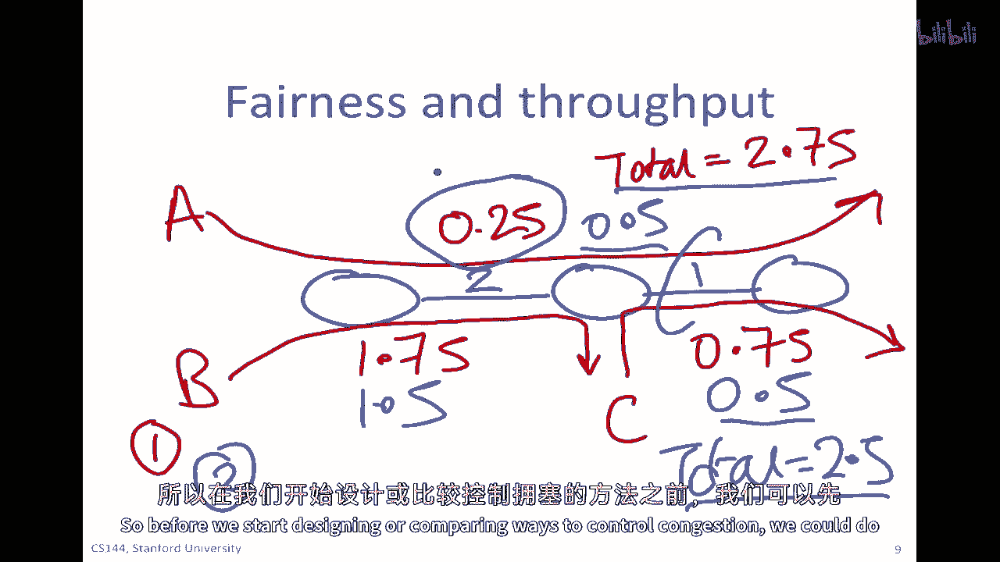

我们将使用的定义被称为最大最小公平性，或最大化最小值，这是一种广泛使用的公平性定义，嗯，这并不是我们唯一可以使用的定义，它使 sense 因为它试图最大化小流量率，同时确保任何想要。

它都可以平等分享其瓶颈链接，所以正式定义在这里显示，并且分配是最大最小公平的，如果你不能增加一个流量的速率，而不减少另一个速率较低的流量的速率。

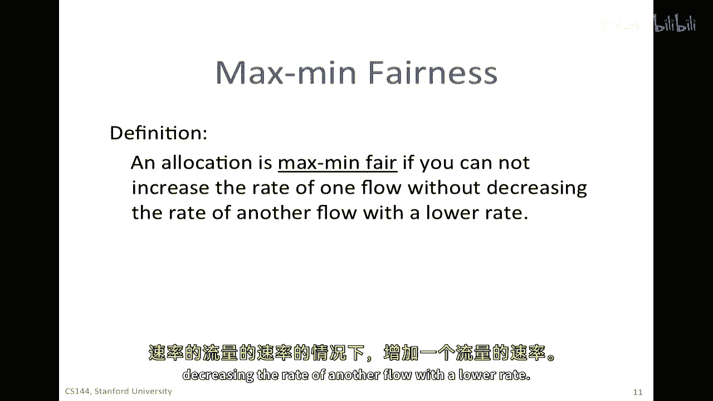

让我们来看看这在我的例子中意味着什么，在我之前向你展示的第二次分配之前，实际上最大最小公平公平，因为如果我们增加b的速率，所以如果我们试图将这个一个这里超过1。5，我们就必须减少a的速率，a的速率。

所以这个是a，我们只能增加，每当我们增加一个，我们会减少一个更低的，因此这就是最大公平分配，它本质上意味着链接，共享瓶颈的，例如，这里会有相等的分配，如果他们想要使用所有那个链接。

或者更多更多超过他们的公平份额，他们会被限制在他们的公平份额。

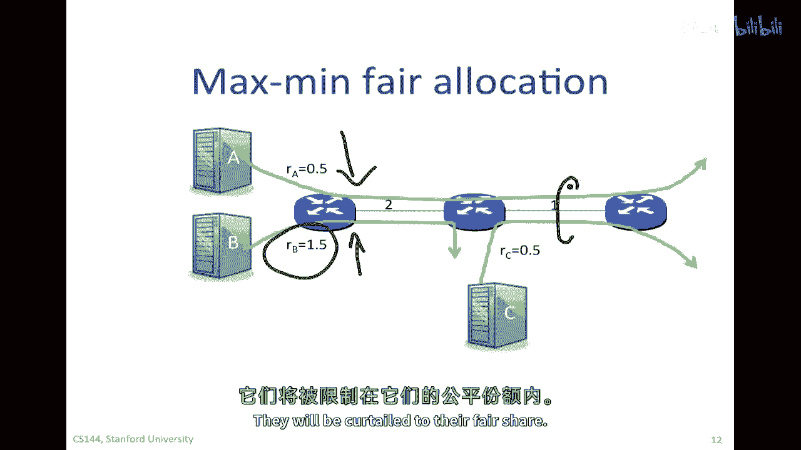

所以他们各得那的一半，让我为您在一个单个链接上演示一个例子，这将更容易理解，所以，在一个单个链接上的一个非常简单和直观的定义，所以如果我们有一个路由器，让我在这里画一个路由器。

并且我有a和b想要连接到那个路由器在，嗯，每秒五兆比特，我就说五点一，然后它从里面发出一个速率为一的链接，接下来让我们考虑有一个第三个，C想在点二处连接到它，所以通过这里我们想要发送通过的总速率。

来自a和c的是1。7，但我们只有速率为一，那么公平的分配应该是什么，C是最小的，所以我们将从分配最小的开始，而C想要的少于其公平份额，换句话说，公平的分配应该是每个占三分之一，它想要0。2。

这少于三分之一，所以我们将分配给它，0。2，这将留下0。8在这个链接上，而其他两个的公平分配现在将是0。4，0。8的一半，每个都想要更多，所以它将被缩短到四点，而且B也想要超过，嗯超过四点。

所以它也将得到四点，所以总和将等于一，如果我们增加任何他们的速度，那么它将以较慢的流量为代价，所以这就是最大化公平分配。

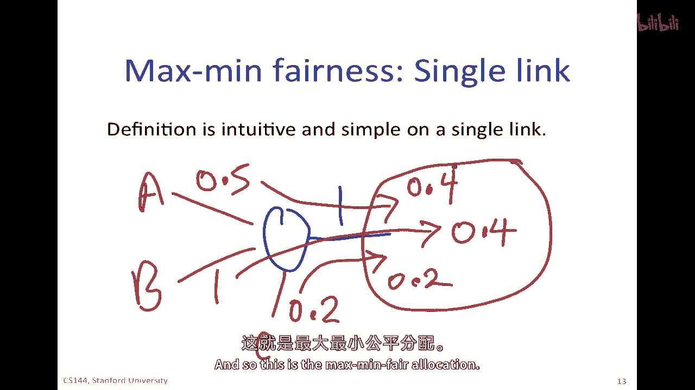

现在您理解了交通拥堵在下几个视频中的含义，我将研究不同的方法来设计交通控制算法，所以我们将从开始看一些不同的技术，最终会看到tcp的工作原理，详细地看看这个。

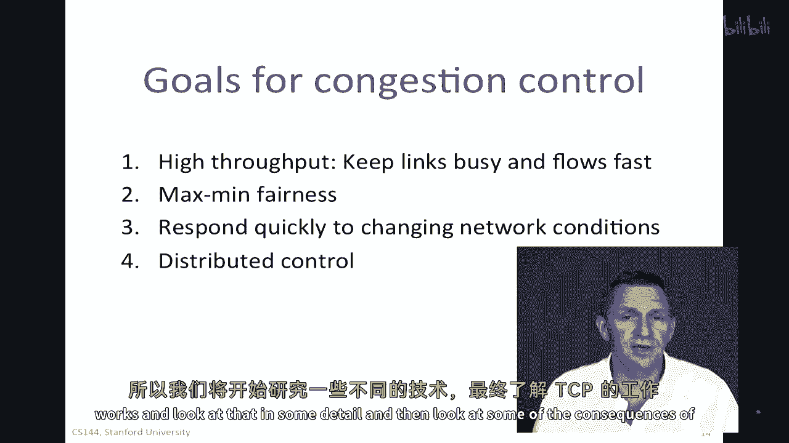

然后看看那些设计的一些后果，有一些目标值得拥有。

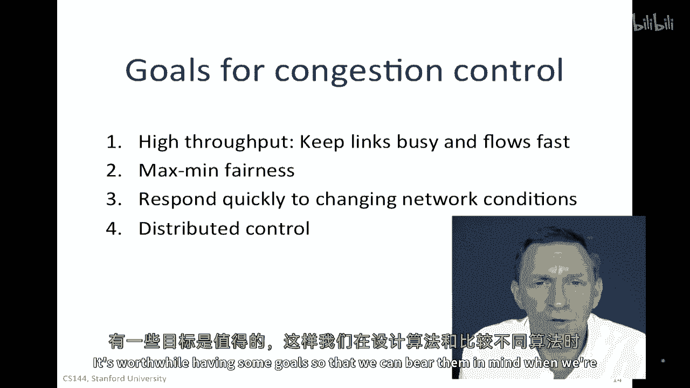

这样我们就可以记住它们，当我们设计算法时，当我们比较一个与另一个时，我有一个列表在这里，其中一些我们已经见过，一些将是新的，但是很明显的，嗯，我们正在考虑为什么，第一个原因是我们想要高吞吐量。

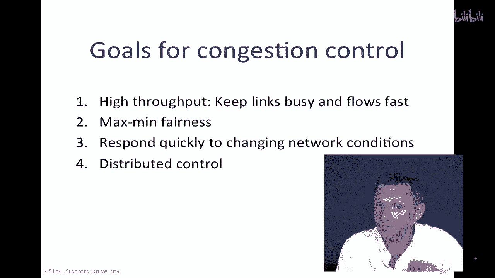

我们想要保持链接繁忙，因为我们想要高效地利用网络。

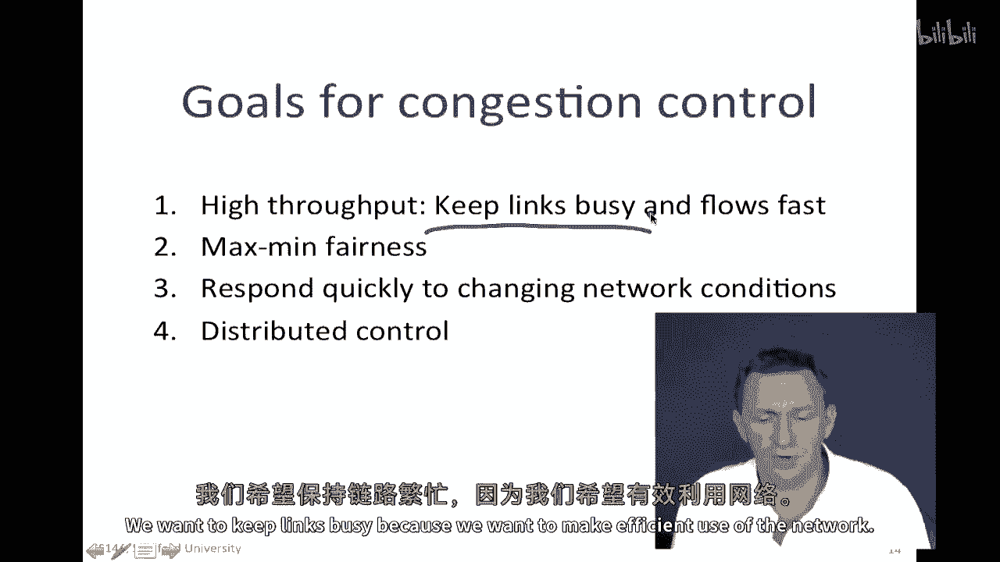

并且我们想要流量快速且完成迅速，第二个原因是我们希望它公平。

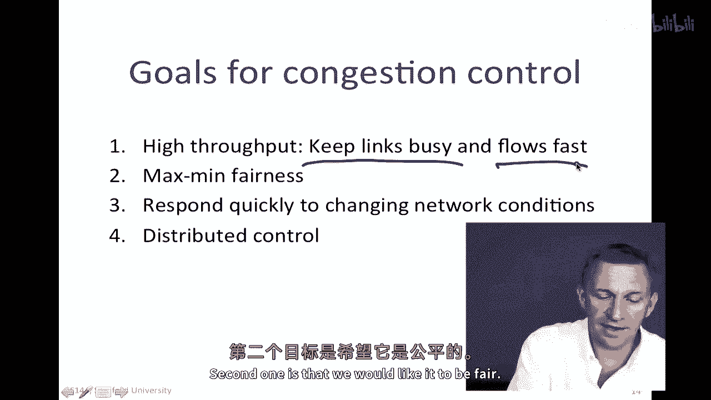

嗯，我们打算，我们通常会使用我们的最大公平性目标，因为它在网络通过量和漂亮程度上提供了一个好的平衡，但是，确保所有争夺瓶颈链路的流量都得到公平对待，并且小的流量也能获得对该链路的良好访问。

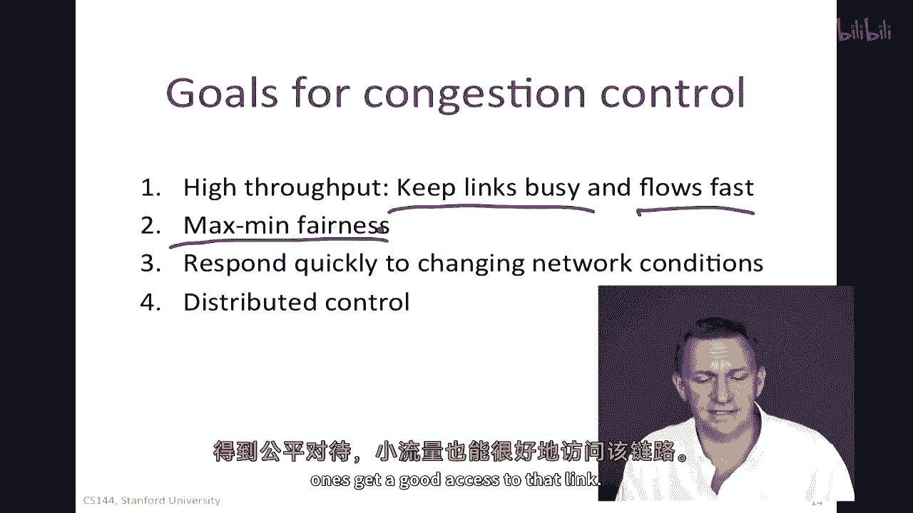

我们想要拥能有效响应网络条件变化的拥塞控制机制。

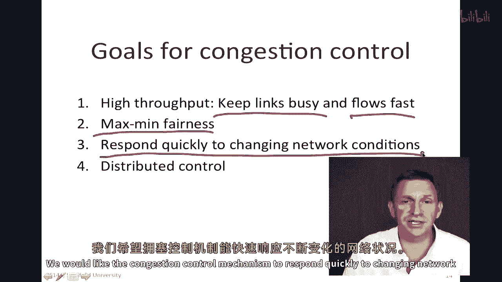

如果其他流量到达且拥塞增加，我们需要能够稍微后退，以便我们不会在网络中引起太多的拥塞，如果其他流量消失并完成，更多的容量变得可用，我们想要能够快速使用这些容量，以便我们能够更有效地利用网络，最后。

我们希望控制被分散，我们不能依赖，存在一些中央仲裁者，它将决定整个网络的速率，我们需要这样操作，以便它可以扩展。

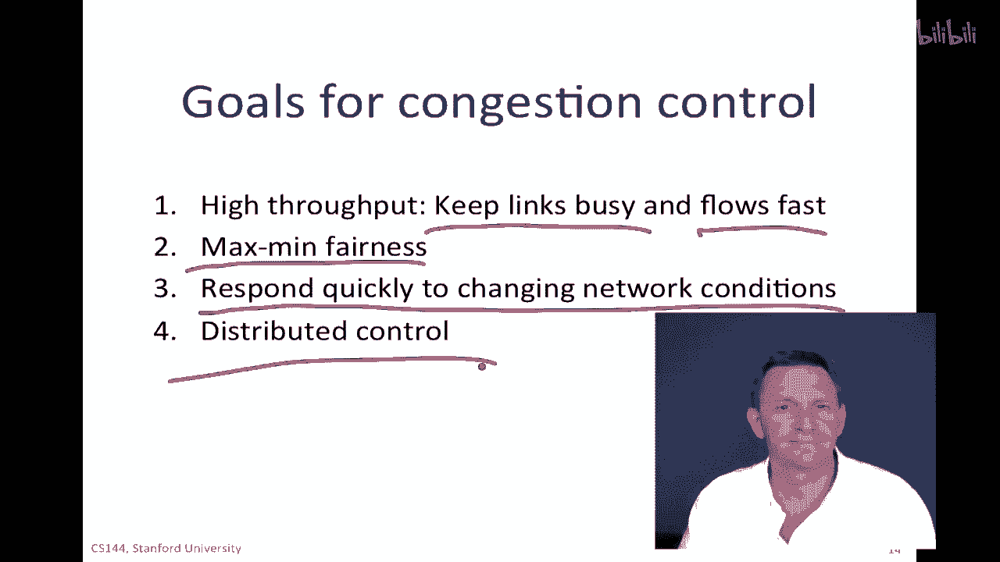