# 课程P53：拥塞控制基础 🚦


在本节课中，我们将要学习网络中的一个核心概念——拥塞控制。我们将探讨什么是网络拥塞，它为何会发生，以及控制拥塞的基本原理和目标。理解这些基础知识，是后续学习具体拥塞控制算法（如TCP中的算法）的关键。

## 什么是网络拥塞？🤔

上一节我们介绍了课程概述，本节中我们来看看拥塞的具体含义。网络拥塞是指网络中的数据流量超过了网络设备（如路由器）的处理能力，导致数据包延迟增加、丢失，甚至网络性能急剧下降的现象。拥塞可能发生在不同的时间尺度上。

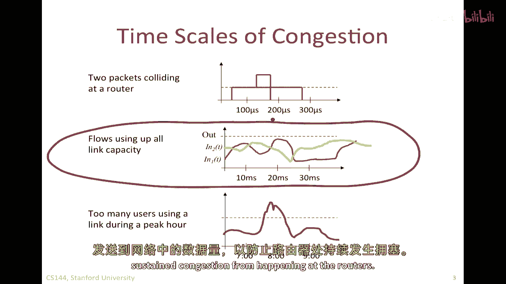

以下是三种常见的时间尺度示例：

1.  **极短时间尺度（包碰撞）**：当两个或多个数据包几乎同时到达路由器并竞争同一个输出链路时，会发生瞬时排队。例如，代码可以模拟为两个数据包到达事件的时间差极小。
    ```
    packet1.arrival_time = t
    packet2.arrival_time = t + ε // ε是一个非常小的值
    ```
    其中一个数据包被立即发送，另一个则进入缓冲区排队，造成短暂的队列堆积。

2.  **中等时间尺度（流级别）**：在往返时间（RTT）或数个RTT的时间尺度上，例如一个TCP连接在下载文件。如果多个数据流（flow）的发送速率之和超过了某条链路的容量，缓冲区就会持续累积并最终溢出。假设链路容量为 **C**，两个流的发送速率分别为 **r1** 和 **r2**，当 **r1 + r2 > C** 时，就会发生拥塞。

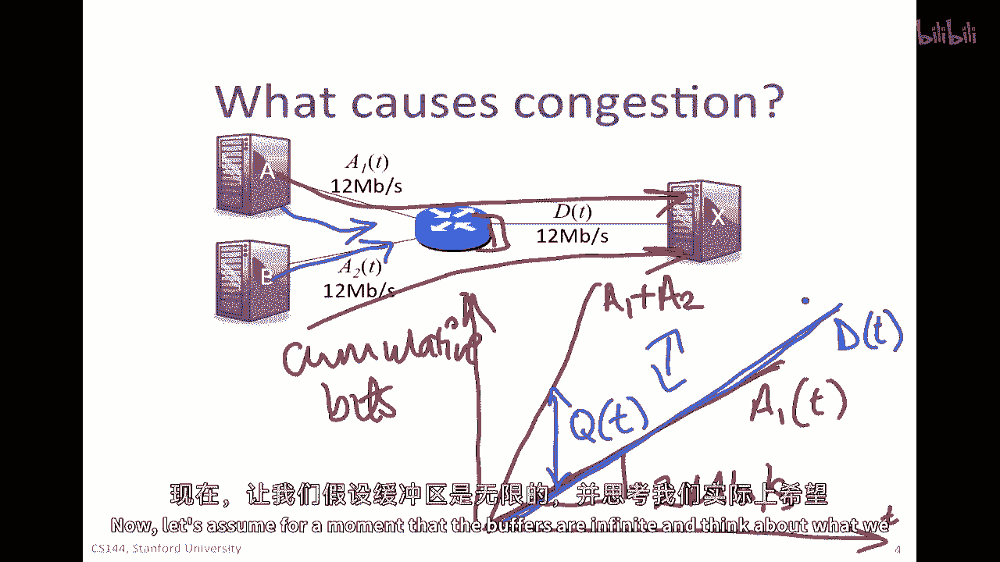

3.  **长时间尺度（人类活动周期）**：例如在高峰时段，大量用户同时访问某个热门网站（如新闻站点），导致连接到该服务器的链路过载。


在拥塞控制中，我们主要关注和试图解决的是第二种时间尺度——流级别的拥塞，因为我们有机会通过反馈机制调整发送端的速率。

## 拥塞的影响与反馈效应 🔄

让我们通过一个具体例子深入理解拥塞的影响。假设源A和源B都希望以12 Mbps的速率向目的地X发送数据。然而，路由器R到X的链路容量只有12 Mbps。

*   设A的发送速率为 **r_A = 12 Mbps**
*   设B的发送速率为 **r_B = 12 Mbps**
*   链路容量 **C = 12 Mbps**


显然，总到达速率 **r_A + r_B = 24 Mbps** 大于离开速率 **C = 12 Mbps**。根据确定性排队模型，队列长度 **q(t)** 将随时间线性增长：**q(t) = (r_A + r_B - C) * t**。

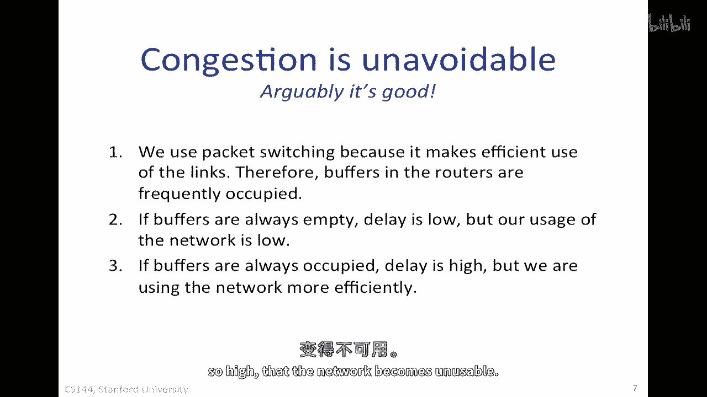

最终，路由器的缓冲区会溢出，导致数据包被丢弃。这些被丢弃的包通常需要重传，而重传又会向网络中注入更多的流量，从而进一步加剧拥塞，形成一个使情况恶化的正反馈循环。因此，拥塞控制的核心目标之一就是避免网络进入这种状态。

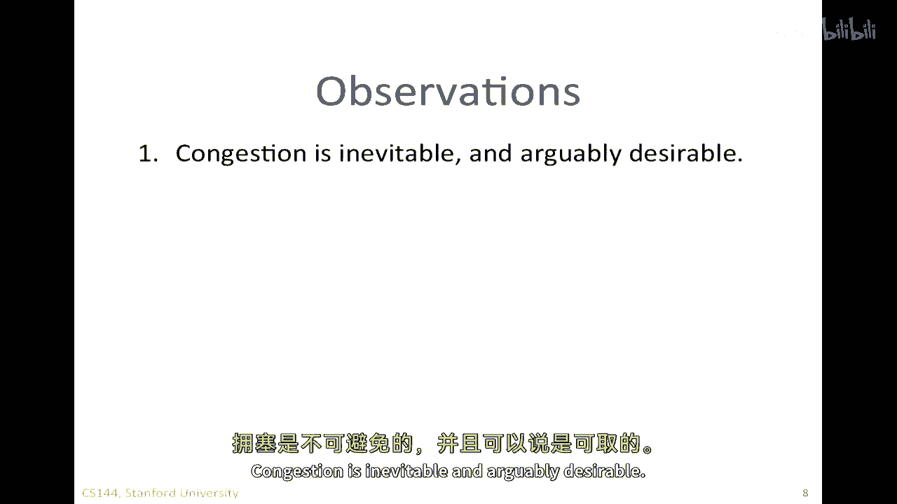

## 公平分配问题 ⚖️

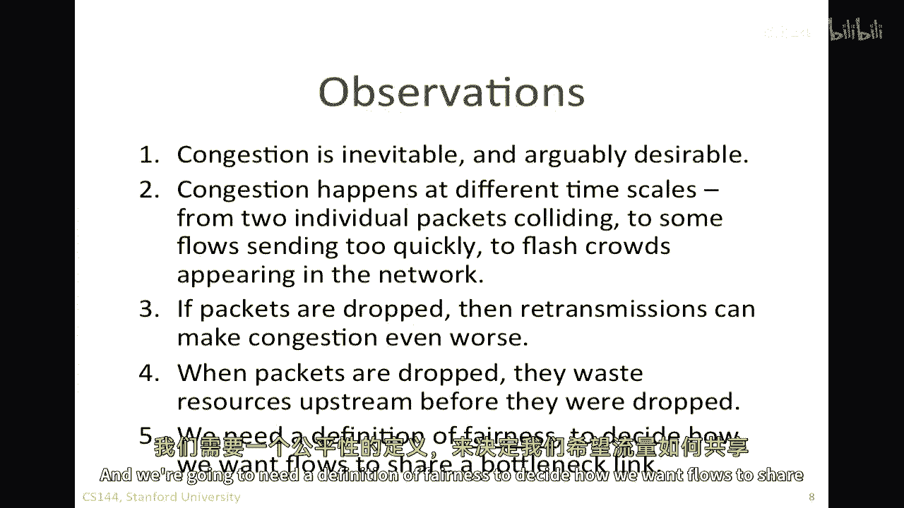

当多个流共享一个瓶颈资源时，如何公平地分配带宽成为一个关键问题。假设链路容量为 **C**，有两个流竞争，它们期望的速率分别为 **r1** 和 **r2**。

一种直观的公平分配方式是“最大最小公平”（Max-Min Fairness）。其定义是：一种速率分配是最大最小公平的，当且仅当无法在**不降低一个更低速率的流的速率**的情况下，去提高任何一个流的速率。

在单个瓶颈链路的简单情况下，最大最小公平意味着：
*   如果每个流的需求都超过其公平份额（即 **r1 > C/2** 且 **r2 > C/2**），则每个流获得 **C/2**。
*   如果某个流的需求小于其公平份额（例如 **r1 < C/2**），则它获得其所需速率 **r1**，剩余的带宽 **(C - r1)** 再在剩余流之间公平分配。

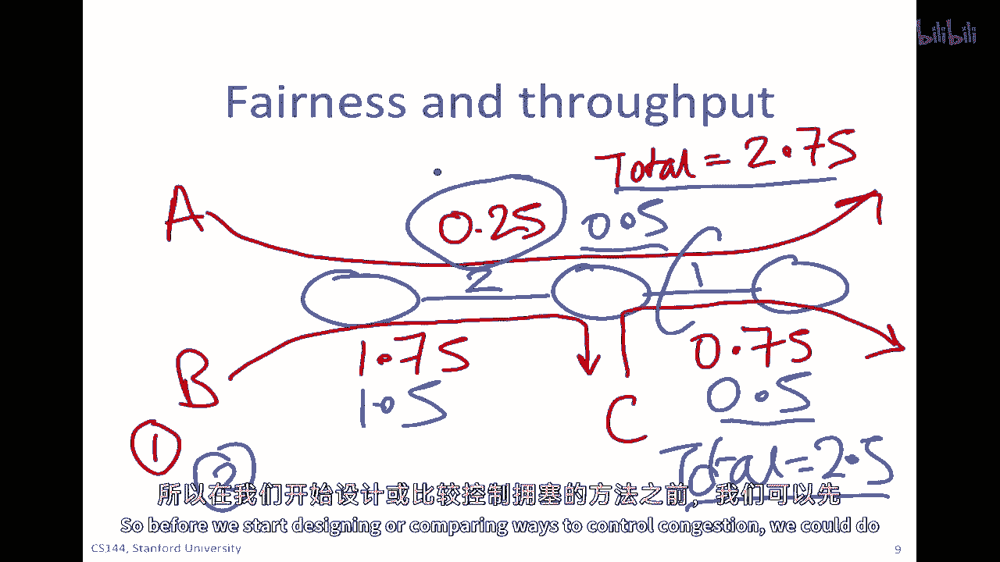

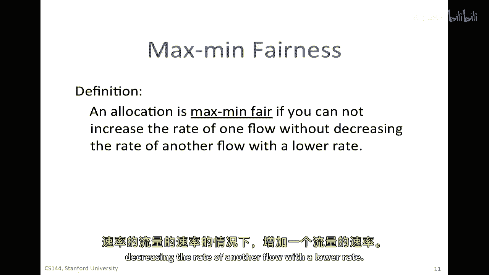

以下是一个计算示例：
> 链路容量 C = 1 Mbps。
> 流A需求：0.5 Mbps，流B需求：0.8 Mbps，流C需求：0.2 Mbps。
> 1.  初始公平份额为 C/3 ≈ 0.33 Mbps。
> 2.  流C需求0.2 Mbps < 0.33 Mbps，故满足其需求，分配0.2 Mbps。剩余带宽 0.8 Mbps。
> 3.  剩余带宽在A和B间分配，公平份额变为 0.8 / 2 = 0.4 Mbps。
> 4.  流A需求0.5 Mbps > 0.4 Mbps，故分配0.4 Mbps。
> 5.  流B需求0.8 Mbps > 0.4 Mbps，故分配0.4 Mbps。
> 最终分配：(A: 0.4, B: 0.4, C: 0.2)，总和为1 Mbps，符合最大最小公平原则。

## 拥塞的必然性与设计目标 🎯

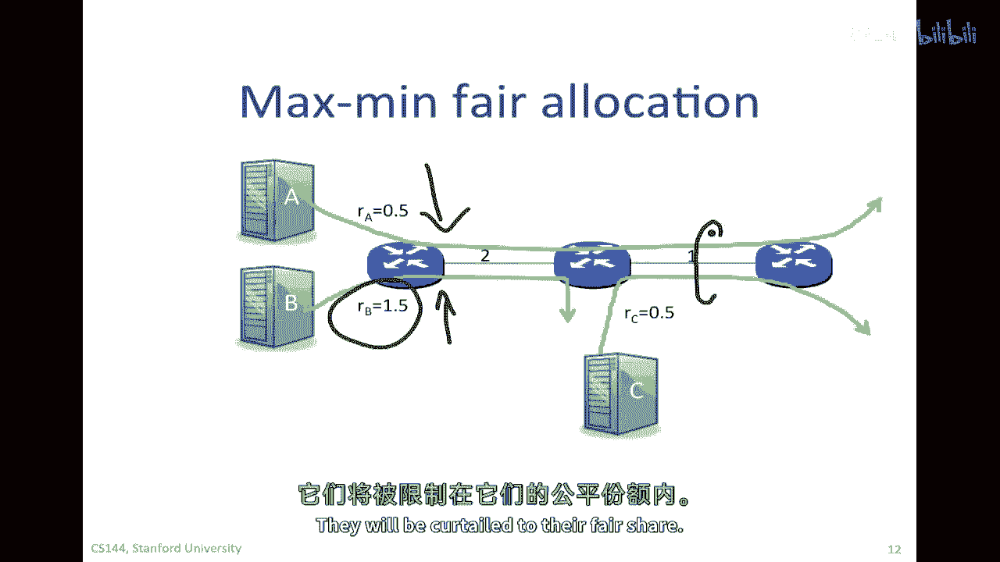

需要认识到，在分组交换网络中，一定程度的拥塞是不可避免甚至有益的。它意味着网络资源（链路、缓冲区）得到了充分利用。如果缓冲区总是空的，虽然延迟低，但链路利用率也低，是一种资源浪费。拥塞控制的目标不是彻底消除拥塞，而是将其控制在一个合理的水平，在**高吞吐量**和**低延迟**之间取得平衡。

基于以上讨论，一个理想的拥塞控制机制应追求以下目标：

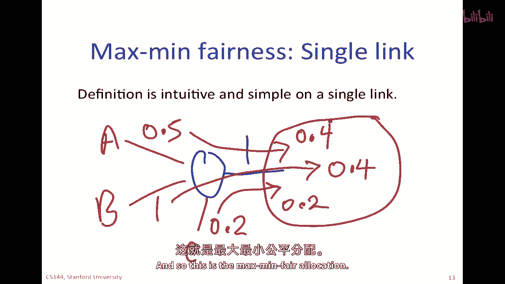


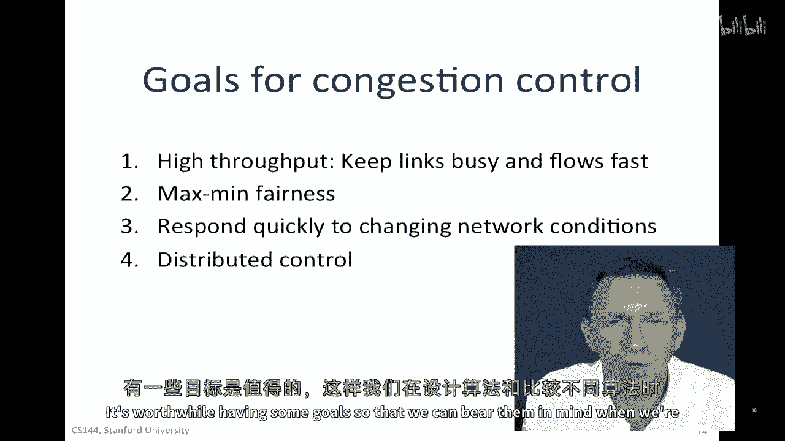

以下是拥塞控制机制的四个核心目标：

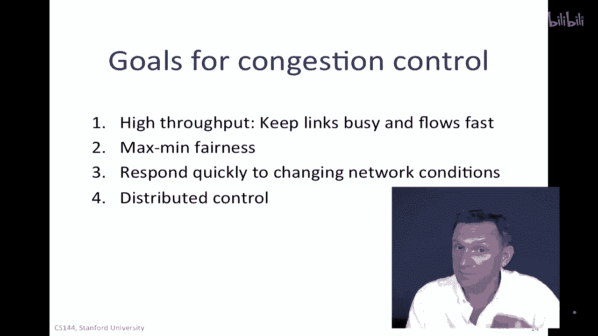


1.  **高吞吐量（High Throughput）**：有效利用网络带宽，保持链路繁忙，使数据快速传输完毕。
2.  **公平性（Fairness）**：通常依据最大最小公平准则，确保竞争同一瓶颈资源的各流量能获得公平的带宽份额，同时保护小流量。
3.  **快速收敛与响应（Responsiveness）**：能快速感知网络状态变化（如新流量加入或旧流量离开），并相应调整发送速率，以充分利用可用带宽或缓解拥塞。
4.  **分布式部署（Distributed）**：算法应能分布式运行，不依赖于中央控制器，以保证可扩展性和鲁棒性。


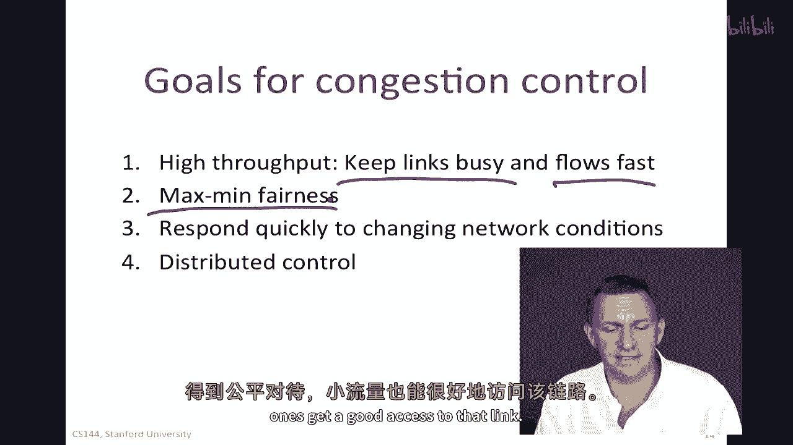


## 总结 📝

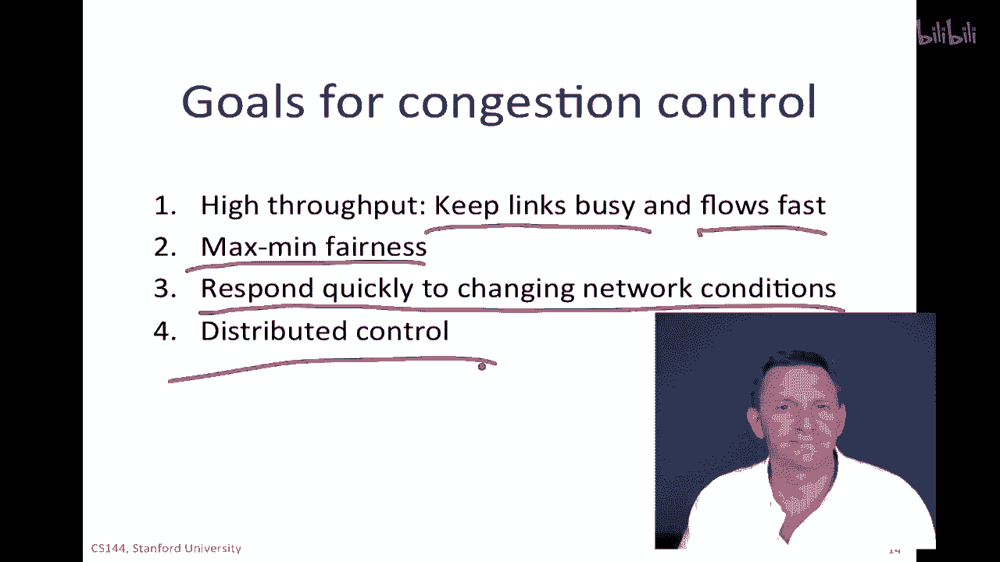

本节课中我们一起学习了拥塞控制的基础知识。我们首先了解了网络拥塞在不同时间尺度上的表现形式及其负面影响，特别是由丢包重传引发的反馈效应。接着，我们探讨了在共享瓶颈资源时的公平分配问题，并介绍了“最大最小公平”这一重要准则。最后，我们明确了设计拥塞控制算法时所追求的四大目标：高吞吐量、公平性、快速响应和分布式部署。这些概念和目标是理解后续各种具体拥塞控制算法（如TCP Reno、CUBIC等）的基石。