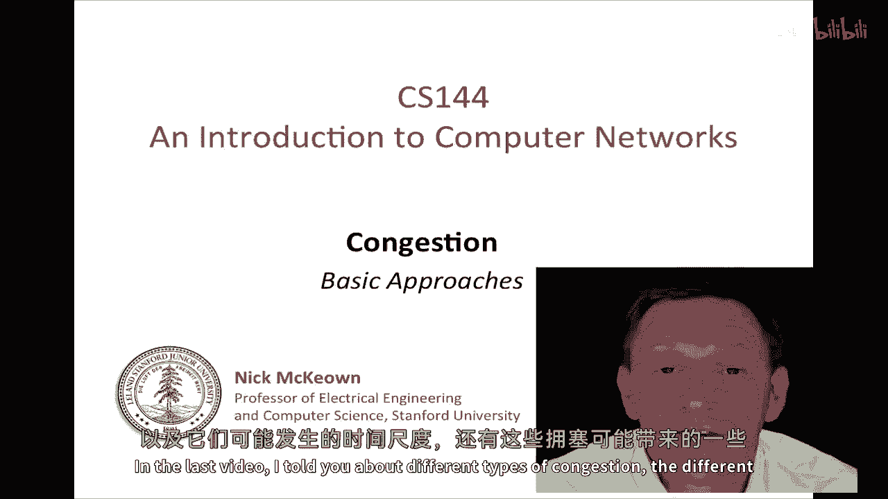

# 课程 P54：TCP 拥塞控制基础 2 🚦

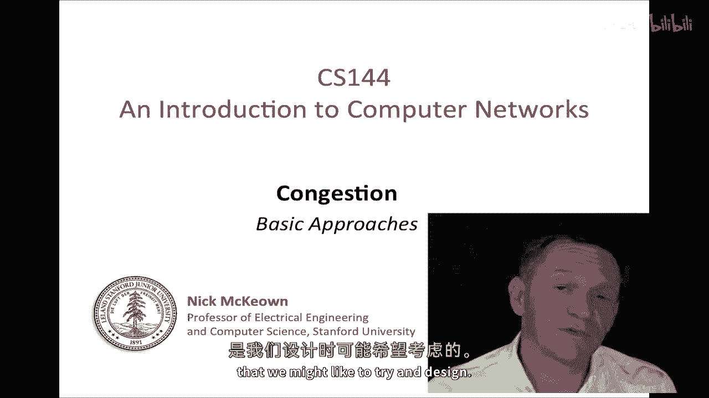

在本节课中，我们将学习网络拥塞控制的基本方法，探讨控制机制应该部署在网络中还是终端主机上，并详细介绍 TCP 所采用的“加性增、乘性减”核心算法。

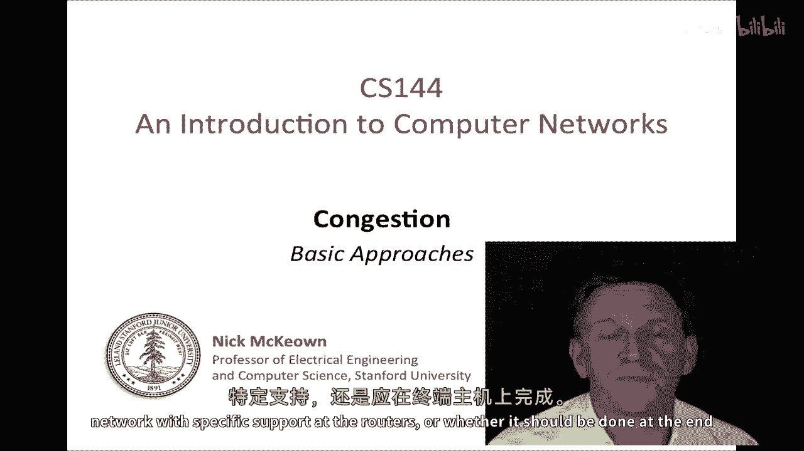

---

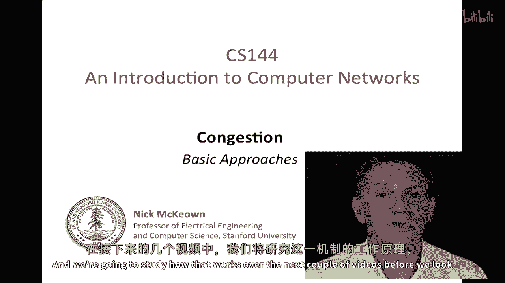

## 网络中的拥塞控制

上一节我们介绍了拥塞的类型和后果。本节中，我们来看看控制拥塞的基本方法。

首先，我们需要考虑拥塞控制应该在网络中进行（即在路由器中提供特定支持），还是在终端主机中完成。

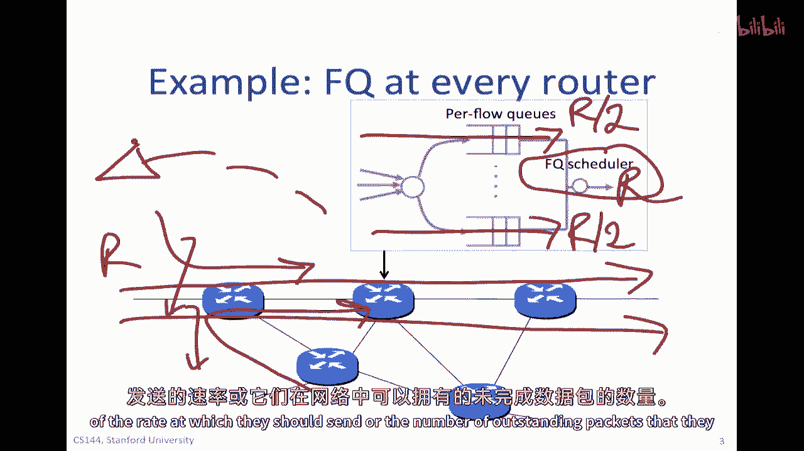

你可能会好奇，为什么不能简单地使用公平队列调度器来分配链路带宽。这种方法确实可以为每个竞争流提供公平的份额，并保持链路忙碌。然而，它存在一个关键问题：它无法主动告知发送源应以何种速率发送数据。如果所有源都以最大速率发送，数据包最终会在缓冲区溢出时被丢弃，从而浪费了上游带宽。

因此，我们需要一种方式向发送源发送信号，指示其应采用的发送速率或网络中允许的未完成数据包数量。

### 基于网络的拥塞控制

在基于网络的拥塞控制中，路由器会提供明确的反馈来指示网络中的拥塞。

以下是其工作原理的关键点：
*   **信号内容**：信号可以是数据包丢弃指示、缓冲区占用率、超过某个拥塞阈值，或是出站链路剩余容量的指示。
*   **信号形式**：通常使用一到两个比特位来向源发送信号，以节省开销。
*   **信号传递**：常见做法是将信号“搭载”在已经传输的数据包上（例如在确认包中返回），而不是创建新的数据包。一种具体技术称为**显式拥塞通知**。

基于网络的方法优点明显：信号直接控制源的行为，对变化反应快，并且是分布式的。然而，它需要网络设备（路由器）的支持。

---

## 终端主机的拥塞控制

接下来，我们探讨是否可以在没有任何网络支持的情况下，仅在终端主机上实现拥塞控制。

这种方法的核心思想是：发送主机通过观察网络行为（如数据包丢失、延迟增加等），自行推断拥塞状况并调整发送行为。TCP 协议正是这样做的，因为 IP 协议默认不提供拥塞指示。

TCP 在终端主机上实现拥塞控制，它会对主机可观测到的事件做出反应，特别是数据包丢失。TCP 利用其**滑动窗口**机制来控制网络中未完成数据包的数量。

### TCP 滑动窗口回顾

在深入拥塞控制之前，让我们快速回顾一下 TCP 滑动窗口的工作原理。

滑动窗口定义了字节流中三个关键部分：
1.  已发送且已被确认的数据。
2.  已发送但尚未确认的数据（即“未完成”数据）。
3.  允许发送但尚未发送的数据（在窗口内）。

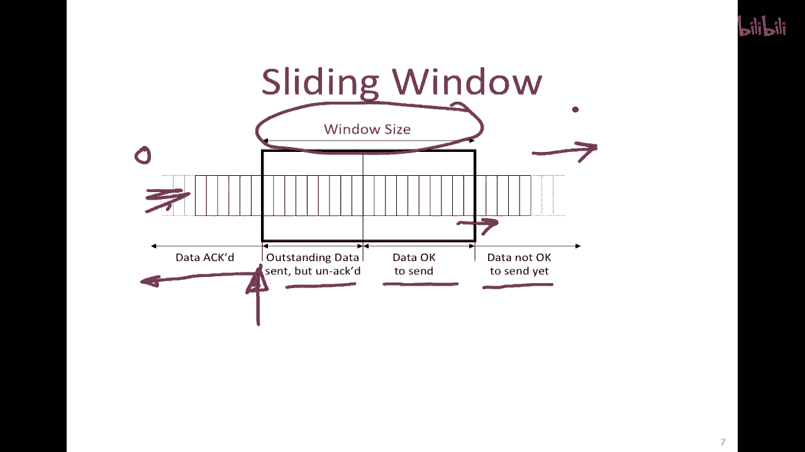

**窗口大小**决定了允许发送但未被确认的最大数据量。如果往返时间等于用窗口数据填满网络管道所需的时间，那么数据可以连续发送，从而充分利用网络。

---

## TCP 拥塞窗口与 AIMD 算法

现在，我们来看看 TCP 如何具体利用窗口机制进行拥塞控制。

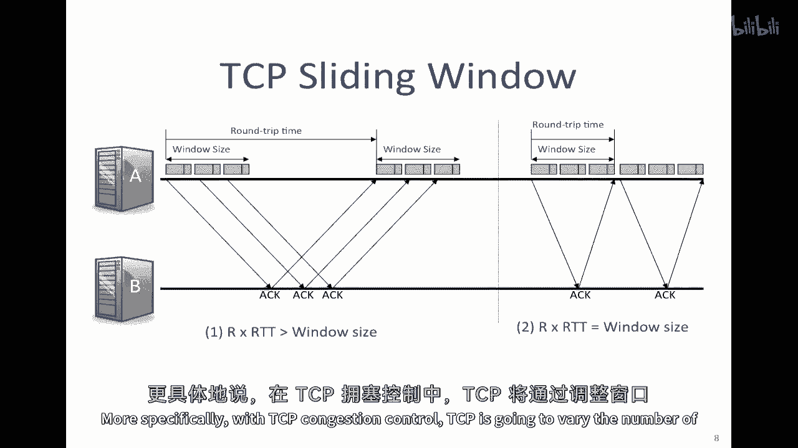

TCP 发送方会维护两个窗口值：
*   **接收窗口**：由接收方通告，防止发送方压倒接收方。
*   **拥塞窗口**：由发送方根据网络拥塞状况自行计算得出，通常缩写为 **cwnd**。

实际发送窗口的大小是上述两者中的较小值。当网络拥塞时，通常由 **cwnd** 主导。

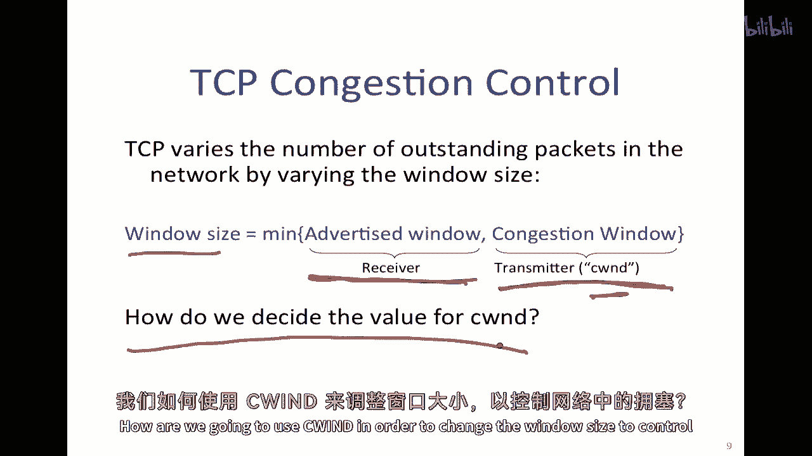

### 核心算法：加性增、乘性减

那么，发送方如何决定 **cwnd** 的值呢？TCP 使用一种被称为 **AIMD** 的经典算法。

以下是 AIMD 的工作原理：
*   **加性增**：当传输顺利，没有数据包丢失时，发送方每成功接收并确认一个完整窗口的数据，就将 **cwnd** 增加 1 个数据包的大小。这是一种缓慢、线性的增长。
    *   公式表示：`cwnd = cwnd + 1` （每经过一个 RTT）
*   **乘性减**：当检测到数据包丢失（视为拥塞信号）时，发送方将 **cwnd** 减少到当前值的一半。这是一种快速、剧烈的下降。
    *   公式表示：`cwnd = cwnd / 2`

### 可视化：TCP 锯齿

如果将 **cwnd** 随时间的变化绘制出来，我们会看到一个典型的“锯齿”形状：
1.  **cwnd** 在成功传输期间线性增长（加性增）。
2.  当发生丢包时，**cwnd** 突然减半（乘性减）。
3.  然后 **cwnd** 再次开始线性增长，如此循环。

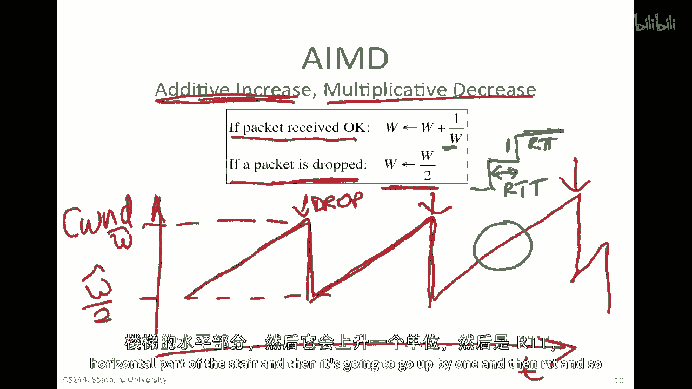

这种模式被称为 **TCP 锯齿** 或 **AIMD 锯齿**。它形象地展示了 TCP 如何探索并适应网络可用带宽：缓慢增加以利用空闲带宽，一旦拥塞则快速后退。

---

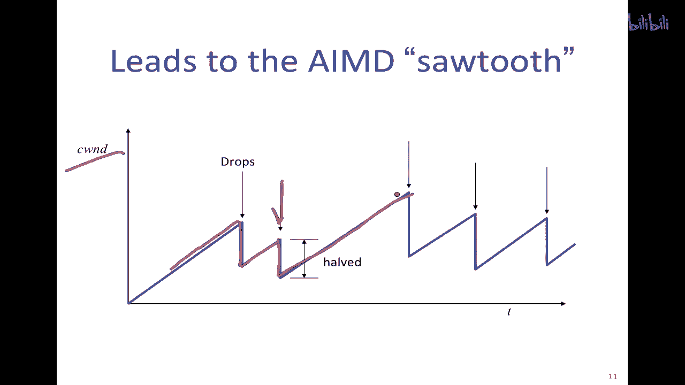

## 总结

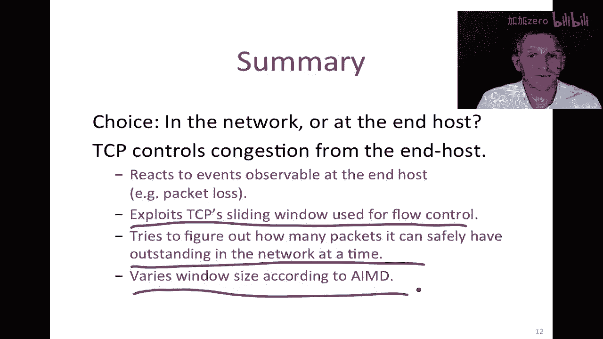

本节课中，我们一起学习了：
1.  **控制位置的选择**：拥塞控制可分为基于网络（路由器提供信号）和基于终端主机两种方式。
2.  **TCP 的选择**：由于 IP 协议缺乏内置支持，TCP 在终端主机上实现拥塞控制，通过观察数据包丢失等事件来推断拥塞。
3.  **核心机制**：TCP 通过动态调整**拥塞窗口** 的大小来控制注入网络的数据量。
4.  **AIMD 算法**：这是 TCP 拥塞控制的核心算法，包括**加性增**（无拥塞时缓慢增加窗口）和**乘性减**（检测到拥塞时快速减半窗口），其运行结果形成了典型的“TCP 锯齿”带宽利用模式。