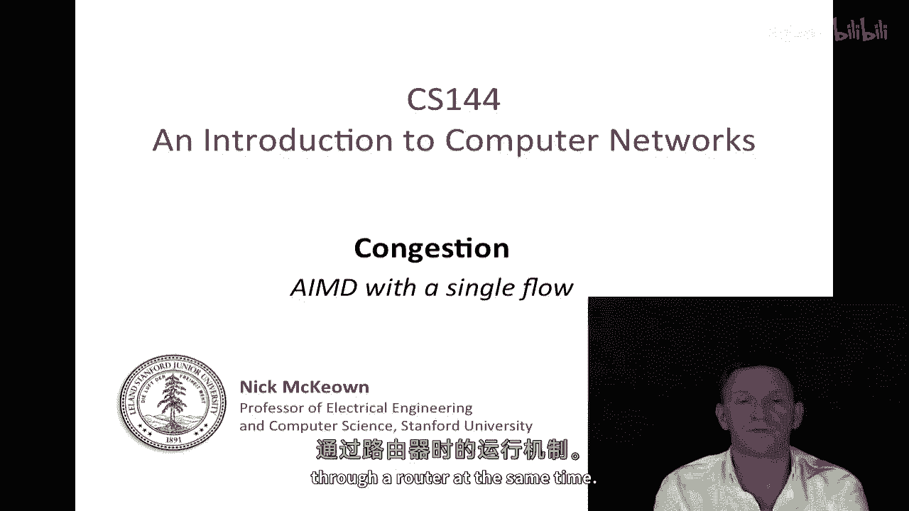
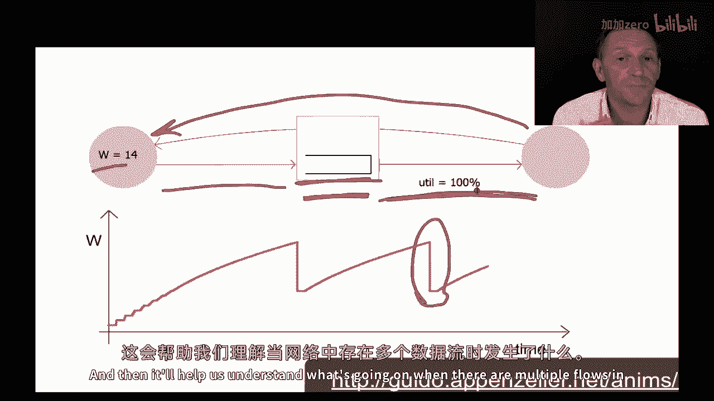

# 课程 P55：单条 AIMD 流的动态分析 🧮

在本节课中，我们将学习 TCP 拥塞控制的核心机制——加性增、乘性减（AIMD）算法。我们将通过分析网络中**单条 AIMD 流**的动态行为，来理解 TCP 如何在没有网络明确支持的情况下，仅通过端主机调节滑动窗口大小来应对拥塞。

上一节我们介绍了 AIMD 的基本概念，本节中我们来看看它在单条数据流中的具体工作过程。

## AIMD 算法回顾

AIMD 算法用于调节 TCP 滑动窗口的大小（`w`），从而控制网络中“在途字节”的数量。其核心规则如下：

*   **加性增**：每当成功收到一个完整窗口的数据包确认时，窗口大小增加一个单位。
    *   公式：`w = w + 1`
*   **乘性减**：每当检测到数据包丢失（视为拥塞信号）时，窗口大小减半。
    *   公式：`w = w / 2`

这种方法的目标是：在无拥塞时谨慎增加发送量以探测可用带宽；在出现拥塞时迅速减少发送量以缓解网络压力。

## 单流 AIMD 动态模拟分析

为了深入理解，我们观察一个 AIMD 流通过单个瓶颈链路的动画模拟。网络结构如下：源主机和目的主机之间有一个路由器，其出口链路（右侧）是瓶颈，速度慢于入口链路（左侧）。

以下是模拟中的关键组件和行为：

*   **拥塞窗口 (`w`)**：图中红线，代表源端允许的未确认数据包数量。它随时间变化。
*   **路由器缓冲区**：位于瓶颈链路前，用于暂存无法立即转发的数据包。
*   **数据包流**：蓝色数据包从源流向目的地。
*   **确认包流**：红色确认包从目的地返回源端，用于触发后续数据包的发送（自时钟驱动）。

当窗口 `w` 较小时，数据包填满传输链路，缓冲区为空。随着 `w` 被“加性增”规则调大，由于链路已满，额外的数据包只能进入缓冲区，导致缓冲区占用率上升。最终，缓冲区会满并发生丢包。触发“乘性减”规则，`w` 减半，源端发送速率骤降，缓冲区开始排空。之后，`w` 再次开始缓慢增长，循环往复。

这个过程中有一个关键现象：**尽管拥塞窗口 `w` 呈锯齿状振荡，但瓶颈链路的利用率始终保持在 100%**。数据包的发送速率基本保持恒定。

## 核心动态与观察

通过分析模拟，我们可以得出关于单条 AIMD 流的几个重要观察：

1.  **窗口与延迟同步**：拥塞窗口 `w` 的增加会导致缓冲区排队的数据包增多，从而增加数据包的往返时间（RTT）。因此，`w` 和 RTT 同步增长和减少。
2.  **发送速率恒定**：发送速率可以定义为 `w / RTT`。由于 `w` 和 RTT 同步变化，它们的比值 `w / RTT` 在实际中近似为一个常数。这解释了为何瓶颈链路能始终保持繁忙。
3.  **缓冲区大小的重要性**：为了使 AIMD 流高效工作（即保持 100% 链路利用率），路由器需要足够大的缓冲区。理想的最小缓冲区大小应为 **`RTT × C`**，其中 `C` 是瓶颈链路的容量（带宽）。这个大小的缓冲区可以吸收窗口 `w` 减半期间未被链路消耗的数据包，防止缓冲区变空导致链路闲置。

## 总结

本节课中我们一起学习了 AIMD 算法在单条网络流中的动态行为。我们了解到：

*   AIMD 通过锯齿状的窗口振荡，稳定地探索网络管道从端到端能容纳的数据量。
*   这种振荡是 TCP 在稳定状态下的正常行为，它使得发送速率保持恒定，并充分利用了瓶颈带宽。
*   为了保证效率，网络中的瓶颈路由器需要配置大小约为 `RTT × C` 的缓冲区。

本质上，对于单条流，AIMD 并未直接调节发送速率，而是在调节网络中“在途数据”的数量，并间接实现了链路的高效利用。在下一个视频中，我们将看到当网络中存在**多条竞争流**时，情况会变得更加复杂和有趣。