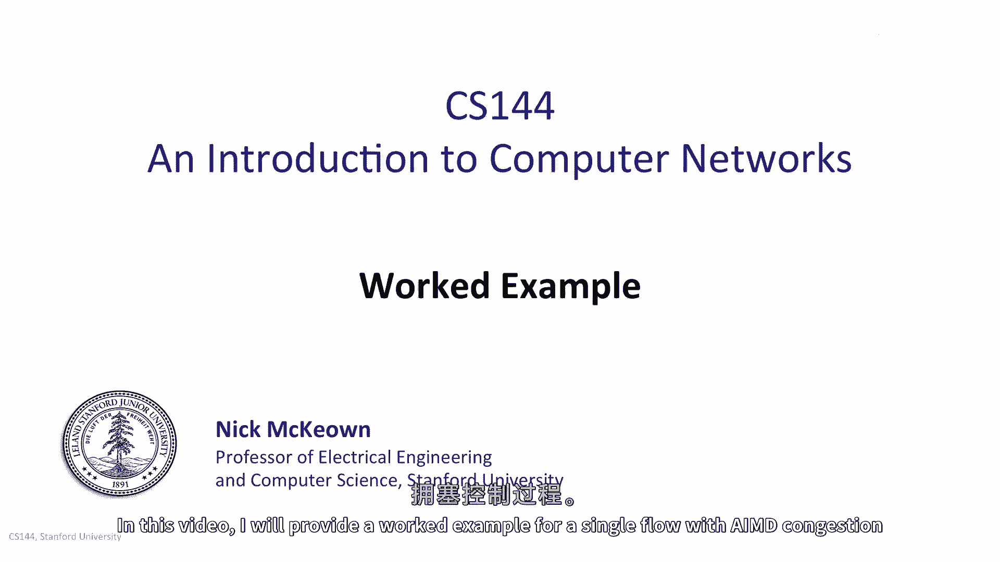
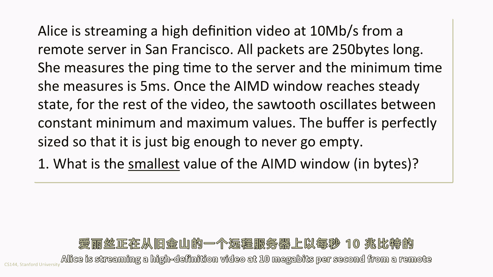
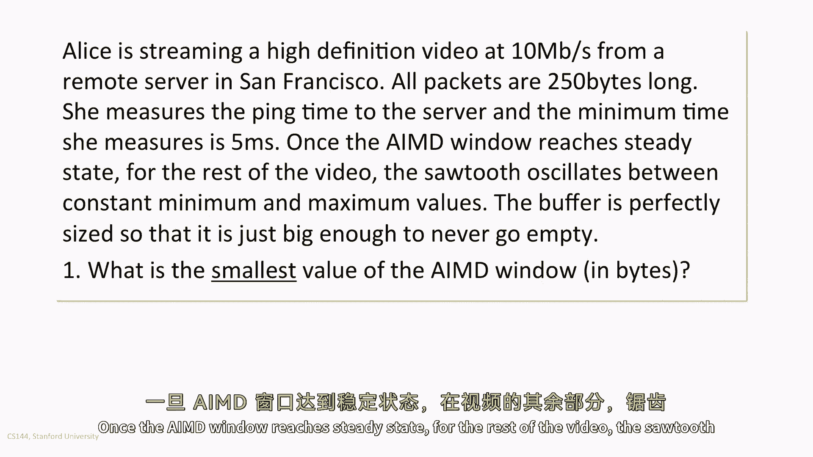
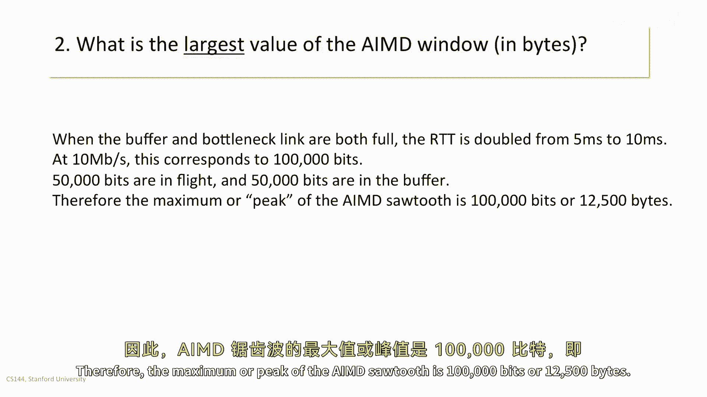
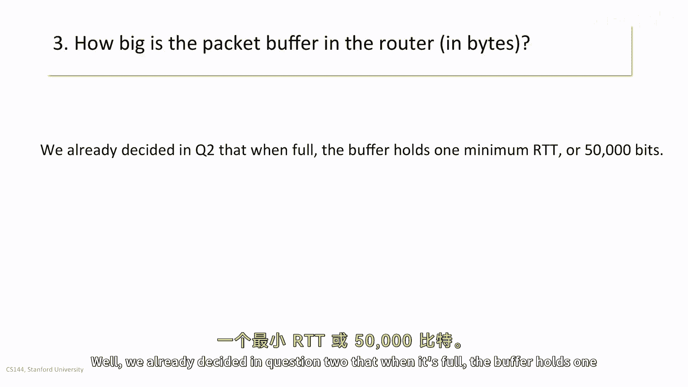
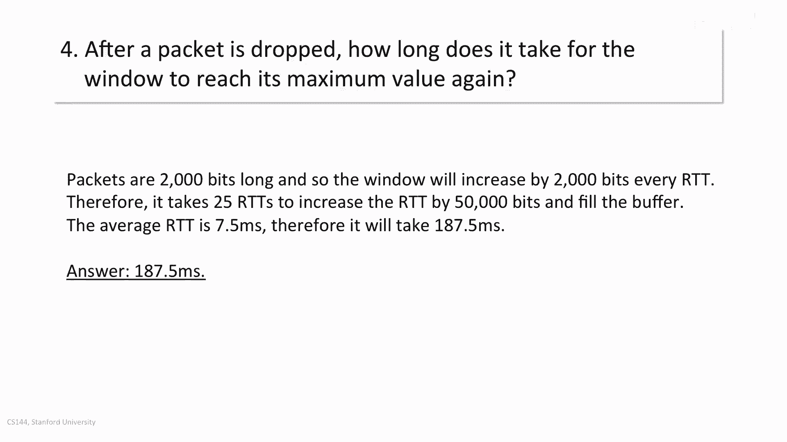

# P56：p55 4-3a Single AIMD flow worked example - 加加zero - BV1qotgeXE8D

在这个视频中，我将提供一个单流IMD拥塞控制的工作示例。

Alice正从远程服务器以每秒十兆比特的速度流媒体高清视频。

在旧金山，所有包都是二百五十字节长。

她测量到服务器的ping时间，并测量到的最小时间是五毫秒。

一旦IMD窗口达到稳定状态，对于视频的其余部分。

锯齿波在常数、最小和最大值之间振荡，缓冲区完美地大小，所以只够永远不会为空。

第一部分，IMD窗口的最小值是多少字节。

嗯，当缓冲区为空时，ping时间的最小值为五毫秒，但瓶颈链在每秒十兆比特时满。

因此管道中有五十万个比特。

这意味着AMD锯齿的最小或谷底是五十万个比特。

或六二五六到五零字节。

因此答案为六千二百五十字节，第二部分。

AD窗口的最大值是多少字节，当缓冲区和瓶颈链都满时，RTT从五毫秒增加到十毫秒，在每秒十兆比特时，这相当于一百万个比特，五十万个比特在飞行，五十万个比特在缓冲区，因此AD锯齿的最大或峰值是一百万个比特。

或十二五千字节。

第三部分，路由器的包缓冲区有多大字节，嗯，我们已经在问题二中决定，当它满时，缓冲区可以持有一个最小RTT或五十万个比特。

第四部分，包被丢弃后，窗口再次达到最大值需要多长时间，包是两千比特长，因此窗口会增加两千比特，每个RTT，因此需要二十五个RTT来增加RTT五十万个比特，并填充缓冲区，平均RTT是7。5毫秒。

因此需要一百八十七点五毫秒。

第五部分，如果Alice现在试图从澳大利亚的服务器观看相同的视频，RTT为二百五十毫秒，路由器的缓冲区应该多大字节，如果网络仍然以每秒十兆比特运行，嗯，最小延迟是二百五十毫秒。

所以缓冲区至少需要二百五十毫秒乘以，十兆比特每秒等于二点五乘以十的六次方比特，因为我们以二的幂来表示存储，答案是二点四兆比特或二百九十八千字节。

第六部分，当服务器在澳大利亚后一个数据包被丢弃时，窗口再次达到最大值需要多长时间，以秒为单位，与以前相同，窗口增加两千比特，每次填充缓冲区都需要两点，五乘以十的六次方，除以两次十的三次方，等于一千。

二百五十轮，平均rtt是三百七十五毫秒，所以再次达到最大值所需的时间是四百六十八点七，五秒或几乎八分钟，答案可能会让你惊讶，amd流从单个包丢失恢复需要很长时间，这在实践中将是一个真正的问题。

这促使我们寻找更好的、更快的TCP方法。

