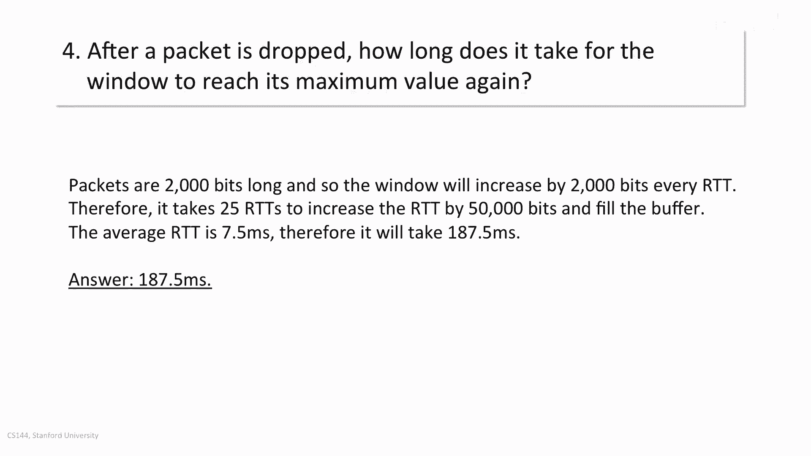
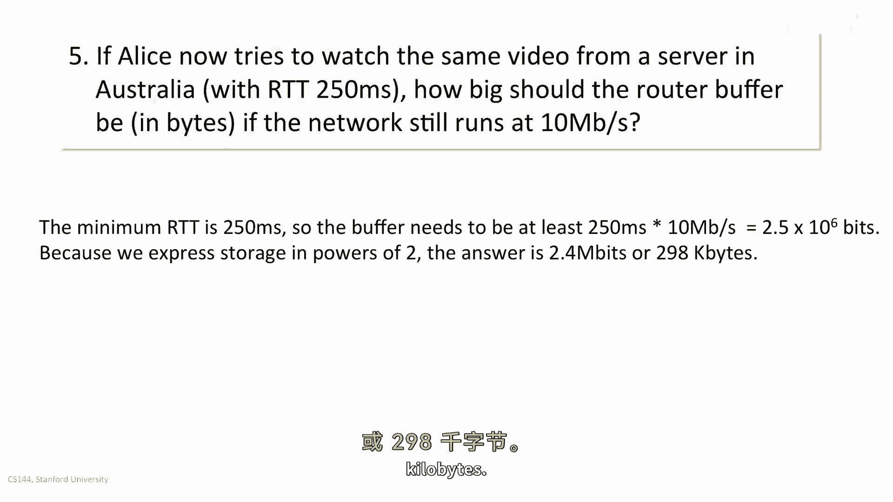

# 课程 P56：单流 AIMD 拥塞控制工作示例 📊

在本节课中，我们将通过一个具体的工作示例，详细分析单流 AIMD（加性增乘性减）拥塞控制机制的行为。我们将计算关键参数，如拥塞窗口的最小值与最大值、缓冲区大小以及恢复时间，以深入理解 AIMD 如何在实际网络中运作。

---

## 概述与场景设定 🌐

首先，我们来设定示例场景。Alice 正在从一台远程服务器流式传输高清视频，其瓶颈链路带宽为 **10 Mbps**。所有数据包的长度固定为 **250 字节**。她测量到服务器的最小往返时间（RTT）为 **5 毫秒**。我们假设 AIMD 窗口已达到稳定状态，并且路由器缓冲区大小经过完美调整，既不会溢出也不会变空。

上一节我们介绍了基本场景，本节中我们来看看如何根据这些信息计算 AIMD 窗口的边界值。

---

## 第一部分：计算 AIMD 窗口最小值 🔽

当网络路径中的缓冲区为空时，我们观察到最小的 RTT 为 5 毫秒。此时，瓶颈链路（10 Mbps）是满的，这意味着有数据包正在“管道中飞行”。

计算管道中的数据量（即带宽延迟积）：
**公式：`数据量 (比特) = 带宽 (bps) × 延迟 (秒)`**

代入数值：
`数据量 = 10 × 10^6 bps × 5 × 10^-3 秒 = 50,000 比特`

这 50,000 比特代表了 AIMD “锯齿波”振荡时的最低点，即窗口最小值。将其转换为字节（1 字节 = 8 比特）：
`50,000 比特 ÷ 8 = 6,250 字节`

**因此，AIMD 窗口的最小值为 6,250 字节。**

---

## 第二部分：计算 AIMD 窗口最大值 🔼

当路由器缓冲区被填满时，总延迟（RTT）会从最小值 5 毫秒增加到 10 毫秒。此时，网络中总的数据量包括两部分：填满管道的数据和填满缓冲区的数据。

总数据量计算：
`总数据量 = 带宽 × 最大RTT = 10 × 10^6 bps × 10 × 10^-3 秒 = 100,000 比特`

这 100,000 比特代表了 AIMD “锯齿波”振荡时的最高点，即窗口最大值。转换为字节：
`100,000 比特 ÷ 8 = 12,500 字节`

**因此，AIMD 窗口的最大值为 12,500 字节。**

---

## 第三部分：计算路由器缓冲区大小 🗃️

从第二部分的分析可知，当 RTT 从 5ms 增至 10ms 时，增加的 5ms 延迟正是由缓冲区中的数据造成的。

因此，缓冲区容量等于带宽与额外延迟的乘积：
`缓冲区容量 = 带宽 × (最大RTT - 最小RTT) = 10 × 10^6 bps × 5 × 10^-3 秒 = 50,000 比特`

转换为字节：
`50,000 比特 ÷ 8 = 6,250 字节`

**所以，路由器的包缓冲区大小为 6,250 字节。**

---

## 第四部分：计算从丢包恢复至最大窗口的时间 ⏱️

现在，我们计算在初始场景（RTT=5ms）下，发生一次丢包后，拥塞窗口从减半后的值重新增长到最大值所需的时间。

已知每个数据包为 250 字节，即 **2,000 比特**。在 AIMD 的“加性增”阶段，每个 RTT 窗口增加一个数据包的大小，即 2,000 比特。

需要增加的数据量是缓冲区的大小，即 **50,000 比特**。
所需 RTT 轮次计算：
`所需轮次 = 需增加数据量 / 每轮次增加量 = 50,000 比特 / 2,000 比特每RTT = 25 个 RTT`

在稳定状态下，平均 RTT 介于最小 RTT（5ms）和最大 RTT（10ms）之间，我们取平均值 **7.5 毫秒**。
总恢复时间计算：
`总时间 = RTT轮次 × 平均RTT = 25 × 7.5 毫秒 = 187.5 毫秒`

**因此，从丢包恢复至最大窗口需要 187.5 毫秒。**

---

## 第五部分：高延迟场景下的缓冲区需求 ✈️

接下来，我们考虑一个变化：Alice 改为连接位于澳大利亚的服务器，最小 RTT 变为 **250 毫秒**，但瓶颈带宽仍为 10 Mbps。我们需要计算此时所需的缓冲区大小。

为确保缓冲区不会在 AIMD 周期内变空，其容量至少需要容纳最小 RTT 对应的带宽延迟积：
`缓冲区容量 = 带宽 × 最小RTT = 10 × 10^6 bps × 250 × 10^-3 秒 = 2,500,000 比特`

在计算机存储中，我们通常使用 2 的幂次单位。进行单位换算：
`2,500,000 比特 ÷ 8 = 312,500 字节 ≈ 305 千字节 (KiB)`
或
`2,500,000 比特 ≈ 2.38 兆比特 (Mib)`

**因此，在高延迟场景下，路由器缓冲区至少需要约 305 KB。**

---

## 第六部分：高延迟场景下的恢复时间问题 🐌

最后，我们计算在高延迟（澳大利亚服务器）场景下，发生丢包后的恢复时间。

需要填充的缓冲区容量为 **2.5 × 10^6 比特**。
每个 RTT 窗口仍增加一个数据包的大小：**2,000 比特**。
所需 RTT 轮次计算：
`所需轮次 = 2.5 × 10^6 比特 / 2,000 比特每RTT = 1,250 个 RTT`

此时，平均 RTT 介于 250ms 和 500ms（2倍最小RTT）之间，取平均值 **375 毫秒**。
总恢复时间计算：
`总时间 = 1,250 × 0.375 秒 = 468.75 秒 ≈ 7.8 分钟`

这个结果令人惊讶：**在高延迟网络中，一次简单的数据包丢失可能导致 AIMD 流需要近 8 分钟才能完全恢复速度。** 这揭示了经典 AIMD 算法的一个重大缺陷，即在长肥网络（LFN）中效率低下，从而促使了 TCP 更快恢复算法（如 Reno、Cubic）的研究与发展。

---

## 总结 📝

本节课中我们一起学习了单流 AIMD 拥塞控制的工作示例。通过逐步计算，我们得出了以下核心结论：
*   AIMD 窗口在 **带宽延迟积（BDP）** 和 **BDP + 缓冲区容量** 之间振荡。
*   路由器**缓冲区的最佳大小**约等于一个最小 RTT 的带宽延迟积。
*   **恢复时间** 对延迟非常敏感。在长延迟网络中，经典 AIMD 从丢包中恢复的速度极慢，这成为其在实际应用中的主要瓶颈，并推动了更先进拥塞控制算法的出现。

这个示例清晰地展示了理论模型与实际网络性能之间的关系。