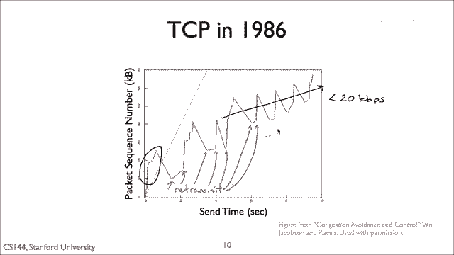

# 课程 P58：TCP Tahoe 拥塞控制详解 🚦

在本节课中，我们将学习 TCP Tahoe 拥塞控制机制的核心原理。我们将了解 TCP 如何通过“加性增、乘性减”算法来管理网络中的数据流，以避免网络拥塞并提升传输效率。

---


## 概述

TCP 被认为是网络领域的一项巨大成就，它作为一种可靠的传输层协议，能在各种网络环境中良好运行。本视频解释了 TCP 如何使用一个简单的有限状态机来控制网络中数据包的数量，从而实现高效的拥塞控制。

---

## 拥塞控制的基本概念


上一节我们介绍了 TCP 的重要性，本节中我们来看看拥塞控制要解决的核心问题。

流量控制旨在防止发送方过度加载接收方。但网络拥塞发生在数据包发送速率超过网络路径中**瓶颈链路**的处理能力时。假设数据从旧金山传输到波士顿，途中的每个路由器都有自己的队列。如果发送速率适中，数据包丢失率会很低。但如果发送速率过高，路由器队列将溢出，导致数据包被丢弃。


数据包丢失会触发重传，从而消耗额外时间并降低性能。因此，拥塞控制的目标是动态调整发送方**未被确认的数据包数量**，使其接近但不超过网络的支持能力。


困难在于，TCP 发送方对网络内部状态（如路由器队列长度）知之甚少。它只能从有限的信号（如数据包确认和丢失）中推断网络状况。


---

## AIMD 算法与拥塞窗口


基本总结是，在稳定状态下，TCP 使用 **AIMD** 算法。它维护一个名为 **拥塞窗口** 的变量。拥塞窗口指定了连接在网络中允许存在的、未被确认的报文段最大数量。

当发送方收到一个确认时，意味着一个报文段已成功离开网络。因此，在每个往返时间内，TCP 可以通过增加拥塞窗口的大小来发送更多数据。具体来说，它采用“加性增”策略。

**核心公式：**
- **加性增**：每个 RTT 周期，拥塞窗口增加 **1个 MSS**。
- **乘性减**：当检测到数据包丢失时，拥塞窗口减半（或重置为1个MSS）。

到目前为止，我们解释了拥塞控制问题的出现，以及 AIMD 作为一种简单高效的解决方案。但这并非一蹴而就。

---

## TCP 拥塞控制的历史演进

TCP 的演进是一个伟大的故事。早期互联网曾因拥塞而崩溃。在 20 世纪 80 年代中期，随着 TCP 流开始饱和链路，路由器开始丢弃数据包，而 TCP 的重传机制反应不佳，经常重传已成功到达的包，继续浪费饱和链路的容量。这导致了“拥塞崩溃”：网络极度拥堵，但应用程序的有效吞吐量却极低。


1988年，Van Jacobson 深入研究了这一问题并修复了 TCP，发表了开创性的论文。其算法构成了今天所有 TCP 实现的基础，这种 TCP 被称为 **TCP Tahoe**。后续的 **TCP Reno** 版本又进行了一些改进。现代 TCP 虽增加了复杂性，但其核心仍是 Reno。


---

## TCP 发送数据的三个核心问题

我们可以将 TCP 的数据发送行为简化为三个问题：
1.  何时发送新数据？
2.  何时重传数据？
3.  何时发送确认？

本视频将解释第一个问题。第二和第三个问题将在下一个关于 RTT 估计和自我时钟的视频中解答。


---

## 旧 TCP 的问题与 Tahoe 的改进


记住，TCP 头部有一个窗口字段，用于流量控制，确保发送方不超过接收方的处理能力。然而，如果接收方窗口远大于网络所能支持的容量，就会出问题。

早期 TCP 在完成三次握手后，会立即发送一整个流量控制窗口的数据。如果瓶颈链路只能排队几个数据包，那么后续的数据包将被大量丢弃。


下图来自确立 TCP 拥塞控制的经典论文，展示了旧 TCP 的低效行为：它立即发送大量数据段，远超网络处理能力，导致频繁丢包和超时重传，形成锯齿状的低效传输模式。




因此，TCP Tahoe 引入了三项关键改进：
1.  **拥塞窗口**
2.  更好的超时估计
3.  自我计时

本视频重点讲解第一项改进。


---

## 拥塞窗口与两种状态

流量控制窗口防止压垮接收方，而**拥塞窗口**则防止压垮网络。发送方的实际发送窗口是这两个窗口的最小值。

TCP Tahoe 将拥塞控制分为两个状态：
- **慢启动**
- **拥塞避免**

在连接开始时或发生数据包超时后，TCP 进入**慢启动**状态。当接近网络容量时，TCP 过渡到**拥塞避免**状态，并遵循 AIMD 策略。


---

### 慢启动状态的工作原理

当 TCP 进入慢启动状态时，其拥塞窗口被设置为 **1个 MSS**。此后，**每收到一个新的确认**，拥塞窗口就增加 **1个 MSS**。

**代码逻辑描述：**
```
cwnd = 1 MSS
for each new ACK received:
    cwnd += 1 MSS
```


这意味着拥塞窗口呈**指数增长**：1, 2, 4, 8, 16... 虽然名为“慢启动”，但相比旧方法（立即发送整个窗口），其增长是受控的；相比后续的“加性增”，其增长又是快速的。


---

### 拥塞避免状态的工作原理


在拥塞避免状态，TCP 增加窗口的速度要慢得多。它**每个 RTT 周期**才将拥塞窗口增加 **1个 MSS**。

**实现方式**：假设当前拥塞窗口大小为 `W` 字节（即 `W/MSS` 个报文段）。那么，每收到一个确认，窗口的增加量是 `(1 MSS) * (MSS / W)`。这样，当 `W/MSS` 个确认全部到达后，窗口总共增加了 `(W/MSS) * (MSS / W) * 1 MSS = 1 MSS`。

**公式描述：**
每个ACK带来的窗口增量 = `MSS * (MSS / cwnd)`

这就是 AIMD 中“加性增”的部分。


---

## 状态转换与信号

TCP 根据三种信号在两种状态间转换：
1.  **新确认**：传输顺利，继续增加窗口。
2.  **三个重复确认**：表明很可能有单个报文段丢失，但后续报文段已到达。
3.  **超时**：表明有严重问题，可能发生了多个报文段丢失或网络中断。

以下是 TCP Tahoe 的状态转换规则：
- 从**慢启动**开始。
- 当拥塞窗口超过一个称为 **慢启动阈值** 的值时，转入**拥塞避免**。
- 当发生**超时**或**三个重复确认**时，TCP 返回到**慢启动**状态，并将 `ssthresh` 设置为当前拥塞窗口的一半，然后将拥塞窗口重置为 1 MSS。


下图展示了 TCP Tahoe 拥塞窗口随时间变化的典型锯齿状模式：指数增长 -> 丢包（超时或3个DupACK）-> 窗口骤降并重置 -> 再次慢启动 -> 达到阈值后进入拥塞避免。


---

## 总结

本节课中我们一起学习了 TCP Tahoe 拥塞控制机制。我们了解到：

1.  TCP 通过 **拥塞窗口** 来限制网络中未被确认的数据量，发送窗口是拥塞窗口和流量控制窗口的最小值。
2.  核心算法是 **AIMD**：无丢包时加性增，检测到丢包时乘性减。
3.  TCP Tahoe 通过 **慢启动** 和 **拥塞避免** 两种状态来管理窗口增长。
4.  它使用 **新确认**、**三个重复确认** 和 **超时** 作为状态转换的信号。
5.  这种机制有效解决了早期互联网的拥塞崩溃问题，是 TCP 可靠高效运行的基础。

这回答了“TCP何时发送新数据”的问题：**当发送窗口允许时**。发送窗口由拥塞窗口动态调节，以适应网络状况。


