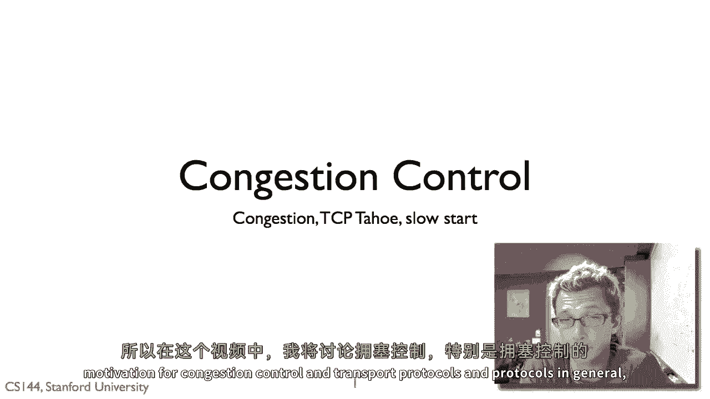

# 计算机网络课程 P59：TCP Tahoe 拥塞控制 🚦

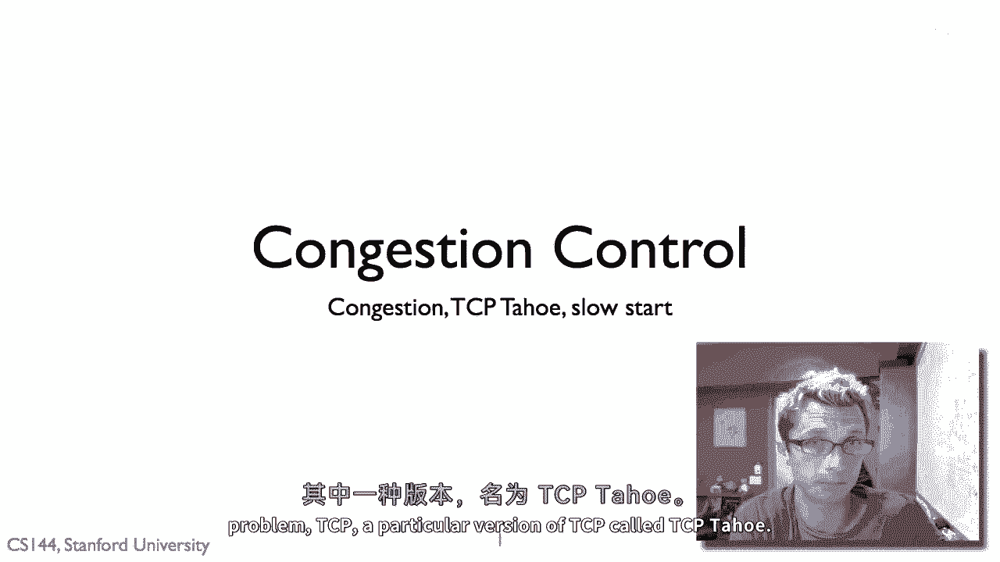

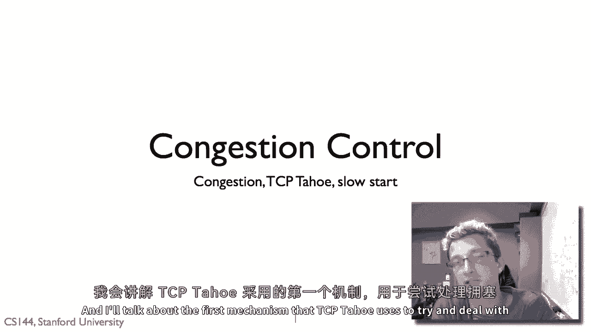

在本节课中，我们将学习网络拥塞控制的基本概念，并深入探讨TCP协议中第一个成功解决此问题的版本——TCP Tahoe。我们将重点介绍其核心机制之一：慢启动。

## 概述

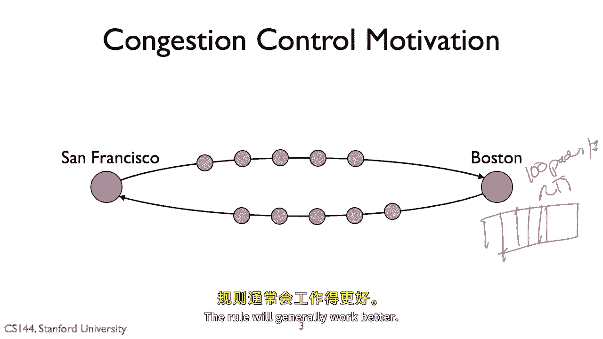

网络拥塞控制的核心思想是，发送数据的终端节点需要控制其发送速率，以避免过度负载网络。如果发送速率超过了网络路径中瓶颈链路所能支持的能力，就会导致大量数据包被丢弃，进而引发频繁的重传，最终使得网络性能急剧下降。TCP Tahoe通过引入**拥塞窗口**的概念，并采用**慢启动**和**拥塞避免**两种状态来动态调整发送速率，从而有效缓解了这一问题。

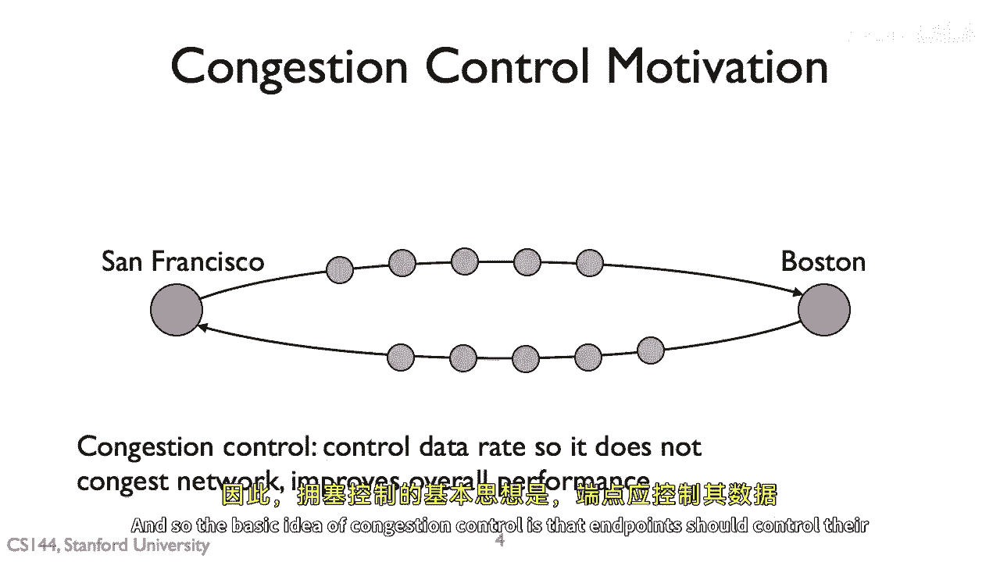

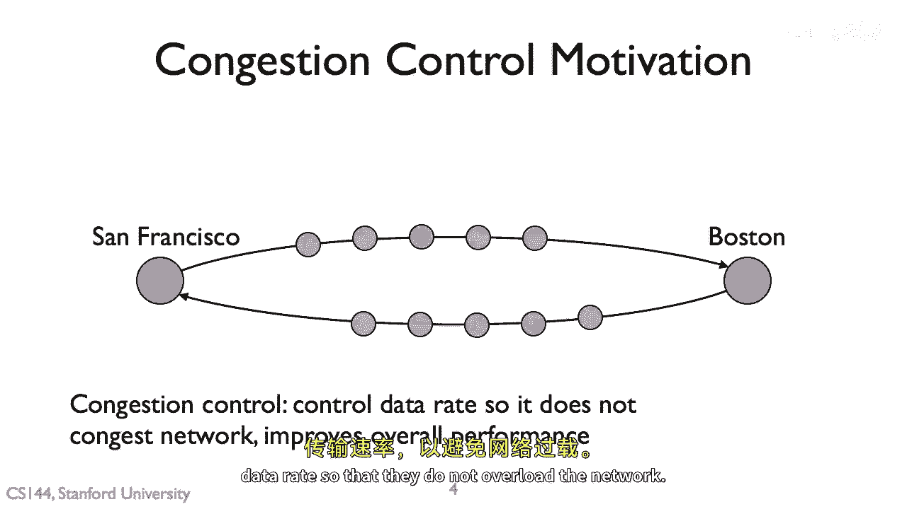

## 拥塞控制的基本动机

上一节我们提到了拥塞控制的重要性，本节中我们来看看其产生的具体背景。

流量控制机制（如TCP头部的窗口字段）规定了接收方能接受的数据量。然而，接收方的处理能力可能远大于网络路径的实际承载能力。

例如，波士顿的接收节点可能有一个能容纳100个数据包的缓冲区，但从旧金山到波士顿的路径上可能存在一个瓶颈链路，其实际只能支持每秒传输约5个数据包。如果旧金山的发送方仅根据流量控制窗口（即接收方能力）以高速率发送数据，它将发送远超网络承载能力的包。这会导致大多数数据包被丢弃，发送方需要花费大量时间进行重传来恢复，造成网络资源浪费和性能低下。

因此，网络拥塞控制的基本思想是：终端节点应控制其数据发送速率，以避免使网络过载，这通常能提升网络的整体性能。

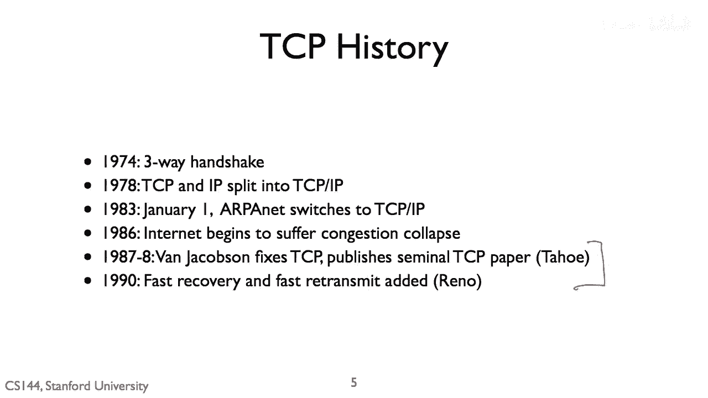

## TCP的发展与拥塞崩溃

如果我们从更宏观的视角退一步看，真正推动拥塞控制研究的是TCP协议及其在实践中遇到的问题。

TCP协议在1974年通过握手建立。1978年，TCP和IP被分割开来。1983年1月1日，整个ARPANET切换到了TCP/IP协议栈。然而，在此之后的大约三年，互联网开始遭受“拥塞崩溃”。在拥塞崩溃中，链路虽然被数据包塞满（以线速运行），但实际有效的应用层吞吐量却为零。因为链路上传输的绝大多数数据包都是不必要的重传或确认包。

Van Jacobson在一篇标志性的论文中分析了这一问题，并提出了解决方案。他发表的这篇里程碑式论文描述了**TCP Tahoe**。名字“Tahoe”和后来的“Reno”来源于发布这些TCP实现的伯克利Unix版本代号。如今，几乎所有TCP实现都包含了源自TCP Tahoe和TCP Reno的机制。

## TCP需要解决的三个基本问题

一个旨在提供可靠传输的协议需要回答三个基本问题：
1.  **何时发送新数据？** 即何时发送从未放入网络的数据。
2.  **何时重传数据？** 即何时重新发送之前已发送但可能丢失的数据。
3.  **何时发送确认？** 即何时通知对方已成功接收数据。

本质上，这些问题决定了协议何时生成数据包、重传包或确认包。在TCP中，确认信息是包头中的一个字段，可以与数据合并发送，但为了简化分析，我们常将数据流和确认流视为独立的单向流。

## TCP Tahoe 之前的算法与问题

在TCP Tahoe之前，TCP的行为相对简单。连接通过握手建立后，发送方会获知接收方的流量控制窗口大小（通过TCP头部窗口字段）。算法如下：
*   发送方立即发送一整个窗口大小的数据。
*   为每个发出的数据包启动一个重传计时器。
*   如果在计时器超时前未收到该数据包的确认，则重传该数据包。

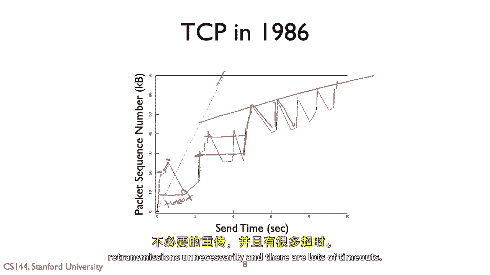

这种方法的核心问题是：如果流量控制窗口远大于网络的实际支持能力，发送方在开始时就会向网络“倾倒”大量数据。这就像虽然你的目的地有30MB的存储空间，但你并不想立即将30MB的数据全部灌入你较慢的DSL或电缆调制解调器链路中。

以下是实现该算法可能发生的情况：
*   **X轴**表示时间（秒），**Y轴**表示TCP发送字节的序列号（以KB为单位）。
*   连接建立后，TCP立即发送了约20KB的数据（一个满窗口）。
*   随后，它因等待确认而阻塞，直到某个数据包超时重传。
*   图中呈现出巨大的“锯齿”模式：一段密集的数据包流之后，跟着一段因超时而空闲的时期。
*   许多数据包被重复传输多次。
*   总体来看，有效数据传输的斜率很低，性能远未达到链路应有的容量。这是因为协议在不必要地发送大量重传，并经历了许多超时。

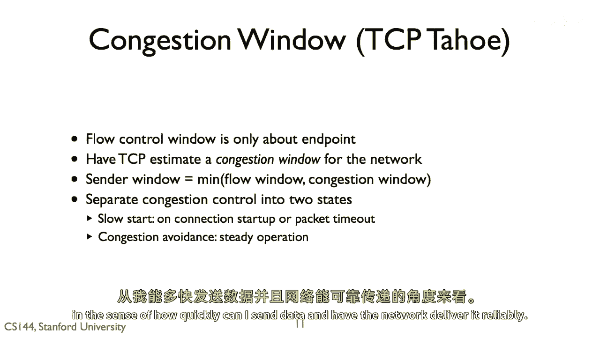

## Van Jacobson 的三大改进

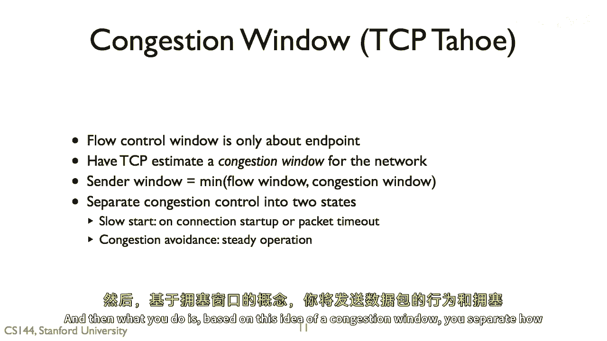

基于上述问题，Van Jacobson 提出了三大改进：
1.  **拥塞窗口** 的概念。
2.  更准确的**超时估计**。
3.  **自计时**。

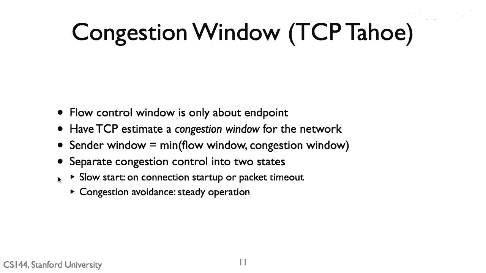

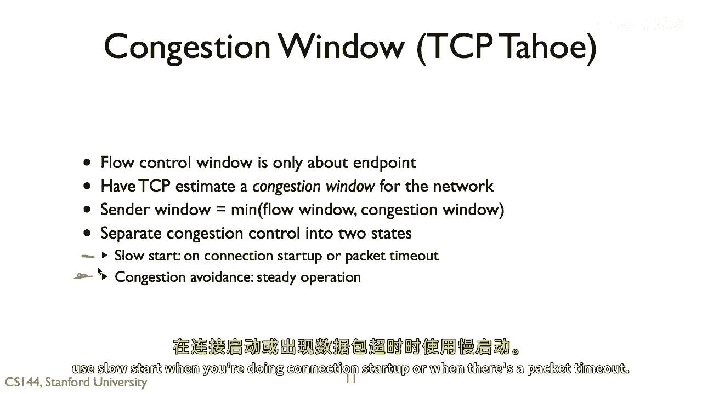

本节我们将重点讨论**拥塞窗口**及相关机制，超时估计和自计时将在后续课程中介绍。

## 拥塞窗口与发送窗口

基本思路是：流量控制窗口仅关乎接收端的能力，而发送方还需要估计一个**拥塞窗口**，它代表了网络当前能够支持的数据量。

因此，实际的**发送窗口**大小取值为：
`发送窗口 = min(流量控制窗口， 拥塞窗口)`
这个公式的意义在于：发送比网络支持更快的数据没有意义，发送比接收方能处理更快的数据也没有意义。

发送方的行为将基于这个拥塞窗口的大小来调整，并将拥塞窗口的管理分为两种状态。

## 慢启动状态

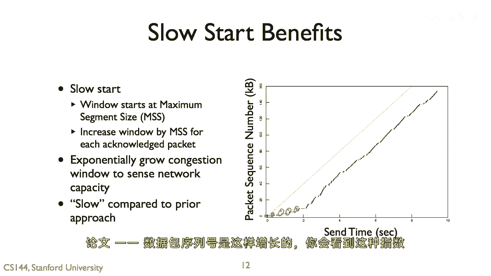

第一种状态称为**慢启动**。它在连接刚开始时，或者在发生数据包超时（表明出现严重问题）后使用。目的是让发送方从低速开始，快速探测出网络的可用容量。

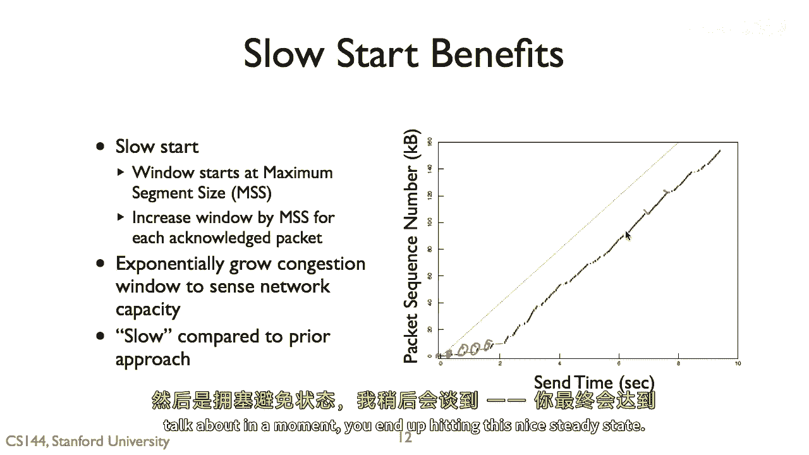

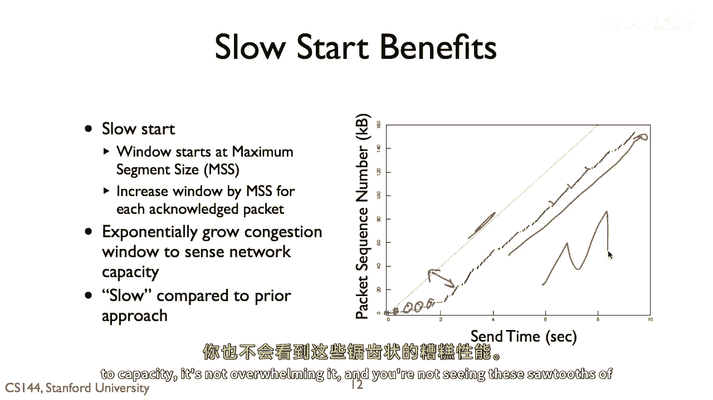

慢启动的基本原理如下：
*   初始时，拥塞窗口被设置为 **1个最大报文段** 的大小（即1个MSS）。
*   之后，**每收到一个新的确认**，拥塞窗口就增加 **1个MSS**。

这意味着在实践中：
*   第一个往返时间：发送1个包 -> 收到确认 -> 拥塞窗口变为2。
*   第二个往返时间：发送2个包 -> 收到2个确认 -> 拥塞窗口变为4。
*   第三个往返时间：发送4个包 -> 拥塞窗口变为8。
*   ...

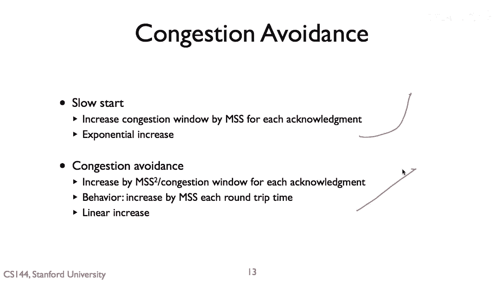

由此可见，拥塞窗口呈**指数增长**。虽然名为“慢启动”，但这是相对于旧版本一开始就发送满窗口数据而言的。通过这种指数增长，可以在对数级步数内快速逼近网络的拥塞点。

## 拥塞避免状态

第二种状态称为**拥塞避免**。当发送方认为其发送速率已经接近网络容量时，进入此状态。目标是谨慎地探索网络极限，并保持在一个稳定、高效的发送速率附近，避免引发拥塞。

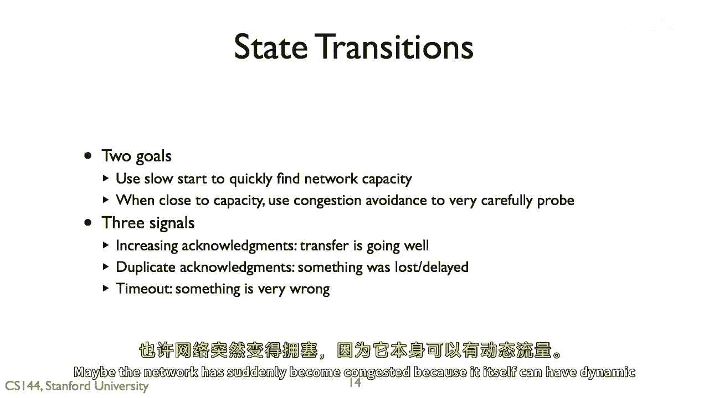

在拥塞避免状态下，窗口增长规则变为：
*   **每收到一个新的确认**，拥塞窗口增加 **（MSS * MSS) / 拥塞窗口**。

这种做法的效果是，在每个往返时间内，拥塞窗口大约只增加 **1个MSS**。也就是说，窗口从指数增长转变为**线性增长**，增长步伐大为放缓。

## TCP Tahoe 状态机与转换规则

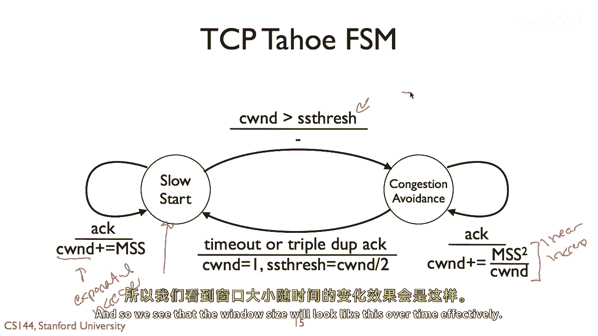

现在，我们将慢启动和拥塞避免结合起来，看看TCP Tahoe如何在这两种状态间转换。其行为由以下几个关键参数和信号控制：

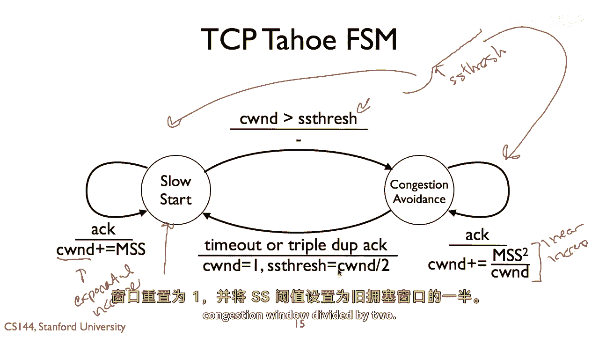

*   **拥塞窗口**： 发送方根据网络状况估计的窗口。
*   **慢启动阈值**： 一个状态切换的门槛值。
*   **三个关键信号**：
    1.  **正常确认**： 数据传输顺利，可以尝试增加窗口。
    2.  **三个重复确认**： 表示可能有单个数据包丢失（因为TCP使用累积确认，对同一序列号的多次确认意味着后续数据包已到但前面有包缺失）。
    3.  **超时**： 表示发生了严重问题，可能网络严重拥塞或路径中断。

以下是TCP Tahoe的有限状态机描述：

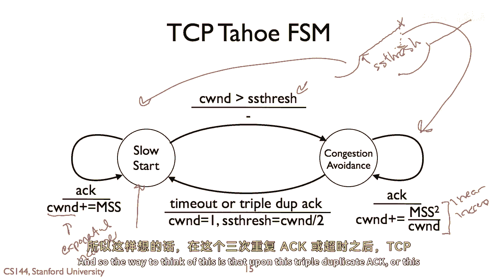

1.  **初始与慢启动**：
    *   连接开始时，处于**慢启动**状态，设置 `拥塞窗口 = 1 MSS`，并设置一个初始的`慢启动阈值`。
    *   在慢启动状态下，每收到一个确认，执行 `拥塞窗口 += 1 MSS`。
    *   当 `拥塞窗口` 增长到超过 `慢启动阈值` 时，状态转换为**拥塞避免**。

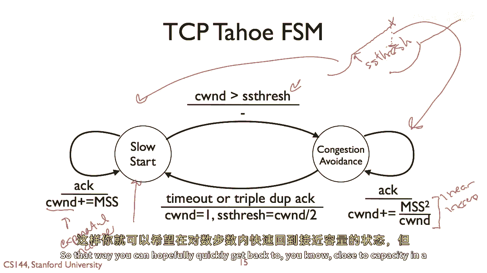

2.  **拥塞避免**：
    *   在拥塞避免状态下，每收到一个确认，执行 `拥塞窗口 += (MSS * MSS) / 拥塞窗口`，实现线性增长。
    *   如果在此状态下发生**超时**或收到**三个重复确认**，则意味着可能发生了拥塞。

3.  **响应拥塞**：
    *   一旦检测到拥塞（超时或三个重复确认），TCP Tahoe会采取激进措施：
        *   设置新的 `慢启动阈值 = 当前拥塞窗口 / 2`。
        *   重置 `拥塞窗口 = 1 MSS`。
        *   状态切回**慢启动**。

这个过程可以理解为：每当TCP认为当前发送速率过高导致拥塞时，它就“退避”到起点（慢启动），但记录下之前拥塞点的一半作为新的目标阈值。然后通过慢启动指数增长快速接近这个新阈值，达到后再通过拥塞避免线性增长谨慎探索。这样就能动态地适应网络变化，将发送速率维持在接近但不超越网络容量的水平。

## 总结

在本节课中，我们一起学习了TCP拥塞控制的核心思想以及TCP Tahoe协议的具体实现机制。

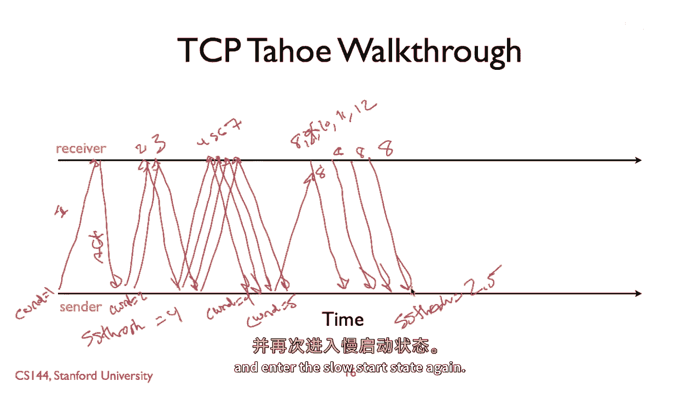

我们首先了解了拥塞控制的动机：防止发送速率超过网络承载能力，避免性能下降。然后回顾了TCP发展史上出现的“拥塞崩溃”问题，这催生了Van Jacobson的改进方案。

TCP Tahoe的核心创新是引入了**拥塞窗口**，并将发送窗口限制为接收方窗口和拥塞窗口的最小值。它通过**慢启动**和**拥塞避免**两种状态来管理拥塞窗口：
*   **慢启动**阶段，窗口指数增长，用于快速探测网络容量。
*   **拥塞避免**阶段，窗口线性增长，用于谨慎维持在容量附近。
*   通过**慢启动阈值**和**三个重复确认/超时**信号在两种状态间切换。一旦检测到拥塞，立即大幅减小窗口并重新慢启动。

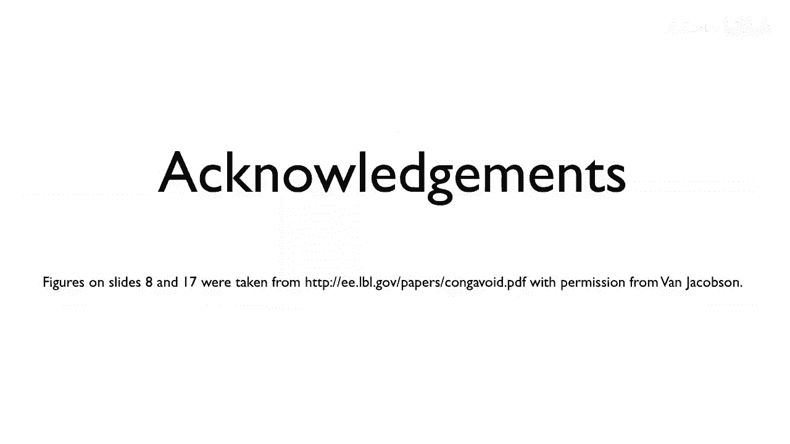

这套机制使得TCP能够有效利用网络带宽，同时保持稳定性和公平性，是后续所有TCP拥塞控制算法的基础。在接下来的课程中，我们将继续探讨TCP Reno等版本对Tahoe的改进。