# 计算机网络原理 P6：分组交换原理 📦

在本节课中，我们将要学习互联网设计的核心思想之一：分组交换。我们将了解什么是数据包，分组交换如何工作，以及它带来的两大关键优势。

---

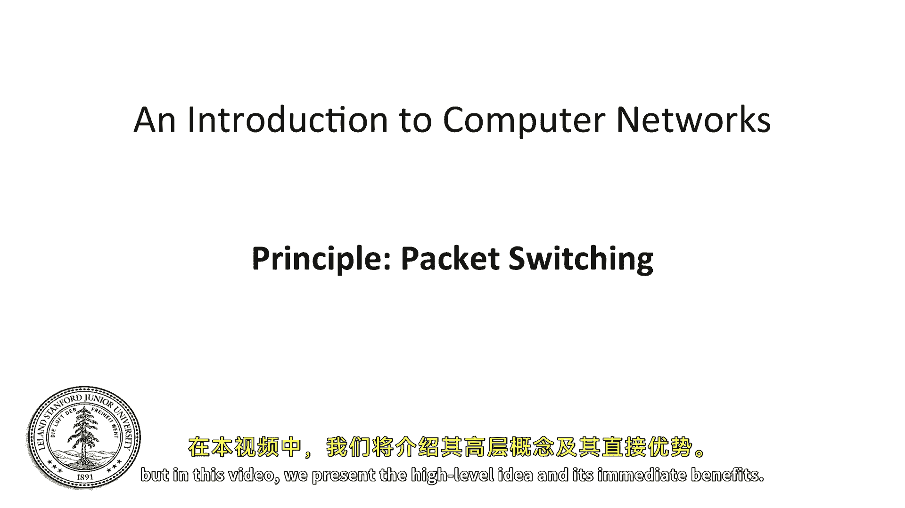

## 概述

互联网最初的设计基于一个具有革命性的想法：分组交换。如今，这似乎是构建网络的直接方式，但情况并非总是如此。分组交换是一个简单的想法，但将其付诸实践会产生许多深远的影响。本课程将用一整周的时间讨论分组交换及其影响，而本视频将介绍其高级理念及其带来的直接好处。

---

## 什么是数据包？📦

数据包是一个自包含的单位，它包含了到达目的地所需的所有必要信息。

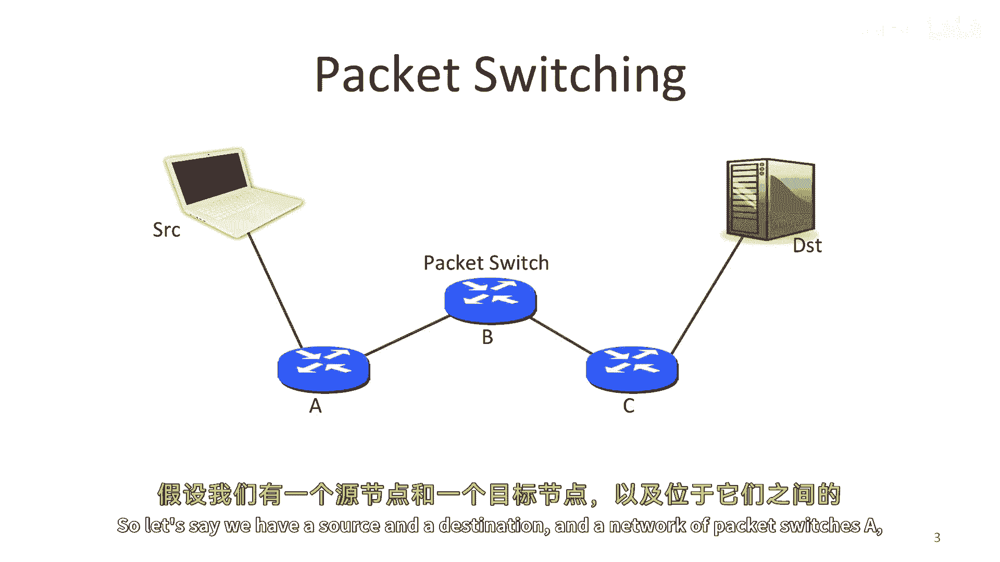

**数据包定义**：一个包含所有必要信息以使其到达目的地的自包含单位。

---

## 什么是分组交换？🔄

上一节我们介绍了数据包，本节中我们来看看分组交换的核心概念。

分组交换是指我们将数据分割成离散的、自包含的数据块。每个数据块被称为一个**数据包**，它包含足够的信息，使得网络能够将每个数据包送达目的地。

**分组交换定义**：将数据分成离散的、自包含的数据块（即数据包）进行传输。

---

## 分组交换如何工作？🛣️

了解了基本概念后，我们来看看分组交换在实际网络中是如何运作的。

假设我们有一个源点（A）、一个目的地，以及一个由节点B和C组成的包交换网络。当A接收到发往目的地的数据包时，它将其发送到链路B。当B接收到该数据包时，它将其发送到C。当C接收到数据包时，它将其直接发送到目的地。在分组交换的最简单形式中，每个数据包都是被单独且独立地路由的。

例如，假设还有一个连接到B的交换机D。在向C发送一个数据包后，B可以立即向D发送下一个数据包。或者，如果下一个数据包也是发往目的地的，B可以连续发送两个数据包。

以下是分组交换的一个简单操作定义：

*   对于每个到达的数据包，我们选择其出站链路。
*   如果链路空闲，我们就发送它。
*   否则，我们将数据包保留下来以备后用。

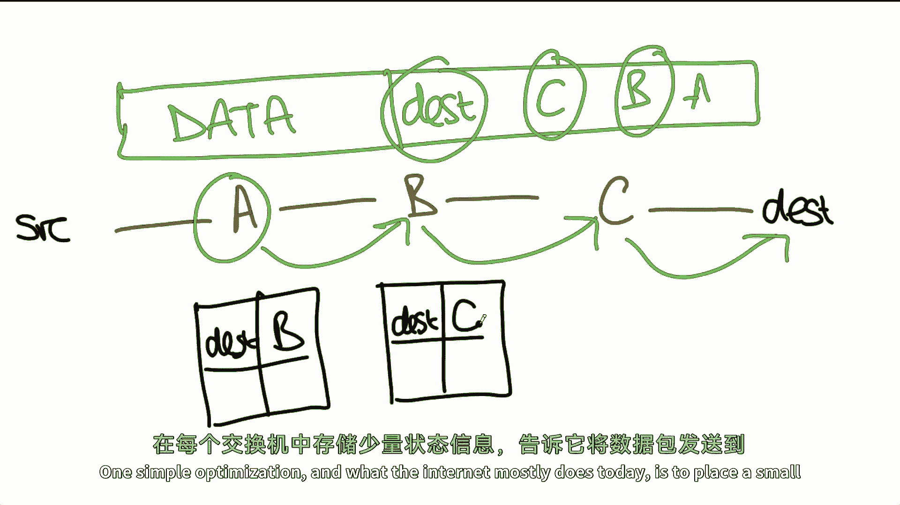

---

## 数据包的路由方式 🧭

上一节我们看到了交换机如何决策，本节中我们来看看数据包是如何知道该去哪里的。

分组交换工作的一种方式是，每个数据包都包含一个明确的**路由**，指定了沿途每个包交换机的ID，直到目的地。我们称之为**自我路由**或**源路由**，因为源点在发送数据包时就指定了路线。

例如，源点为数据包插入路径 `A -> B -> C`。然后，目的地将数据包转发给A。A查看数据包头部，看到下一个节点是B，于是将数据包转发给B。B看到下一个节点是C，于是转发给C。C看到最后一个节点是目的地，于是完成转发。

互联网支持这种源路由，但通常默认关闭，因为它会引发重大的安全问题。

---

## 更高效的路由：转发表 📋

源路由需要携带完整路径，效率不高。一个简单的优化（也是当今互联网主要采用的方式）是在每个交换机中存放一小部分状态。

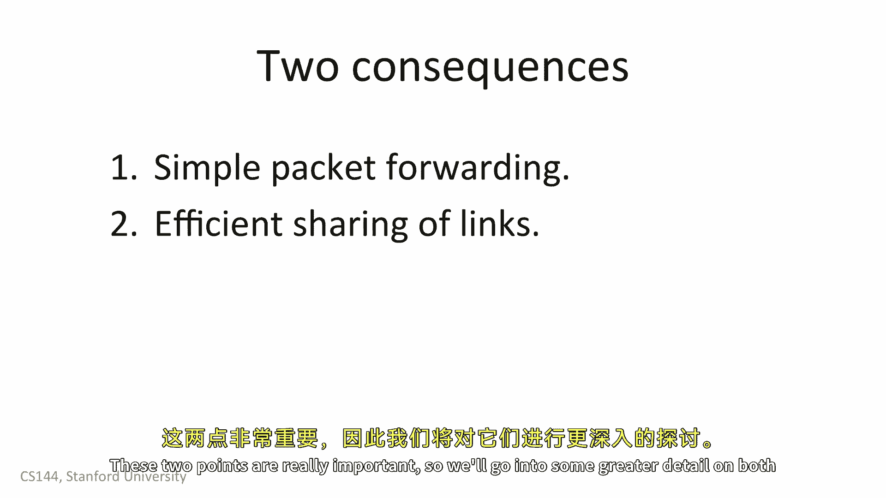

这个状态通常是一个**转发表**，它告诉交换机应该将数据包发送到哪个“下一跳”。例如，交换机可以拥有一张表，其中包含目的地地址和对应的下一跳地址。当它接收到一个数据包时，就在表中查找目的地地址，并将数据包发送到相应的下一跳。

在这种模型中，所有数据包只需要携带**目的地地址**。沿途的每个交换机都可以根据这个地址和本地转发表做出正确的转发决策。

例如，在我们的网络中：
*   交换机A的转发表指出：发往目的地的数据包应去往交换机B。
*   交换机B的转发表指出：发往目的地的数据包应去往交换机C。

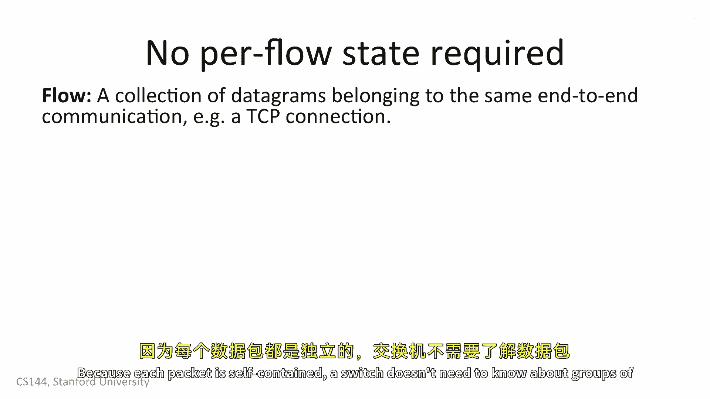

---

## 分组交换的两大优势 ✨

了解了分组交换的工作机制后，我们来看看它带来的两个非常重要的属性。

### 优势一：交换机简单高效

第一个优势是交换机可以为每个数据包做出独立的本地决策。它不需要在数据包上保持额外的状态。交换机看到两个数据包去往同一个目的地，但它不需要知道这两个数据包是否是某个更大传输协议（如一次文件传输）的一部分。交换机也不需要了解数据包的内容——它不需要知道哪些数据包是Skype通话，哪些是网页请求，哪些是固件更新。它只是简单地转发数据包。

这极大地简化了交换机的设计和实现。

### 优势二：高效共享链路资源

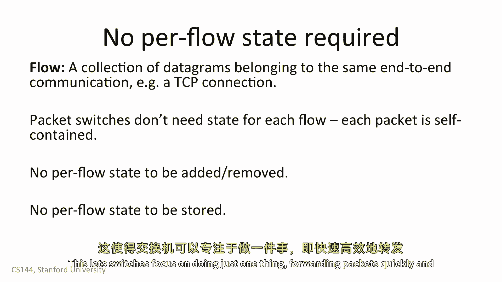

第二个优势是它让我们能够有效地将链路资源共享给多方。

例如，考虑家庭无线路由器。有两个人在各自的笔记本电脑上浏览网页。如果一个人正在阅读页面（此时不产生流量），那么另一个人可以以全速下载文件。如果第一个人开始加载新网页，链路容量就可以在两人之间共享。一旦下载完成，第一个人又可以使用链路的全部容量。

---

## 深入探讨优势一：无状态转发 🧠

这两个优势非常重要，让我们更深入地探讨第一个方面：无状态转发。

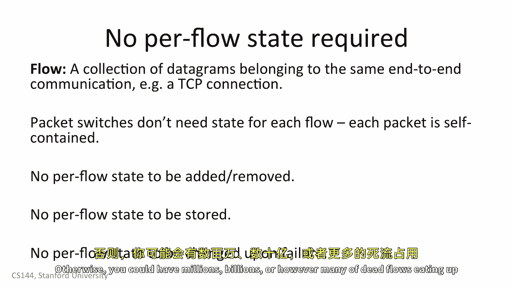

当我们通信时，通常不只发送一个数据包，而是发送许多个。例如，一次语音通话由许多连续的数据包组成，它们都属于同一次通信。我们称这一系列数据包为一个**流量**。

更具体地说，一个**流量**是属于同一端到端通信的一组数据包，例如一个TCP连接。

分组交换的核心在于每个数据包都是独立路由的。因为每个数据包都是自包含的，交换机不需要知道关于数据包组或“流量”的任何信息。

试想一下，如果每个交换机都必须跟踪经过它的每一个Web连接，这将需要巨大的状态，并且非常难以管理。相反，独立处理每个数据包意味着交换机可以建造得更简单、更易于管理和调试。交换机不需要担心添加或删除“流”的状态。

想象一下，如果你每次想加载一个网页，都需要与路径上的每个交换机通信，只为设置状态以便你的请求能通过。这可能会使事情变得慢得多。而使用分组交换，你只需要发送数据包，交换机就会转发它们。

交换机也不需要存储这种“流”状态。因为交换机必须非常快，它们需要将状态存储在非常快速的内存中，这将是昂贵的。分组交换允许交换机只专注于一件事：快速高效地转发数据包。

最后，这意味着交换机不需要担心故障。例如，当你开始一个Web请求时，如果你的平板电脑突然没电了，在需要维护“流”状态的系统中，交换机将一直保留这个请求的流状态。如果创建状态的节点之一失败，交换机需要知道如何清理后果，否则内存中可能会堆积大量无效的“死亡”流状态。

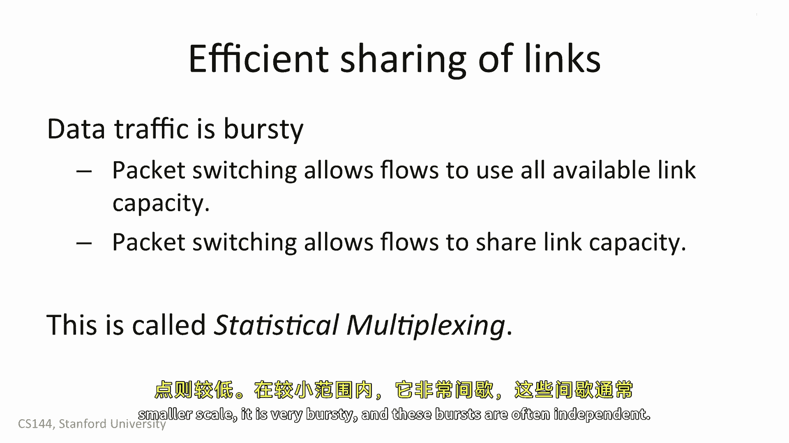

而使用分组交换，交换机没有针对每个终端或每个流的状态。如果你的平板电脑关机了，交换机并不关心，它只是停止从那里接收数据包。这样，交换机在功能上就独立于通过它发送流量的计算机。

---

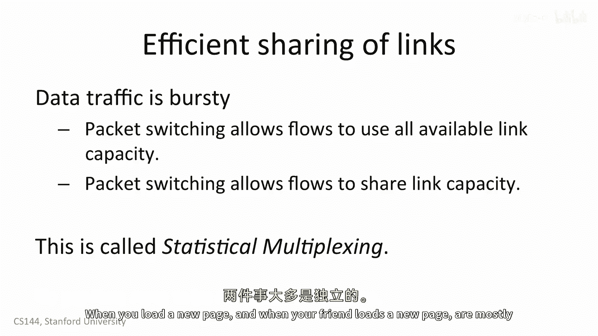

## 深入探讨优势二：统计复用 📊

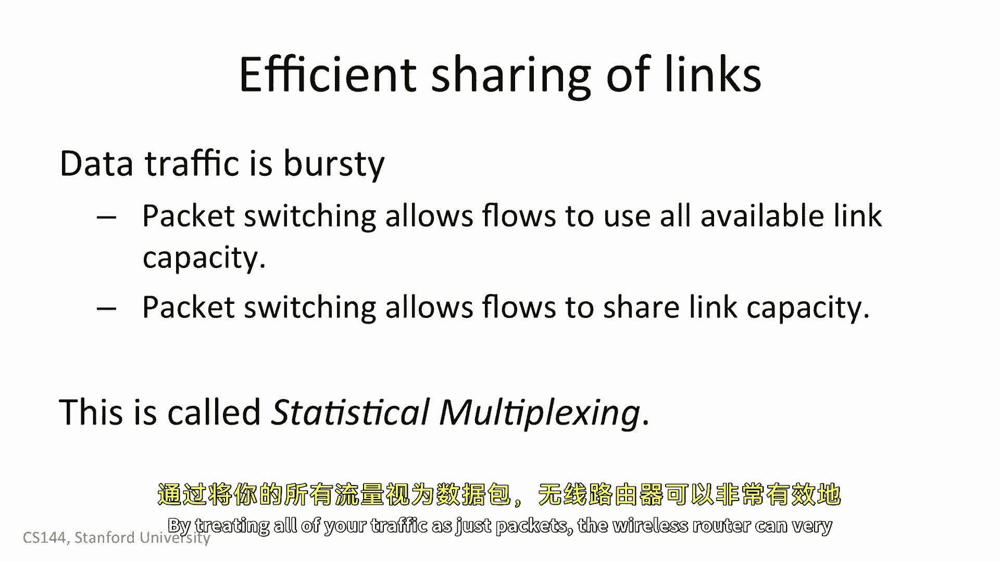

上一节我们讨论了无状态转发如何简化交换机，本节我们来看看第二个优势：高效的资源共享，这被称为**统计复用**。

想想你通常如何使用互联网：你的使用是间歇性的。你加载一个网页，然后阅读它，再加载另一个。你从iTunes下载几首歌，然后听歌。你从Netflix流式传输节目45分钟，然后停止。数据流量并非总是以固定速率发送和接收，其使用率会随时间起伏。

在宏观上，流量模式会大规模变化（例如，下午两点通常很高，晚上八点不错，凌晨两点很低）。在微观上，流量非常具有**突发性**，而且不同用户的突发往往是独立的。

假设你和你的朋友都在咖啡店浏览网页。当你加载新页面时，你的朋友可能在阅读；当你的朋友加载新页面时，你可能在阅读。大多数时候你们的流量是独立的，有时可能会重叠，但往往不会。

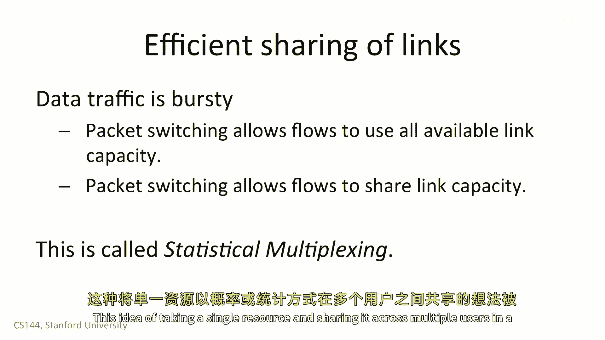

因为路由器将所有流量都视为独立的数据包，所以它可以非常有效且简单地在你们之间共享其容量。
*   如果你正在加载页面而你的朋友在阅读，无线路由器可以将其全部容量分配给你的数据包。
*   如果你的朋友正在加载页面而你在阅读，路由器可以将其全部容量分配给你朋友的数据包。
*   如果你们俩同时都在使用，那么链路容量将由你们共享。

这种根据概率或统计方式将单个资源分配给多个用户的想法，就叫做**统计复用**。它是“统计的”，因为每个用户根据其他人如何使用资源而获得一个统计上的份额。例如，如果你的朋友正在阅读，你可以使用全部链路；如果你们俩都在加载页面，你平均获得大约一半的链路容量。

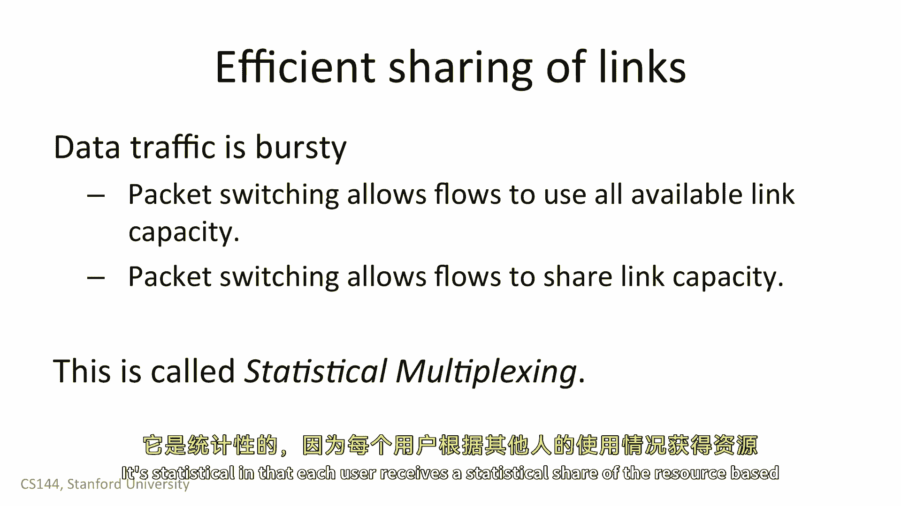

---

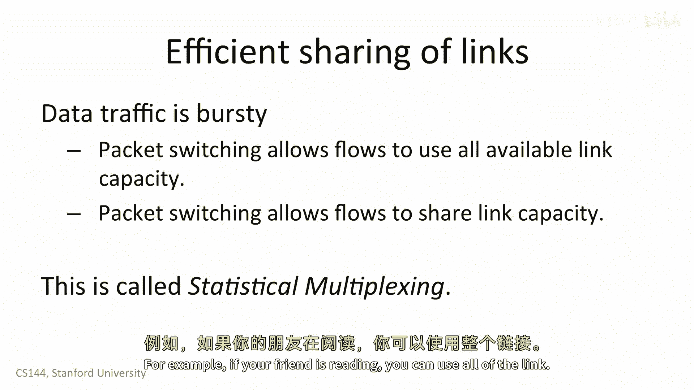

## 总结 🎯

本节课中我们一起学习了分组交换的原理。我们了解到：

1.  **数据包**是包含目的地信息的自包含数据单元。
2.  **分组交换**是将数据分割成数据包进行独立传输和路由的过程。
3.  路由可以通过**源路由**（数据包携带完整路径）或更常见的**查表转发**（交换机根据目的地地址查找转发表）实现。
4.  分组交换有两大核心优势：
    *   **使交换机简单高效**：交换机无需维护每个“流”的状态，只需独立转发每个数据包，简化了设计、管理和故障处理。
    *   **实现统计复用**：允许网络链路根据用户的实际需求动态、高效地在多个用户之间共享容量，提高了资源利用率。

这个简单的构建块在当时是革命性的，并构成了当今互联网的基础。