# P60：p59 4-6 TCP RTT Estimation - 加加zero - BV1qotgeXE8D

Tp taho 对网络拥堵崩溃问题进行了三项主要改进。

在前一个视频中遇到的互联网。

我讲述了它如何将其拥塞窗口集成到两个操作状态中，到其两个操作状态中，慢启动和拥塞避免，在这个视频中，我将解释其他两个机制，Rtt 估计和自我时钟。

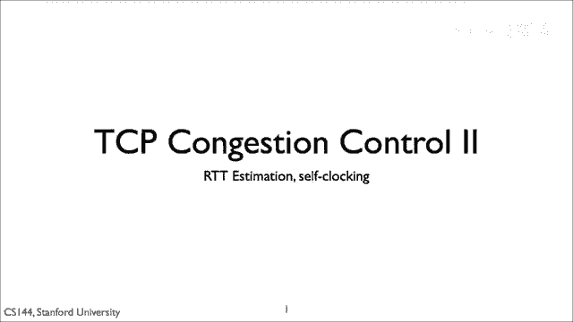

记住，tcp 实现归结为三个问题，第一个问题是何时发送数据，Tp 的答案是使用拥塞窗口来限制其传输，当网络下一次拥塞时，让我们回答第二个问题，当tcp应重传数据时何时，结果发现。

准确地估计重传超时时可以对dispu的行为产生显著影响，选择超时过长会导致tp停滞，等待确认，选择超时过短会导致tp退缩过激，进入慢启动状态，因此，tp tao 对超时估计进行了一些改进。

这些改进已经证明是估计嘈杂信号和网络系统的一种普遍好方法，因此，学习它们可以给设计其他协议提供指导。

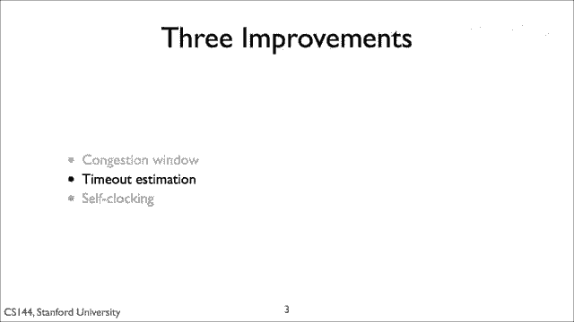

因为tcp过渡到慢启动状态。

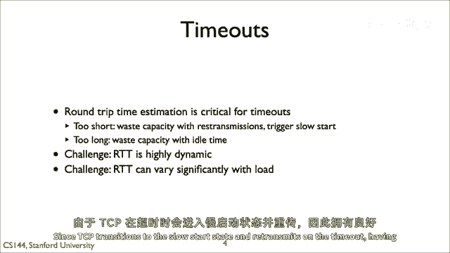

慢启动状态和重传在超时，有一个好的超时时间值是至关重要的。

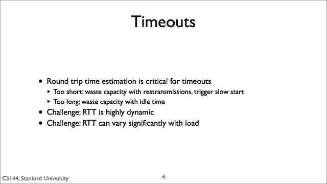

如果往返时间是一个常数，那么最佳传输超时就比往返时间大一点点。

因为成功接收的包，确认应该在包传输后的时间间隔内到达，但是往返时间不是常数，它们可以高度动态，此外，它们可以随着负载的显著变化，随着流发送段，它可能开始填充沿途的路由。

其他来源的流量爆发也可以显著改变队列延迟，给所有这些噪音，我们需要一种 robust 的方法来估计在假设包丢失之前多久。

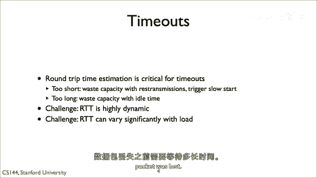

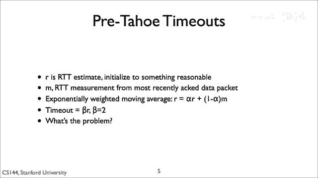

在tcp之前，Tahoe，tcp 跟踪了一个单一变量r its rgt 估计。

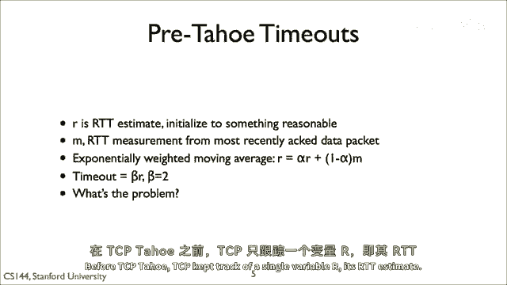

每次它收到一个新的确认，它将计算一个 rtt 估计 m。

从发送段到确认接收的时间间隔。

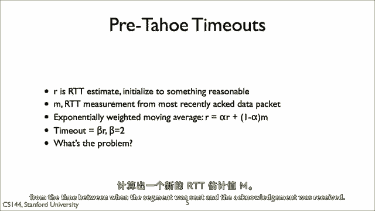

R 是那些测量的指数加权移动平均。

如果没有对一段的确认，在tp 假设它丢失并触发重传后两个r。

那么这个方法的问题在哪里。

基本问题是，它假设 rtt 测量的方差是其值的一个常数因素。

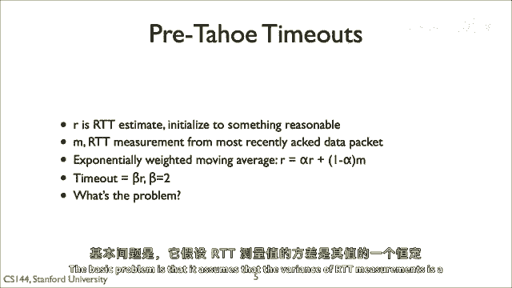

想象，例如，"你有一个高低波动延迟的路径"，例如。

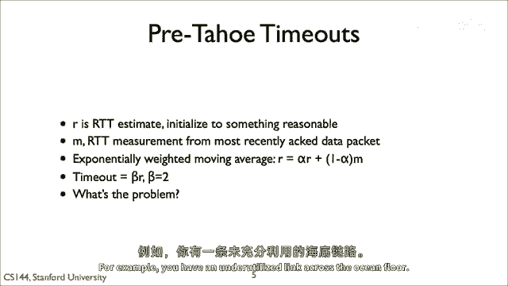

"您在海底有一个被低估的链接"，即使延迟为八十毫秒，九十九点九，"关于rgds的百分之九十九都在八十到八十一毫秒之间"，"这个TCP算法将等待160毫秒"，"在触发重传计时器之前"，"但是。

这几乎完全是一种浪费的rtt"，想象一个相反的情况，平均延迟是二十毫秒，但是，它的方差非常高，以至于延迟有时高达八十毫秒，尽管一大部分包有高的延迟，tcp将假设这些包丢失，缩小其拥塞窗口至1。

并重新传输它们。

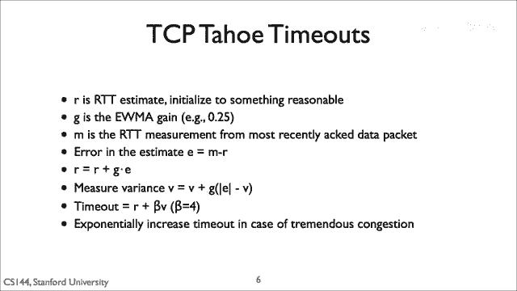

所以，tcp，tahoe在其重传超时时集成了对延迟方差的估计。

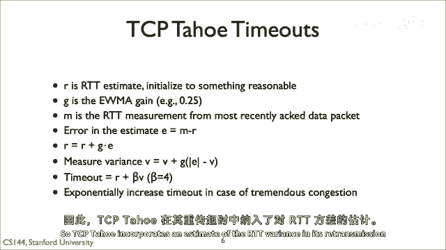

它保持对RTT估计的指数加权移动平均。

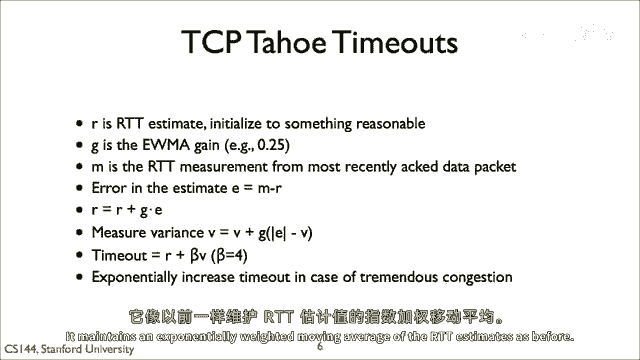

与以前相同，它还测量测量与估计的差异程度。

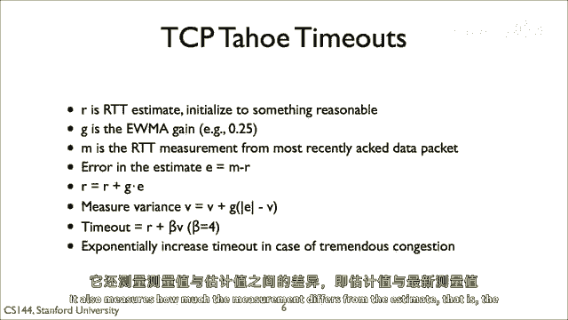

那就是估计与最近测量之间的误差。

它对这个方差应用指数加权移动平均，同样适用于V。

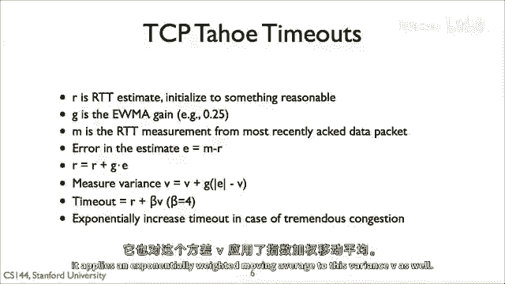

它计算RTT估计的时间出，加上四倍方差。

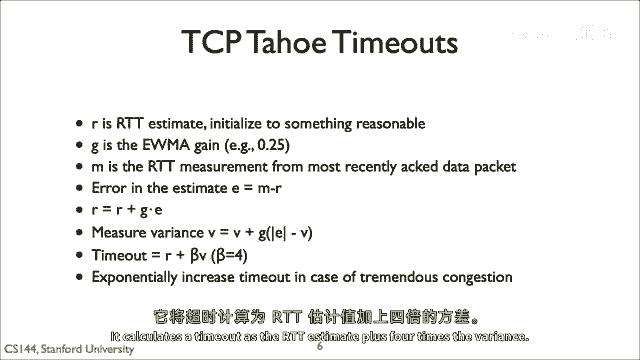

所以，如果连接的RTT非常稳定，超时时间只会稍微大于平均RTT。

但如果RTT有较大的变化，TCP会选择一个更大的超时时间。

如果重传失败，那就是它没有被确认，然后TCP再次以指数增加的定时器重传。

TCP假设这意味着存在巨大的拥塞。

所以继续其乘法减少，通过减少，通过增加它重传的片段之间的间隔。

两个值g和beta，它们被选择以便进行一些实验，这种方法相对 robust。

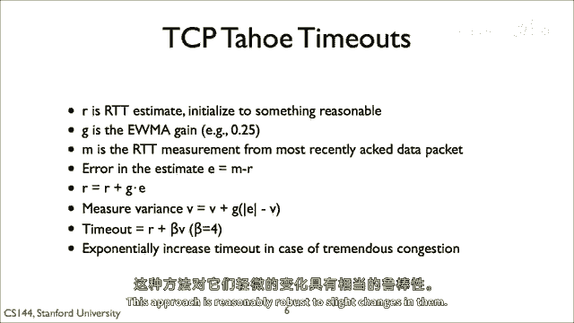

对它们进行微小的更改，在它们背后并没有特殊的魔法，它们只是在实践中工作得很好。

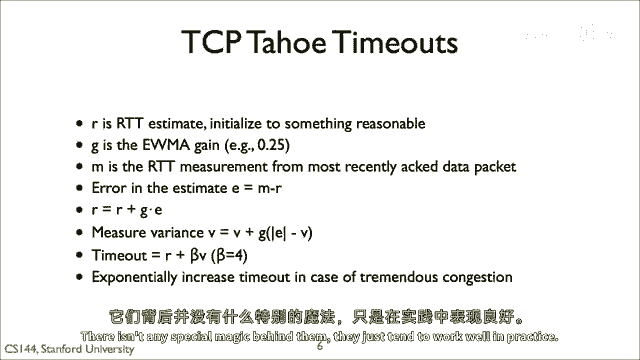

以下是从原始tcp拥塞控制论文中提取的两幅图表，它们显示了tcp观察到的数据点与底部亮线之间的rtt，并且估计时间t p保持顶部的暗线。

t p tahoe在pre tahoe之前非常保守，测量值和时间出值之间的大差距代表浪费的时间，当tcp应该等待太久重新传输时。

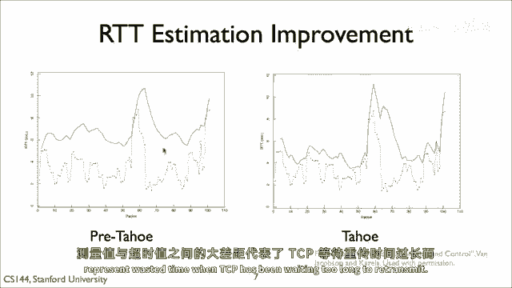

也大约在包六十处。

当rtt尖峰向上时，在太浩之前，将会不必要的重传和慢启动。

相比之下，右侧显示的tp tao的rtt估计值更紧密地跟踪rtt值。

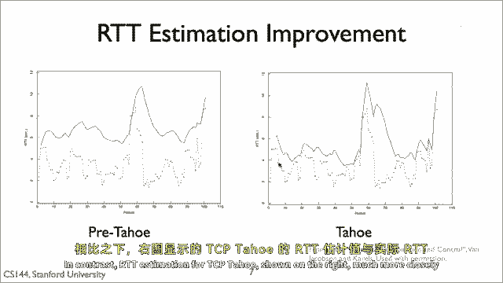

所以现在我们已经回答了第二个问题，TCP何时重传数据。

从这一课中我们可以学到，需要估计一个重传或重试计时器。

当需要估计重传或重试时间时，或者在网络协议中，不仅要考虑观察到的往返时间，但是也有其变体。

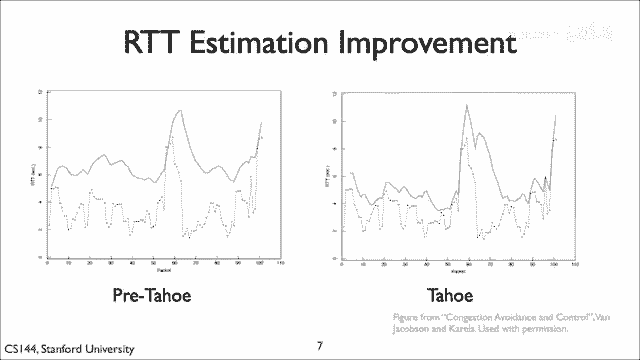

所以现在我来到了第三个问题，TCP应该在何时发送确认。

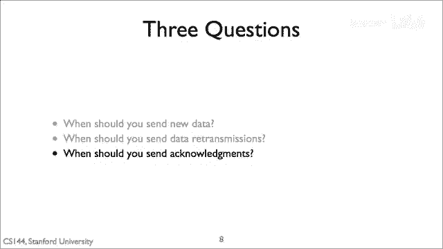

结果答案是一般来说尽可能少的延迟。

如果TCP遵循这个政策，这将导致一个非常重要且强大的行为，被称为自我计时。

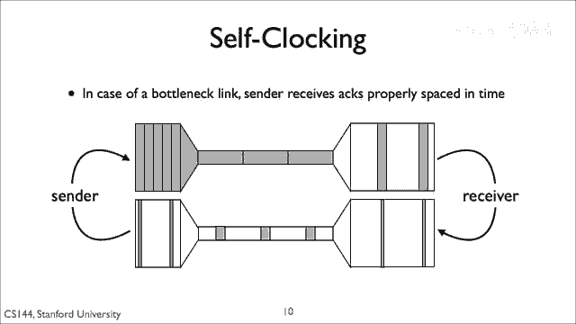

自我计时意味着如果TCP发送确认积极。

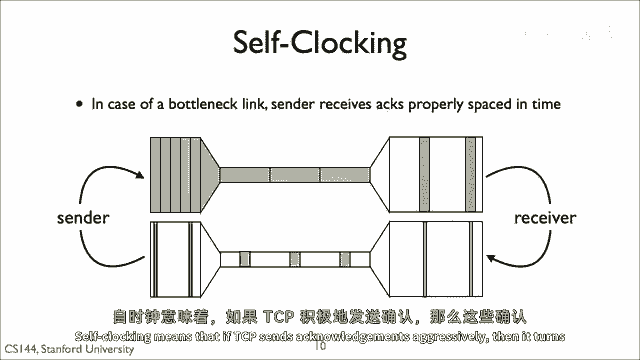

那么它们就会随着时间的推移而分散，根据瓶颈链的吞吐量。

发送者将收到随着时间的推移而分散的确认。

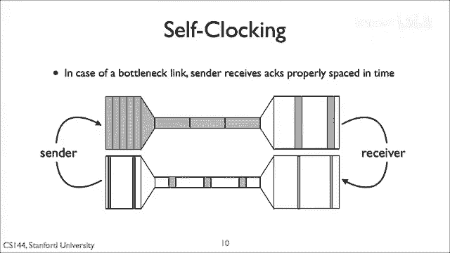

由于发送者将在发送窗口前进一步时立即发送新数据，这意味着它将以瓶颈链所能支持的速率发送分段。

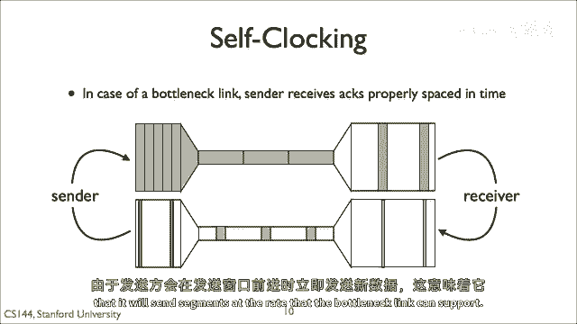

这张图表直观地显示了，网络的吞吐量被显示为路径的宽度。

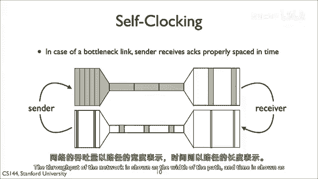

并且时间被显示为路径的长度，在宽大的高带宽链路上发送的包需要很短的时间。

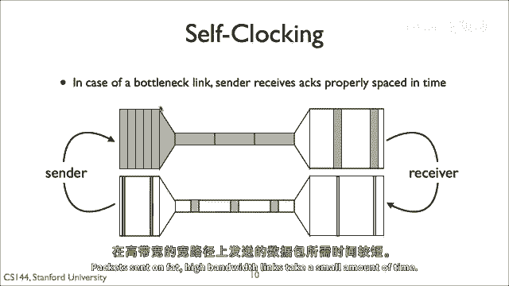

在同一条低带宽链路上发送的包。

有更长的传输时间和队列延迟，因此，它们在瓶颈链路中冒出来时需要更多的时间。

当它们从瓶颈链路中冒出来时，他们将再次快速，但按照他们离开瓶颈的速率，时间上会间隔开来。

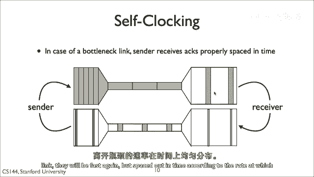

因为确认包很小，并且假设瓶颈不在反向路径上，这意味着确认将到达中心。

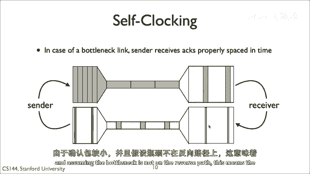

大约以他们希望穿越瓶颈链的速率到达。

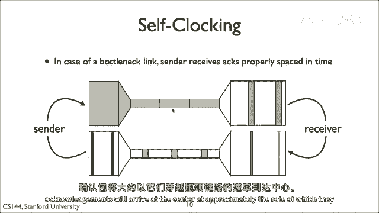

这项政策有一个额外的好处。

tcp只有在收到确认时才将新包放入网络。

那就是当它的一个现有包从拥堵角度看已经离开了网络时。

这意味着tcp正在保持未完成的包的数量，那就是网络稳定的队列和容量的使用。

所以，自时钟原理意味着TCP积极发送确认，一旦它收到数据段。

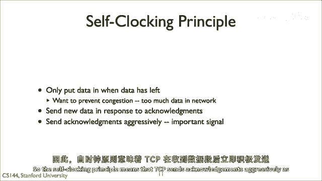

这是为了向发送方信号数据已经离开网络，同时也为了提供RTT估计并允许它自我时钟其传输，所以，总的来说，Tp tau引入了三个主要机制，允许有效地管理拥塞并获得良好的性能，即使在繁忙的网络中。

第一个是它引入了拥塞窗口，它意味着它保持一个AMD，类似于状态机，可以在慢启动和拥塞避免状态之间转换，状态机控制拥塞窗口的更新方式，第二个是它计算重传计时器，使用指数加权移动平均以及方差。

从而减少假阳性以及假阴性。

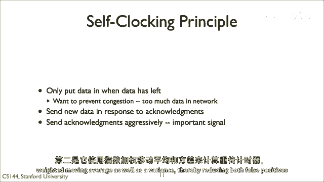

最后通过积极发送确认。

