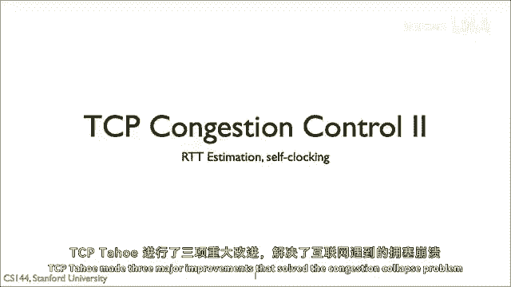

# 课程 P60：TCP RTT 估计与自我时钟机制 🕐

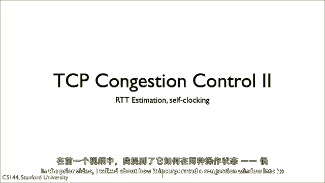

在本节课中，我们将学习 TCP Tahoe 协议为解决网络拥塞崩溃问题而引入的另外两项核心改进：**RTT（往返时间）估计**与**自我时钟**机制。上一节我们介绍了拥塞窗口和慢启动/拥塞避免状态机，本节中我们来看看 TCP 如何更智能地决定何时重传数据，以及如何通过确认机制来调节发送速率。

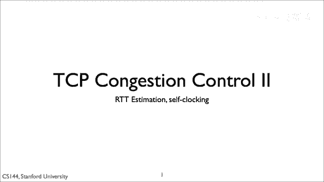

---

## 概述 📋

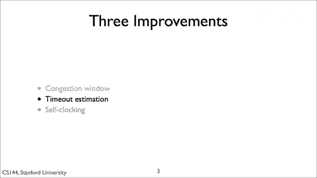

TCP Tahoe 对早期网络拥塞崩溃问题进行了三项主要改进。我们已经学习了第一项：将拥塞窗口集成到慢启动和拥塞避免两个操作状态中。本课程将详细解释其余两项关键机制：
1.  **RTT 估计**：如何动态、准确地计算重传超时（RTO）值。
2.  **自我时钟**：接收方如何通过确认（ACK）来自然地调节发送方的数据发送节奏。

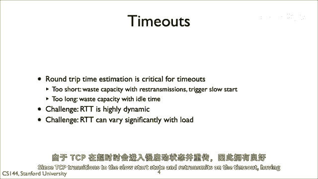

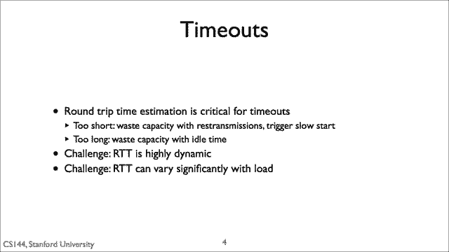

准确估计重传超时对 TCP 行为有显著影响。超时过长会导致传输停滞，等待不必要的确认；超时过短则会导致不必要的重传和激进地退回到慢启动状态。TCP Tahoe 的改进方法已成为估计网络系统中噪声信号的通用好方法。

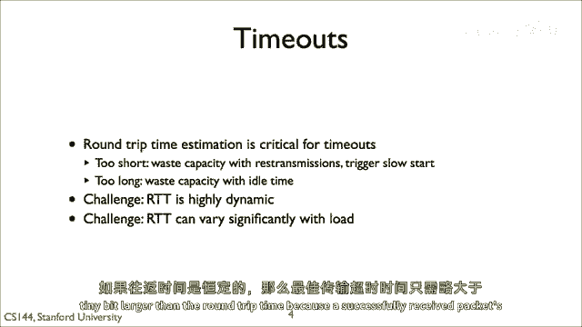

---

## RTT 估计的重要性 ⚖️

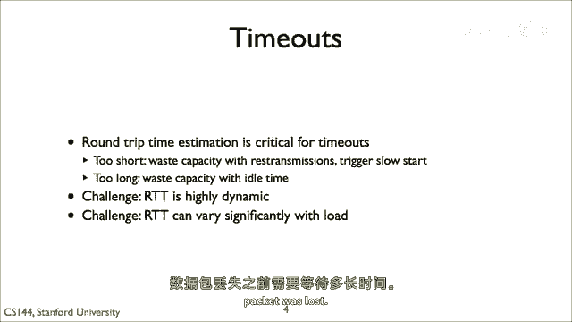

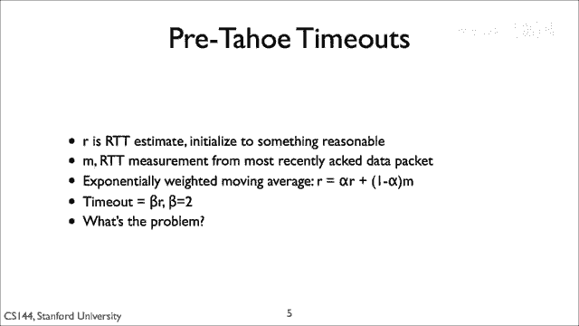

因为 TCP 在超时后会过渡到慢启动状态，所以拥有一个良好的超时值至关重要。

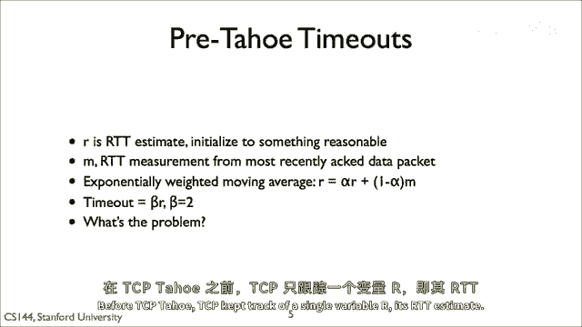

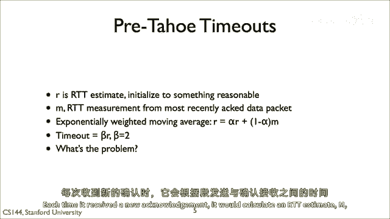

如果往返时间（RTT）是常数，那么最佳传输超时（RTO）只需比 RTT 略大一点。因为成功接收数据包的确认（ACK）应该在数据包传输后的 RTT 时间间隔内到达。

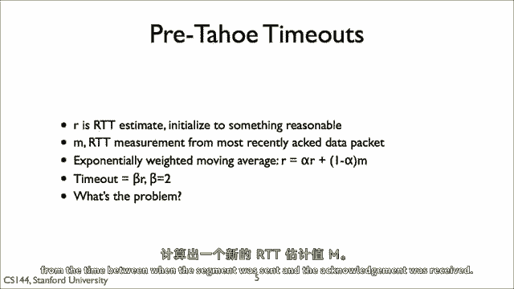

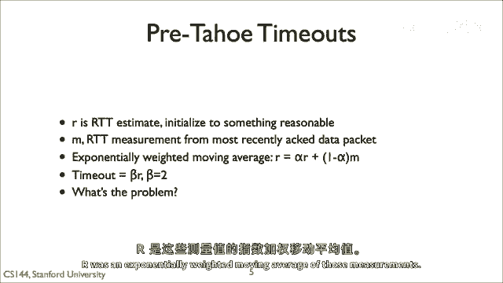

但是，RTT 不是常数。它们可以高度动态变化。此外，随着数据流发送数据段并开始填充沿途路由器的队列，RTT 会因负载发生显著变化。其他流量源的突发也可能显著改变队列延迟。面对所有这些噪声，我们需要一种稳健的方法来估计在假设数据包丢失之前应等待多久。

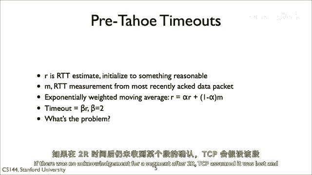

---

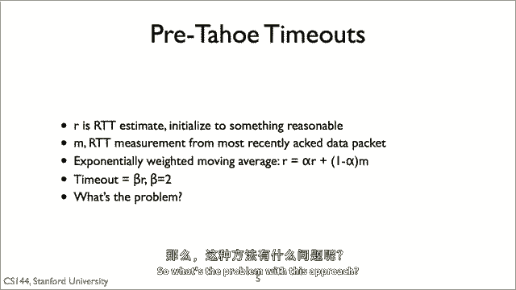

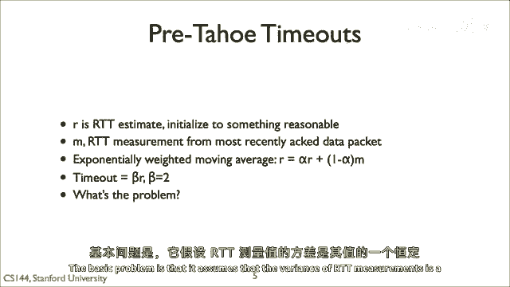

## 早期 TCP 的 RTT 估计方法

在 TCP Tahoe 之前，TCP 跟踪一个单一变量 `R` 作为其 RTT 估计。

每次收到一个新的确认时，它会计算一个 RTT 测量值 `M`（即从发送数据段到接收确认的时间间隔）。

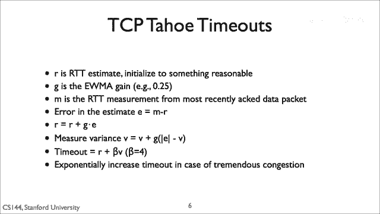

`R` 是这些测量值的指数加权移动平均（EWMA）。公式如下：
`R = α * R + (1 - α) * M`
（其中 α 是一个平滑因子，通常接近 1，如 0.875）。

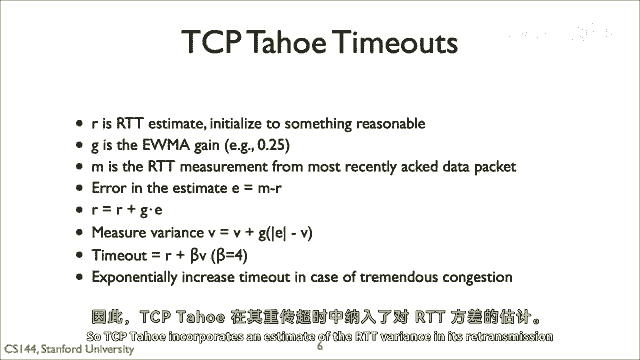

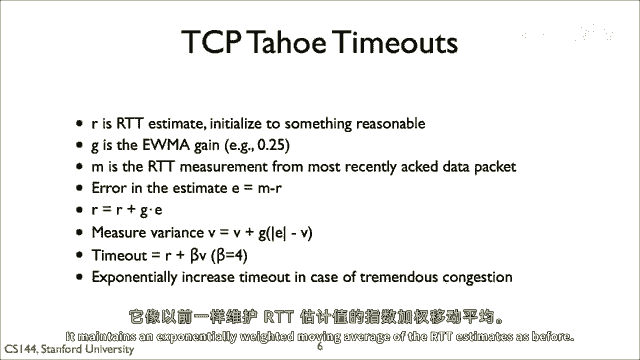

如果没有在 `2R` 时间内收到对某个数据段的确认，TCP 就假设它丢失并触发重传。

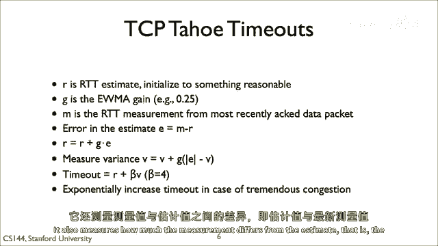

那么这个方法的问题在哪里？

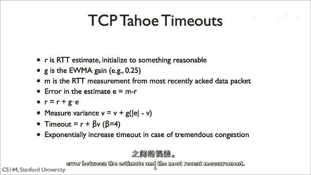

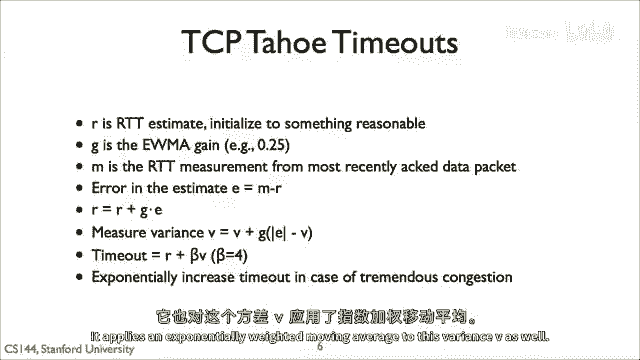

基本问题是，它假设 RTT 测量的方差是其值的一个常数因子（即固定为 2 倍）。这无法适应多变的网络环境。

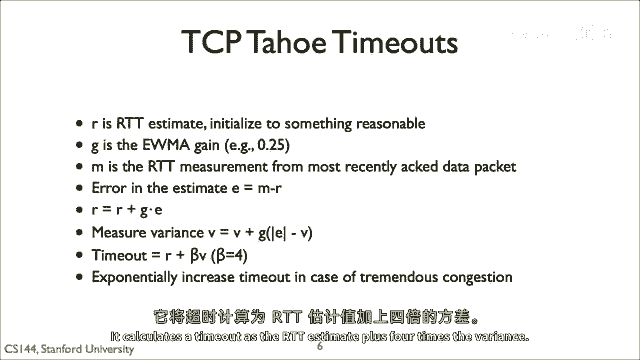

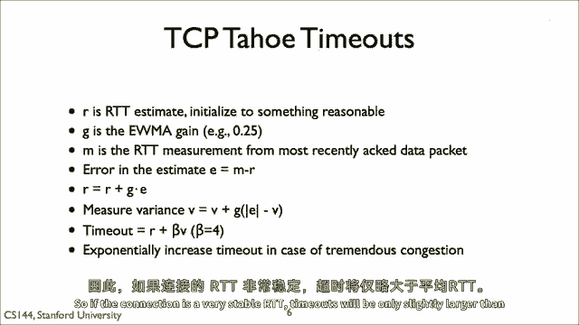

---

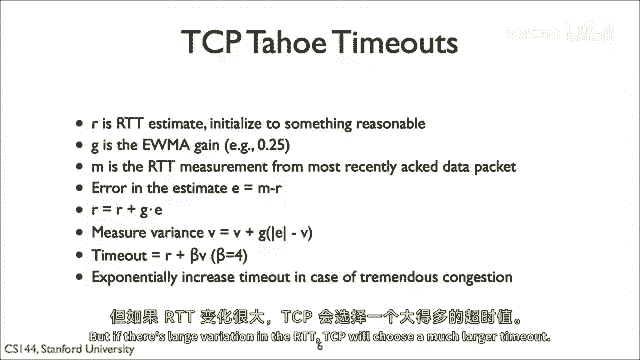

## TCP Tahoe 的改进：引入方差估计

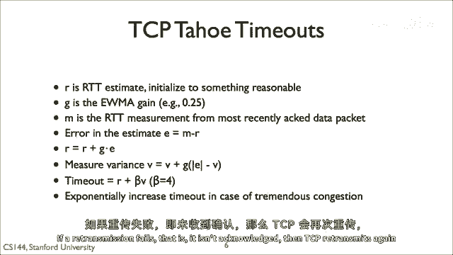

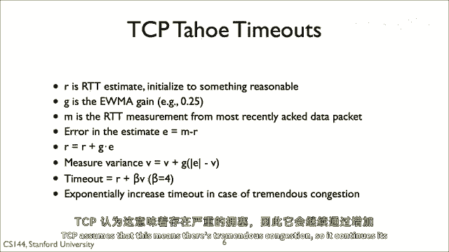

因此，TCP Tahoe 在其重传超时计算中集成了对延迟方差的估计。

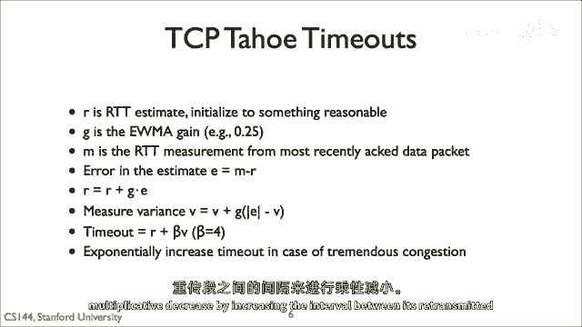

它保持对 RTT 估计 `R` 的指数加权移动平均（与之前相同）。

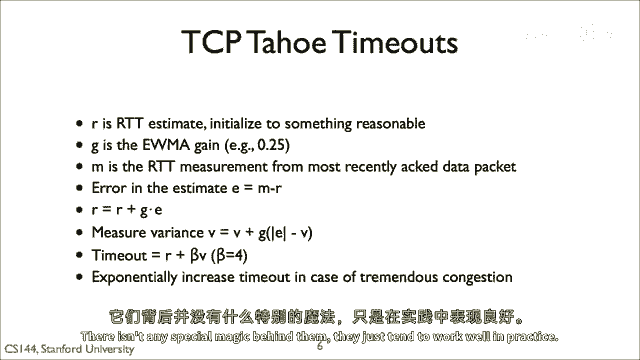

它还测量当前测量值 `M` 与估计值 `R` 的差异程度，即估计误差 `Err = M - R`。

它对这个误差的绝对值（代表方差）应用另一个指数加权移动平均，得到变量 `V`（方差估计）。

最终，它按以下公式计算重传超时（RTO）：
`RTO = R + 4 * V`

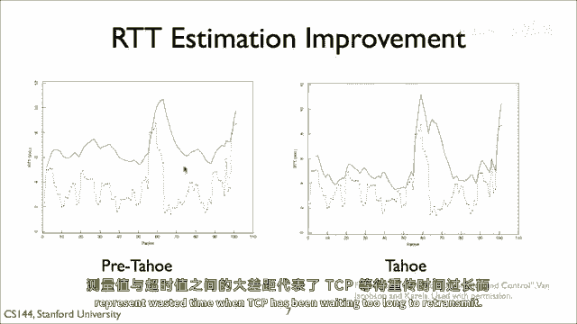

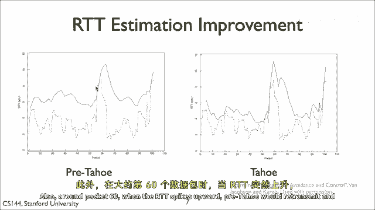

所以，如果连接的 RTT 非常稳定，方差 `V` 小，超时时间只会稍微大于平均 RTT。但如果 RTT 变化较大，`V` 值会增大，TCP 就会选择一个更大的超时时间，避免不必要的重传。

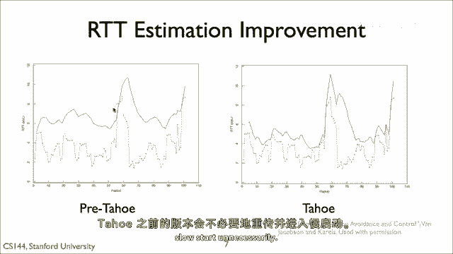

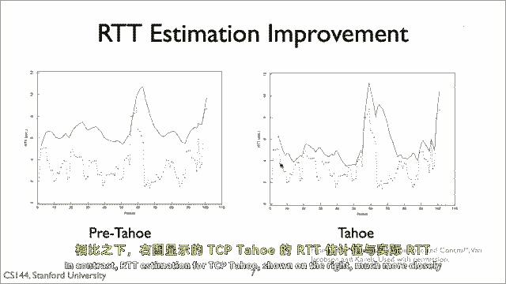

如果重传失败（即重传的数据包仍未被确认），那么 TCP 会以指数增加的定时器再次重传（例如，将 RTO 翻倍）。TCP 假设这意味着存在严重的拥塞，因此通过增加重传间隔来继续其“乘法减少”的退避策略。

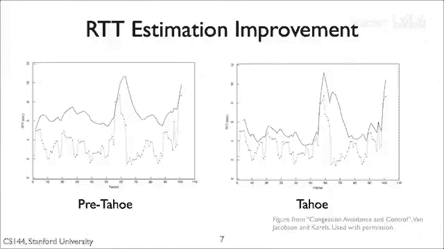

参数 `α`（用于 RTT 平滑）和 `β`（用于方差平滑，以及 RTO 公式中的倍数 4）是通过实验选择的。这种方法相对稳健，对它们进行微小更改并没有特殊的魔力，它们只是在实践中工作得很好。

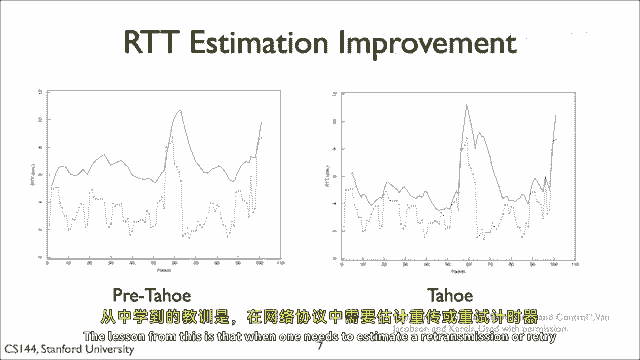

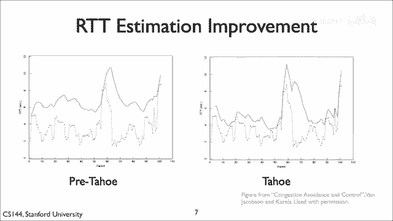

---

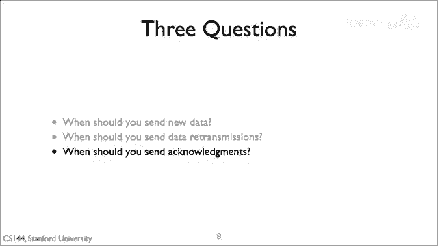

## 效果对比

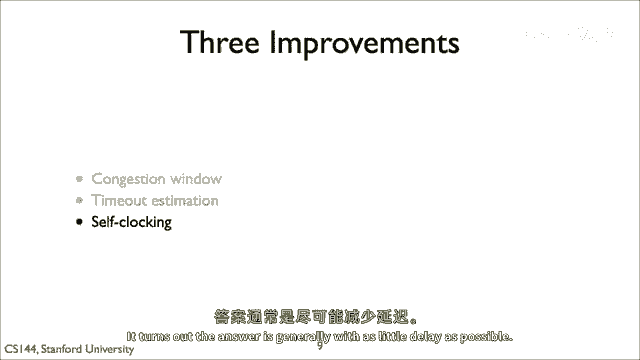

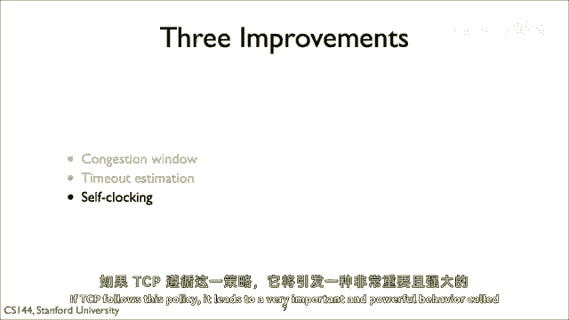

原始 TCP 拥塞控制论文中的图表显示，TCP Tahoe 之前的算法非常保守。测量值和超时值之间的大差距代表浪费的等待时间。同时，当 RTT 出现尖峰时，旧算法会导致不必要的重传和进入慢启动。

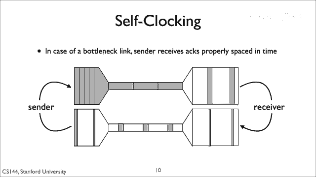

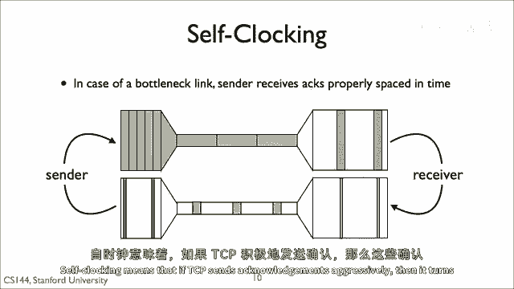

相比之下，TCP Tahoe 的 RTT 估计值（图中顶部的暗线）更紧密地跟踪实际的 RTT 测量值（底部的亮线），从而做出更合理的重传决策。

---

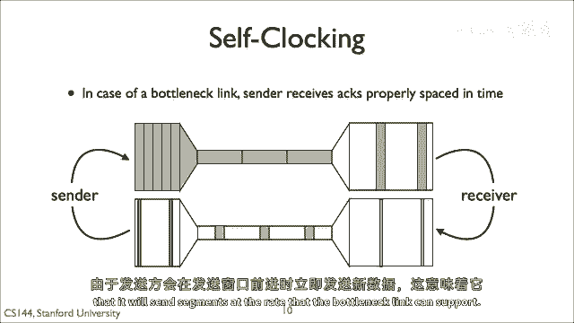

## 自我时钟机制 ⏱️

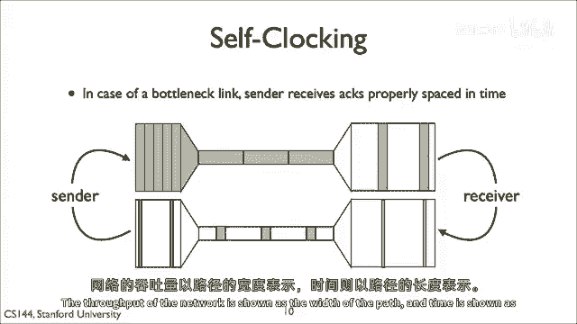

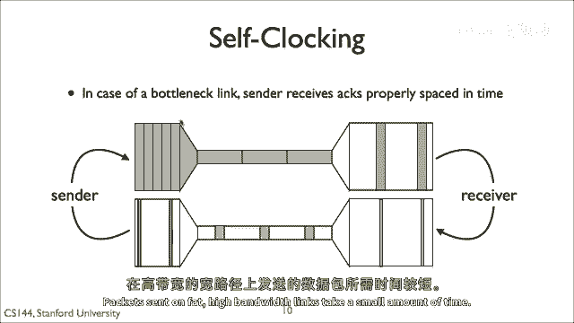

现在我们已经回答了第二个问题（TCP 何时重传数据），我们来到第三个问题：TCP 应该在何时发送确认？

答案是：一般来说，尽可能少地延迟，即一旦收到数据段就立即发送确认。

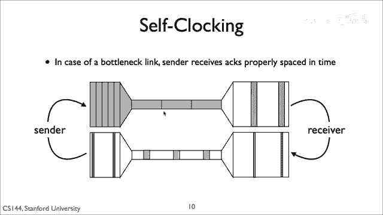

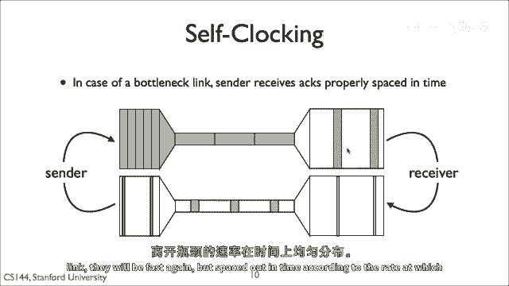

如果 TCP 遵循这个策略，将导致一个非常重要且强大的行为，被称为**自我时钟**。

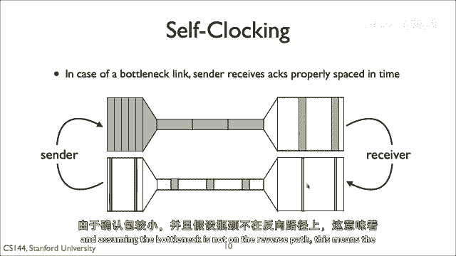

自我时钟意味着：如果接收方积极发送确认，那么这些确认会按照数据包离开网络瓶颈链路的速率在时间上分散到达。发送方在收到确认后才会发送新数据，因此它将以瓶颈链路所能支持的速率发送数据段。

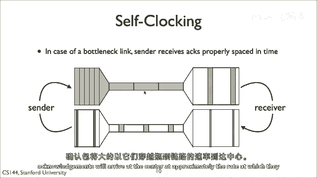

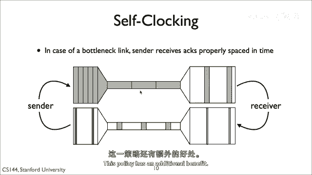

这项政策有一个额外的好处：TCP 只有在收到确认（意味着它的一个现有数据包已从网络拥塞角度离开）时才将新数据包放入网络。这意味着 TCP 正在控制网络中未完成数据包的数量，从而稳定队列并有效利用网络容量。

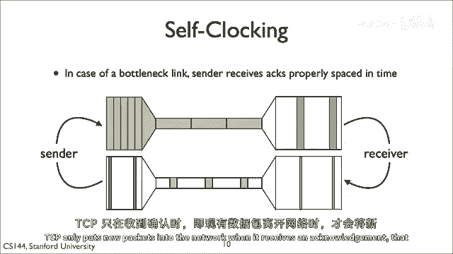

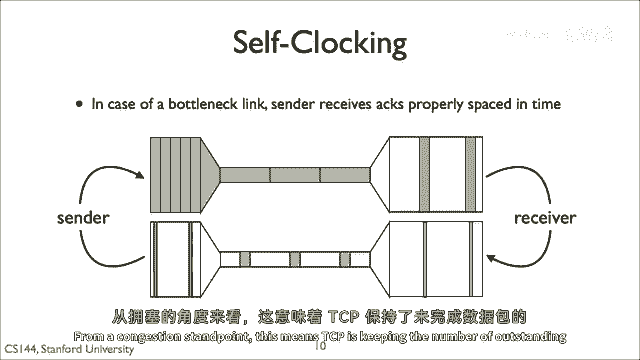

所以，自我时钟原理要求 TCP 一旦收到数据段就积极发送确认。这既是为了向发送方信号数据已经离开网络，也是为了提供 RTT 估计并允许发送方根据网络状况自我调节其传输速率。

---

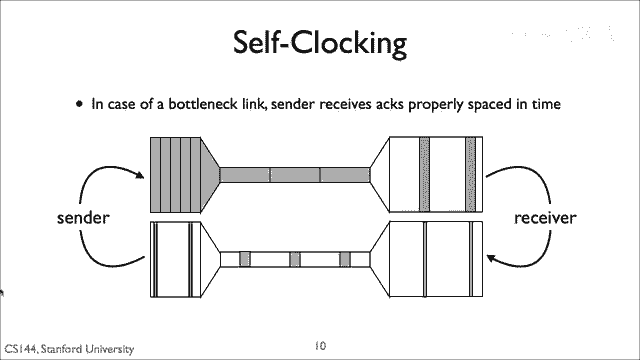

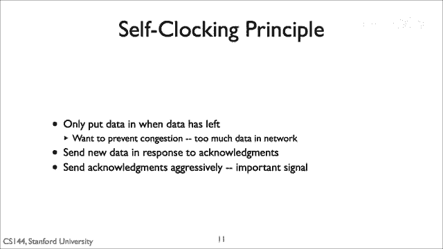

## 总结 🎯

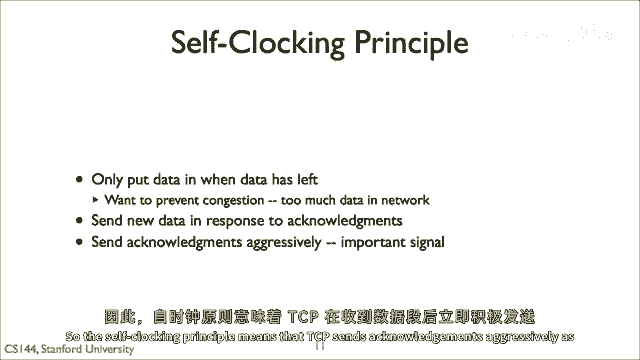

本节课中，我们一起学习了 TCP Tahoe 协议的三项核心拥塞控制机制中的后两项：

1.  **智能的 RTT 估计**：TCP Tahoe 不仅计算 RTT 的指数加权移动平均值（`R`），还估计其方差（`V`）。重传超时（RTO）由公式 `RTO = R + 4 * V` 计算得出。这使得超时值能自适应网络延迟的波动，减少误判。
2.  **自我时钟**：接收方立即发送确认的策略，使得确认的到达节奏反映了网络的可用带宽。发送方据此节奏发送新数据，实现了传输速率与瓶颈带宽的自动匹配，并控制了网络中的在途数据量。

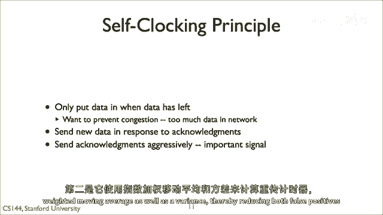

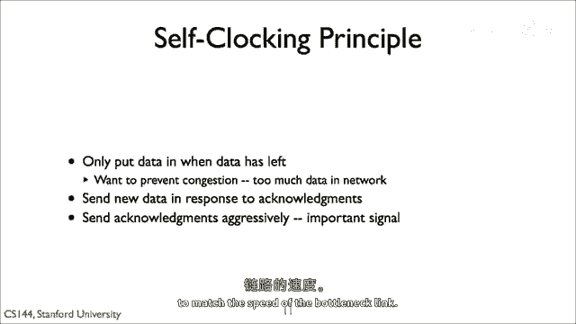

结合上一课的拥塞窗口状态机，这三项机制共同使 TCP Tahoe 能够有效地管理网络拥塞，在繁忙的网络中获得良好性能。从这项设计中我们可以学到，在设计需要估计重传或重试时间的网络协议时，不仅要考虑观察到的平均延迟，还必须考虑其方差。