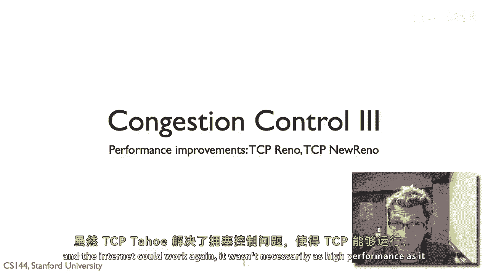
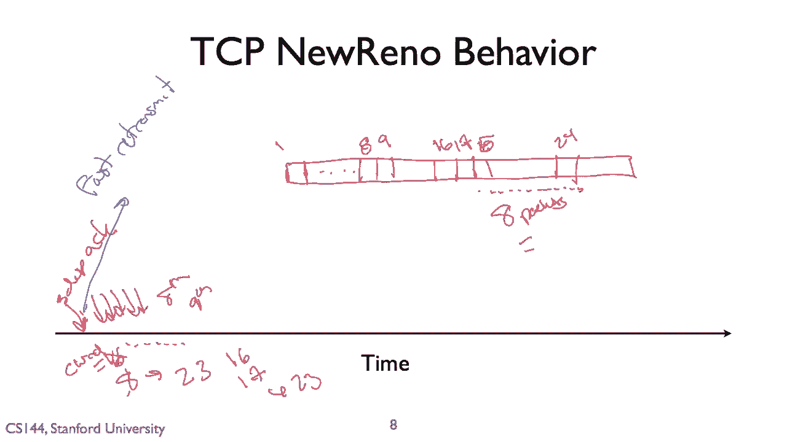

# P62：p61 4-7 Congestion Control - TCP Reno and New Reno - 加加zero - BV1qotgeXE8D

所以在这个视频中，我想谈谈一些TCP的更现代版本，TCP Reno和新Reno。

TCP Tahoe在哪里工作，拥塞控制问题，使得TCP能够运行。

互联网能够再次工作，它并不一定能达到其最佳性能，它比需要的更保守一些。

因此从那以后，TCP已经有了改进，尽管仍然保留了TCP Tahoe的原始机制，以使其能够工作。

嗯，我想要这个，发送数据更快，性能更高，所以我要解释其中的两个改进。

一个是叫做tp reno的东西，然后是tcp new reno，用于召回tp tahoe，嗯，如果协议正在运行，并且你遇到超时或三重重复动作，这暗示有一个丢失的包，你会做三件事。

你将慢启动阈值设置为拥塞窗口的一半，所以它在决定，当你进入拥塞避免状态时，当拥塞窗口再次增长时，你将拥塞窗口设置为1并进入慢启动状态，这里的想法是，你在发送，你在发送数据，让我们在这里说窗口大小。

你在发送数据，发生了一些事情，有一个事件，你将阈值设置为你原始窗口大小的一半，你将拥塞窗口设置为一，你又进入了慢启动阶段，指数增长，然后当你达到这个阈值时，你又进行了增量增加。

这就是太浩行为，所以这里是一张图片，只是显示这一点，嗯，更清楚地，所以从这里开始，我们将拥有一个大小为1的拥塞窗口，我们现在处于慢启动状态，然后，假设出现三重重复行为或超时。

我们将拥塞窗口设置为大小为1，但这里我们有一个慢启动阈值，它是这个值的一半，对吧，所以如果这个是x，这是x除以2，所以我们再次进行指数增长，直到我们达到这个点，我们现在处于避免拥塞的阶段，线性增加，嗯。

这里有，嗯，超时，窗口大小保持稳定，砰，下降到拥塞阶段，窗口大小再次变为一，慢启动条件等避免，所以我们看到每当我们有三重重复动作或超时时，我们最终将拥塞节点减小到大小一，正在经历慢启动。

然后进入避免拥塞阶段。

因此tp reno通常行为类似于tp tahoe，有一个例外，在时间线上，它以相同的方式设置拥塞窗口的大小为一，并再次进行慢启动，这里的假设是，事情已经非常糟糕，如果我有超时。

所以我只是假设网络没有任何事情，并假装事情是从开始一样，嗯，tp reno与tp tahoe的不同之处在于三重重复动作上，它假设一段数据包丢失了，但其他数据包正在到达，我很可能接近我应该达到的速度。

我不需要将我的拥塞窗口设置为大小一，相反，我还是将阈值设置为拥塞窗口的一半，如前所述，但我将我的拥塞窗口设置为拥塞窗口的一半，这就是快速恢复，而不是再次进入慢启动，我只有我的拥塞窗口，嗯。

然后它添加了另一个机制，叫做快速传输，它，不会等待三重重复的超时，它说，我有三重重复的动作，这意味着那个段数据包很可能丢失，所以我立即重新传输它，这种行为意味着在三重重复动作中，tcp reno。

我们将保持在避免拥塞的状态，不会需要对进入该状态的步骤进行对数计算，这意味着窗口大小更大，快速传输意味着它不会等待超时，因此，理论上，想法是它不会在几个往返时间内下降，然后开始加速。

因此其总体吞吐量将更高，因此，这是一个显示tp reno在类似情况下行为的图片，在这里我们看到，我们从这里开始慢启动状态，慢启动，然后我们有一个三重复制动作，而不是下降到一个窗口大小为一的拥塞窗口。

它设置，如果我们这里的拥塞窗口是x，它将拥塞窗口设置为x除以二，因为那是慢启动阈值，这导致协议重新进入拥塞，避免进入避免拥塞，在这里我们看到三重重复行为，进行快速重传，我们收到确认，我们再次增长窗口。

然后这里我们有超时，当超时时，雷诺的行为与以前相同，在那时，它说，它说，出了大问题，我将拥塞窗口设置为1，我再次进入慢启动状态，所以我们有了慢启动条件，避免，拥堵，风，超时和三重重复。

自从那个tp reno的行为，所以让我们走一遍，所以我的发送者发送包一，我收到确认，一，我发送二和三，我收到确认二和三，然后我发送，四五，六七，嗯然后，让我们假设嗯，第四包丢失了哦。

接收者仍然会发送确认，但在对五的回应中，六和七，它将发送第三幕，第三幕重复三次，所以三重复制的举动在这里，一个条件变为一个在这里，在这里是二，现在是四，收到三重复制的举动后。

Gp Reno将设置其拥塞窗口为二，立即我们传输，一个向右的包，快速重传，所以这里是快速重传，没有超时，希望我们能得到第七个举动，现在，我们有一个拥塞窗口大小为二的大小，我们将发送包八和九。

因此，tp Reno显著提高了tcp的吞吐量。

你不必进入慢启动状态，并将条件降至大小一，只要丢失一个分段，tcp New Reno甚至稍微提高了一些事情，更实质上，它行为与tau和reno以及超时相同，当你在快速恢复状态时。

它对拥塞窗口做了一些稍微复杂的事情。

当你进入快速恢复时，这是当出现三重复制的举动时。

对于收到的每个复制举动，你将拥塞窗口膨胀至最大分段大小，然后，当最后一个待确认的包被确认时，你将返回拥塞避免状态，你将拥塞窗口恢复到设置的值，当进入快速恢复时，嗯，基本上，这将做什么。

如果我有一大批待确认的包，让我们说，我有一个非常大的窗口，嗯，在这种情况下，让我们就说，嗯，让我们说八个包，它不是一个非常大的窗口，但是是，你知道，用于绘图，它是合理的，嗯，并且这个包在这里，嗯。

这个包丢失了，对吧，所以，让我们叫这个包税，对吧，所以，这个包丢失了，每个这些包都将欺骗或复制确认，现在，tcp在收到这些复制确认时，它将开始膨胀其拥塞窗口大小，并且随着它膨胀拥塞窗口大小。

这将让它开始发送新的包，这里的想法是我们有证据表明包正在离开网络，因此发送新的包是安全的，我们不想发送它们太快，清楚，我们接近网络的拥堵点，但如果不是，会发生什么，我们做快速自由传输。

我们实际上必须等待整个RTT，在我们可以发送新的包之前，我们需要进行重传，然后我们得到确认，我们现在可以移动窗口，因此，RTT中TCP基本上处于空闲状态。

你看在这个例子中，在这里，天啊，我们有一个情况，其中存在长时间的，存在等待重传的闲置期。

因此，基本上这个推文，在接下来的几秒钟内将明确解释，允许TCP Reno开始发送新的包，当快速传输正在飞行时，它开始膨胀拥堵窗口以使其更大，即使这是最后确认的包，它也可以开始发送新的包。

但一旦我们收到适当的确认，如。

让我们说，我们收到对这个段的确认，然后它突然将拥堵窗口大小减少到正确的大小，所以它不像我们突然饱和了网络。

让我们走一遍这看起来像什么，假设我们的拥堵窗口大小为，十六，我们遇到了三重复制行为，规则意味着我们将拥堵窗口设置为八，在这个点上我们遇到了三重复制行为，拥堵窗口变为八，嗯，我们将进行快速重传，因此。

一个三重到来，我们发送快速重传，同时，当那个更快的传输包还在等待时，我们正在接收到额外的确认，对吧，窗口大小为十六，我们遇到了三重复制行为，实质上，我们预期将收到，嗯，顺序十六或十五和三重复制行为。

随着这些开始流入，我们将增加拥堵窗口为一次每个，因此，我们将计算那些三重复制，在这个时间段内，拥堵窗口将增加，对于每个重复的确认，加一，这意味着它将增加到二十三，所以这可能看起来很大。

所以我们已经从十六扩大了拥塞窗口到二十三，但想想这在序列号空间意味着什么，所以我们有这个包窗口对吧，并且这里是最后一个确认的包，让我们就叫它，嗯，包一，正确，然后我们开始了，嗯。

我们现在有一个大小为十六的出色窗口，所以我们可以从一个发送，所以我们可以从包一安全地发送，嗯到十六，所以我们得到了最后一个，嗯，包一的确认，你知道我们可以发送十六，嗯，一切都如此顺利，一个被确认。

这允许我们发送十七，所以一切都好，现在表演三重复制，我们无法发送任何超过十七的东西，直到拥塞窗口超过十七，所以它从一开始，拥塞窗口已经缩小到八，因此，这意味着被允许发送的有效数据包是，嗯，二，三，四。

五，六，七和八，对，这对我很有帮助，因此，随着这些额外的确认消息到来，我们将开始扩大这个，所以我们允许自己发送到十到十一，到十二到十三到十四，等等等等等等，直到我们收到说第八个，一个重复的确认。

现在突然我们增加了我们的拥塞窗口大小回到十六，这意味着嗯，嗯我们可能重新发送十七，然后当我们得到第九个时，我们已经将其增加到十七个，这意味着我们现在可以发送包十八，因此这将增加到二三个，本质上。

这会膨胀拥塞窗口，因此我们可以发送至包二十四，现在，如果你仔细看这些包，十七，十八，十九，二十，二十一，二十二，二十三，二十四，那就是八个包，等于实际的拥塞窗口大小是多少，想法是这种方式膨胀。

因为我们有它，现在我们正在添加加1，最后，最后到达的认可将允许我们检查出新的包，因此，一旦更快的传输确认到来，我们就会重置所有事情，天啊，事情被确认，我们的拥塞窗口设置为大小八，我们可以开始向前移动。

但本质上，这个做什么就是窗口的膨胀，在三次重复确认后，允许tcp新reno继续发送数据，而你的传输器在飞行越快，以及它要发送的数据量等于，并且它由再次到来的确认消息来计时，所以你知道。

数据包正在以预期下一轮旅行时间的拥塞窗口大小离开网络，假设快速重传的数据包成功送达。

所以这就是tcp reno和新reno，新reno在许多系统今天普遍使用，嗯，至少是tcp今天的基础，我会稍微谈谈更先进的tcp，那处理一些现代或考虑因素。

但你知道在Linux系统或Windows系统中，"Mac OS 系统"，正在运行的基本TCP算法与Reno非常非常相似。"结果发现，交通控制是一个真的很难的问题"，"并且。

构建一个坚固的网络系统是其中最困难的问题之一。"，"你所看到的基本方法是已被采纳的"，"并且看起来非常强大且非常坚固"，"这个增加的概念是乘法的吗？"，"增加窗户的增量，右侧添加"，"然后乘以它"。

所以，当事情变得不好时，你的反应非常迅速，并且小心翼翼地增加它。所以，窍门在于当你在做的时候，这就是如何保持管道流量和提高吞吐量，所以，有些东西像快速重传，不要等待超时，只是为了发送非常非常快速重传。

还有像拥塞，窗口膨胀，哇，我不想浪费一整个往返时间来等待快速重传，我知道东西正在离开网络，我要开始发送一些新的包，我允许这些包。

