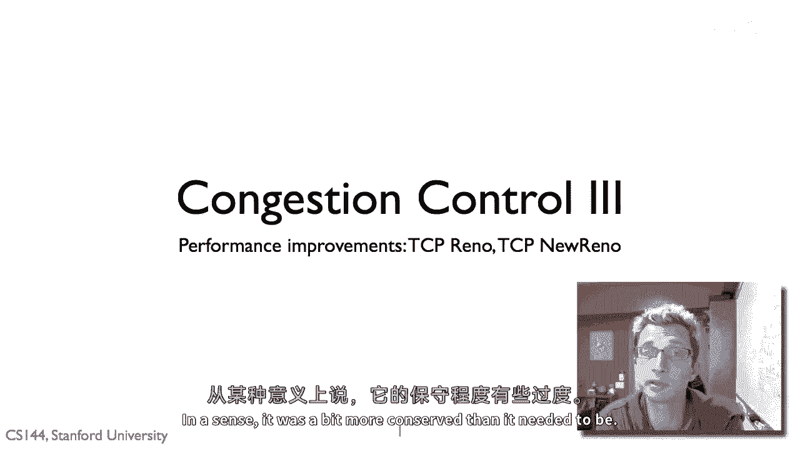
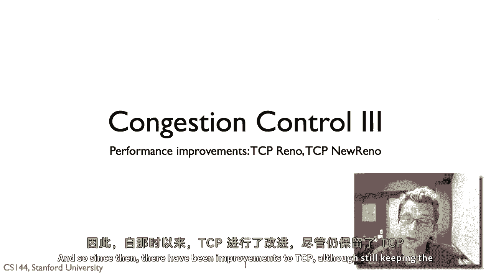
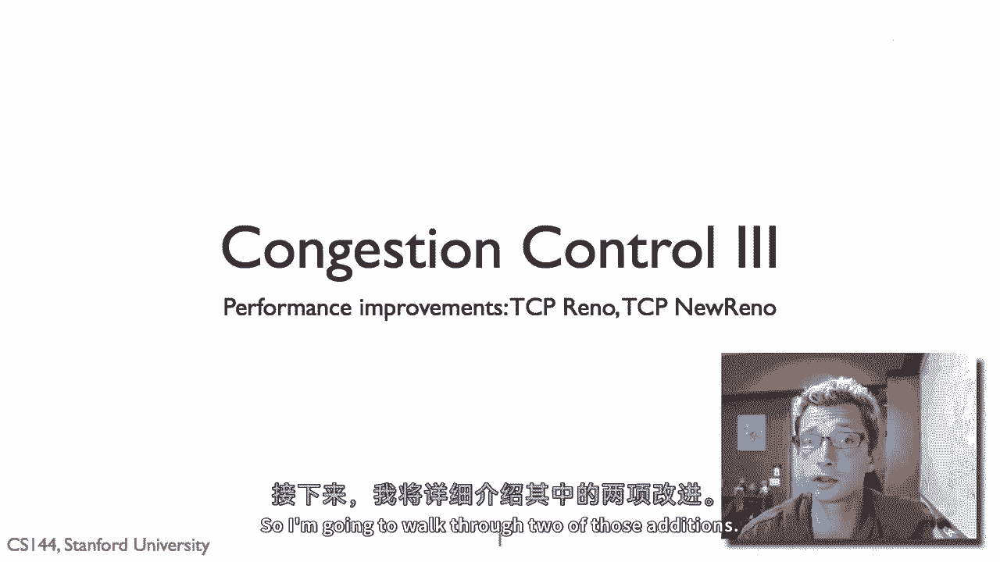
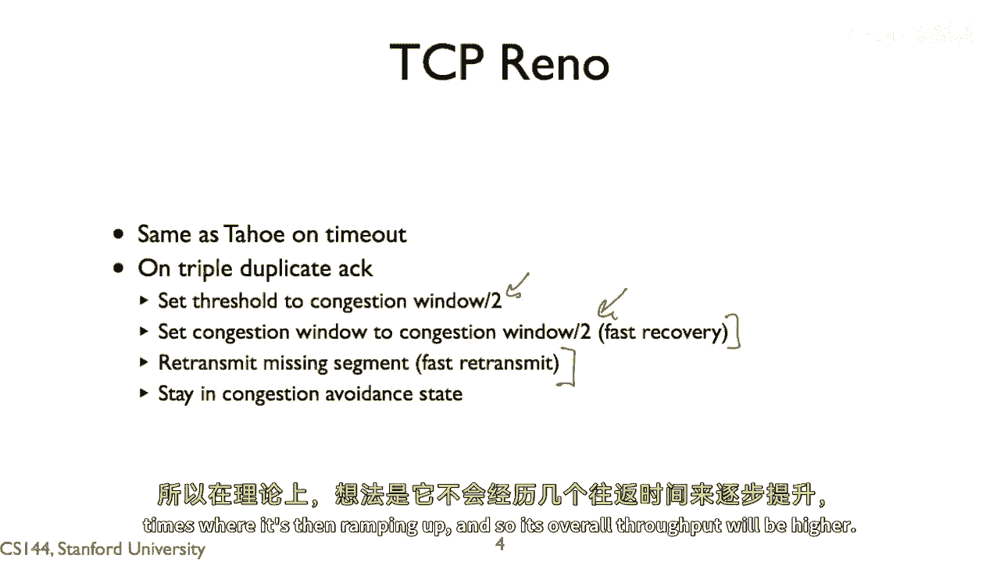
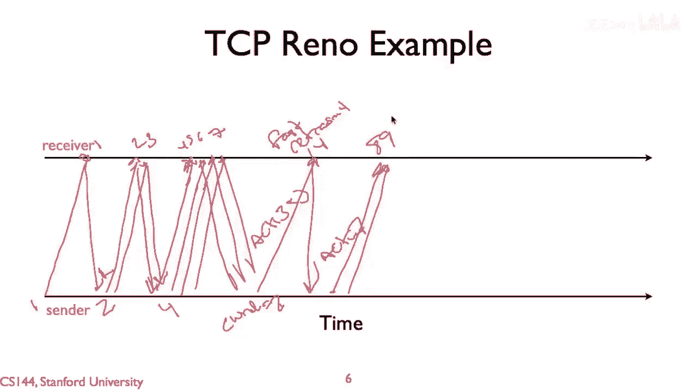
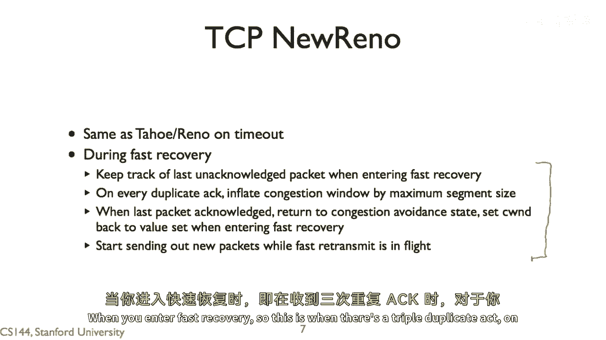
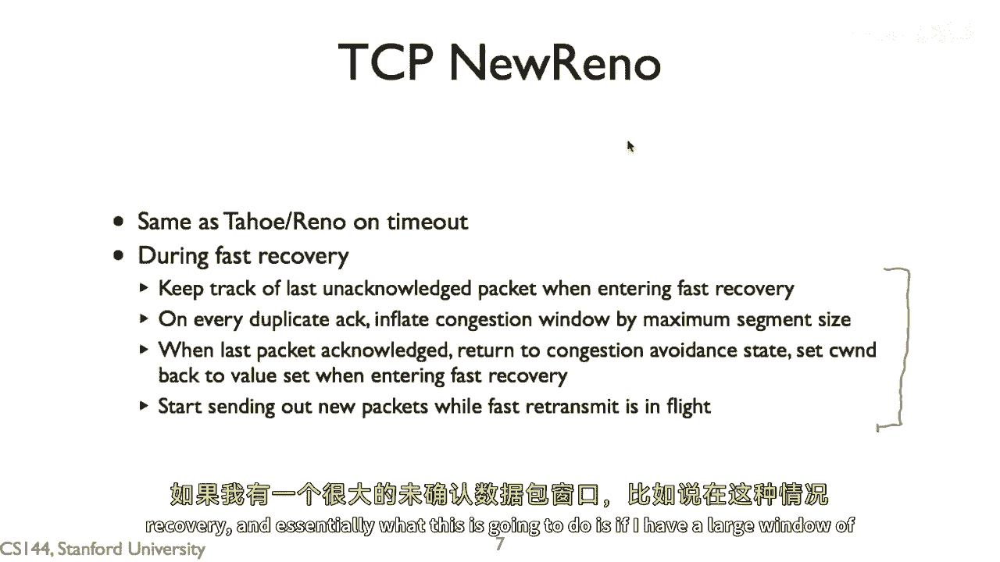
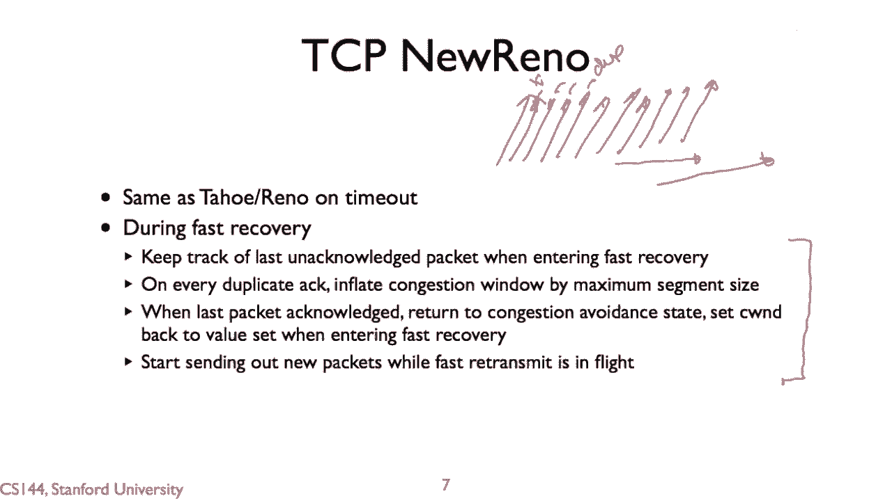
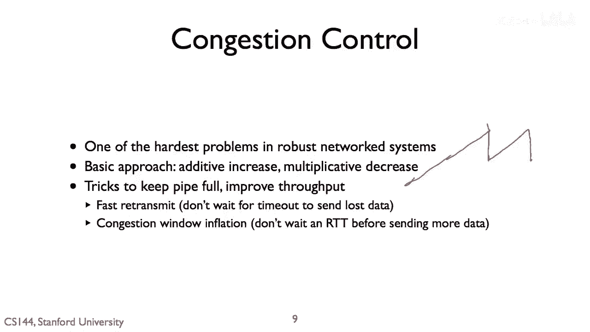

# 课程 P62：TCP 拥塞控制 - Reno 与 New Reno 🚦

在本节课中，我们将学习 TCP 拥塞控制的两个重要改进版本：TCP Reno 和 TCP New Reno。我们将了解它们如何通过“快速重传”和“快速恢复”等机制，在保持网络稳定的同时，显著提升数据传输的性能。

---

## TCP Tahoe 的回顾与局限

上一节我们介绍了 TCP Tahoe 的基本拥塞控制机制。TCP Tahoe 解决了拥塞控制的基本问题，使得 TCP 能够在互联网上稳定运行。

然而，TCP Tahoe 并不总能达到最佳性能，它的行为有时过于保守。

因此，在 TCP Tahoe 之后，TCP 协议有了进一步的改进，尽管其核心机制依然被保留。

为了获得更高的性能和更快的发送速度，我们接下来将介绍两个重要的改进版本。

---

## TCP Reno 的改进 🚀

TCP Reno 的行为通常与 TCP Tahoe 类似，但有一个关键例外。这个例外体现在对“三次重复确认”事件的处理上。

以下是 TCP Tahoe 在遇到拥塞事件（超时或三次重复确认）时的行为：
1.  将慢启动阈值设置为当前拥塞窗口的一半。
2.  将拥塞窗口重置为 1。
3.  重新进入慢启动阶段。

TCP Reno 与 TCP Tahoe 的不同之处在于处理三次重复确认时。它假设只有一个数据包丢失，而其他数据包仍在正常到达，因此网络状况可能并没有那么糟糕。

所以，TCP Reno 在遇到三次重复确认时：
1.  将慢启动阈值设置为当前拥塞窗口的一半。
2.  将拥塞窗口设置为新的慢启动阈值（即减半），而不是重置为 1。这被称为 **快速恢复**。
3.  同时，它会立即重传被认为丢失的数据包，这被称为 **快速重传**，而无需等待超时。

这种行为意味着，在三次重复确认后，TCP Reno 会保持在拥塞避免状态，避免了重新进入慢启动阶段。这使得窗口大小可以保持在一个更高的水平，并且由于快速重传，它不会浪费几个往返时间来等待超时。

因此，TCP Reno 的整体吞吐量比 TCP Tahoe 更高。

---

## TCP Reno 行为图示

以下图示展示了 TCP Reno 在类似情况下的行为。

我们从慢启动状态开始，拥塞窗口指数增长。当遇到三次重复确认时，拥塞窗口减半（而不是降为1），并进入快速恢复和快速重传。之后，它直接回到拥塞避免状态，继续线性增长。

如果遇到超时事件，TCP Reno 的行为则与 Tahoe 相同：将拥塞窗口重置为 1，并重新开始慢启动。

---

## TCP New Reno 的进一步优化 ⚡

TCP New Reno 在超时处理上的行为与 Reno 和 Tahoe 相同。它的主要改进在于处于“快速恢复”状态时，对拥塞窗口进行了一些更复杂的调整。

当你因三次重复确认而进入快速恢复状态时：
1.  对于后续收到的每一个重复确认，都将拥塞窗口临时增加一个最大报文段的大小。
2.  当收到对丢失数据包的重传确认（即一个新的、非重复的确认）时，退出快速恢复状态，并将拥塞窗口恢复为进入快速恢复时设置的值（即减半后的值）。

这样做的目的是：当我们有一大批数据包在等待确认，而其中一个丢失时，后续到达的重复确认表明数据包仍在离开网络。通过临时膨胀拥塞窗口，允许发送方在等待重传确认的同时，继续发送新的数据包，从而避免了在往返时间内管道空闲。

一旦收到正确的重传确认，拥塞窗口会立即恢复到正确的大小，不会导致网络突然过载。

---

## 核心机制总结

本节课中我们一起学习了 TCP Reno 和 New Reno 如何优化拥塞控制：

*   **快速重传**：在收到三次重复确认后，不等待超时就立即重传可能丢失的包。
*   **快速恢复**：在三次重复确认后，将拥塞窗口减半并保持，而不是重置为1，从而避免退回到慢启动。
*   **窗口膨胀**：在快速恢复期间，通过重复确认临时增大窗口，以保持数据流，提高吞吐量。

这些机制的核心思想是：**乘性减，加性增**。当网络出现问题时反应迅速（乘性减），在网络良好时谨慎增加（加性增）。快速重传避免了等待超时的延迟，而窗口膨胀则避免了在重传期间管道空闲。

如今，许多操作系统（如 Linux、Windows、macOS）中使用的基础 TCP 算法都与 Reno 非常相似，这些机制共同构建了一个既健壮又高效的网络传输系统。