# P63：p62 4-7a TCP Reno - 加加zero - BV1qotgeXE8D

在这个视频中，我要谈谈使用tcp的两种性能改进，快速重传和快速恢复。

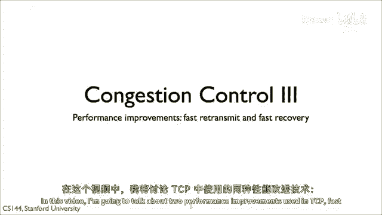

除了拥塞避免状态外，提高rtt估计和自我时钟，tcp使用了三个更多的机制，这些机制通过软化tcp对包丢失的反应，提高了tc的性能，回忆tcp tahoe的机制，因为它的行为比imd在包丢失时更保守。

tcp tahoe会掉入慢启动状态，当达到ss thresh时，它指数级增加拥塞窗口，到达那个点时，它进入加性增加，第一个机制叫做快速重传是t speed tahoe的一部分。

如果tp tahoe发送者收到三个重复的确认，所以对于同一序列号，有四个动作，它假设下一个分段丢失并立即重传，它立即发送这个分段，而不等待超时，假设这个重传成功，这减少了发送者收到确认前的延迟。

并可以移动发送窗口向前发送新数据，TCP Tahoe将这些三个视为丢失，这些三个将这些三重重复确认视为丢失，并设置拥塞为进入慢启动状态的一个，TCP Reno，TCP的一种后来的版本。

添加了一种叫做快速恢复的第二种算法，它具有两个机制，第一个是当由三重重复确认检测到丢失时，TCP Reno不会将拥塞窗口设置为一个，它不会将进入慢启动状态，相反，它将拥塞窗口减半。

因为ss thresh被设置为拥塞窗口的一半，这意味着tcp reno没有退出拥塞避免状态，使用此算法，在无超时的稳定状态下，tp reno的行为，在损失上遵循amd政策，它具有拥塞窗口乘法减少。

并在超时时使用加法增加，tg reno的行为与tcp tahoe相同，将拥塞窗口设置为一，TCP Reno 添加的第二个机制是，当处于快速恢复状态时，它将拥塞窗口扩大一个，对于每个重复的确认。

这是为了防止在单个丢失的情况下，TCP无法发送整个往返时间的数据，因为它正在等待确认来推进其发送窗口，因为每个重复的确认意味着一个段已经成功离开网络，TCP可以，理论上。

在没有阻塞网络的情况下发送一个新的段，因为旧的拥塞窗口大小是c，当拥塞窗口增加1时，对于每个重复的动作，拥塞窗口从c除以2增长，快速恢复到c加上c除以2或3c除以2。

这意味着对于从c除以2到c的重复确认，tcp可以发送一个新的段，对于重复确认的第二半部分，tcp可以发送一个新的段，因为拥塞窗口已经进一步前进，一旦tp接收到一个新的确认，它将其拥塞窗口重置为正确的值。

所以c除以2，所以让我们把这一切都放在一起，tcp tahoe，当它遇到超时或三重重复确认时，它采取三个步骤，首先，它设置ss thresh为拥塞窗口的一半，其次，它设置拥塞窗口为1，第三。

它重新传输缺失的段，这些第一步意味着它进入了慢启动状态，并按指数增加其拥塞窗口，直到它再次遇到损失，或达到ss thresh。

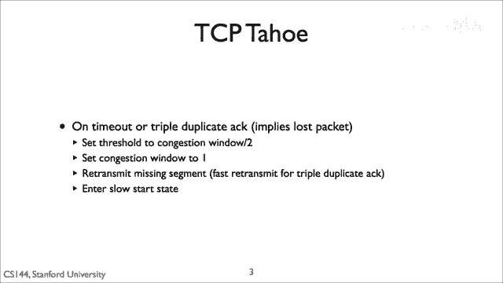

这导致了我们在早期图表中看到的tp的行为，taho的行为随时间变化。

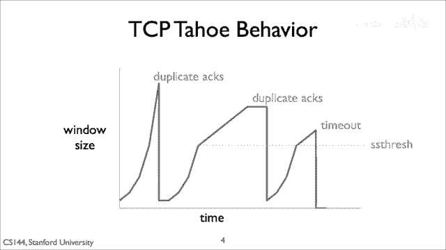

所以现在，让我们走一遍tesby tahoe做什么，当它遇到三重重复确认时，假设拥塞窗口是8 mss，段丢失了，tcp将收到总共7个重复确认，在第三个之后，它重新传输。

缺失的段将其拥塞窗口设置为1 mss，和ss three到四，当它收到重新传输的act时，它发送一个新的段，当它收到对这个段的act时，它设置其拥塞窗口为2，当它收到对这些两个段的act时。

它将其疑问的拥塞窗口增加到3然后4。

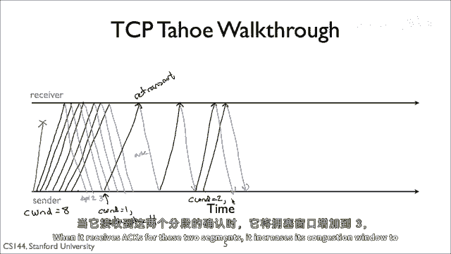

当它达到它进入拥塞避免状态，接下来的四个act将只会增加拥塞窗口1 mss，这就是tcp tahoe。

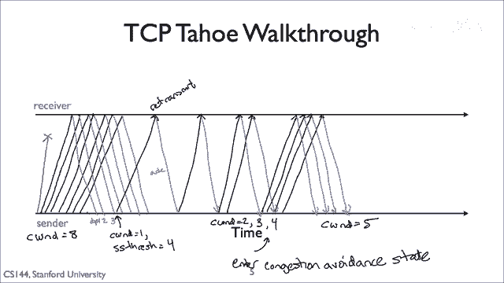

tp reno在超时时与tcp tahoe行为相同，在三重重复ack时，它执行快速通过传输，立即发送段，而不是将其拥塞窗口设置为1，它将其减半，从而保持在拥塞避免状态，对于每个重复的确认。

它将拥塞窗口增大一，以便在重传的段被确认之前发送新的段，所以tahoe和reno的主要区别在于快速恢复。

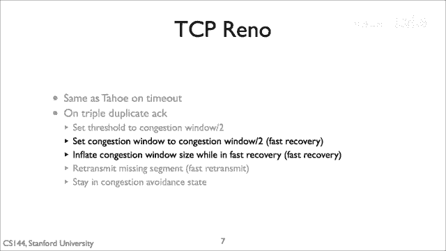

所以这是一幅显示reno行为的图表，它从慢启动状态开始，所以让我们使用三重重复轴，它将拥塞窗口减半，保持在避免拥塞的状态，并执行快速重传，然后开始增加拥塞，在amd之前使用amd的平坦区域。

它使用拥塞窗口膨胀来发送新的段，我将显示窗口大小的膨胀，在第二组三重重复轴中，相同的情况发生，它执行快速重传，减半窗口并在超时时保持避免拥塞，它将拥塞窗口设置为一并重新进入慢启动状态。

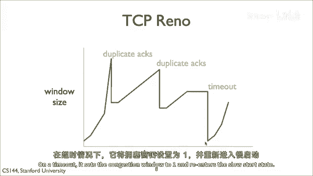

拥塞窗口膨胀是快速恢复的一部分，这是reno进入快速恢复时它如何工作的详细信息，它膨胀，它可以通过每个重复的确认将其拥塞增加一，因为拥塞窗口已经减半，这意味着拥塞窗口可以增长到其原始值三倍以上。

原始值除以二，这意味着发送者将发送原始拥塞窗口除以二的新段，减去一个损失段，几乎等于遵守amd所需的量，记住，这是一个tp tahoe fsm，有两个状态，慢启动和拥塞，避免。

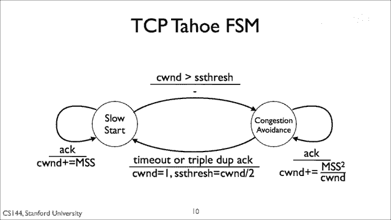

这是tcp reno的全部fsm，它在三重重复动作中添加一个第三状态，快速恢复，而不是过渡到慢启动，它在快速恢复状态中过渡到快速恢复，当它收到新的确认时，它过渡回避免拥塞状态。

重置拥塞窗口为拥塞窗口大小的一半，当它在快恢复状态上超时时，它返回慢启动，就像在避免拥塞状态收到重复动作时一样，它将拥塞窗口增加一，这，在这里在快速恢复的过渡中增加三，是考虑到收到的三个重复确认。

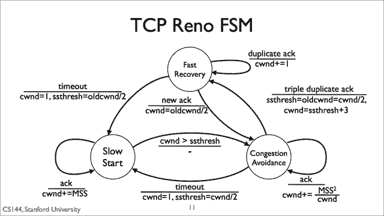

让我们走一遍reno的行为，假设我们开始时的拥塞窗口大小为八，最大段大小和一个段被丢弃，发送者将在第一个三个重复动作后收到七个重复动作，它将拥塞窗口缩小为剩余的四个，在避免拥塞的状态。

它将将拥塞窗口扩大三到七个mss，在下一个第四次重复确认，拥塞窗口增长到八个mss，接下来的三个确认将增加到九个十个，然后十一mss，这样发送者可以在这个时候发送大约三个新的段，中心将确认，嗯，它将。

发送者将收到对重传的确认，谁的动作号将发送窗口向上移动，以包括触发其重复确认的所有片段，到这个时候，Tp reno将拥堵窗口缩小到正确的值，其旧值的一半，这允许tp rina发送一个新的片段。

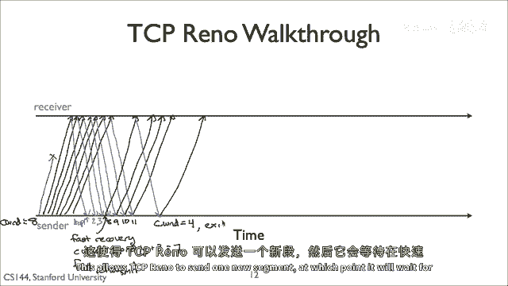

到那时它将在快速恢复期间等待来自片段中心的确认，拥塞控制是一个非常困难的问题，记住它不是什么，有人可能会期待它，这是早期互联网开发者和用户观察到的一种新兴行为，必须面对，为了使互联网再次工作。

tp今天使用的基本方法是增量的，增加，乘法，减少，或一个imd，但关于这是如何工作的有很多细节，tcp具体如何发送数据，以及何时发送，重传数据，并发送确认，使amd工作良好和稳定。

在实际应用中需要处理一系列边缘情况，今天的几乎所有tcp变种都基于tcp reno，已经添加了一些处理现代网络速度的功能，但当你连接到你最喜欢的网站时，你的操作系统正在使用tcp reno和慢启动。

拥塞避免。

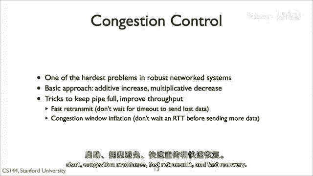