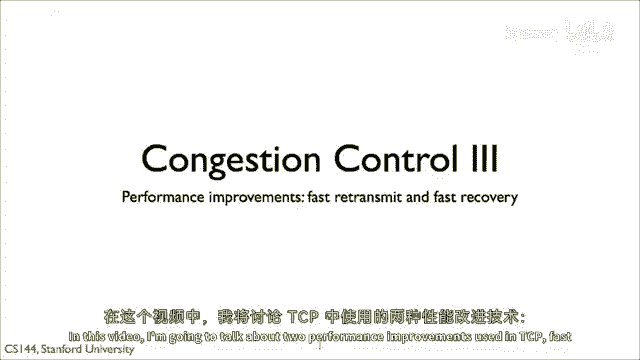
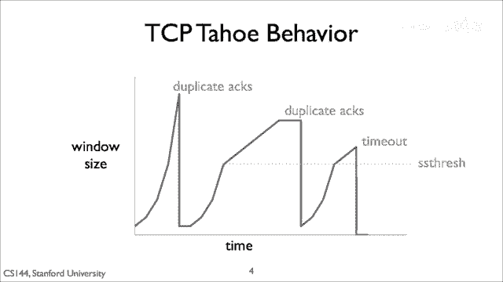
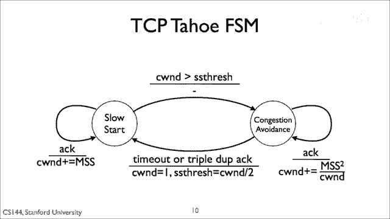
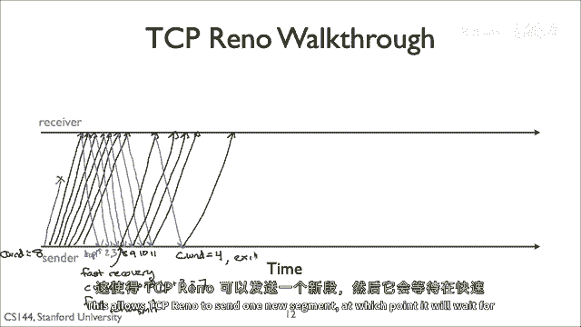

# 计算机网络课程 P63：TCP Reno 详解 🚀

在本节课中，我们将学习 TCP 协议中两种重要的性能改进机制：**快速重传** 与 **快速恢复**。我们将详细探讨它们如何与 TCP Tahoe 和 TCP Reno 协同工作，以更高效地处理网络拥塞和数据包丢失。

---

## 概述 📋

除了拥塞避免、RTT 估计和自我时钟机制，TCP 还使用了三种额外的机制来提升性能。这些机制通过软化 TCP 对数据包丢失的反应来实现。回忆 TCP Tahoe 的行为，它在面对数据包丢失时比 AIMD 策略更为保守。

TCP Tahoe 在检测到丢失时会进入慢启动状态。当拥塞窗口达到慢启动阈值时，它会指数级增加窗口大小。到达该点后，它进入加性增加阶段。

---

## 快速重传机制 ⚡

第一个机制称为**快速重传**，它是 TCP Tahoe 的一部分。

如果 TCP Tahoe 发送方收到三个重复的确认（即对于同一个序列号有四个 ACK），它会假设下一个数据段已丢失并立即重传。发送方无需等待超时，从而减少了接收确认前的延迟，并可以向前移动发送窗口以发送新数据。

TCP Tahoe 将这三个重复确认视为数据包丢失，并设置拥塞窗口为 1，进入慢启动状态。

---

## 快速恢复机制 🔄

TCP Reno 是 TCP 的一个后续版本，它引入了第二种算法，称为**快速恢复**。该算法包含两个主要机制。

**第一个机制**是：当通过三个重复确认检测到数据包丢失时，TCP Reno 不会将拥塞窗口设置为 1，也不会进入慢启动状态。相反，它将拥塞窗口减半，并将慢启动阈值设置为当前拥塞窗口的一半。这意味着 TCP Reno 保持在拥塞避免状态。

使用此算法，在无超时的稳定状态下，TCP Reno 在遇到丢失时遵循 AIMD 策略：它执行**拥塞窗口乘法减少**，并在超时时使用**加法增加**。在超时情况下，TCP Reno 的行为与 TCP Tahoe 相同，将拥塞窗口重置为 1。

**第二个机制**是：当处于快速恢复状态时，TCP Reno 会为每个收到的重复确认将拥塞窗口增加 1。这是为了防止在单个数据包丢失的情况下，TCP 因等待确认来推进发送窗口而无法在整个往返时间内发送数据。

因为每个重复确认意味着一个数据段已成功离开网络，理论上，TCP 可以在不阻塞网络的情况下发送一个新数据段。假设旧的拥塞窗口大小为 `c`，当拥塞窗口因每个重复确认增加 1 时，窗口大小会从 `c/2` 增长到 `c + c/2` 或 `3c/2`。

这意味着，对于从 `c/2` 到 `c` 的重复确认，TCP 可以发送一个新数据段。一旦 TCP 接收到一个新的确认，它会将拥塞窗口重置为正确的值，即 `c/2`。

---

## TCP Tahoe 与 TCP Reno 行为对比

上一节我们介绍了两种机制的核心概念，本节中我们来看看它们的具体行为差异。

以下是 TCP Tahoe 在遇到超时或三个重复确认时的处理步骤：

1.  将慢启动阈值设置为当前拥塞窗口的一半。
2.  将拥塞窗口设置为 1。
3.  重传丢失的数据段。

第一步意味着 TCP Tahoe 进入了慢启动状态，并会指数级增加其拥塞窗口，直到再次遇到数据包丢失或达到慢启动阈值。这导致了我们在早期图表中看到的 TCP Tahoe 随时间变化的行为。

现在，让我们走一遍 TCP Tahoe 在遇到三个重复确认时的具体流程。假设拥塞窗口是 8 MSS，一个数据段丢失了。TCP 将总共收到 7 个重复确认。在收到第三个重复确认后，它会重传丢失的数据段，将拥塞窗口设置为 1 MSS，并将慢启动阈值设置为 4。

当它收到重传数据段的确认时，会发送一个新数据段。当收到对这个新数据段的确认时，它将拥塞窗口设置为 2。当收到对这两个数据段的确认时，它会将拥塞窗口增加到 3，然后是 4。

当拥塞窗口达到慢启动阈值时，它进入拥塞避免状态。接下来的四个确认只会使拥塞窗口增加 1 MSS。这就是 TCP Tahoe 的行为。

---

## TCP Reno 的行为流程

TCP Reno 在超时时的行为与 TCP Tahoe 相同。但在收到三个重复确认时，它会执行**快速重传**，立即发送数据段，而不是将拥塞窗口设置为 1。它会将拥塞窗口减半，从而保持在拥塞避免状态。

对于每个重复确认，它会将拥塞窗口增大 1，以便在重传的数据段被确认之前发送新的数据段。因此，Tahoe 和 Reno 的主要区别在于**快速恢复**机制。

以下是一幅显示 Reno 行为的图表。它从慢启动状态开始。当遇到三个重复确认时，它将拥塞窗口减半，保持在拥塞避免状态，并执行快速重传。然后开始使用 AIMD 策略增加拥塞窗口。

在快速恢复期间，它使用拥塞窗口膨胀来发送新的数据段。在第二组三个重复确认中，相同的情况发生：它执行快速重传，将窗口减半并保持在拥塞避免状态。在超时时，它将拥塞窗口设置为 1 并重新进入慢启动状态。

拥塞窗口膨胀是快速恢复的一部分。以下是 Reno 进入快速恢复时如何工作的详细信息：它可以通过每个重复确认将其拥塞窗口增加 1。因为拥塞窗口已经减半，这意味着拥塞窗口可以增长到其原始值的一半以上。

具体来说，发送者将发送大约 `原始拥塞窗口 / 2` 个新数据段（减去一个丢失的数据段），这几乎等于遵守 AIMD 策略所需的量。

---

## 状态机对比

回忆一下，TCP Tahoe 的有限状态机有两个状态：**慢启动** 和 **拥塞避免**。

TCP Reno 的全部 FSM 在三个重复确认时添加了第三个状态：**快速恢复**。它不会过渡到慢启动，而是过渡到快速恢复状态。当它收到新的确认时，它会过渡回拥塞避免状态，并将拥塞窗口重置为之前大小的一半。

当它在快速恢复状态中超时时，它会返回慢启动状态。就像在拥塞避免状态收到重复确认时一样，在快速恢复状态中，它也会将拥塞窗口增加 1。在快速恢复的初始过渡中增加 3，是为了考虑到已经收到的三个重复确认。

---

## TCP Reno 行为示例

让我们走一遍 Reno 的具体行为。假设我们开始时拥塞窗口大小为 8 MSS，一个数据段被丢弃。发送者将在第一个三个重复确认后，总共收到七个重复确认。

1.  它将拥塞窗口缩小为剩余的一半，即 4 MSS，并保持在拥塞避免状态。
2.  在快速恢复期间，对于接下来的重复确认，它会将拥塞窗口扩大。经过三次增加（对应三个重复确认），窗口增长到 7 MSS。
3.  在第四次重复确认时，拥塞窗口增长到 8 MSS。
4.  接下来的三个确认将使窗口增加到 9、10，然后 11 MSS。这样，发送者大约可以在这个时候发送三个新的数据段。
5.  当发送者收到对重传数据段的确认时，这个确认号会将发送窗口向上移动，以包含触发所有重复确认的数据段。
6.  此时，TCP Reno 会将拥塞窗口缩小到正确的值，即其旧值的一半（4 MSS）。这允许 TCP Reno 发送一个新的数据段。

---

## 总结与思考 💡

在本节课中，我们一起学习了 TCP Reno 如何通过**快速重传**和**快速恢复**机制来改进网络性能。这两种机制使 TCP 在面对数据包丢失时能做出更快速、更温和的反应，避免了像 TCP Tahoe 那样激进地退回到慢启动状态，从而在大多数情况下保持了更高的吞吐量。

拥塞控制是一个非常复杂的问题。需要记住的是，它并非人们最初预期的那样简单。它是早期互联网开发者和用户观察到的一种必须面对的涌现行为，目的是为了使互联网能够稳定工作。

TCP 今天使用的基本方法是 **AIMD**，但关于它如何工作有很多细节。TCP 具体如何发送数据、何时重传数据以及如何发送确认，都需要在实际应用中处理一系列边缘情况，才能使 AIMD 策略良好且稳定地工作。

如今，几乎所有 TCP 变种都基于 TCP Reno，并添加了一些处理现代网络高速特性的功能。当你连接到最喜欢的网站时，你的操作系统很可能正在使用 TCP Reno 及其慢启动和拥塞避免机制。