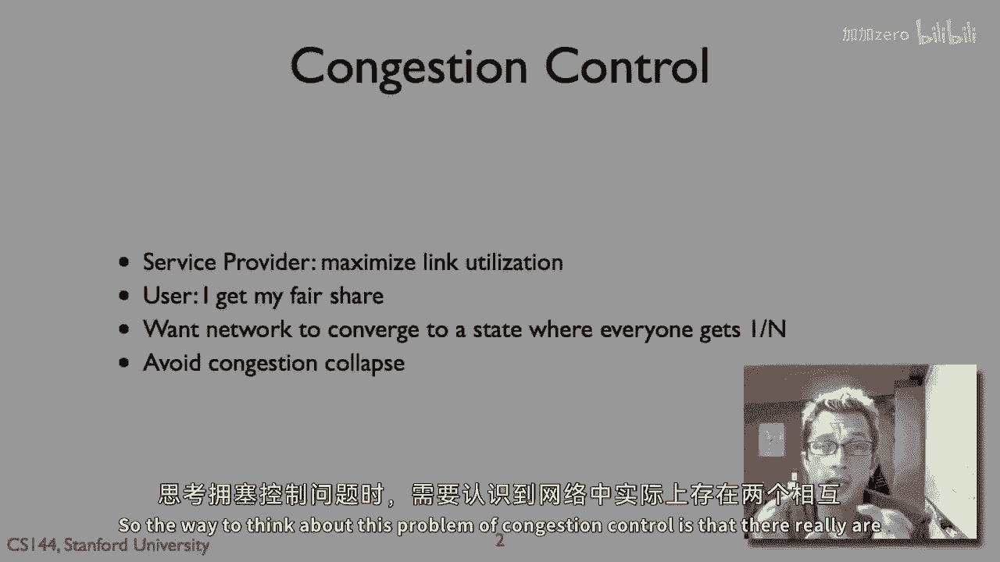

# P64：p63 4-8 Congestion Control - AIMD - 加加zero - BV1qotgeXE8D

所以在关于TCP Reno和新Reno的视频中，我说了增加的增加，乘法的减少，结果证明这是一种非常强大和非常有效的机制，用于网络拥塞控制，我正在试图给你一种直觉，关于为什么它工作得这么好。

以及为什么它通常在互联网上使用，所以，思考这个问题的方法是。

网络中确实存在两种相互冲突的要求，第一个是服务提供商，他们想要干什么，是他们想要最大化他们的长度，利用率，那就是他们想要他们的网络被完全利用，他们不想要有空闲的容量，嗯，那就是未被使用的。

但是用户想要公平地分享那个，你知道服务提供商会很高兴，如果一个用户只拿到了整个管道，但是然后你将失去所有的客户，用户将会不高兴，所以想法是你想要一个用于交通控制的算法，这个算法让链接运行接近利用率。

但是会收敛到一个点，在那里无论你，每个用户，假设所有其他条件都相等，都将大约得到1/n，如果用户有n个，这样做将避免交通崩溃，他们仍然在做有用的数据，所以这些是问题的基本参数。

我们想要最大化高利用率链接的使用率，同时，每个人都应该公平地分享那份链接的使用率，我们还要确保网络不会自己腐烂到地下，所以，你的拥塞窗口大小应该多大，所以，实际上最优的拥塞窗口大小。

正如你之前所说的是带宽延迟积，这基本上是一个想法，就是说，我有从旧金山到波士顿的带宽是，嗯，每秒传输十兆兆字节，延迟为一百毫秒，这就意味着，嗯，如果我能支持每秒十兆字节，并且拥有有效窗口持续一百毫秒。

那么我的有效窗口应该基本上为一兆字节，对，一百兆字节每秒乘以一百毫秒，等于一毫秒，同样，如果我的带宽是每秒六兆字节，并且我的延迟是，嗯，九十毫秒，那么我应该发送大约五百四十千字节的拥塞窗口。

这是从这些值中得出的，并且如果我每秒发送一个兆字节的条件窗口，并且有十个条件窗口，我将每秒发送十个兆字节，这将每秒发送十个兆字节，同样，如果我的拥塞窗口是五百四十千字节，并且它的拥塞时间是九十毫秒。

他们将分解为每秒六兆字节，所以现在一种思考拥塞窗口如何随时间变化的方式，或者换句话说，我们如何随时间工作拥塞对，被称为嚼嚼图，这实际上是一部分被阐述的，在一些或一篇首次提出这个想法的论文中。

或者为什么amd是一个是好主意，所以一种好的图形方式，我们希望做的是绘制，我们有两个在网络中竞争的流量，我们将绘制流量的速率，嗯，基于其说，拥塞窗口大小和速率在x轴上，并在y轴上绘制流量b的速率。

它将是一个散点图，如果网络公平，a将等于b，那就是a得到的速率将等于b得到的速率，因此，散点图的点应该落在这条线上，现在，这就是用户要求，如果我们正在满足服务提供商的要求。

因为我们实际上正在运行网络在容量下，那么它应该 that a plus b，这两个流量的总和等于网络的容量，这就是服务提供商，所以我们喜欢的是一种拥塞控制算法，它会使你知道从何处开始，在这个设计中。

你知道，选择一些随机点，将使流量a和流量b向这个中心点的理想点 gravitate，我们在这里公平和高效，我们完全利用链接，所以你可以显示，如果我们在这个效率线右侧，这意味着我们过载了网络。

所以包丢失的机会更大，我们将看到三重复制x，如果我们在绿色区域，我们有网络负载，所以我们想要达到这个点，我们正在精确地运行在狭窄的容量上，但我们有公平的容量，现在，这个将，这个将显示给你。

从t1到t6等序列的增加方式是累加增加，乘法减少的行为，所以让我们选择这个任意点，t1，流量b正在以远远超过其公平份额的操作，嗯，你可以看到这段距离是他们公平份额的一部分。

并且流量a正在以远远低于其公平份额的操作，你可以看到这段距离，这里，所以会发生什么，两者都在累加增加模式，并且他们都将累加增加他们的拥堵，窗口大小和他们的流量率，直到某个点，网络变得过载。

然后当它开始丢失包时，然后它们将乘法减少他们的窗口大小并返回累加增加，这就是乘法减少，然后它们现在开始累加增加，因为乘法减少比a减少b的速率更多，它是一个乘法因子，这然后使图表，a和b的比较更接近公平。

你可以在这里看到t3将这对流量带得更接近公平线，这就是我们看到的，因为我们正在不断地按照乘法因子减少每个流量随时间，然后按照累加因子随时间增加，它们之间振荡于过载和欠载感。

如果他们要推网络直到它稍微过载，然后它们稍微后退，随着时间的推移，这种缩放乘法减少使他们收敛到这个点，所以实际上，在最终情况下，我们将看到你知道，取决于确切的过载点，嗯，导致三重确认，对。

因为会有一些线索，等等，你将看到这两条流量在加载网络时沿着公平线振荡，然后增加，然后过载它，它们后退增加，所以随着时间的推移，累加增加，乘法减少使一对流量或一组流量实现两者都希望的属性。

他们得到网络容量的公平份额，他们最终移动到这个线这里，但也通过其累加增加，他们将接近网络容量，他们将接近网络容量，他们将，你知道，然后稍微向前走，然后稍微向后走，然后稍微向前走，但一般来说，累加增加。

乘性减少会使流量收敛到这个点。

