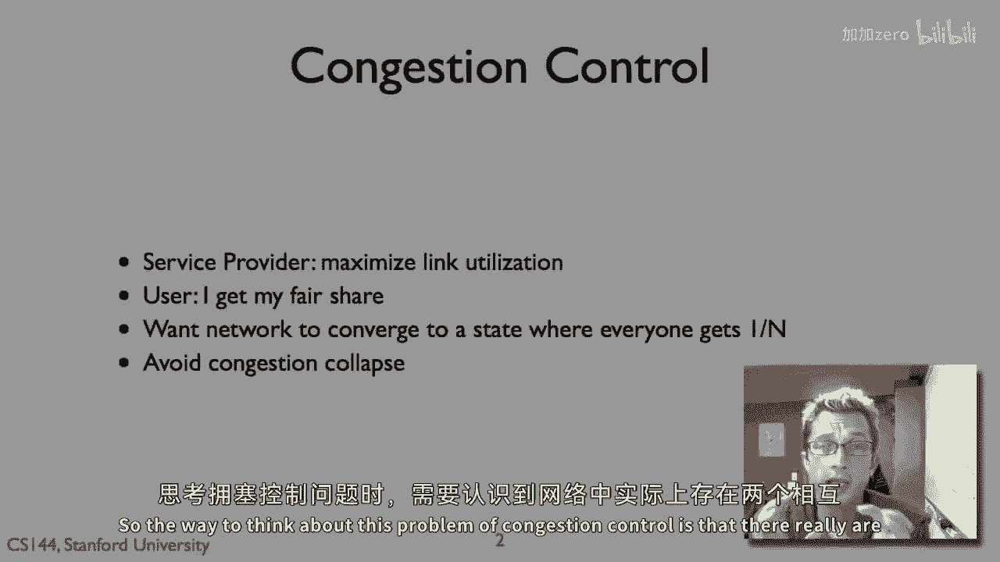
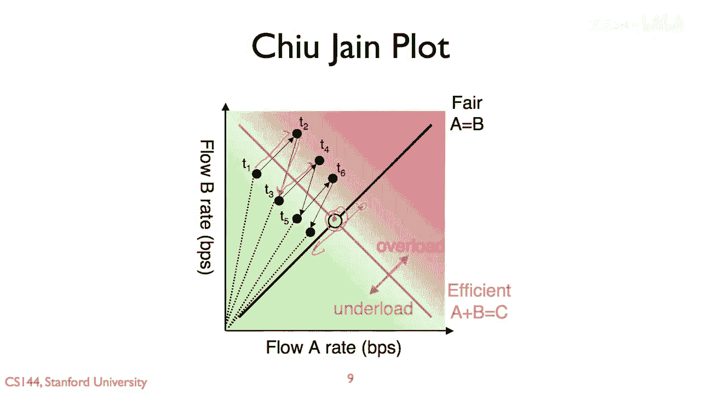

# 课程 P64：TCP 拥塞控制 - AIMD 原理详解 🚦

在本节课中，我们将学习 TCP 拥塞控制的核心机制之一：**加性增、乘性减**。我们将探讨它为何能有效平衡网络利用率和用户公平性，并通过图形化方式直观理解其工作原理。

---

## 概述：网络中的冲突需求

网络中存在两种相互冲突的需求。

服务提供商希望最大化其链路利用率，即希望网络被完全利用，没有空闲容量。

用户则希望公平地分享网络资源。如果只有一个用户占用了整个管道，其他用户会不满意。

因此，拥塞控制算法的目标是：让链路运行在接近满载的利用率，同时收敛到每个用户（在条件相同时）大约获得 `1/n` 的公平份额（假设有 n 个用户）。这样既能避免网络崩溃，又能保证数据传输效率。

---

## 核心目标与最优窗口

我们希望最大化高利用率链路的使用率，同时确保每个用户公平地分享链路，并防止网络因过载而性能恶化。

那么，拥塞窗口应该设置为多大？实际上，**最优的拥塞窗口大小是带宽延迟积**。

这个基本思想是：如果带宽是每秒 B 字节，延迟是 D 秒，那么有效的窗口大小应为 `B * D` 字节。

**公式：`最优拥塞窗口 = 带宽 (B) × 延迟 (D)`**

例如：
*   带宽 10 MB/s，延迟 100 ms，则窗口应为 `10 MB/s * 0.1 s = 1 MB`。
*   带宽 6 MB/s，延迟 90 ms，则窗口应为 `6 MB/s * 0.09 s = 540 KB`。

如果每个连接的拥塞窗口都按此设置，并且有多个连接，它们的总发送速率将等于链路容量。

---

## 可视化理解：吞吐量轨迹图

一种理解拥塞窗口如何随时间变化，或者说流量如何竞争网络资源的方法，是使用**吞吐量轨迹图**。

假设网络中有两个竞争流：流量 A 和流量 B。
*   我们在 X 轴上绘制流量 A 的速率（或拥塞窗口大小）。
*   我们在 Y 轴上绘制流量 B 的速率。

如果网络完全公平，则 A 的速率等于 B 的速率，所有点应落在 `A = B` 的公平线上。

如果满足服务提供商的要求，即链路完全利用，则两个流的总和应等于网络容量 `C`，即 `A + B = C`。这条线被称为效率线。

理想的拥塞控制算法应能使流量从任意起点开始，最终收敛到公平线与效率线的交点。这个点同时满足了**公平性**和**高效率**。

在效率线右侧意味着网络过载，丢包概率增大，将触发拥塞响应（如收到三个重复ACK）。在效率线左侧则意味着网络负载不足。

---

## AIMD 的工作过程

现在，我们来看加性增、乘性减如何引导流量收敛到理想点。

假设在时间 `t1`，流量 B 的速率远高于其公平份额，而流量 A 的速率远低于其公平份额。

以下是发生的过程：

1.  **加性增阶段**：两者都处于加性增模式，逐步增加其拥塞窗口和发送速率。
2.  **触发过载**：直到某个时刻，网络变得过载并开始丢包。
3.  **乘性减阶段**：两个流都进行乘性减少（例如，将窗口减半），然后退回。
4.  **再次加性增**：减少后，它们重新开始加性增加。

由于乘性减少对速率高的流影响更大（减少的绝对值更多），这使得 `t3` 时刻的流量对 `(A, B)` 比 `t1` 时刻更接近公平线。

随着时间的推移，这种“推进直到轻微过载，然后后退”的振荡过程，在乘性减少的缩放效应下，会使竞争流逐渐收敛到公平线与效率线的交点。

最终，我们将看到多个流量在公平线附近振荡，并随着加性增而接近网络容量，偶尔因过载而后退。**加性增、乘性减**机制使得一组流量最终能同时获得网络容量的公平份额，并保持链路的高利用率。

---

## 总结

本节课我们一起学习了 TCP 拥塞控制中的 **AIMD** 机制。

我们首先了解了网络中对**高效率**和**公平性**的双重需求。接着，我们引入了**带宽延迟积**作为最优拥塞窗口的理论依据。

然后，我们通过**吞吐量轨迹图**可视化地分析了两个竞争流的行为，明确了理想收敛点是公平性与效率的平衡点。

最后，我们逐步剖析了 **AIMD** 的工作过程：通过周期性的**加性增**探索可用带宽，在检测到拥塞时通过**乘性减**快速降低负载。这种机制能有效地引导网络流量同时实现高利用率和公平分配，是互联网拥塞控制的基石之一。