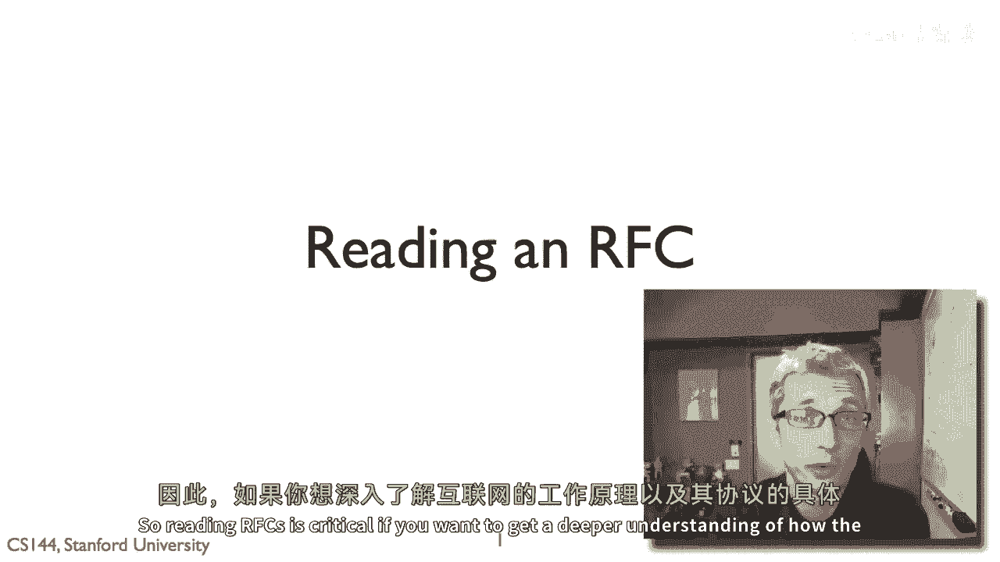

# 课程P65：RFC阅读指南 📖

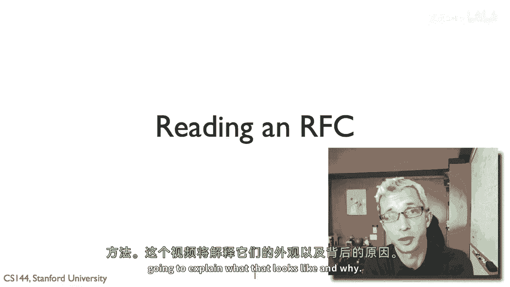

在本节课中，我们将学习如何阅读和理解RFC（Request for Comments，请求评论）文档。RFC是定义互联网协议和标准的核心文档，掌握其阅读方法对于深入理解互联网工作原理至关重要。

## RFC是什么？🤔

上一节我们介绍了课程目标，本节中我们来看看RFC的基本概念。

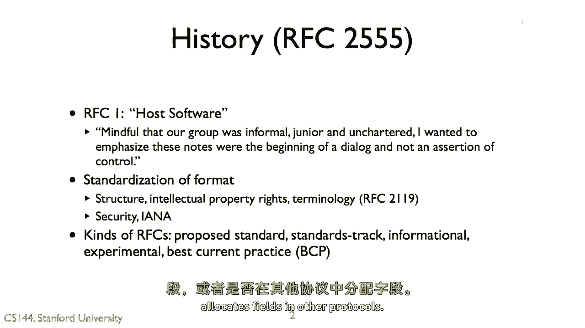

RFC是互联网工程任务组（IETF）发布的一系列技术文档，用于描述互联网协议、标准、最佳实践等信息。它并非强制性的控制声明，而是社区对话和共识的产物。虽然今天的RFC格式比最初更为正式，但其核心精神——作为实现互操作性（即不同系统能够协同工作）的指导——始终未变。

## RFC的类型与意义 📋

理解了RFC的基本定义后，我们来看看RFC有哪些不同类型，以及它们各自的意义。

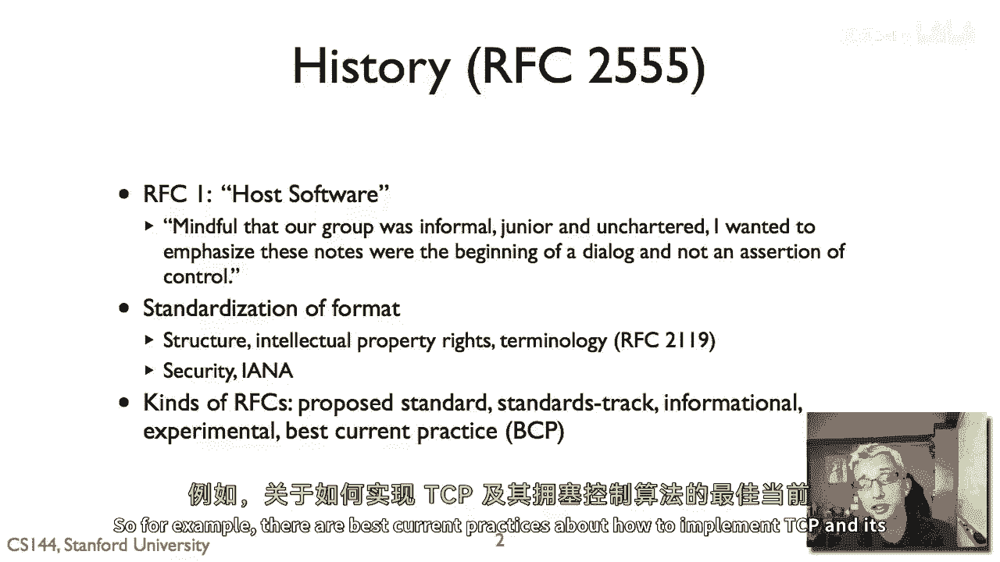

初学者可能会对RFC的多种类型感到困惑。实际上，不同类型的RFC具有不同的意义和对互联网标准过程的影响。RFC主要分为以下几类：

以下是RFC的主要类型：

*   **实验性（Experimental）**：描述仍在探索阶段的想法或技术。
*   **信息性（Informational）**：提供对社区有价值的信息，但不定义协议标准。
*   **提议标准（Proposed Standard）**：一组人认为应该成为互联网通用标准的技术规范。
*   **标准追踪（Standards Track）**：已成为互联网稳定标准的技术规范。从提议标准过渡到此状态需要经过严格的流程，包括多个可互操作的实现和正式的审核。
*   **最佳当前实践（Best Current Practice, BCP）**：根据当前知识状态，描述完成某项任务的最佳方法。例如，关于如何实现TCP及其拥塞控制算法的文档就属于此类。

## RFC的诞生过程 🚀

上一节我们介绍了RFC的类型，本节中我们来看看一份文档是如何最终成为RFC的。

RFC的制定过程是一个严谨的社区协作流程。以下是一个简化的步骤说明：

以下是RFC从构思到发布的主要步骤：

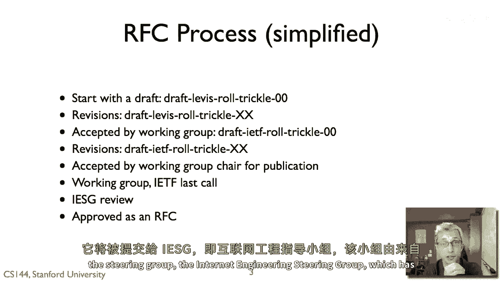

1.  **个人草案（Individual Draft）**：文档始于一份个人提交的草案，表明某人或某小组认为此文档可能对互联网有益。例如：`draft-levis-ticc-00`。
2.  **工作组草案（WG Draft）**：如果草案被相关IETF工作组采纳为工作项目，其名称会变为`draft-ietf-工作组名-主题-00`，版本号重置。文档在工作组内经过会议讨论、邮件列表反馈和多次修订。
3.  **工作组最后征集（WG Last Call）**：工作组主席认为文档已成熟，会在工作组内部发起最后征集，以收集最终修改意见。
4.  **IETF最后征集（IETF Last Call）**：文档被提交至整个IETF社区进行最后审查，任何人都可以提出意见。
5.  **IESG审核（IESG Review）**：互联网工程指导组（IESG）进行最终审核。该小组由各领域专家组成，他们可能批准发布，也可能要求重大修改或拒绝。
6.  **发布为RFC**：审核通过后，文档被分配一个RFC编号并正式发布。

## 如何解读RFC中的关键术语 🔑

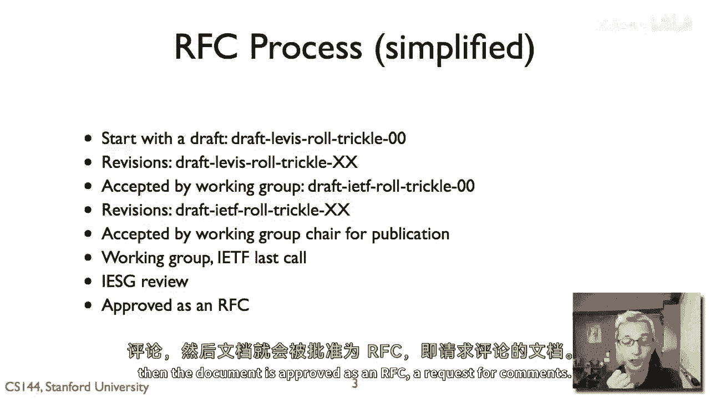

了解了RFC的制定流程后，阅读具体文档时，理解其使用的特定术语至关重要。

RFC 2119定义了在RFC中用于表示要求级别的关键术语。这些术语通常以大写形式出现，含义如下：

以下是RFC中的核心要求术语：

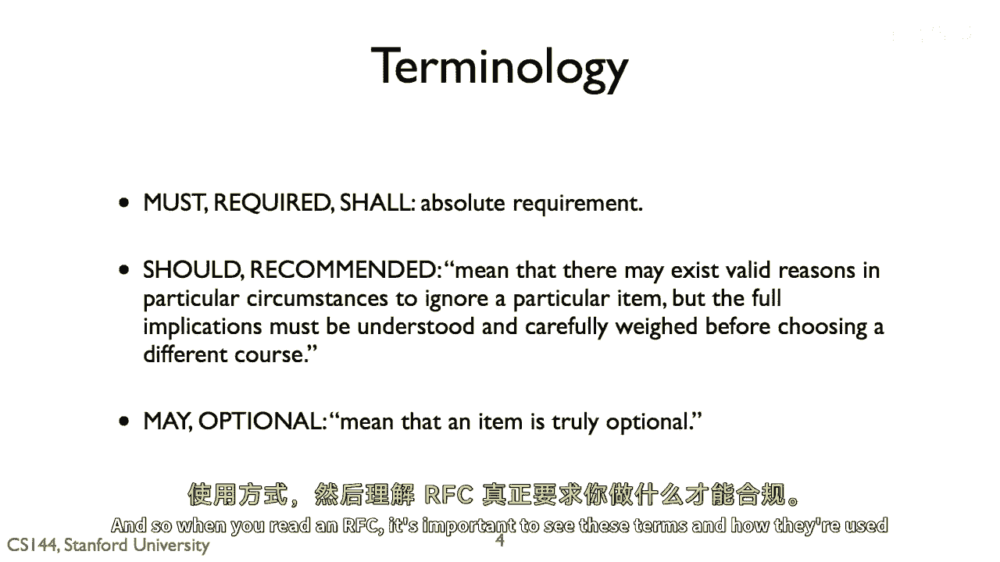

*   **必须（MUST）/ 必须不（MUST NOT）**：表示绝对要求。不遵循则意味着不符合RFC规范，无法实现互操作性。
*   **应该（SHOULD）/ 不应该（SHOULD NOT）**：表示强烈推荐的做法。理解不这样做可能带来的后果后，可以选择不遵循。
*   **可以（MAY）**：表示完全可选，是否实现不影响互操作性。

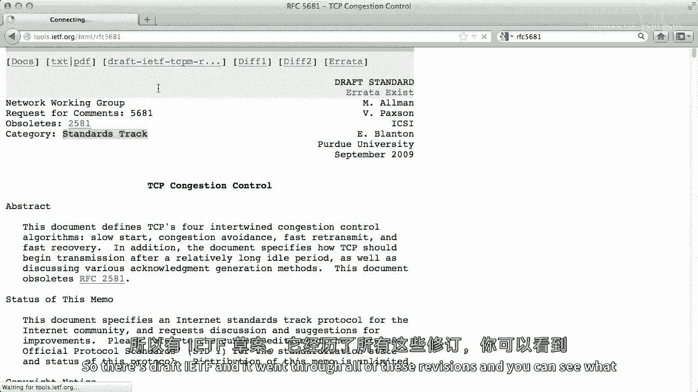

## 实战解析：RFC 5681示例 📄

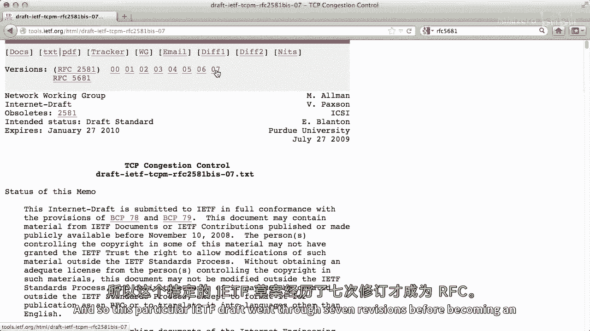

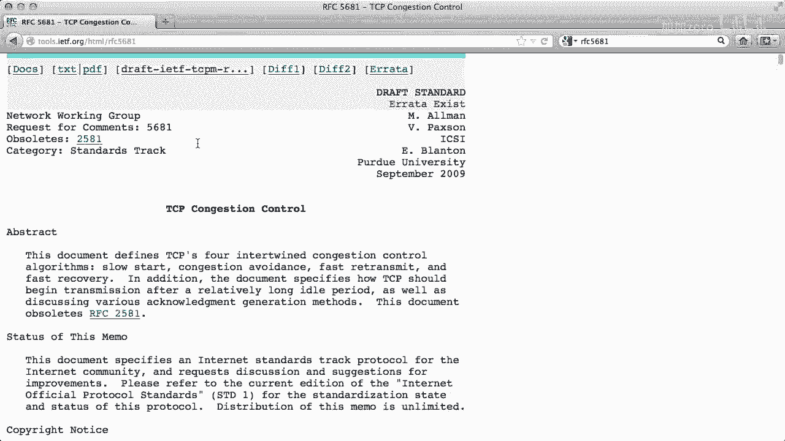

上一节我们学习了RFC的关键术语，现在让我们通过一个真实案例来应用这些知识。

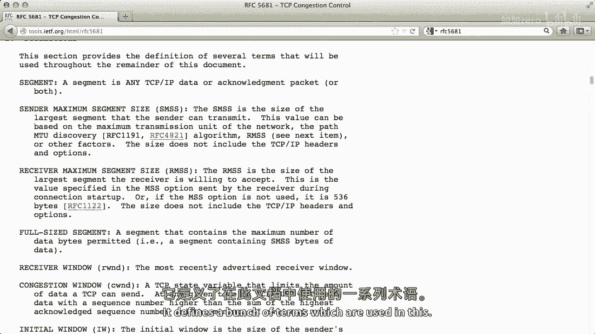

我们以RFC 5681（TCP拥塞控制）为例。这是一份标准追踪RFC。

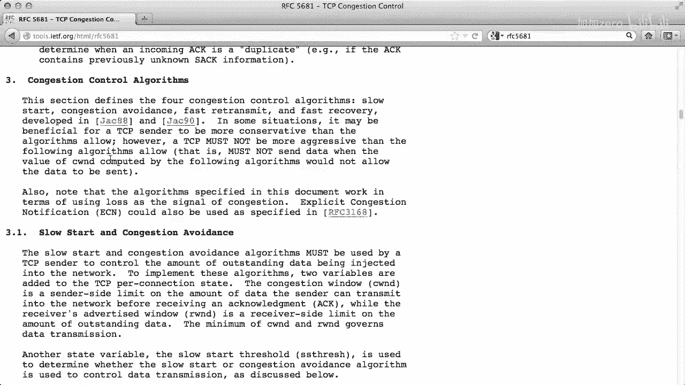

文档首先声明，TCP发送方**可以**（MAY）比算法建议的更保守（发送更慢），但**绝不能**（MUST NOT）更激进（发送更快）。这设定了行为的上限。

在定义初始拥塞窗口（`cwnd`）大小时，文档规定：
*   对于大尺寸报文段，初始窗口**必须**（MUST）为2个报文段。
*   对于中等尺寸报文段，初始窗口**必须**（MUST）为3个报文段。
*   对于小尺寸报文段，初始窗口**必须**（MUST）为4个报文段。

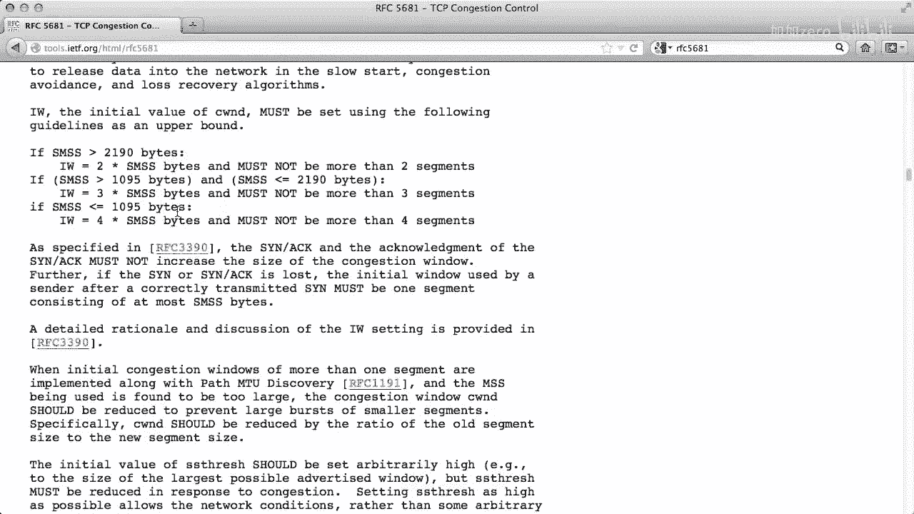

在定义初始慢启动阈值（`ssthresh`）时，文档建议其**应该**（SHOULD）被设置为一个任意高的值，以便慢启动可以持续到出现丢包为止。这意味着实现者可以设置更低的值，但**应该**理解其后果。

在拥塞避免阶段，关于增加拥塞窗口的规则是：
*   发送方**可以**（MAY）每次往返时间（RTT）增加少于1个报文段的窗口。
*   发送方**应该**（SHOULD）每次RTT按以下公式增加1个报文段的窗口：`Increase = SMSS * SMSS / cwnd`。
*   发送方**绝不能**（MUST NOT）每次RTT增加超过1个报文段的窗口。

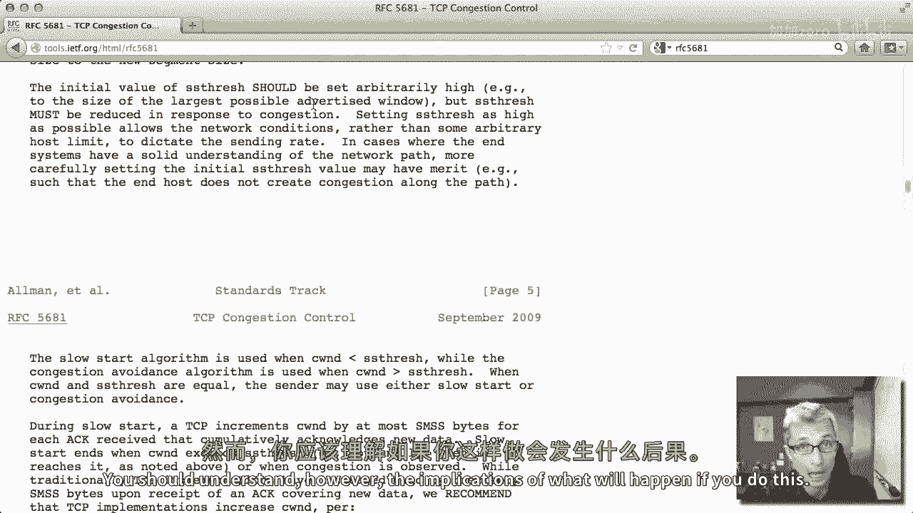

## 理论与现实的差距 💡

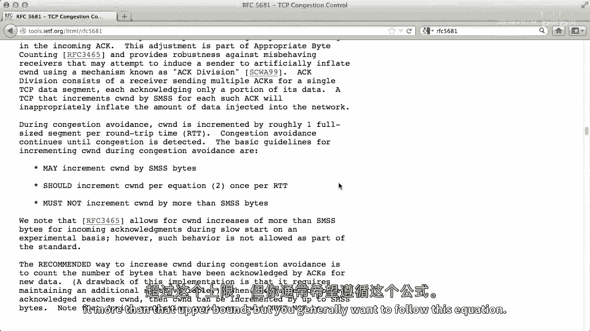

最后，需要明确一点：RFC是技术规范，而非法律条文。

尽管RFC规定了“必须”遵守的条款，但并没有中央机构强制执行。现实中，出于性能等考虑，一些主要厂商可能不完全遵循。例如，有研究发现，谷歌和微软的服务器在建立新连接时，设置的初始拥塞窗口大小超过了RFC 5681的规定，以便更快地传输数据。这引发了关于是否应更新RFC以适应现代网络环境的讨论。这正体现了互联网标准在理想规范与实际部署之间的动态平衡。

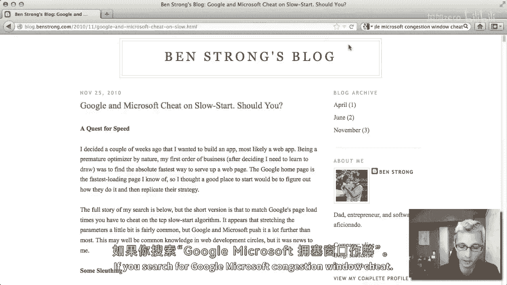

## 总结 📝

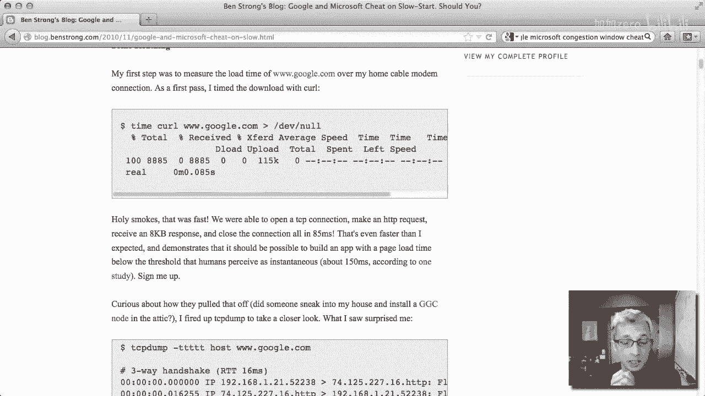

本节课中我们一起学习了：
1.  **RFC的本质**：它是定义互联网互操作性的核心共识文档。
2.  **RFC的类型**：包括实验性、信息性、提议标准、标准追踪和最佳当前实践等。
3.  **RFC的制定流程**：从个人草案到IESG批准发布的协作过程。
4.  **关键术语解读**：`必须（MUST）`、`应该（SHOULD）`、`可以（MAY）`等术语的精确含义。
5.  **实践与案例**：通过RFC 5681分析了具体规范，并理解了标准在现实世界中的应用与变通。

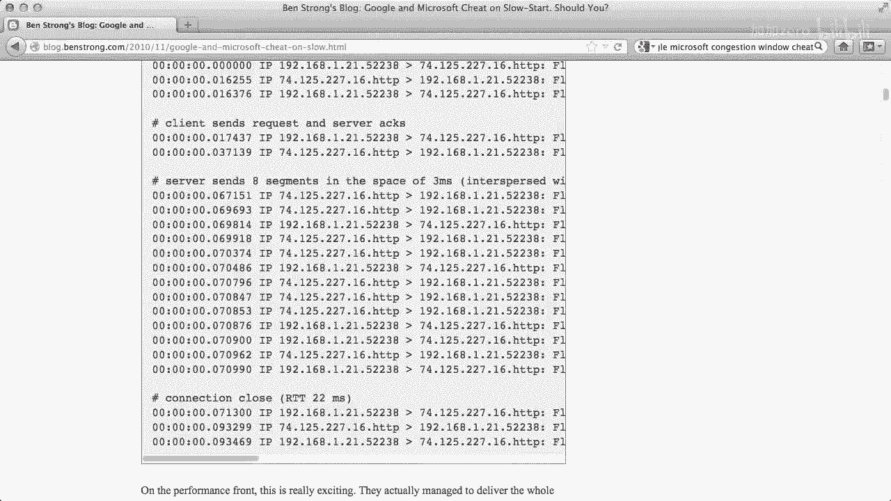

掌握RFC的阅读方法，是深入理解互联网底层协议和参与网络技术社区讨论的重要基础技能。