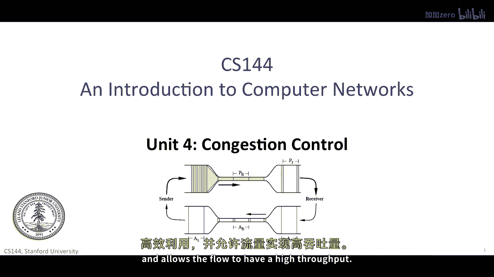
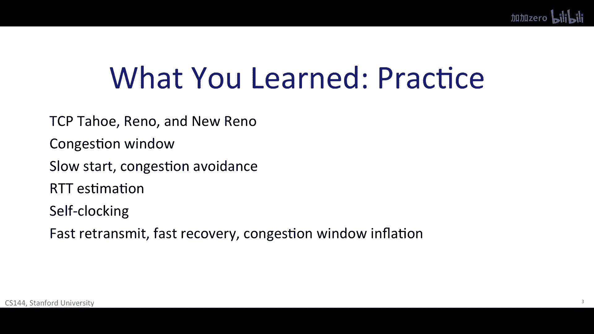
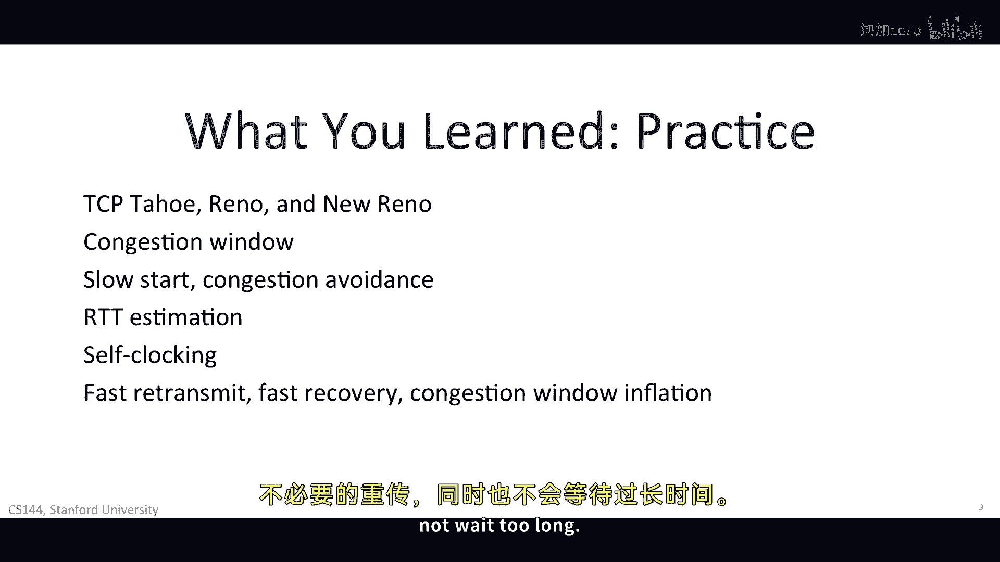

# P66：p65 4-11 Congestion Control - 加加zero - BV1qotgeXE8D

在这一单元中，你已经看到了交通和分组交换如何通过拥塞控制相互交互。

流量控制是关于终点主机的，它确保源主机不会使目的地主机过载。

通过发送超过它可以接收的拥塞控制。

另一方面，是关于防止源主机过载链接和路由器之间的。

当源主机将太多的包放入网络时，或者当许多源主机将包放入网络时。

它们可以填满路由器队列，直到它们溢出在tcp中。

在发送主机上运行的拥塞控制算法。

告诉它网络中可以拥有多少包，以便不过度填满路由器队列。

tcp总会导致一些包被丢弃。

因为这是它使用的反馈信号，以知道路由器队列是否满了，但当它工作良好时。

tcp保持包丢弃率，低，链接保持良好且充满。

并允许流量具有高吞吐量。

尼克首先解释了网络拥塞的原则，你学习了当一个路由器结构接收的包比它可以发送的包快时发生的事情。

如果拥塞是短暂的。

然后路由器可以吸收这个额外的流量到一个队列中并排空队列。

如果拥塞是长期的，长期到队列溢出，然后路由器必须丢弃一些包。

尼克介绍了一种非常有价值的思考方式。

而不是想出丢弃包的方案，思考你想要网络总体行为的是什么。

我们想要网络公平。

并解释这意味着在引入最大最小公平性的概念时，最大公平性说网络是公平的，如果你不能增加一个流的速率。

而不减少一个速率较低的流的速率，有许多方法可以实现这个目标，并且今天的网络有许多不同机制。

但我们专注于一个。

你学习tcp使用的基本算法，叫做累加。

增加，乘法，减少或imd当运行顺畅时，tcp增加可以未完成的字节数，它可以在轮询时间内增加一个段大小。

当tcp检测到一个包被丢弃时，它减半可以未完成的字节数。

你学习这个行为的样子，使用tcp锯齿图。

嗯，每个单独的流在共享许多流的链接上都有一个锯齿图。

所有这些平均下来，都显示出对链接的持续高使用率。

使用锯齿波形，我们使用符号a imd来计算tcp吞吐量。

如果你假设网络以均匀率p丢失包。

那么tcp流的吞吐量是根号三半乘以，rtt的倒数乘以根号p，如果你增加往返时间，书的下载速度会下降。

这方程做出了许多简化假设，但它实际上通常相当准确。

在许多情况下，在考虑网络可能行为的时候，它是一个非常有价值的工具。

你已经学习了tcp如何在实践中实现这些原则。

菲尔告诉你在 late nineteen eighty eighty s 互联网崩溃的事情，由于拥堵和至今仍在使用的tcp修复措施，你学习了tcp的三个版本，tcp tahoe。

tcp reno和tcp new reno，我们首先覆盖的重要想法是，tcp端点维护一个拥塞窗口。

一个tcp流可能在网络中拥有不被确认的字节数n。

当n是其流量控制窗口和拥塞控制窗口的最小值时。

你不将比接收端能够处理的包数更多的包放入网络。

或比中间链接和路由器能够处理的包数更多，你学习了tcp如何使用两个状态来控制拥塞控制窗口的大小。

慢启动和拥塞避免，慢启动让tcp能够快速找到接近正确的拥塞窗口大小。

拥塞避免使用imd，tcp从慢启动开始，并在首次检测到丢失时过渡到拥塞避免。

你学习了tcp如何估计其连接的往返时间，它需要这个估计来确定一个确认超时的时间。

通过跟踪平均值，以及接收一个片段所需的时间变异性。

tcp也可以避免不必要的重传，并且不会等待太久。

你学习了tcp如何控制它将包放入网络，使用一种叫做自我计时的技术。

你在我看给你展示tcp行为的动画时首先看到了自我计时。

菲尔，然后带我们通过了一些使用自我计时的例子，tcp只有在网络中有新包时才会放入。

当它收到确认时，或者当超时时间到的时候，这在防止拥塞方面非常有用，因为它意味着，tcp只有在数据包已经离开网络时才将数据包放入网络。

最后，我们覆盖了tcp中添加的三个优化优化。

reno和tcp新reno快速重传，让tcp在只丢失一个数据包时继续前进，而不是等待超时，TCP重传一个段，当它检测到对前一个段的三个重复确认时。

这是TCP继续接收段的迹象。

但它没有使用快速恢复接收到这个特定的段。

TCP Reno不退回到慢启动，或三个重复动作，它只是将拥塞窗口减半并留在拥塞避免状态。

最后TCP New Reno添加了一个额外的优化窗口膨胀。

使得三个重复动作。

不导致TCP失去一个RT值的传输，当它等待缺失的片段被添加时。

现在，交通拥堵最令人着迷的地方是，它是一种被发现的现象，随着互联网的发展，没有人真正想过这样的事情可能会发生，或者如何控制它，它是一种涌现行为，一旦网络变得足够大且被广泛使用，现在。

它是网络通信的基本概念，被视为构建强大且性能高的系统至关重要的部分。

TCP的现代版本，比课堂上讨论的稍微先进一些。

但主要是它们已经进化到能够处理许多。

许多更快的网络，操作系统中发货的TCP版本具有TCP Reno。

或在其算法中具有TCP New Reno，以处理非常快的网络，添加了新的功能和操作模式。

人们会查看Linux源代码，在那里你会看到这些算法。

但是，这也很酷的是，这些繁琐的算法有一个坚实的。

概念基础和理论，一方面，我们可以谈论rtt变异估计，快速恢复和自我时钟，另一方面。

