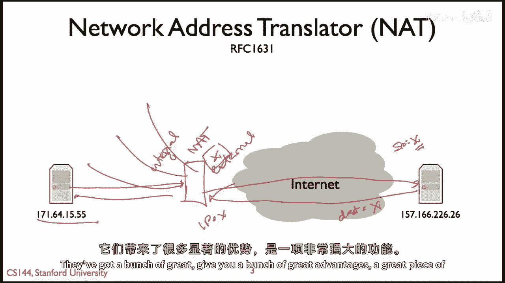
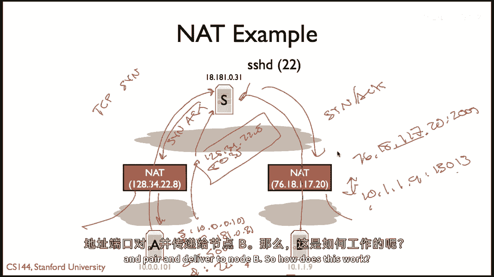
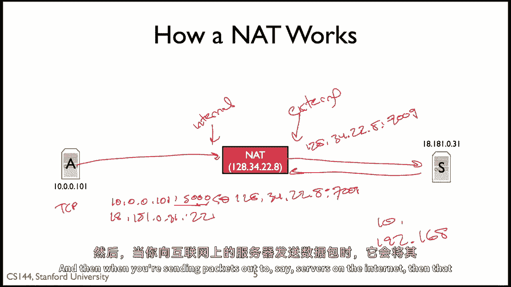

# 课程 P68：网络地址转换（NAT）简介 🌐

在本节课中，我们将学习网络地址转换（NAT）的基本知识，并解释其工作原理。NAT是现代网络中一个非常普遍且重要的组件，它允许我们解决IP地址短缺问题，并提供一定程度的安全保护。

## 端到端原则与NAT的引入

上一节我们介绍了网络的基本任务。根据端到端原则，网络的核心任务是尽可能高效、灵活地传输数据包，而所有智能和复杂功能都应放在网络的边缘（即终端主机）。在这个模型中，两个拥有IP地址的主机之间的所有网络设备，其职责仅仅是找到最佳路径并转发数据包。

将智能置于网络边缘的好处在于，这便于添加新功能且不会引入复杂的依赖关系。一旦开始在网络中间（即核心路径上）添加功能，就会引入依赖性和复杂性，使整个系统变得更加普遍和困难。

然而，NAT是一个有趣的例外。它最初在RFC 1631中定义，是一个强有力的例证，说明在网络中间添加某些功能可以带来显著的好处，但同时也引入了新的复杂性。

## NAT 的工作原理

上一节我们提到了NAT带来的好处与复杂性，本节中我们来看看NAT具体是如何工作的。

本质上，NAT是一个位于你的设备（如家庭网络）和公共互联网之间的“盒子”。它拥有一个公共互联网IP地址（例如 `X`）。

以下是NAT处理数据包的基本流程：

1.  **出站数据包（从内部到互联网）**：当你的电脑（内部地址，例如 `I`）发送一个数据包到互联网上的服务器（地址 `S`）时，数据包首先到达NAT。
2.  **地址重写**：NAT会重写这个数据包的源地址。它将源地址从你的内部私有地址 `I` 和端口，改为NAT自己的公共地址 `X` 和一个由NAT分配的新端口（例如 `P_X`）。
    *   原始数据包：`源: I:Port_I -> 目标: S:Port_S`
    *   重写后数据包：`源: X:P_X -> 目标: S:Port_S`
3.  **状态记录**：NAT会在其内部创建一个映射表，记录 `(I:Port_I) <-> (X:P_X)` 的对应关系。
4.  **入站数据包（从互联网到内部）**：当互联网上的服务器 `S` 回复数据包时，它会发送到 `X:P_X`。
5.  **反向翻译**：NAT收到这个目标为 `X:P_X` 的数据包后，查询其映射表，找到对应的内部地址 `I:Port_I`。
6.  **转发**：NAT将数据包的目标地址重写为 `I:Port_I`，并将其转发到你的电脑。

通过这个过程，内部网络的多台设备可以共享一个公共IP地址 `X` 访问互联网。

## NAT 的主要优势

了解了NAT的基本原理后，我们来看看它带来的具体好处。

以下是NAT提供的两大核心优势：

*   **IP地址共享**：这是NAT最主要的功能。互联网服务提供商（ISP）通常只给家庭或小型企业分配一个或少数几个公共IP地址。通过NAT，内部网络中的多台设备（如手机、电脑、智能家居设备）可以使用私有IP地址（如 `10.x.x.x`, `192.168.x.x`），并通过NAT共享那一个公共IP地址访问互联网。这极大地缓解了IPv4地址耗尽的问题。
    *   **公式描述**：`N 台内部设备 -> 1 个公共IP地址 (通过NAT映射)`。
*   **基础防火墙安全**：由于内部设备的真实IP地址被NAT隐藏，互联网上的外部设备无法直接发起连接到这些内部设备。外部连接只能响应由内部设备首先发起的会话。这提供了一种简单的、默认的入站连接过滤，增加了网络的安全性。

## NAT 工作实例分析

上一节我们概述了NAT的优势，本节我们通过一个具体场景来深入理解其工作细节。

假设有两个家庭网络，各自通过一个NAT路由器连接互联网。主机A在左侧NAT后，主机B和一台SSH服务器在互联网上。

**场景：主机A（`10.0.0.111`） 连接 SSH服务器（`18.1.81.31:22`）**

以下是连接建立过程中数据包地址的变化步骤：

1.  **主机A发起连接**：主机A发送TCP SYN包。
    *   `源: 10.0.0.111:5000 -> 目标: 18.1.81.31:22`
2.  **左侧NAT进行出站翻译**：NAT收到包，创建映射 `(10.0.0.111:5000) <-> (128.34.22.8:8350)`，并重写包。
    *   `源: 128.34.22.8:8350 -> 目标: 18.1.81.31:22`
3.  **服务器回复**：SSH服务器向NAT的公共地址回复SYN-ACK包。
    *   `源: 18.1.81.31:22 -> 目标: 128.34.22.8:8350`
4.  **左侧NAT进行入站翻译**：NAT根据映射表，将包目标地址翻译回主机A的地址。
    *   `源: 18.1.81.31:22 -> 目标: 10.0.0.111:5000`

**关键点**：NAT必须重写**源端口**。如果NAT后有两台主机都使用源端口5000，NAT为它们分配相同的外部端口会导致冲突。因此，NAT会为每个会话分配一个唯一的外部端口。

## NAT 的状态管理与现实示例

NAT的核心在于维护连接状态。它通常采用一种“按需创建”的策略。

基本模型是：NAT不会预先创建任何映射。只有当它从内部接口收到一个目的地为外部网络的数据包时，才会动态地为这个 `(内部IP:端口, 协议)` 元组分配一个 `(外部IP:端口)` 元组，并创建映射记录。随后，利用这个映射来处理返回的数据包。

这种状态管理带来了复杂性，也是NAT会干扰某些网络协议（如P2P应用）的原因。

在现实中，NAT无处不在。例如，当你连接家庭Wi-Fi时，你的设备获得的通常是一个私有IP地址（如 `192.168.1.5`）。你可以通过以下方式验证：

*   在电脑上查看本地IP地址（通常是 `10.x.x.x` 或 `192.168.x.x`）。
*   访问一个“显示我的IP”的网站（如 `whatismyip.com`），你会看到一个不同的公共IP地址。这个公共IP地址就是你家庭路由器的NAT外部地址。

---

本节课中我们一起学习了网络地址转换（NAT）的基础知识。我们了解到NAT通过重写IP数据包的地址和端口，实现了多台设备共享一个公共IP地址，并提供了基础的安全防护。尽管它违背了严格的端到端原则，并引入了状态管理和协议兼容性等复杂性，但NAT因其解决IP地址短缺问题的巨大实用性，已成为现代互联网不可或缺的组成部分。在后续课程中，我们将探讨NAT的不同类型及其带来的更多挑战。