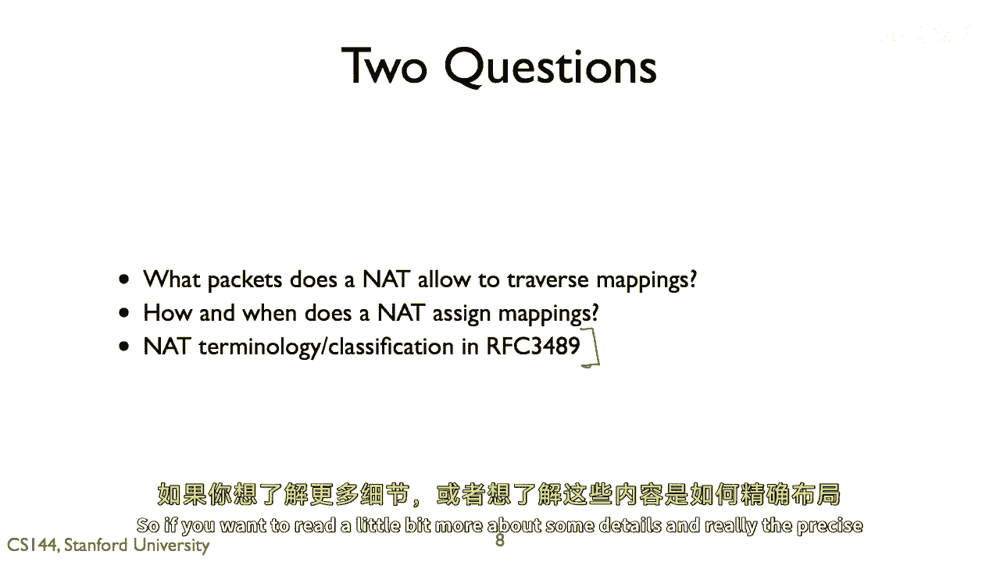
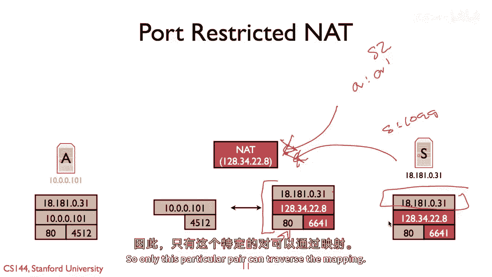
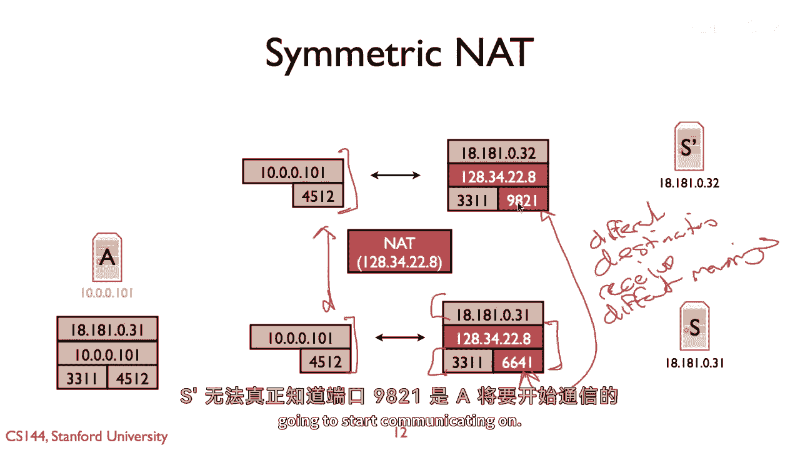
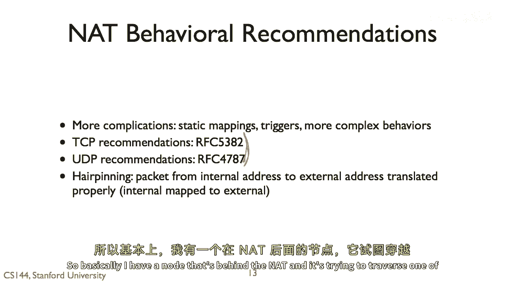

# 网络地址转换（NAT）类型详解 🧩

在本节课中，我们将学习网络地址转换（NAT）的不同类型及其工作原理。理解这些类型对于认识NAT如何影响网络通信，以及为何某些应用程序（如在线游戏或P2P应用）在NAT环境下会遇到连接问题至关重要。

## 概述

NAT的核心功能是将内部私有网络地址转换为外部公共网络地址。虽然这听起来是一个简单的抽象过程，但实际上存在多种实现方式，每种方式在映射创建、数据包过滤和地址分配上都有不同的行为规则。

上一节我们介绍了NAT的基本模型，本节中我们来看看NAT的具体分类和行为差异。

## NAT的基本工作模型

NAT的工作模型是：当内部网络节点需要与互联网上的外部节点通信时，NAT设备会在其内部建立一个映射表。这个映射表将内部IP地址和端口号关联到一个外部IP地址和端口号。

例如，当内部主机 `10.0.0.101:4512` 试图连接外部Web服务器 `18.1.1.1:80` 时，NAT会重写数据包的源地址。所有来自内部主机的TCP数据包，其源地址都会被改为NAT的外部地址（如 `128.34.22.8:6641`）。外部服务器看到的数据包就是来自这个地址。当服务器回复时，NAT会再将目的地址翻译回内部主机的地址 `10.0.0.101:4512`。

这个简单的模型引出了两个基本问题：
1.  NAT允许哪些数据包通过其建立的映射？
2.  NAT如何以及何时分配和拆除这些映射？

## NAT的主要类型（基于RFC 4787）

根据RFC 4787（原RFC 3489）的定义，NAT主要分为四种类型，它们在数据包过滤的严格程度上有所不同。

以下是四种主要NAT类型的介绍：

### 1. 全锥型NAT (Full Cone NAT) 🌐

全锥型NAT是限制最少的类型。一旦内部地址 `(X:y)` 被映射到外部地址 `(X‘:y’)`，**任何**来自外部互联网的数据包，只要其目的地址是 `(X‘:y’)`，都会被NAT转发给内部主机 `(X:y)`，无论外部数据包的源地址和源端口是什么。

**核心行为公式**：
`允许通过映射的数据包 = { 所有目的地址为 (X‘:y’) 的数据包 }`

### 2. 受限锥型NAT (Address-Restricted Cone NAT) 🔒

受限锥型NAT增加了基于源IP地址的过滤。当内部主机 `(X:y)` 与外部主机 `(A:b)` 通信并建立映射后，NAT会记录外部主机的IP地址 `A`。此后，只有源IP地址为 `A` 的数据包（目的地址为 `(X‘:y’)`）才会被允许通过映射并转发给内部主机。来自其他IP地址的数据包将被丢弃。

**核心行为公式**：
`允许通过映射的数据包 = { 目的地址为 (X‘:y’) 且 源IP地址 == A 的数据包 }`

### 3. 端口受限锥型NAT (Port-Restricted Cone NAT) 🔐

端口受限锥型NAT是限制最严格的锥型NAT。它不仅过滤源IP地址，还过滤源端口号。只有当外部数据包的源IP地址和源端口号 `(A:b)` 与内部主机之前通信过的外部主机地址完全匹配时，数据包才会被允许通过。

**核心行为公式**：
`允许通过映射的数据包 = { 目的地址为 (X‘:y’) 且 源地址 == (A:b) 的数据包 }`

### 4. 对称型NAT (Symmetric NAT) 🌀

对称型NAT的行为与前三种有本质区别。它不仅进行端口限制，其关键特性在于：**对于同一个内部地址和端口 `(X:y)`，发往不同外部目的地 `(A:b)` 的数据流，会被分配不同的外部地址端口映射 `(X‘:y’)**。

这意味着，如果内部主机 `10.0.0.101:4512` 同时与服务器 `S1 (18.1.1.1:3331)` 和服务器 `S2 (18.1.1.2:3331)` 通信，NAT会创建两个独立的映射：
-   映射1: `(10.0.0.101:4512) <-> (128.34.22.8:6641)`，用于与S1通信。
-   映射2: `(10.0.0.101:4512) <-> (128.34.22.8:9821)`，用于与S2通信。

**对称NAT带来的问题示例**：
假设一个大型多人在线游戏（MMO）需要玩家在不同服务器间切换。客户端原本通过映射端口 `6641` 与服务器S1通信。当游戏指示客户端切换到服务器S2时，对称NAT会为这个新连接创建一个全新的外部端口（如 `9821`）。服务器S2看到客户端来自端口 `9821`，而系统无法得知这个端口 `9821` 和之前的端口 `6641` 属于同一个客户端，从而导致连接断开。这种行为给需要知道客户端固定地址的应用程序带来了巨大挑战。

## NAT的复杂行为与边缘案例

除了上述主要类型，NAT设备在实际部署中还有许多复杂行为和需要处理的边缘情况。RFC 4787、5382、5508等文档试图规范NAT的行为。以下是一个典型的边缘案例：

### 发夹转换 (Hairpinning) 🔄

发夹转换发生在以下场景：两个主机（A和B）位于同一个NAT设备之后。当主机B试图通过NAT的外部映射地址来访问主机A时，就需要发夹转换。

**场景**：
-   主机A: `10.0.0.101:4512`，外部映射为 `128.34.22.8:6641`
-   主机B: `10.0.0.99:x`
-   B想访问A，发送数据包到 `128.34.22.8:6641`

**问题**：
如果NAT不做特殊处理，数据包到达NAT后，其目的地址被翻译为 `10.0.0.101:4512`，但源地址仍是B的内部地址 `10.0.0.99:x`。当A回复这个数据包时，回复包会直接通过内部交换机发给B，而不会经过NAT。B发送请求时用的是A的外部地址，但收到的回复却来自A的内部地址，这可能导致通信失败。

**解决方案（发夹转换）**：
当NAT收到来自B、目的地址为A外部映射的数据包时，它需要执行两次转换：
1.  转换目的地址：`128.34.22.8:6641` -> `10.0.0.101:4512`
2.  转换源地址：`10.0.0.99:x` -> `128.34.22.8:y` （某个外部端口）
这样，A看到的请求是来自NAT外部地址 `128.34.22.8:y`。当A回复时，数据包会发送到NAT，再由NAT转换后发送给B内部的 `10.0.0.99:x`。这个过程就像数据包在NAT处“绕了一个弯”（发夹弯），因此得名。

## 总结

本节课中我们一起学习了网络地址转换（NAT）的四种主要类型：全锥型、受限锥型、端口受限锥型和对称型。它们的主要区别在于对通过映射的数据包的过滤严格程度，以及如何为内部连接分配外部映射。我们还探讨了对称型NAT如何给应用程序带来连接性问题，以及NAT需要处理的复杂边缘情况，如发夹转换。理解这些NAT行为差异，是诊断和解决许多现代网络应用连接问题的关键基础。