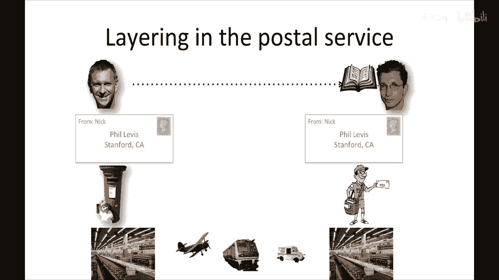
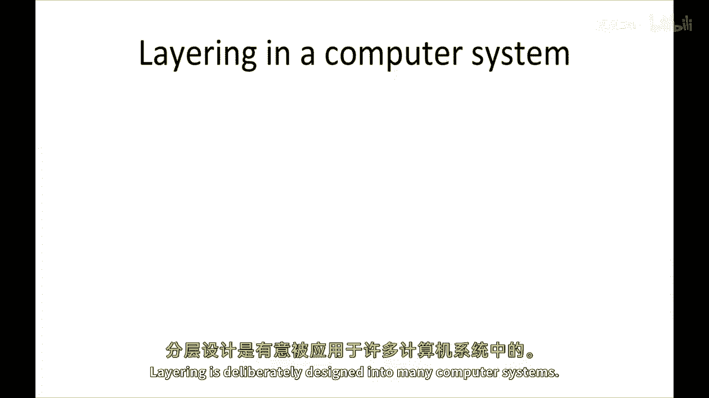
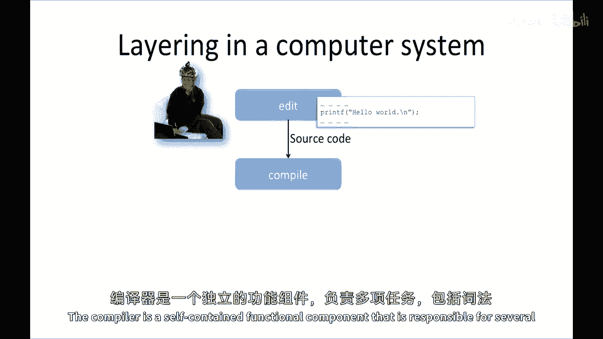
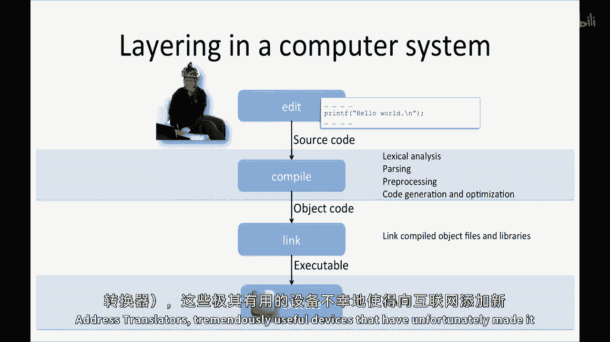
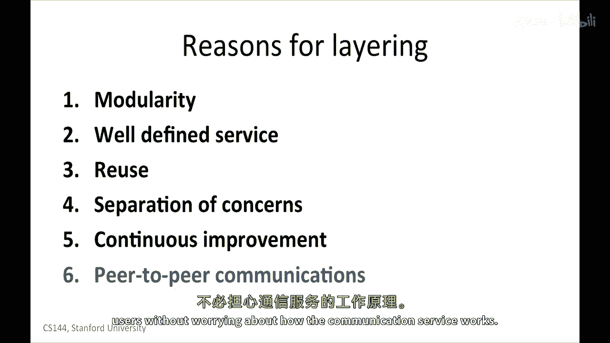

# P7：p6 1-6 Layering principle - 加加zero - BV1qotgeXE8D

你最近看到的最后几段视频提到了许多关于分层的内容，特别是在描述四层互联网模型的视频中，分层非常，非常广泛地使用，已经在网络中使用了几十年，在互联网出现之前，实际上，分层不仅是网络设计中广泛使用的原则。

而且在其他领域也广泛使用，它经常被用作许多许多类型的计算机系统的设计原则，分层有许多原因，我们在这个视频中会探索一些，我们将探索分层是什么，我们将看一些通信和计算机系统中分层的简单示例。

并将解释为什么许多系统都分层。

要么是偶然的，要么是故意的设计，让我们从分层的定义开始，分层，是我们给系统组织成多个分离的功能组件或层的名称，层是分层的，它们按顺序通信，换句话说，每个层只与直接上方和下方的层有接口。

每个层为上层提供明确的服务，使用下层提供的服务，并执行自己私有的处理，日常生活中有许多分层的例子，特别是在一个服务被故意或自然地叠加在另一个服务之上的情况下，例如，如果你在寻找飞机票。

你可能访问你的旅行代理网站，如谷歌航班，Hipmunk或Kayak，这些网站让您可以在多个航空公司中找到票务，通过与单个服务通信，您可能选择去每个航空公司的网站查询他们可用的票务。

旅行代理网站为每个航空公司提供了一个服务层，现在，它们正在抽象每个航空公司网站的细节，如果我们查看每个航空公司的底层，他们飞不同的类型的飞机，通过不同的路线，飞机负责提供服务的细节。

并为您提供简单抽象的票务，有效用于特定航班，让您从两个机场之间旅行，他们还隐藏了许多其他细节，例如，他们提供的，糟糕的食物，在许多情况下，他们有多个供应商提供食物，饮料，燃料，等等。

所有这些都在自然中被我们隐藏，消费者，这种关注点的分离允许层次结构中的每个层专注于做好自己的工作，并为上一层提供明确的服务。

另一个接近互联网的分层的例子是邮政服务，想象一下，我有一本书想要寄给菲尔，我把书放入信封，添加菲尔的地址和我的地址，然后交给奥莉芙送到邮局，邮政服务分类邮件，然后通过各种不同的方式发送，飞机，邮车。

火车，等，直到它到达靠近菲尔的邮局，邮递员将信送到菲尔，菲尔打开它，发现书在里面。

服务明显位于顶部，我不关心信从何处到我这里，它们是否通过飞机，卡车或飞艇，我也不关心书的路线，或它沿途经过的邮局数量，我不介意奥莉芙步行，骑自行车或跑步去邮局，我不关心她将信放入哪个邮局。

我想要底层为我抽象掉细节，提供我简单的服务模型，我把书放入信封，底层依次将其送到菲尔，奥莉芙不需要知道邮政服务如何发送信，她只是通过后一层通信，将信放入，菲尔只想要书，注意。

每个层只与上面的和下面的层通信，如果邮政服务部署新的列车，或开始使用不同的空运货运服务，菲尔和我不需要知道，换句话说，因为通信只是上下的，与层之间有明确的接口，我们可以独立地改进每个层随时间，例如。

如果我想要更快的保证送达，我可以将信封交给快递员，如DHL或FedEx，接口几乎相同，我只给他们信封和钱。

分层在许多计算机系统中被故意设计。

当我们编写程序时，这是编辑程序，我们创建源代码，使用一种抽象掉操作系统细节的语言，虚拟内存的工作原理，以及硬件的低级细节，好的，所以c在隐藏细节方面并不优秀，但许多其他语言，如java和python。

故意保护我们免受底层如何工作的了解，作为程序员，我们与下层进行通信，编译器通过将它交给，我们的源代码，编译器是一个自包含的功能组件，负责多个任务。

如词法分析，解析，我们的代码，预处理声明，和代码生成优化，编译器生成对象代码，哪个，然后它然后传递给线性器。

链接器将编译的对象文件和库链接在一起，它生成可执行文件，CPU，真实或虚拟，然后执行代码，如果你有编写计算机程序的经验，分层的优点相当明显，在这个例子中。

分层将编写在硬件上执行的程序的整体问题分解为模块，或功能组件，每个都有明确的角色，并为上一层提供明确的服务，它还提供了明确的关注点分离，编译器可以专注于词法分析，解析，等等。

链接器可以专注于高效地将对象拼接在一起，它们都不需要担心对方的工作，并且每个都可以得到改进，随着时间的推移和技术知识的进步，可以升级和替换，例如，我们可能会替换一个商业C编译器为gcc，或者反之亦然。

无需更改链接器或我们使用的语言，当尼克最初起草这些幻灯片时，我对他放入编译器作为分层的例子感到兴奋，这是分层优点的伟大例子，同时也展示了有时你需要打破分层的情况，尽管后果极其负面。

所以让我们以C编程语言为例，一般来说，一段C代码可以编译为几乎任何处理器，我们可以像以下语句一样编写C代码，我对代码进行加加编译，使其适用于ARM处理器和手机。

笔记本电脑或微控制器中的x86-64处理器，超现代洗碗机，这样，C代码硬件无关，因此它保持这一层，但有时我们需要让我们的C代码做一些特殊事情，只有我们的处理器能做，例如。

x86-64处理器具有许多特殊指令，微控制器没有，C允许你直接包含微妙的代码，如Linux和Windows的操作系统内核，他们用这些来实施他们的最低级别实现，C提供的层化隐藏了这些细节。

所以它不允许你直接这样做，但你必须这样做来实现你的目标，因此，操作系统内核包括汇编代码，这样做意味着代码不再层独立，为ARM编写的Linux上下文切换汇编代码仅适用于ARM，因此。

你需要为每个层编写此代码的版本，如果Linux想在新处理器上运行，开发人员需要为新处理器编写新的汇编代码，这是一个很好的例子，因为它显示了分离关注点和简化系统的层化的好处，就像编写C比汇编更容易一样。

但有时你需要打破层边界，这样做有巨大的成本，突然你不再依赖于底层，极大地限制了灵活性，所以有时你必须这样做，但只有你真正真正需要时才这样做，正如我们将看到。

今天互联网上许多实际操作挑战都源于人们打破层化，并假设他们服务接口上方和下方的东西，存在一种持续的张力，以通过跨层优化改进互联网，并导致灵活性的损失，我们将看到一个非常明确的例子，这就是所谓的NATs。

或网络地址转换器，非常有用设备，不幸的是，它们已经几乎使在互联网上添加新传输协议变得几乎不可能。

因此，总的来说，我们使用层化和计算机系统模块化的五个主要原因，它将系统分解为更小、更可管理的模块，以定义良好的服务，每个层为上层提供定义良好的服务，第三，重用上层，可以依赖他人在下层实现的所有努力。

它节省我们编写每个层的时间，每当我们构建一个新系统时，第四，关注点的分离，它使我们能够分离系统的不同部分，每一层都可以专注于自己的工作，无需担心其他层如何完成它们的工作。

唯一的通信是层与层之间的上下通信，因此，它有助于将一层的处理和数据保持在可能的本地和内部，最小化层之间的复杂交互第五，它允许每个功能的持续改进，第六个优点特定于分层通信系统，例如。

基于四层互联网模型的互联网，是其他系统之间的点对点通信，我们看到了每一层如何与其在另一个系统中的伙伴通信，使用由下层提供的交付服务，同样在邮件示例中，菲尔和我作为用户在相互通信。

