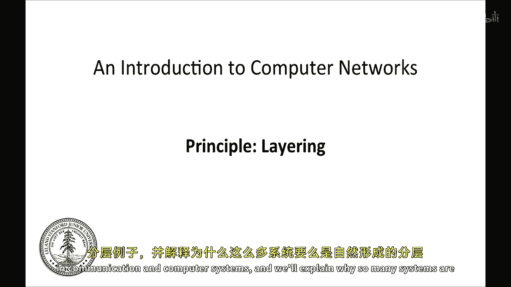
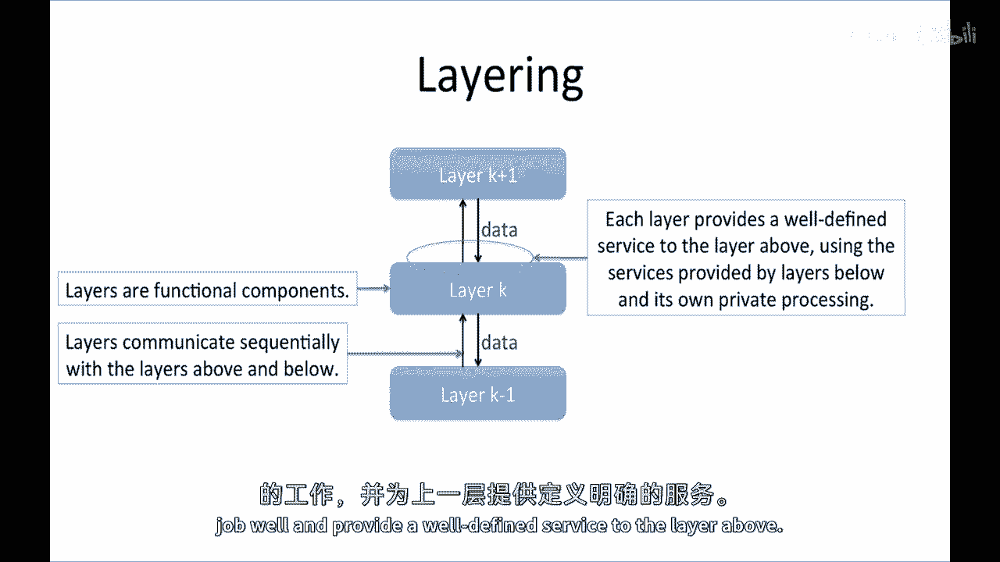
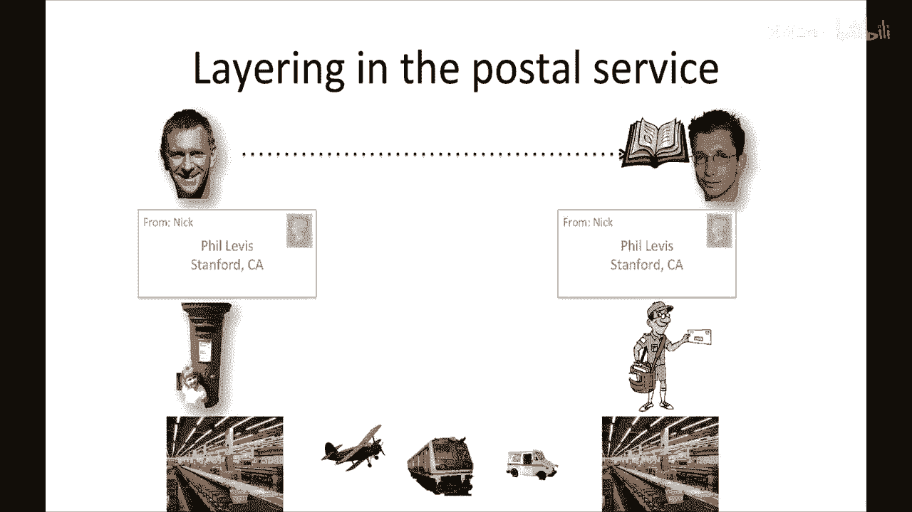
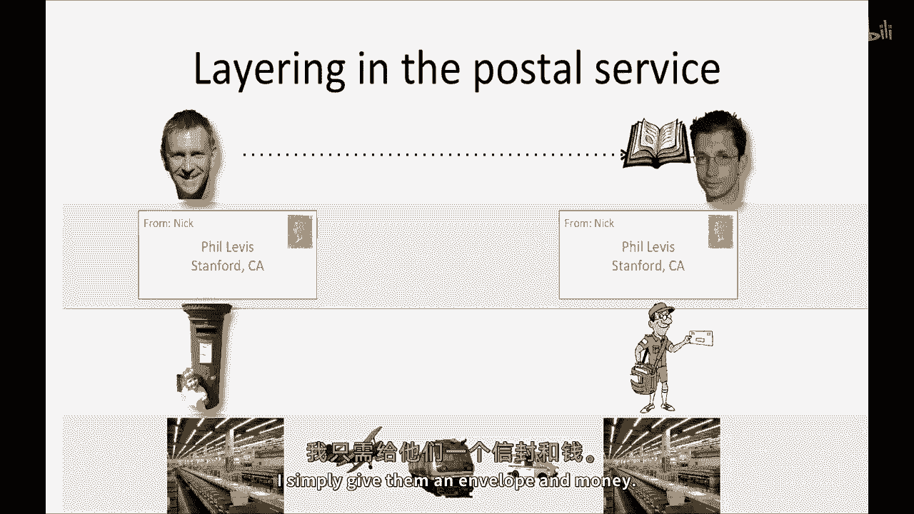
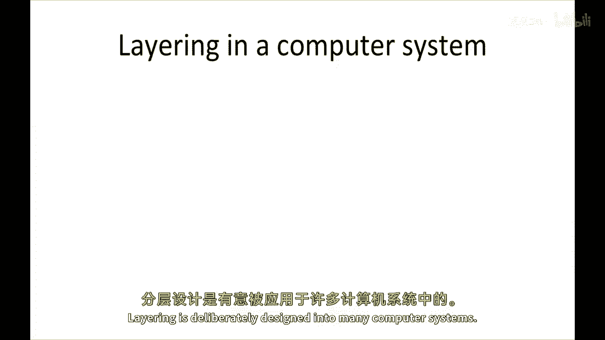
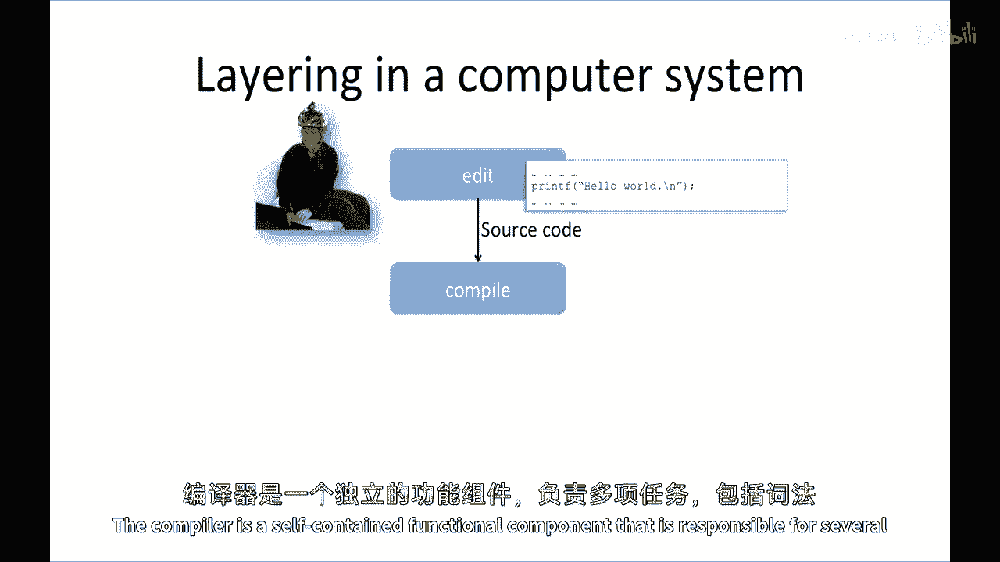
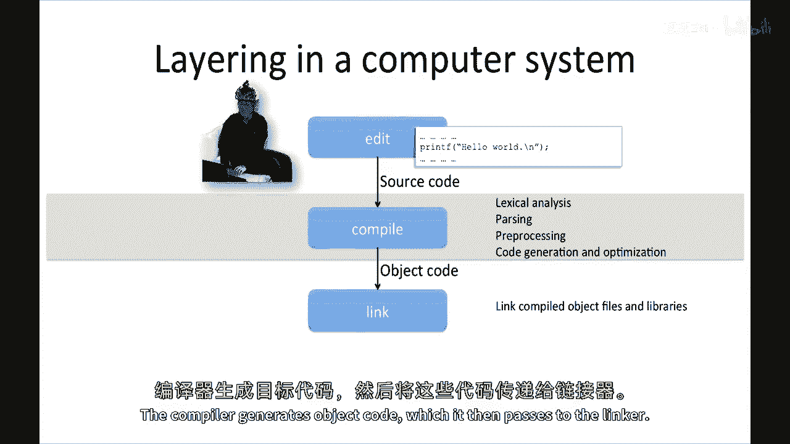
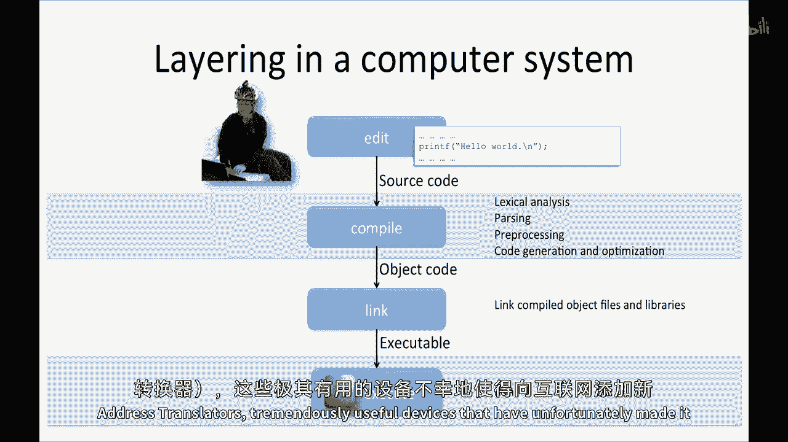
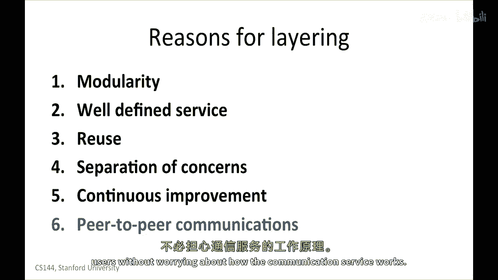

# 计算机网络原理 P7：分层原则 🏗️

在本节课中，我们将要学习计算机网络中一个核心的设计原则——分层。我们将探讨分层的定义，通过日常和计算机系统中的例子来理解其工作原理，并分析采用分层设计的诸多优点。

---

## 什么是分层？

分层，是指将系统组织成多个分离的功能组件或层的设计方法。这些层按顺序排列和通信。具体而言，每个层只与直接相邻的上层和下层有接口。它为上层提供明确的服务，同时利用下层提供的服务来完成自己的私有处理。

上一节我们介绍了分层的定义，本节中我们来看看分层在现实生活中的例子。

## 日常生活中的分层示例

分层在我们的生活中无处不在，尤其是在一个服务叠加在另一个服务之上的场景中。

以下是两个常见的例子：

*   **在线订票服务**：当你使用谷歌航班、Hipmunk或Kayak等旅行代理网站时，你实际上在使用一个服务层。这个网站为你抽象了各个航空公司网站的细节，让你能通过一个统一的界面查询多家航空公司的票务信息。而航空公司本身，又隐藏了飞机型号、航线规划、餐饮供应商等更底层的细节。
*   **邮政服务**：假设你想寄一本书给朋友。你把书放入信封，写好地址，交给邮递员。邮递员将信送到邮局，邮局通过飞机、卡车、火车等多种运输方式将信件送达目的地邮局，最后由当地的邮递员送到你朋友手中。作为寄件人，你无需关心信件具体通过何种交通工具、途经多少个中转站，你只享受“寄出-送达”这个简单的服务。

在这些例子中，每一层都专注于自己的核心任务，并为上一层提供一个清晰、简单的服务接口。这种关注点的分离，正是分层设计的精髓。

## 计算机系统中的分层

分层原则在计算机系统设计中也被广泛应用。

当我们编写一个计算机程序时，就经历了一个典型的分层处理过程。以下是这个过程的简化步骤：

1.  **编写源代码**：程序员使用高级编程语言（如Java、Python）编写代码，这些语言抽象了操作系统和硬件的底层细节。
2.  **编译**：编译器作为一个独立的功能组件，接收源代码，进行词法分析、语法解析、优化等一系列处理，最终生成目标代码。其接口是接收源代码，输出目标代码。
3.  **链接**：链接器接收编译器生成的目标代码以及所需的库文件，将它们“拼接”在一起，生成最终的可执行文件。
4.  **执行**：中央处理器（CPU）执行链接器生成的可执行文件。

分层将“在硬件上运行程序”这个复杂问题，分解为多个模块化、职责明确的步骤。每个组件（如编译器、链接器）都可以独立改进和替换，而无需改动其他层。

## 分层的优点与边界

采用分层设计主要带来以下五个优点：

*   **模块化与可管理性**：将复杂系统分解为更小、更易管理的模块。
*   **明确定义的服务**：每一层都为上层提供定义清晰的服务接口。
*   **代码复用**：上层可以复用下层已经实现的功能，无需重复造轮子。
*   **关注点分离**：每一层可以专注于自己的核心功能，无需了解其他层的具体实现。
*   **持续改进**：可以独立地对某一层进行升级、优化或替换，而不会影响整个系统。

此外，对于像互联网这样的通信系统，分层还带来了第六个关键优势：**对等通信**。通信两端同一层的实体（例如，两台电脑上的网络应用层）可以使用下层提供的服务进行直接“对话”，就像邮件例子中的寄件人和收件人一样。

然而，有时出于性能或实现特定功能的需要，开发者会选择“打破”层与层之间的边界。例如，在C语言中，虽然它旨在隐藏硬件细节，但为了利用某些处理器（如x86-64）的特殊指令或实现操作系统内核，开发者有时不得不直接编写汇编代码。这样做虽然能实现目标，却牺牲了分层带来的灵活性和可移植性——为ARM处理器编写的汇编代码无法在x86-64上运行。

> 这种“跨层优化”在互联网中也很常见，并带来了一些挑战。例如，网络地址转换（NAT）设备虽然非常有用，但它对网络层和传输层信息的处理，几乎使得在现有互联网上部署新的传输协议变得不可能。这体现了在追求优化与保持系统灵活性之间存在的持续张力。

---

本节课中我们一起学习了分层原则。我们了解了分层的定义，看到了它在日常生活和计算机系统中的具体体现，并总结了其六大优点：模块化、明确定义的服务、复用性、关注点分离、持续改进和对等通信。同时，我们也认识到，虽然分层是强大的设计工具，但有时出于实际需要，人们也会选择打破层间边界，而这往往会带来灵活性的损失。理解分层原则，是理解现代计算机网络架构的基础。