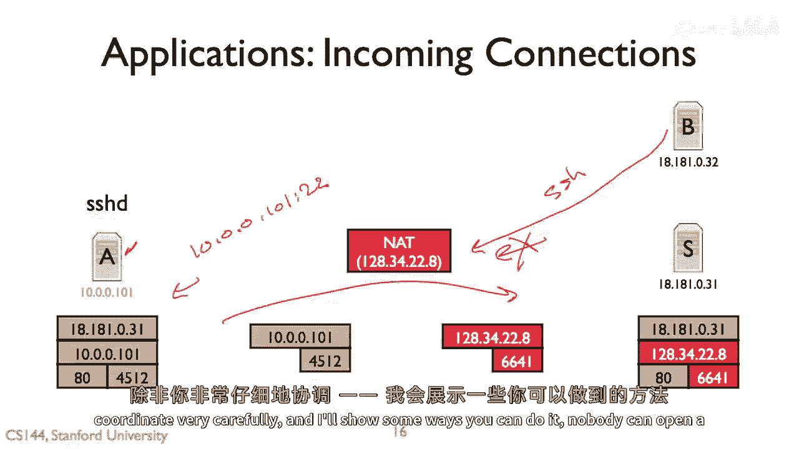
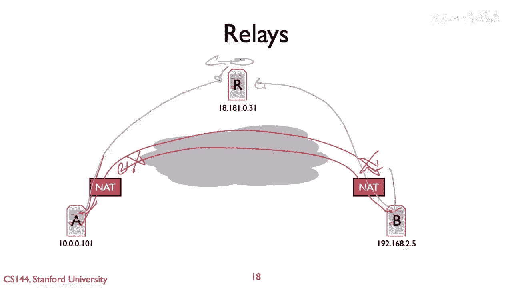
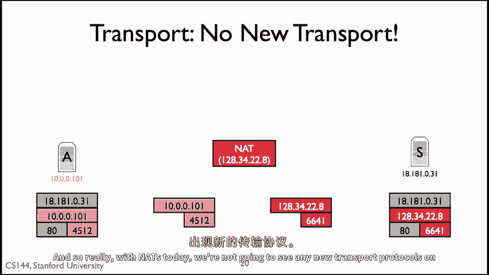
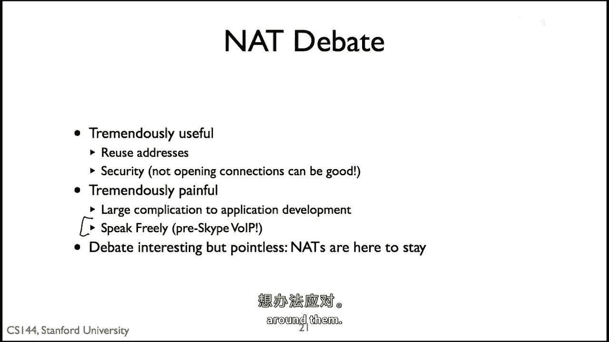

# P70：p69 5-3 NATs - Implications - 加加zero - BV1qotgeXE8D

所以网络提供了一种非常有用的服务，它们允许你将IP地址分配给许多主机，你今天就感觉到这很有用，考虑到IP地址正在变得越来越稀缺，它们还可以提供一些其他有用的服务，例如，有限的安全性和防火墙。

所以当你处于其后面时，会发生很多事情，所以本视频将探讨一些这些影响的方面，并解释现代应用如何今天尝试处理它们，因为它们是障碍。

所以网络地址翻译应用的第一个影响是，一般来说，传入连接，嗯，你不能接收连接，所以我们在谈论skype时看到了这个，当你想要向位于nat后面的人打开电话时，会发生什么，你不能直接向他们打开tcp连接。

因为没有映射，所以让我们来看看这是如何工作的，所以这里我们有一个ssh服务器，嗯，或者我们有一个位于knot后面的服务器，这是服务器a的情况，它正在运行一个在端口22上的ssh服务器，它还有，你知道。

连接到服务器，S，它在浏览网页，你知道它建立了一个web连接，这太好了，所以当主机b想要连接到主机a的ssh连接时，会发生什么，那么问题在于，它将会向这个nat发送一个包，无论发生什么，无论如何。

这个包需要翻译成去10。0。0。1，点零点零，点零点一，点零一或二十二，但是那里没有映射因为ssh是服务器，它不发送连接请求，Out，它接收连接请求，因此NAT没有映射，因此因为没有将10。0映射。

零一零一点二二b实际上无法打开SSH连接，是的，AT允许连接出，它不允许连接入，因此这对知道会发生什么的应用程序构成了各种复杂性，如果我正在运行Skype，如果我想要拨打电话。

如果其他节点位于NAT后面，我无法连接到那个节点，因此，它实际上限制了你可以部署的服务类型，而且，你需要跳过一系列障碍才能使应用程序工作，当他们坐在nats后面时。

但这是坐在nat后面对应用的第一个含义，基本上，如果你在那个方面落后，一般来说，其他节点，除非你精心协调，我会展示一些你可以这样做的方法。

你不能打开它，没有人能连接到你，所以首先提到的方法和简要讨论了这个问题，嗯，在之前的skype讲座中，有一件事叫做连接反转，所以想象一下，a坐在nat后面，而b想要连接到a，那么b不能。

因为nat没有映射，这些包会弹回，你知道，反弹，你将获得i np，因此，你可以有一些种类的反转服务，或者一些种类的约会服务，其中，a和b都连接到约会服务，当b想要向a打开连接时，它实际上发送的是。

是发送一个请求，嗨，a，我想要一个连接，会话服务可以将此请求转发给a，然后它可以打开一个连接到b，这被称为连接反转，因为b想要处理一个连接到a的连接，但是，因为它不能，因为那样就会导致相反地连接。

打开一个连接到b的连接，为了做到这一点，你需要某种会话服务，两个可以通信，但他们都打开了出站连接，会话服务，然后请求是以这种方式的，所以这就是一个例子，Skype做的其中一件事是其他方法，此外还有。

Skype也做这件事是，如果两个主机都位于nat后面，这意味着他们无法直接打开对彼此的连接，在两种情况下，连接请求将失败，在at上没有映射，一般来说，因此它失败了，所以取而代之的是你同时拥有它们。

连接到一些中继器r，然后中继器在这些两个连接之间转发流量，所以从连接r流入的数据，然后转发到连接b，从b的连接流入的数据r接收并转发到a，但是这里有一个例子，突然这不是端到端的。

我们现在在中间引入了这个额外的主机，谁知道可能会出什么问题，那么肯定，如果你在做这个，那么 uh，加密你的流量，除非你信任中继站，但是存在一种方式，如果两个主机都在后面。

并且它们仍然可以打开对其他主机的连接，确实通过第三方主机，那就是它确实有一个公开的路由B地址，那么，哪一个不是坐在NAT后面？

所以，这就是一些基本的事情，你可以做，比如在TCP级别等，结果发现，如果你真的需要打开直接的连接，有，你可以做更激进和复杂的事情，其中一种被称为NAT打洞，所以，这里的基本想法是我们有两个客户端。

它们坐在身后，客户端A和客户端B，并且它们想要打开彼此之间的直接连接，或者它们之间直接建立连接，它们不想通过外部的约会服务或中继，所以它们做的，它们首先与一些外部服务器交谈。

以确定您想要服务器在这里发送什么，以确定他们的外部地址和端口，客户端B说啊哈，如果我向您发送数据包，说从UDP端口，嗯，六千，然后服务器将向网格报告，啊哈，不错，你正在发送的这些包。

我看到它们来自76181172，嗯，端口，嗯，991，所以客户端b知道10。1。1。9端口6000，对外部世界显示为761817172，991，a也做了同样的事情，所以它会发现你知道，这是，嗯。

数据包看起来像三四到二十二，嗯八，嗯端口，三十千五百。

现在就在这样的情况下说，客户端a和b都已经从内部地址端口发送了数据包，对到这个x到外部IP地址和端口，并且NATs创建了映射，所以它们内部为这个内部地址端口创建了映射，让我们假设它们是全锥形NATs。

只是为了简化起见，这意味着这些映射现在已在NAT上活跃，所以现在有可能，如果与服务器通信，客户端b可以问服务器嘿，基于那个，客户端a的公共IP地址和端口是多少，服务器可以说，哦 well，它是一二八。

三四二八八，你知道，端口三十千五啊，然后客户端b可以发送流量到那个，嗯，公共IP地址和端口对，它可以穿越与服务器类似的映射a，嘿，b的公共IP地址在端口对是多少。

然后发送流量到七十六一八一七二零端口九十九十一，并让它穿越映射去客户端b，这假设那些映射是全锥形的，这些是全锥形NATs，让我们说它们不是全锥形NATs well，结果你会发现。

服务器仍然可以做一些把戏，让客户端告诉客户端b再次，其他客户端的公共IP地址和端口对，然后客户端可以尝试同时向彼此发送流量，所以客户端b将开始向一二八三四发送流量，二八端口，从其端口三千五百。

同时发送六千，客户端a将开始向七十六一八发送流量，十七二十端口，从其IP地址和端口九十九十一，如果我们说有一个受限的锥形NAT，甚至是端口受限的at当那些数据包，那些出站数据包穿越NAT时。

那么就会设置一个映射，它将说，啊哈，我看到您的客户正在向这个外部IP地址和端口发送流量，我为您创建了一个映射，事情翻译得正确，同样，这不对，当客户端B发送流量时，它将这样做，因此。

知道其他侧的外部地址和端口，他们可以迫使网络设置一个映射，所以有一个问题是否存在一种NAT或什么样的NAT，这对这个模型不工作吗，在哪里客户端a，并且客户端b同时向外部IP地址和端口发送流量。

这些流量映射到每个这些客户端的内部IP地址和端口，这些是由与服务器通信 earlier 确定的，所以给我这些不同种类的NAT，是否存在一种NAT对于这将不工作，所以结果表明这将适用于全锥形NAT。

因为映射将工作得很好，即使源IP地址和端口不同，也会工作，嗯，受限的锥形NATs，因为再次我们设置了这些映射，这将包括其他NATum的外部IP地址，它将适用于端口受限的NATs，因为再次。

这些数据包将来自正确的UDP端口，一类它不工作的是，是对称的，不是因为当这些客户与服务器交谈以确定他们的IP地址和端口时，他们的外部地址在开始与另一个NAT交谈时映射不会保持。

所以只是因为服务器看到了端口三十千五，当客户端A然后试图发送流量到，嗯，右侧的NAT，这个NAT不会去重用端口三十千五，它将分配一个新的外部端口，所以不会工作。

所以这就是为什么对称结在今天的互联网上真的受到贬低，所以我们讨论了nats对应用的影响，以及他们如何设置映射，或者使用中继或相遇服务，所以还有一个，甚至更深的结的暗示，这是运输，所以如果你想一下。

一个nat要设置一个映射，它需要了解传输协议是什么，它需要了解传输协议的报头，所以例如，当它设置UDP或TCP映射时，结扣需要了解这是TCP分段，这是UDP分段，这是分段中的端口号，这是我需要重写的。

如何计算校验和，没有那个它就做不了，所以如果你部署，如果你说，编写一个新的传输协议，它使用传输协议标识符在IP包中，嗯，然后你试图让它遍历那个，现在我们会丢弃它，它不知道数据包格式，因此。

今天在互联网上你不能真正部署一个新的传输协议，有点像鸡和蛋的问题，在哪里开发那个软件和维护非软件，他们不会添加对新传输协议的支持，直到它非常非常流行，但它不会变得非常流行，直到它在NAT之间工作，因此。

有一种这样的辩论和哲学讨论，对吧，所以早期的，嗯，你知道，大约在两千零年代中期，NATs意味着什么，意味着我们基本上被困在TCP，UDP和ICMP上，有权让应用程序在互联网上大规模工作。

它必须使用这三种传输协议之一，因此，实际上，当那是今天的情况，我们在互联网上不会看到任何新的传输协议，因此，这就导致了一个非常大的哲学辩论。

尤其是在两千年代初期NAT开始在全球部署时，特别是在一方面，燕子极其有用，你可以重用地址，有安全保障，你知道，如果我坐在广告后面，恰巧有一些易受攻击的公开端口，比如在我的Linux机器上。

或者在我的Windows机器上，因为没有成功映射，来自互联网更广泛区域的攻击者，无法攻破我，对吧，它 sort of 给予这个非常简单的，我的意思是，非常锤子，但是但是 非常有效，仅仅对于最终用户，嗯。

安全对吧，不打开连接可能是好的，但是也有巨大的，他们也是极其痛苦的，尤其是在开始表现出标准行为之前，开发应用程序真的很难想象，如果有人打电话给你说嘿，你的应用程序不工作，你知道，有时候连接中断。

而且可能是这样，这是他们的客户从一个服务器过渡到另一个服务器的时候，并且NAT正在使用对称的，是一个对称的NAT，使得端口被重新分配，连接断开得非常难调试，嗯，因此，一个例子，有一个真的很，著名的叫做。

请随意说话，的例子，那就是在skype出现之前的语音过载，IP嗯，基本上这个人说嘿，嗯，我将停止开发，自由发言，因为你知道在傻子面前这行不通，而且没有任何方法能让他们接受。

所以在人们发现所有打拳的套路之前，而且在这种行为成为标准到可以做到之前，所以存在着一场巨大的哲学辩论，现在，这有好处也有坏处，他们破坏了从头到尾的论证，但实际上，这真的很，非常有趣。

但是结果却变得毫无意义，我的意思是，燕子们来了就不会走了，他们已经部署，他们将永远部署，他们的优点通常被认为超过了缺点，人们部署他们，而且他们希望他们能工作，而且你必须适应他们。

但这意味着什么，就是我们历史上谈论互联网时，把它看作是一种狭窄的浪费，只有一个统一的协议，然后允许你有许多传输协议在上面，许多链接协议在下面，但nat已经改变了这一点，所以实际上，从实用的角度来看。

新的沙漏不仅包括层三，但是，我们也有第四级，由于实际考虑，我们不会看到新的传输协议被实施或部署，你可以在udp上构建协议，而且这就是今天通常做的事情，gdp只提供了一个漂亮的数据包服务。

而不是在层三使用传输标识符，你在层四使用端口，嗯，但这就是现在的世界，新的互联网沙漏，由于网络地址转换是ip，然后与icp，tcp和udp。

