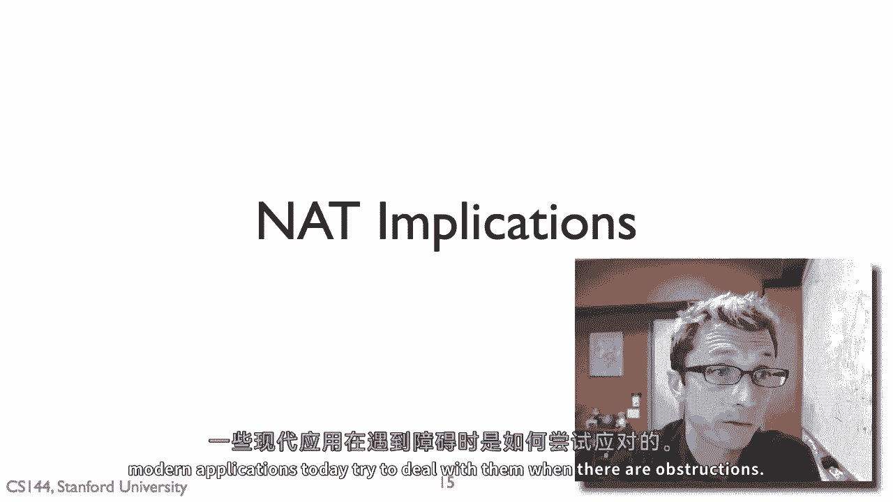
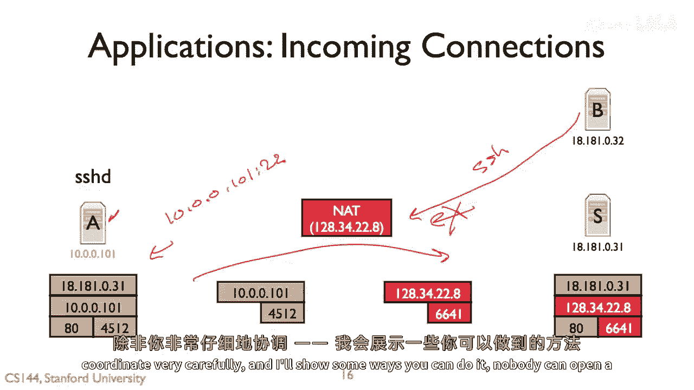
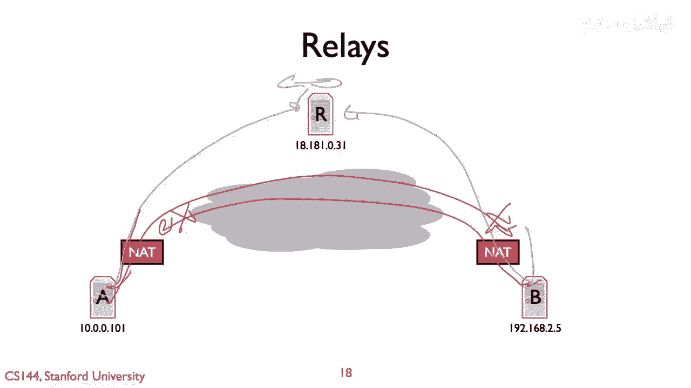
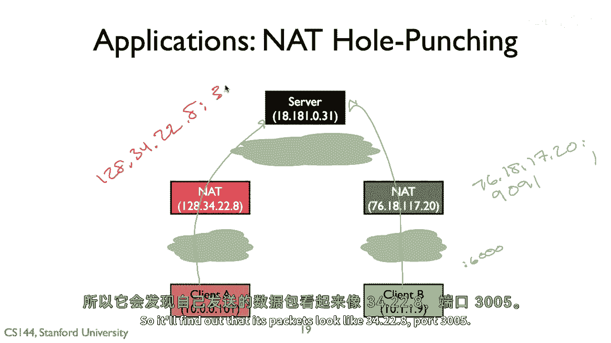
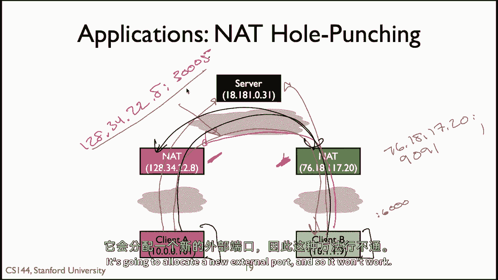
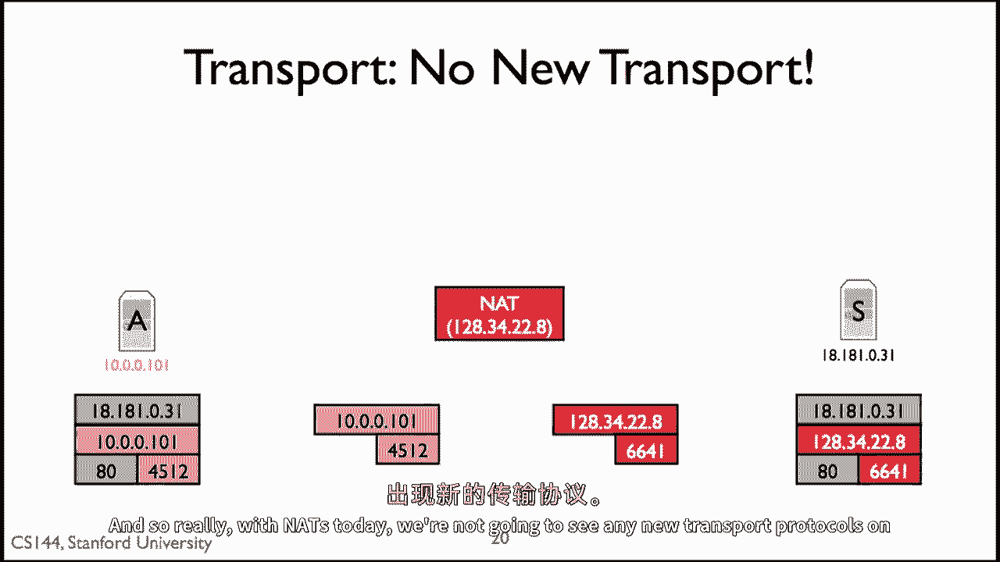
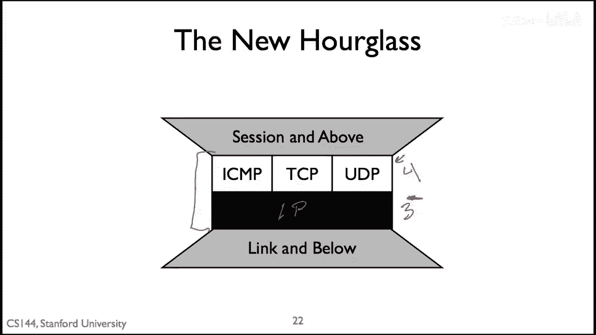

# 网络课程 P70：NAT 的影响与应用应对 🧩



在本节课中，我们将探讨网络地址转换（NAT）对现代网络应用产生的具体影响，并了解应用程序为克服这些障碍而采用的各种技术。我们将从NAT如何限制连接建立开始，逐步深入到连接反转、中继、NAT打洞等高级技术，最后讨论NAT对网络协议栈发展的深远影响。

---

## NAT 对连接建立的影响 🔒

上一节我们介绍了NAT的基本工作原理，本节中我们来看看NAT带来的第一个主要影响：**限制传入连接**。位于NAT后的主机通常无法直接接收来自外部网络的连接请求。


其核心原因在于NAT的映射机制。NAT仅在内部主机主动发起**出站连接**时，才会在NAT设备上创建临时的 `(内部IP:端口, 外部IP:端口)` 映射。对于希望从外部接入的服务（如SSH服务器），由于没有预先建立的映射，外部发起的连接数据包无法被正确转发到内部主机。



例如，假设主机A（IP: `10.0.0.1`）位于NAT后，并运行着SSH服务（端口22）。当外部主机B试图连接A时，数据包会发送到NAT的公网IP和端口。但由于A并未主动向外发起SSH连接，NAT上没有对应的映射条目，因此这个连接请求会被丢弃。**公式化描述为：**
`外部连接请求 -> NAT (无映射) -> 丢弃`

这导致了一个直接后果：位于NAT后的设备难以直接提供公共服务。对于像Skype这样的点对点应用，如果通话双方都在NAT后，则无法直接建立连接。

---

## 应对策略：连接反转与中继 🔄

为了解决无法直接建立连接的问题，应用程序发展出了多种应对策略。以下是两种核心方法：

### 1. 连接反转
当主机A在NAT后，而主机B想连接A时，由于B无法直接发起连接，可以采用“反转”思路。



*   **工作原理**：A和B都先与一个双方都能访问的**会合服务器**建立出站连接。当B想连接A时，它通过会合服务器向A发送一个请求。A收到请求后，**主动向B发起一个出站连接**。由于NAT允许出站连接，这个连接得以建立。
*   **关键点**：连接方向被“反转”了。原本是B连A，实际变成了A连B。

### 2. 中继转发
如果通信双方都位于NAT之后，连接反转也将失效，因为双方都无法接收对方的入站连接。此时需要引入**中继服务器**。

*   **工作原理**：主机A和B分别与具有公网IP的中继服务器R建立连接。A想发送数据给B时，先将数据发给R，再由R转发给B。反之亦然。
*   **影响**：这种方式破坏了互联网的**端到端原则**，引入了额外的中间节点，可能带来延迟、单点故障和隐私顾虑（因此常需配合加密使用）。

---



## 高级技术：NAT打洞 🕳️

连接反转和中继都需要第三方服务器持续参与转发，并非真正的点对点直连。NAT打洞技术则旨在帮助两个都在NAT后的主机建立**直接的点对点连接**。


其核心步骤利用了一个事实：某些类型的NAT（如全锥型NAT）在创建映射后，允许**任何外部主机**使用该映射向内部主机发送数据。

以下是NAT打洞的基本流程：

1.  **地址发现**：客户端A和B分别与一个公网服务器S通信。S记录下每个客户端**经过NAT转换后的公网IP和端口**（即A_NAT, B_NAT）。
2.  **信息交换**：服务器S将B的公网地址（B_NAT）告诉A，同时将A的公网地址（A_NAT）告诉B。
3.  **同时发起连接**：A和B**同时**向对方的公网地址（A_NAT, B_NAT）发送UDP数据包。对于全锥型、受限锥型或端口受限锥型NAT，这个向外发送数据包的动作会在各自的NAT上“打”出一个“洞”，即创建或激活一个允许来自对方地址的数据包进入的映射。
4.  **直连建立**：一旦“洞”被打通，后续数据包就可以直接在A和B之间传输，无需再经过服务器S。

**代码逻辑示意（伪代码）：**
```python
# 客户端A
my_private_addr = (‘10.0.0.1‘, 6000)
# 1. 联系服务器，获得自己的公网映射地址 A_NAT
a_nat = server.register(my_private_addr)
# 2. 从服务器获取客户端B的公网地址 B_NAT
b_nat = server.get_peer_address(‘B‘)
# 3. 同时向B_NAT发送数据包“打洞”
sendto(‘ping‘, b_nat)
# 4. (等待并接收来自B的数据包，直连建立)
```


**技术限制**：NAT打洞对NAT类型敏感。它在全锥型、受限锥型和端口受限锥型NAT上有效，但在**对称型NAT**上通常会失败。因为对称型NAT为每个不同的外部目的地分配不同的端口映射，导致A与服务器S通信时使用的端口，和A与B通信时使用的端口不同，B无法使用从S获得的地址连接到A。



---

## NAT 对网络协议发展的深远影响 🌉

除了影响具体应用，NAT还对互联网的基础架构产生了深刻的哲学性影响。

### 1. 传输协议层的“锁定”
NAT设备需要理解并修改传输层协议（如TCP、UDP）的头部信息（如端口号、校验和），才能正确地进行地址转换。这意味着：

*   **现状**：如果你发明了一个新的传输层协议（使用新的IP协议号），现有的NAT设备将无法识别和正确处理它，导致数据包被丢弃。
*   **后果**：这造成了“先有鸡还是先有蛋”的困境。新协议无法流行，因为无法穿越广泛部署的NAT；而NAT厂商没有动力支持新协议，除非它已经流行。**结果就是，互联网被“锁定”在了TCP、UDP和ICMP这几种传输协议上。**



### 2. 互联网“沙漏模型”的变形
传统的互联网被形容为一个“沙漏”，IP层是狭窄的腰部，其下可以承载各种链路技术，其上可以运行各种传输协议。NAT的出现改变了这一模型。


如今，由于NAT的存在，**传输层（TCP/UDP）也成为了沙漏腰部的一部分**。新的应用若想在全球互联网上工作，几乎必须基于TCP或UDP来构建。这也是为什么现代许多新协议（如QUIC）选择在UDP之上实现，而不是创建全新的传输层协议。

### 3. 安全与便利的权衡
NAT带来了一些非本意的“安全好处”：它默认屏蔽了所有未被请求的入站连接，为内部网络提供了一道简单的防火墙。这保护了终端用户设备上许多未打补丁的漏洞。然而，这种安全是粗粒度的，并且以牺牲端到端连接能力和增加应用开发复杂性为代价。

---

## 总结 📝


本节课中我们一起学习了NAT技术对网络应用产生的多方面影响及应对策略：

1.  **连接限制**：NAT默认阻止传入连接，影响了点对点应用的直接通信。
2.  **应对技术**：应用程序采用**连接反转**、**中继服务器**和**NAT打洞**等技术来绕过限制，建立通信。
3.  **协议锁定**：NAT导致新的传输层协议难以部署，将互联网应用“锁定”在TCP和UDP之上。
4.  **架构影响**：NAT改变了互联网的“沙漏模型”，使传输层成为新的“狭窄腰部”，并引发了关于网络灵活性、安全性与便利性的长期讨论。



尽管NAT破坏了经典的端到端互联网模型，并带来了诸多挑战，但由于其在地址节约和简易安全方面的巨大价值，它已成为现代网络中不可或缺的一部分。理解和适应NAT环境，是开发现代网络应用的必备知识。