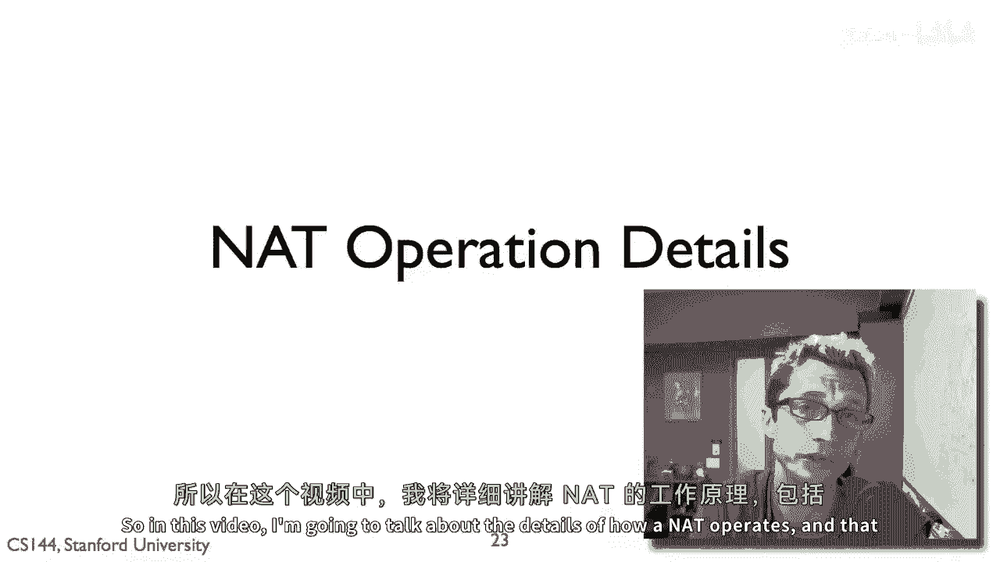
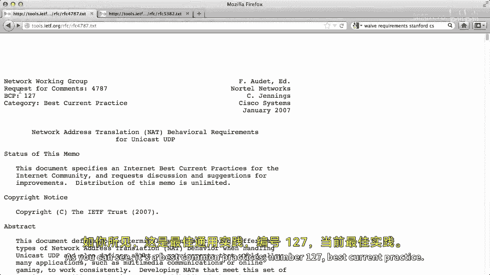
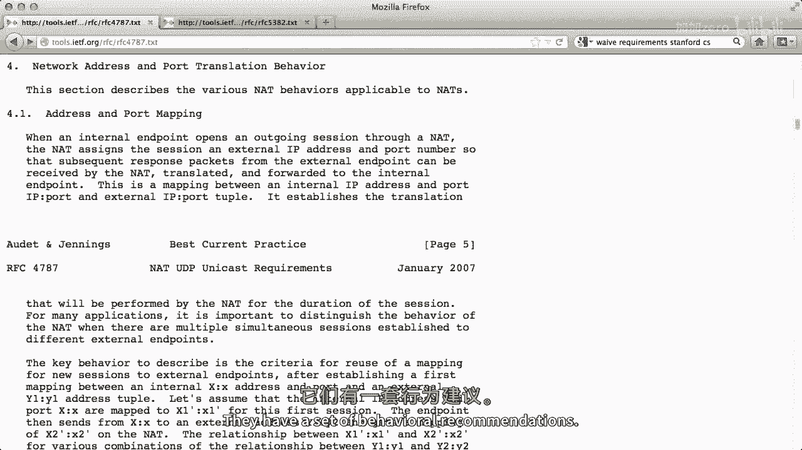
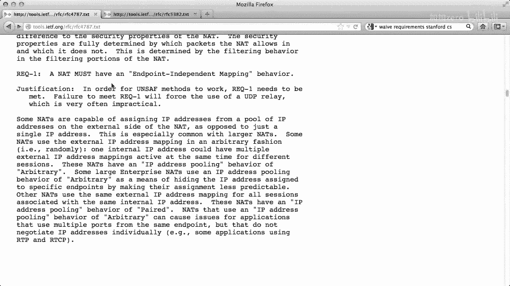
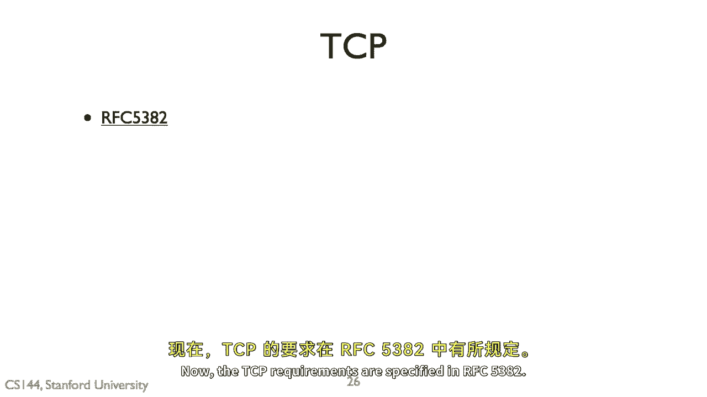
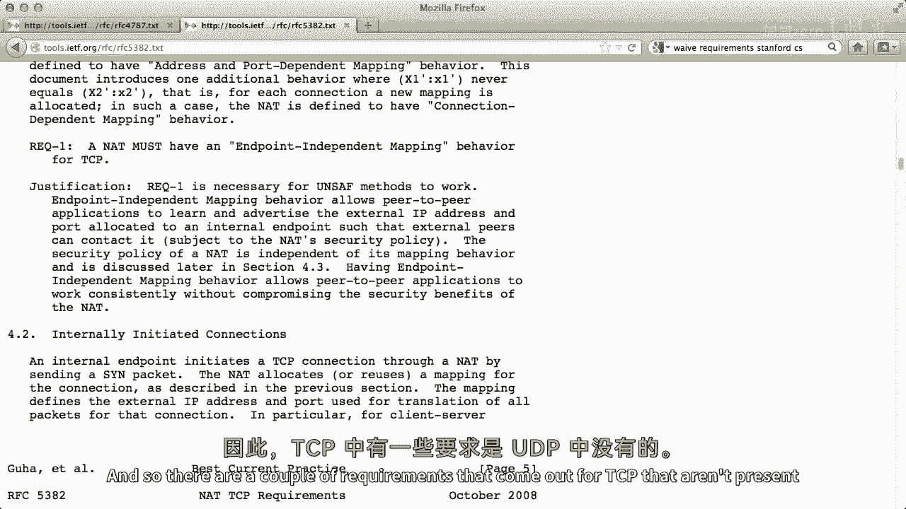
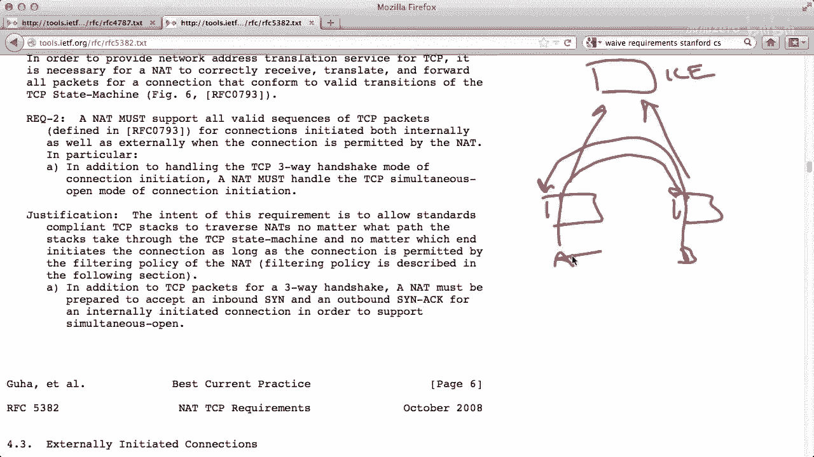
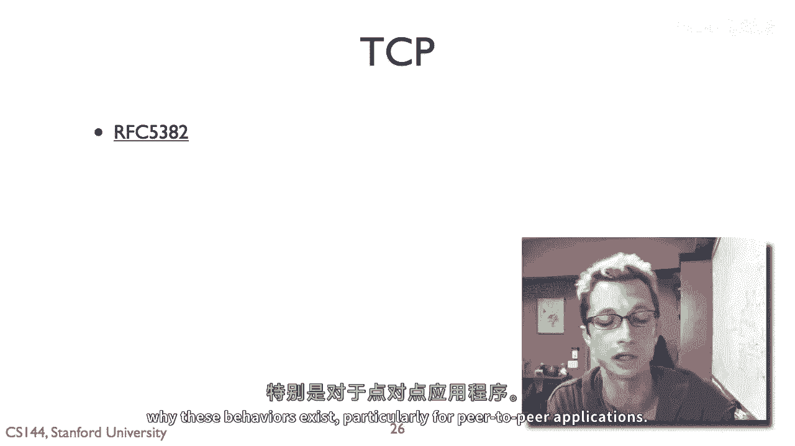

# P71：p70 5-4 Nats - Operation - 加加zero - BV1qotgeXE8D

"所以在这个视频中，我要谈谈一个如何运作的细节"，"那就是关于如何处理不行为的规则和建议。"。

" both incoming and outgoing connections" 的中文翻译是 " both incoming and outgoing links" 或 " both incoming and outgoing connections"。

"可能穿越的包"，以及当它回应时如何。

"当它不演戏时"，作为一个本地人，我想提醒你，在网络地址转换盒子中设置映射是非常重要的。"从内部IP地址端口对到外部IP地址端口对"，"所以，这就是我们的一个nat，其外部IP地址是1"，二十八，三十。

四，二十，二，八，内部接口也是如此，外部接口也是如此，对外部世界，现在看起来像一百二十八，三十四，二十，二点八，内部世界还有一个IP地址，说十点零点零，零点一。

现在通过发送TCP U连接打开来托管一个罐子，向服务器S发送消息到端口八十，网络将观察到会将主机A的内部地址和端口10001翻译为外部地址，零一四五一二到外部地址，报告一二八三四二二八。

并且它将分配一个外部端口，在这种情况下，对于这个映射，我们将使用6641号端口，我会设置这个映射，所以，你可以问一个问题，那就是如果一些任意的包进入nat，应该怎么回应，现在。

如果nat开始接收来自128的tcp包，34，嗯，22到8，嗯，抱歉，包，两个一，二十八，三十四，二十二，端口，六十六，四十一，它应该将它们翻译，这就是映射所说的。

现在基于它是否是全锥形可能会有对该的限制，端口受限，等等，嗯，但一般来说，匹配此包的包将穿越，但如果它接收到一个目的地为其外部地址的包，所以一、二、八、三、四，二十二、八，和端口，一些随机的。

某个随机的端口的，嗯，五五千，嗯、一、二、七，那应该怎么做最好，最终，网络本身也是一个ip设备，并且事实是，它的一些端口恰巧导致翻译，这与它如何响应的事实是独立的，所以想象一下，如果没有设置端口映射。

没有内部节点到nat，没有人打开任何连接，如果你尝试连接到它，它会如何响应，在这种情况下，你将会像往常一样响应，嗯，所以对于这个特定情况，它可能会建立连接，拒绝，就像重置包，嗯，或者你知道。

取决于什么消息，什么包进来，它可能发送一个icmp错误，并且，所以一般来说，at行为像一个正常的ip设备或ip路由器，除了当包到达内部的，外部接口，具有映射时，或者当包从内部接口穿越并生成映射时。

所以除了那个，如果你想象如果没有这样或那样的节点在它后面，那么它就行为像一个正常的ip设备，所以，例如，在许多MATs，如你家路由器，实际上，在端口八十上运行Web服务器。

所以如果你有一个家庭无线路由器，它在端口八十上运行Web服务器，这允许你配置它，有时它不是四个，而是其他贫穷的，但想法是nat本身可以响应连接，无论它们是为Web管理界面还是其他完全合理的服务，嗯。

所以当我们有，一个当我们有in时出现的问题，那就是导致你设置这些映射的原因，嗯，所以你可以想象，在udp的情况下，这通常是当一个包来自内部接口时，我将其发送到外部，然后设置一个映射。

映射将内部IP地址端口映射到外部IP地址端口，当然，nat需要小心这些分配，以确保它不重复使用，嗯，tcp的情况，如果你看到tcp sin，嗯，那么你会发现设置一个映射，或者你知道你可以稍微更，嗯。

稍微更稍微更宽松，并说看，如果我们看到任何tcp包来自内部，那么我们假设应该有一个映射，并且只是设置映射，当然有一个问题，这就是你创建映射的方式，你何时拆除它们，对于udp，因为没有控制序列。

这些通常在超时时间，现在将被拆除在超时时间，你需要回收它们，否则你可能用完外部端口，对于tcp，如果你看到正确的fin，嗯，act交换来拆除连接，那么你知道你可以垃圾，收集连接状态，内部。

映射可以更快地拆除，当然，这里有一些边缘情况，你需要确保它实际上被丢弃，你想要确保你没有进入一些状态，在那里有可能丢失数据，因此，它们发现rfcs已经详细描述了，nat应该如何行为。

并且这些行为建议在，你知道几乎十年的经验使用这些设备后出现，这些行为建议已经出来，你知道几乎十年，那么他们如何可能通过奇怪的行为干扰应用程序，所以有一些早期的文档试图基于，你知道。

有人实际上去了colin jennings，基本上去fry's电子设备和买了，你知道，两台不同型号的nat盒子，仅仅测量并看到了它们做了什么，它们做了各种各样的疯狂事情，基于这个和基于应用程序行为。

itf提出了一对建议，这是给你的一个，另一个是给传输速度设定的，你知道其他为其他行为建议，关于应该如何行为，所以UDP在RFC四千七百八十七中被指定。

所以这里是，RFC四千七百八十七，如你所见，它是最佳通用实践，第一百二十七项最佳当前实践。

嗯，总的来说。

嗯，这些文档术语匮乏。

嗯，它们有一套行为推荐。

所以，在这里，例如，是推荐一，是要求一，并且那必须有一个终点独立的映射行为，所以，这意味着如果我们回到描述自然的术语中，这从分类术语的角度所表达的实质是，如果你仔细阅读文档的细节。

你会发现"nats"不能是对称的。"因为在该应用中，UDP协议之间的映射创建"，"内部IP地址端口之间"，"并且外部IP地址端口必须独立于终点是什么"，"这不可能是一个对称的网络"。

"对于每个外部IP地址和端口，它都设置一个新的映射"，"由于所有导致应用程序崩溃的方式"，所以，这里是第二个，一个推荐，这里有一个推荐，那就是nats应该有一个IP地址，配对的池化行为，嗯。

所以这是为那些实际上有多个外部地址的nats设计的，并且想法是嘿，如果我们可以，那么可以，嗯，Iudp，来自同一内部IP地址的包应该看起来具有相同的外部IP地址。

所以这里是第三个，嗯，这里是第三个，嗯，建议，嗯，要求嗯，这涉及到端口如何分配，所以事实证明，端口零到十二十三是被视为系统服务的，所以这些是只有管理员或超级用户才能绑定的端口，嗯，在Unix系统中。

基本上可以绑定到root，这就是你为什么看到像http smtp这样的东西，它们所有这些都在这些低端口号上运行，与像bittorrent或skype这样的应用程序内容不同，这些运行在高端口号上。

这就是这个历史遗迹，但是，基于这个，应用程序已经做出了一些假设，所以，这个要求的意思是要 kind of，所以我们不破坏那些，如果内部端口在零到1023之间，那么外部端口应该在零到1023之间。

相反的也是，如果它不是，如果它在10246，65535，那么外部应该介于65535之间，所以我不打算去检查所有这些要求，实际上，很方便的是，如果你仔细阅读这些文档。

这真能给你带来所有各种应用期望的感觉吗，有这些还是挺好的，有这些理由，甚至解释得像说嘿，有的应用程序假设这些或协议假设这些，因此，nat需要这样做，这样它就不破坏这些应用程序，它给你带来这种美好的感觉。

嗯，互联网上有一些有趣的协议方法发生，现在TCP的要求已经在RFC五十三八十二中指定。

所以我们可以看到第一个，嗯，TCP NAP行为的要求与UDP非常相似，这种端点无关的映射对称NATs真的很差，它们破坏了各种各样的东西，所以永远不要构建对称的，那不是要求第一号，但与UDP不同。

TCP有连接，因此有连接的设置，"因此，TCP有一些要求产生。"。

"那些不在udp中存在的"。

例如，"这个有点意思"，"是否是第二个要求"，"一个网络设备必须支持所有有效的TCP数据包序列，以建立连接。"，当网络连接被允许时，内部以及外部都将启动此过程。"这里的基本观点是这个"。

"这个子点a不是必须同时处理tcp连接的开启"，所以这就回到了这个问题，我们讨论了NAT打洞，在哪些情况下两个节点后面是NAT，假设是a和b，他们想要相互建立连接，他们想要通过一个NAT建立连接。

所以他们会与一些外部服务器交谈，并提供减法服务的服务器，比如ice，这些基本上允许他们做一些查询响应，来确定他们后面是什么类型的NAT，也来确定外部IP地址和端口，与它们的本地IP地址和端口相关联。

因此基于这个，a和b都可以确定，给他们的内部地址和端口，在端口上的外部地址是什么，他们通过会晤服务某种方式交换这个信息，然后a和b同时尝试向对方打开TCP连接，现在可能是，你知道，这些连接。

如果这些连接存在或者这个状态存在，但是基本点在于，b完全有可能发送一个sin，这设置起状态，并且sin在a还没有设置其翻译状态之前就到达了，所以sin不会穿越。

然而状态现在存在于b上，所以b现在有一个翻译条目，现在a然后打开一个回连，并且它的sin穿越了这个翻译，现在a可以打开一个连接在b上，但是问题是，这是一个同时打开，B已经发送一个罪过，在TCP状态图中。

这个罪过是突出的，它已经发送一个罪过，这是同时打开，当A和B同时向对方发送罪过时，对于A和B想要直接相互打开连接的P2P应用，A NAT允许这种TCP打开非常重要，不仅仅是这样，我们不支持同时打开。

因此，我们不允许这个罪过穿越，因为那是一个如果你有映射的入站罪，入站罪必须能够遍历，这就是这里要求二的意思，但更一般地说，它正在说看TCP有一个状态图，并且你应该能够遍历状态图来打开连接。

以你想要的任何方式，并且NAT不应该限制这一点，那就是NAT不应该在某种方式限制TCP实现选项的极限。

所以这里一个要求三是他们应该有一个端点无关的过滤行为，所以这基本上就是回到前面讨论的术语，在NAT的分类中，这意味着一个完整的锥形NAT，那就是建议在TCP方面，NAT应该是全锥形的。

再次像UDP的建议，这些行为建议的每个，每个都有其理由，因此，阅读这些真的很有启发性，很照亮，应用类型是什么，什么样的边缘情况可以使NAT破裂，你可以看到许多都与对等到对等有关，特别是语音过载。

IP地址，在所有那些Nats工作良好的应用中，当你仅仅有一个客户端在AT后面，打开连接到服务器的连接时，但是，任何与Nats后端的东西想要相互打开连接的应用程序，你需要有智能的行为，他们没有。

否则，你可以打破这些应用程序，所以，这个要求对于Nats来说是一种有趣的边缘情况，嗯，那是什么使得一个nat如此特殊，至少需要六秒钟才能有效响应未请求的入站sin，所以这里是，这里是案例。

为什么再次强调这一点的重要性，让我们来看这个例子，我们有a和b，它们都位于nat后面，并且它们正在尝试同时打开，现在发现a在b之前成功地同时打开了它，以至于sin到达b尝试打开之前，嗯，它是嗯。

它与一个的连接，所以如果蜜蜂没有以这种方式回应，嗯，对这种请求和无所请求的入站信号的反应，说，你知道，抱歉，连接被拒绝，或者是你说，我明白了，p或者它想做什么，根据情况而定。

然后问题在于这可能会回到nat，并导致他们不拆毁国家，然后当b试图做自己的同步打开时，所以这里将是错误，如果b试图做自己的同步打开，那个状态现在已经被拆毁，这将失败，所以这里的想法是。

如果b至少需要等待六秒钟，假设b和a，如果他们在做同步打开，将会尝试在彼此之间六秒钟内完成，这就是所谓的同时，嗯，所以nat将在发出响应之前等待，以便b有机会做自己的开放，这可能然后设置状态为a。

请注意第二句，如果在此期间和接收并翻译了出站sin的b，它必须默默地丢弃原始，原始的未请求的入站sin，在这种情况下，你知道入站sin进来了，它是未请求的，然后突然出现了一些迹象，可能它是请求的。

你应该丢弃它，嗯，你不应该发出错误，嗯，你可以问问题，关于，你是否应该拥有它，遍历否，会有另一种方法，我实际上回去查看了一些档案，这似乎工作得很好，关于这个讨论的邮件列表档案，这似乎工作得很好。

这意味着nais足够缓冲这些sin，它解决了问题，并且是最简单的答案，这就是一个简要概述，和一些内部细节和广告，和他们的政策，以及他们使用的算法，和一些规则，允许应用程序工作的行为规则，嗯，如果这个是。

有趣的，我完全推荐 uh，阅读这些rpcs的详细信息，尤其是因为它们给出了这些行为存在的很好描述。

