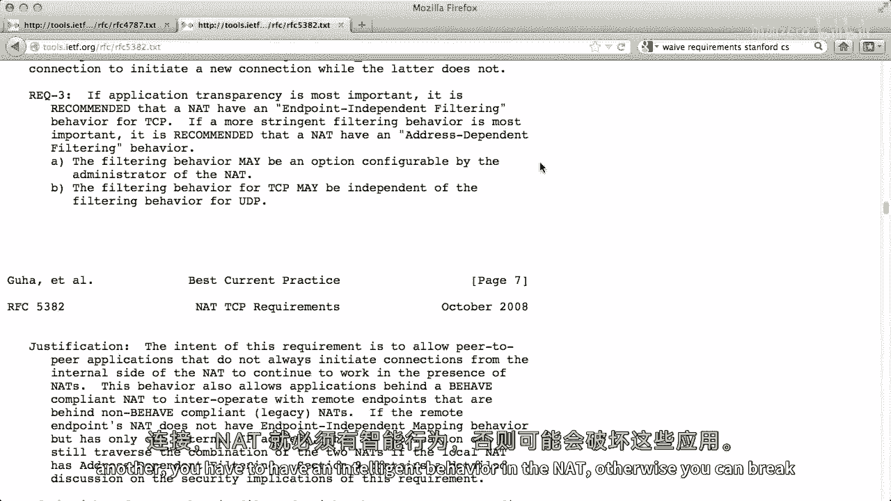

# 课程 P71：NAT 操作详解与行为规范 📡


在本节课中，我们将深入探讨网络地址转换（NAT）设备的核心操作细节，特别是其如何处理数据包以及为确保应用程序正常工作而必须遵循的行为规则和建议。

---

## NAT 映射机制 🔄

上一节我们介绍了NAT的基本概念，本节中我们来看看NAT如何建立和维护地址映射。

NAT设备的核心功能是在其内部接口和外部接口之间建立映射。这个映射将内部网络的IP地址和端口号，转换为外部网络可见的IP地址和端口号。

例如，一个NAT设备的外部IP地址是 `128.34.22.8`，内部网络有一台主机A，IP地址为 `10.0.0.1`。当主机A（端口 `10001`）向外部服务器S（端口 `80`）发起一个TCP连接时，NAT会创建一个映射。

以下是NAT建立映射的基本过程：
1.  **观察出站包**：NAT观察到从内部主机 `10.0.0.1:10001` 发往外部服务器 `S:80` 的数据包。
2.  **分配外部地址**：NAT为其分配一个外部端口，例如 `6641`。
3.  **建立映射**：NAT建立映射 `10.0.0.1:10001` -> `128.34.22.8:6641`。

此后，所有从服务器S返回给 `128.34.22.8:6641` 的数据包，都会被NAT根据此映射翻译并转发给内部的主机A `10.0.0.1:10001`。

---


## NAT 对未映射数据包的处理 ❓

那么，如果一个数据包的目的地是NAT的外部地址，但端口没有对应的映射，NAT会如何处理？


NAT本身也是一个IP设备。即使没有设置任何端口映射，它也需要像普通路由器或主机一样响应网络请求。


以下是NAT处理未映射数据包的通用原则：
*   如果数据包的目的端口在NAT设备本身上运行着服务（例如，家用电器的Web管理界面运行在端口 `80`），NAT会像普通服务器一样响应。
*   如果数据包的目的端口没有服务，NAT通常会拒绝连接（例如，发送TCP RST包）或返回ICMP错误。

简而言之，NAT的行为就像一个正常的IP设备，仅在数据包触发已存在的映射或需要创建新映射时，才执行特殊的地址转换操作。


---


## 映射的生命周期管理 ⏳

映射不会永久存在。NAT需要管理映射的创建和销毁，以避免耗尽端口资源。

映射的创建通常由内部主机发起的出站数据包触发。而映射的销毁则取决于协议类型：


以下是不同协议的映射超时策略：
*   **UDP**：由于是无连接协议，没有明确的连接终止信号。NAT会设置一个超时计时器（例如30秒或更长），如果在超时时间内没有该映射下的数据包通过，则删除该映射。
*   **TCP**：基于连接状态。当NAT观察到TCP连接正常终止（FIN握手）时，可以立即回收映射。如果连接异常中断，也需要依赖超时机制来清理。


RFC文档详细描述了NAT应有的行为，这些规范是基于多年实践经验总结而来，旨在防止NAT干扰应用程序的正常运行。


---

## UDP NAT 行为规范 (RFC 4787) 📜

为了确保UDP应用（如VoIP、在线游戏）能穿透NAT正常工作，IETF在RFC 4787中定义了一系列NAT行为建议。


以下是RFC 4787中的几个核心要求：
1.  **端点无关的映射**：NAT为内部主机分配的外部地址/端口映射，应**独立于**外部目标地址。这意味着它不能是对称型NAT。公式可以理解为：`映射(内部IP:端口) = 外部IP:端口`，此结果不随 `目标IP:端口` 改变。
2.  **地址配对保持**：如果NAT拥有多个外部IP地址，那么来自同一内部IP地址的所有连接应尽量使用相同的外部IP地址。
3.  **端口映射范围保留**：NAT应尽量保持端口号范围。例如，内部端口是知名端口（0-1023），映射的外部端口也应在相同范围；内部是高端口（1024-65535），外部映射也应在高端口范围。

这些要求旨在满足各种UDP应用程序的历史假设和协议期望，避免NAT破坏其功能。


---

## TCP NAT 行为规范 (RFC 5382) 📄



TCP协议由于有连接状态，其NAT行为规范在RFC 5382中定义，它有一些独特于连接建立过程的要求。

以下是RFC 5382中针对TCP的关键要求：
1.  **支持TCP状态机遍历**：NAT必须支持所有有效的TCP数据包序列来建立连接，不应限制TCP的实现选项。这对于P2P应用的同时打开连接至关重要。
2.  **端点无关的过滤**：与UDP建议类似，在过滤入站数据包时，应采用全锥形NAT的行为，只要数据包的目的地址/端口匹配现有映射，就应允许通过，而不检查源地址。
3.  **处理未请求的SYN包**：这是一个重要边缘案例。当NAT收到一个目的地没有映射的入站TCP SYN包（未请求的SYN）时，它**不应立即拒绝**（如发送RST），而应至少等待6秒。如果在这6秒内，内部主机恰好向该外部地址发起连接（发出SYN），NAT应建立映射并**静默丢弃**之前收到的那个未请求的SYN包。这个机制是为了支持P2P应用中可能发生的“同时打开”场景。

```text
# 同时打开场景示例
主机A (在NAT A后)             主机B (在NAT B后)
      |                               |
      |-- SYN (to B) --------------->|  # A的SYN到达B的NAT，但无映射，被暂缓处理
      |                               |
      |<------- SYN (to A) ----------|  # B的SYN几乎同时到达A的NAT
      |                               |
# 如果NAT B立即用RST拒绝A的SYN，连接会失败。
# 规范要求NAT B等待，给内部主机B一个发起出站SYN的机会来建立映射。
```

---

## 总结 🎯


本节课中我们一起学习了NAT操作的核心细节。
我们首先了解了NAT如何通过映射表转换内外网地址。
接着，探讨了NAT对无映射数据包的处理方式，以及如何管理UDP和TCP映射的生命周期。
最后，我们详细解读了确保应用程序兼容性的关键行为规范：RFC 4787对UDP NAT的要求（如端点无关映射），以及RFC 5382对TCP NAT的特殊要求（如支持同时打开连接和处理未请求SYN）。
理解这些规范对于开发能在各种NAT环境下稳定运行的网络应用至关重要。