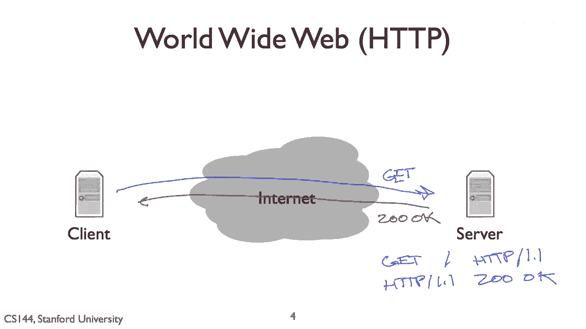
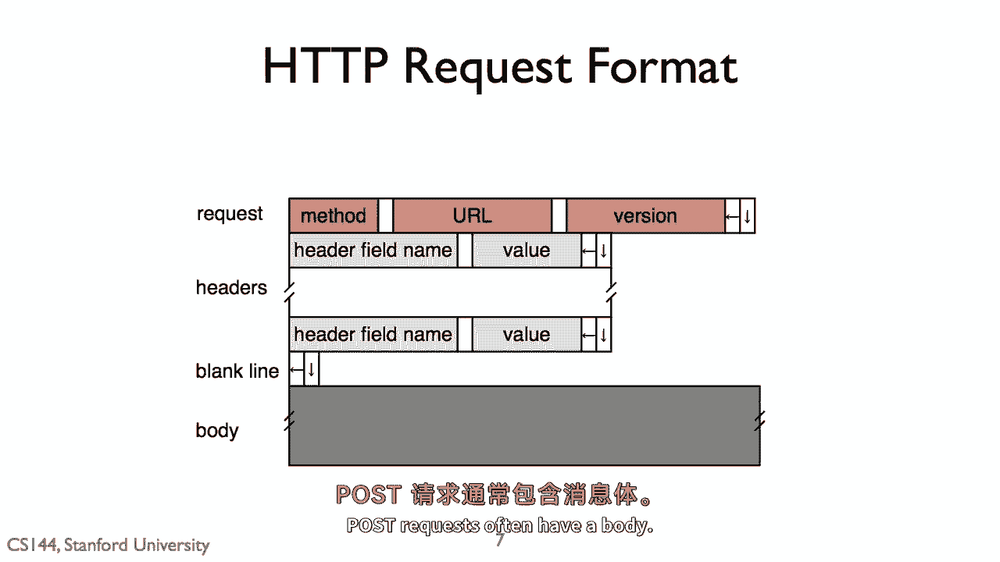
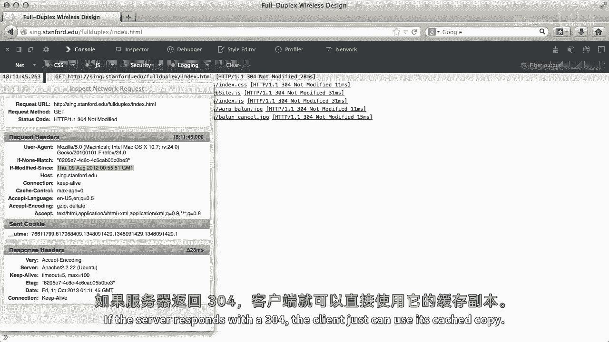
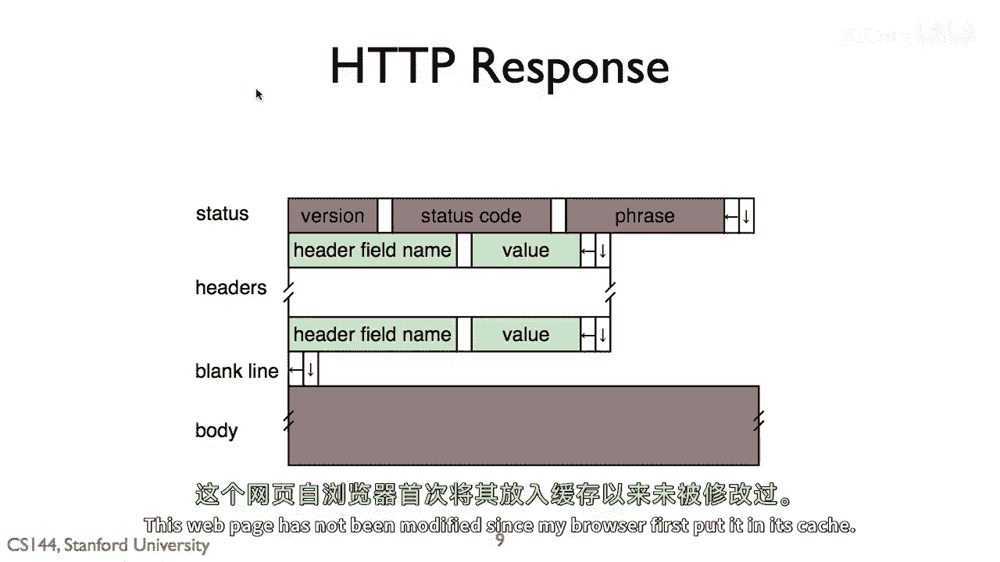
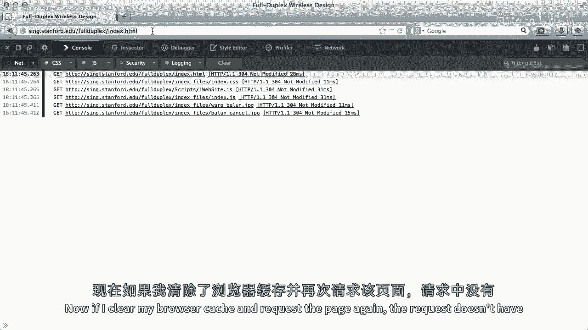
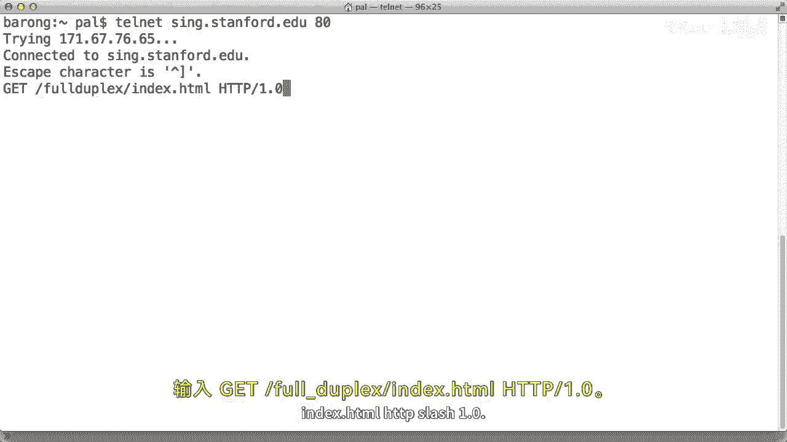
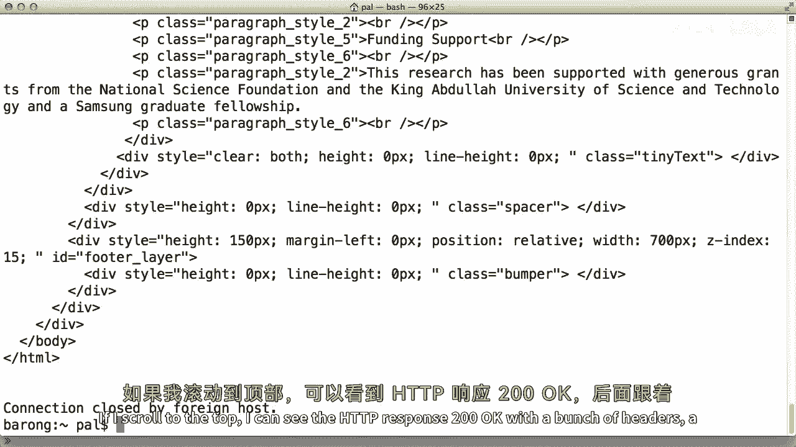
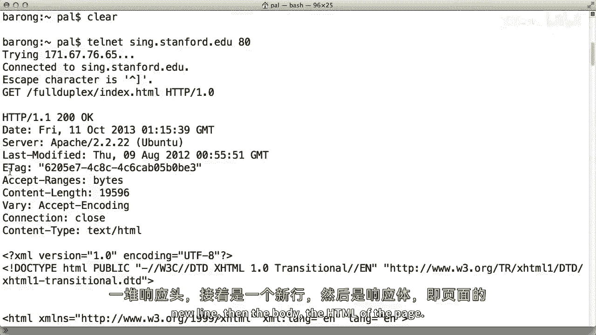
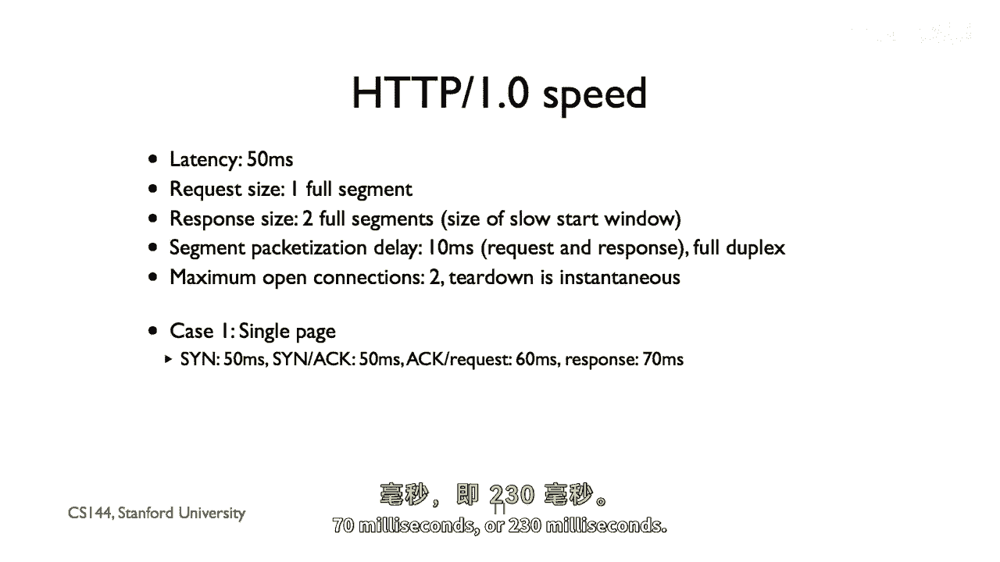
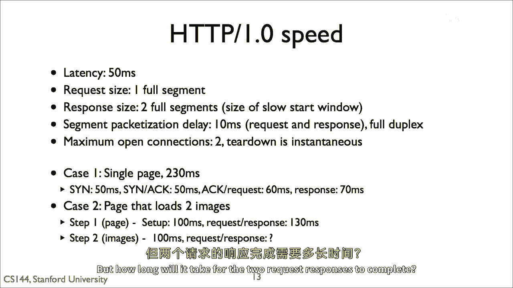

# 课程 P72：HTTP 协议基础 🕸️

在本节课中，我们将学习超文本传输协议（HTTP）的基本概念、工作原理以及如何分析其性能。HTTP 是现代互联网的基石，最初设计用于传输文档，如今已广泛应用于流媒体、应用程序交互等众多场景。

## 什么是超文本？ 📄

上一节我们介绍了课程概述，本节中我们来看看 HTTP 协议的核心——“超文本”。超文本是一种文档格式，它允许在文档中同时包含格式信息和内容信息。与微软 Word 或 PDF 等二进制格式不同，超文本完全由 ASCII 文本构成，这意味着你可以用任何文本编辑器查看其内容。

以下是一个来自维基百科页面的超文本摘录示例：

```html
<h2>历史</h2>
<p>HTTP 最初旨在传输文档，现在已被用于许多其他事情，如 <a href="http://www.w3.org/pub/WWW/">流媒体</a> 等。</p>

```

在基本层面上，超文本文档就是一个文本文档，浏览器根据文档中特殊的格式命令（称为“标记”）来显示它。例如，`<h2>` 标签表示这是一个二级标题，应以更大的字体显示。超链接则是一种特殊的标记，表示标签内的内容在被点击时，应加载指定的 URL。

超文本文档的独特之处在于，它可以通过标记引用并嵌入其他文件（如图片），而无需将这些文件的数据直接存储在文档中。

## HTTP 的基本模型 🔄

理解了超文本后，我们来看看 HTTP 协议是如何工作的。HTTP 采用客户端-服务器模型，以文档为中心进行通信。

以下是 HTTP 通信的基本流程：
1.  **客户端**（如浏览器）向**服务器**（如 `www.stanford.edu`）建立一个 TCP 连接。
2.  客户端通过该连接发送一个 **HTTP 请求**。
3.  服务器接收并处理请求。
4.  服务器通过同一个连接发送一个 **HTTP 响应** 回客户端。
5.  客户端读取响应，这可能促使它发出更多的请求（例如，获取页面中嵌入的图片）。

HTTP 协议本身也是由 ASCII 文本构成的，人类可读。最常见的请求方法是 `GET`，用于请求页面。



## HTTP 请求与响应的格式 📝

上一节我们介绍了 HTTP 的基本通信模型，本节中我们来详细看看请求和响应的具体格式。

### HTTP 请求格式

一个 HTTP 请求由以下几部分组成：
*   **请求行**：包含方法（如 `GET`）、请求的 URL 和 HTTP 版本号。
*   **请求头**：零个或多个头部行，每行包含一个头部字段名和对应的值。
*   **空行**：用于分隔头部和主体。
*   **请求主体**：对于 `GET` 请求，主体通常为空；对于 `POST` 等发送数据的请求，主体包含要提交的数据。



以下是 `GET` 请求的一个示例：

```
GET /full-duplex/index.html HTTP/1.1
Host: www.stanford.edu
User-Agent: Mozilla/5.0
If-Modified-Since: Wed, 21 Oct 2022 07:28:00 GMT

```



### HTTP 响应格式



一个 HTTP 响应由以下几部分组成：
*   **状态行**：包含 HTTP 版本、状态码（如 `200`）和状态短语（如 `OK`）。
*   **响应头**：零个或多个头部行。
*   **空行**：用于分隔头部和主体。
*   **响应主体**：请求的实际内容，如 HTML 文档。



以下是成功响应的一个示例：

```
HTTP/1.1 200 OK
Content-Type: text/html
Content-Length: 1234
Last-Modified: Wed, 21 Oct 2022 07:28:00 GMT





<!DOCTYPE html>
<html>
...
</html>
```



## 使用工具分析 HTTP 🔧

理论需要实践来验证。我们可以使用浏览器开发者工具或 `telnet` 等命令行工具来观察和分析 HTTP 请求与响应。

以下是使用 `telnet` 手动发送 HTTP 请求的步骤：
1.  打开终端或命令提示符。
2.  输入 `telnet www.stanford.edu 80` 连接到服务器的 80 端口（HTTP 默认端口）。
3.  连接成功后，手动输入 HTTP 请求，例如：
    ```
    GET /full-duplex/index.html HTTP/1.0
    Host: www.stanford.edu

    ```
4.  按下两次回车（输入空行）后，你将看到服务器返回的完整 HTTP 响应。

## HTTP 性能分析 ⏱️

了解了协议格式后，我们来看看影响 HTTP 性能的因素。早期的 HTTP/1.0 协议非常简单：每个请求都需要建立独立的 TCP 连接，并在响应完成后关闭。

让我们做一个简化的性能分析。假设：
*   客户端与服务器之间的单向传播延迟为 **50ms**。
*   一个 HTTP 请求的封装和发送需要 **10ms**。
*   一个 HTTP 响应的封装和发送需要 **20ms**。
*   TCP 三次握手需要 **100ms**（SYN 50ms + SYN-ACK 50ms）。

**加载一个简单页面（无图片）的总延迟计算如下：**
1.  TCP 三次握手：50ms + 50ms = **100ms**
2.  发送请求：10ms（但需等待握手完成后的 ACK，ACK 传输时间假设为 0，因此此步主要受制于传播，可简化为 **60ms** 从开始到请求发送完毕）
3.  接收响应：20ms（响应传输）+ 50ms（传播）= **70ms**
**总延迟 ≈ 100ms + 60ms + 70ms = 230ms**



**加载一个包含两张图片的页面（使用两个独立连接）则更慢**，因为每个图片都需要重复建立连接、请求、响应的过程，且连接共享同一链路，会产生排队延迟。

## 总结 📚



本节课中我们一起学习了 HTTP 协议的基础知识。我们首先了解了**超文本**作为 ASCII 文本格式文档的本质。然后，我们探讨了 HTTP 的**客户端-服务器请求-响应模型**，并详细剖析了**请求和响应的文本格式**。我们还介绍了如何使用**开发者工具**和 `telnet` 来实际观察 HTTP 通信。最后，我们通过一个简化的模型分析了 **HTTP/1.0 的性能特点**，特别是由于为每个资源建立独立连接而带来的延迟问题。理解这些基础知识是学习更高效 HTTP 版本（如 HTTP/1.1 的持久连接、HTTP/2 的多路复用）和现代 Web 性能优化的关键。