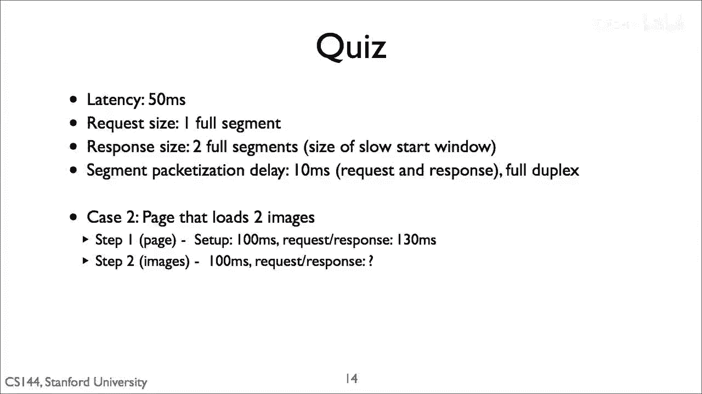
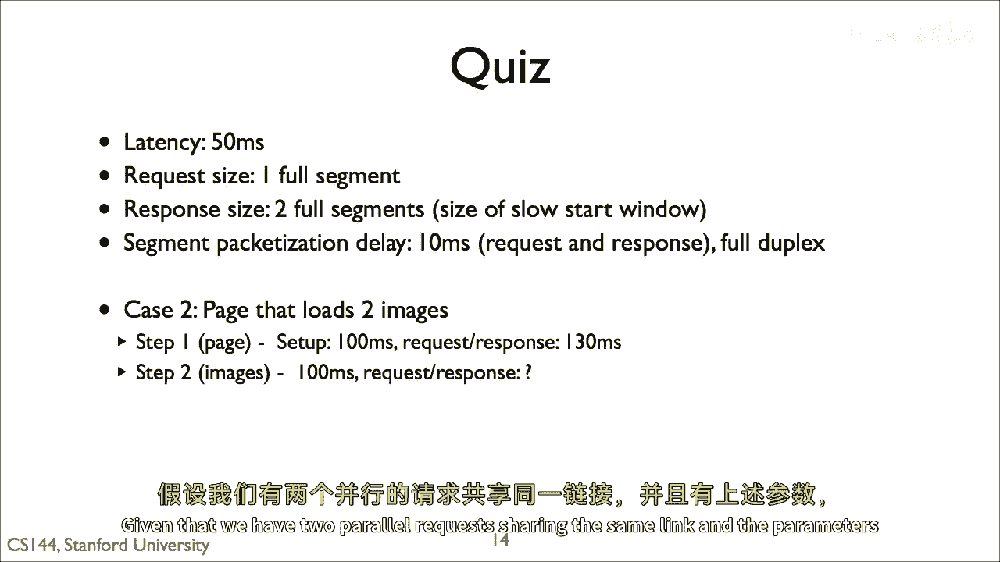
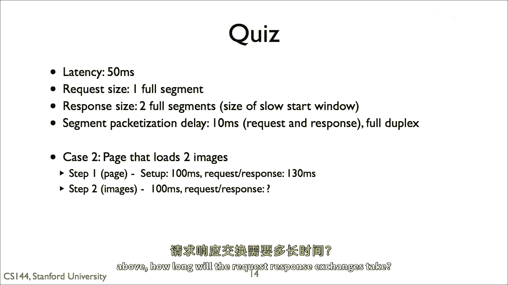

# 课程 P73：HTTP 测验 1 介绍 🧩

在本节课中，我们将要学习一个关于 HTTP 并行请求的测验。这个测验基于我们之前讨论过的“两个并行请求共享同一个链接”的场景。通过分析这个场景，我们可以更好地理解 HTTP 协议在实际应用中的行为。

## 测验背景介绍

上一节我们介绍了 HTTP 连接的基本概念。本节中我们来看看一个具体的应用场景。

这个测验的背景是：我们有两个并行请求共享同一个 HTTP 链接。这种情况在现代网络应用中非常常见，例如一个网页同时加载多个图片或脚本文件。

## 测验场景图示



以下是描述该场景的图示：


这张图展示了两个请求（Request A 和 Request B）通过同一个 TCP 连接被发送到服务器。

## 核心机制分析

在 HTTP/1.1 中，默认启用了持久连接（Persistent Connection）。这意味着一个 TCP 连接可以用于多个请求和响应，而不是每个请求完成后就关闭。这提高了效率，但也引入了新的问题，即如何管理多个并行的请求。

当两个请求共享一个连接时，它们必须被**序列化**。也就是说，请求和响应必须按顺序发送和接收。这可以用一个简单的模型来描述：

```
客户端 -> 服务器: 发送请求A
客户端 -> 服务器: 发送请求B
服务器 -> 客户端: 发送响应A
服务器 -> 客户端: 发送响应B
```

然而，实际的网络行为可能更复杂，因为请求和响应的处理时间不同。



## 可能遇到的问题

以下是并行请求共享连接时可能遇到的关键问题：

1.  **队头阻塞**：如果请求A的响应处理得很慢，即使请求B的响应已经准备好，它也必须等待请求A的响应完全发送完毕后才能开始传输。
2.  **响应顺序**：服务器响应的顺序是否一定与客户端发送请求的顺序一致？这是一个需要思考的问题。
3.  **资源竞争**：两个请求是否可能相互影响，例如竞争连接带宽？

## 后续图示提示

为了帮助分析，测验还提供了更多的视觉线索：




这些图示可能展示了请求与响应在时间线上的具体交互过程，或者揭示了某种特定的现象（如队头阻塞）。仔细观察时间线、箭头方向和标签是解答测验的关键。

## 总结

本节课中我们一起学习了 HTTP 测验 1 的背景。我们回顾了两个并行请求共享一个 HTTP 连接的基本场景，并分析了其中可能涉及的**队头阻塞**、响应顺序等核心概念。理解这些底层机制对于诊断网络性能问题和深入学习 HTTP/2、HTTP/3 的改进至关重要。接下来的测验将基于这些图示，挑战你对HTTP交互顺序和结果的理解。