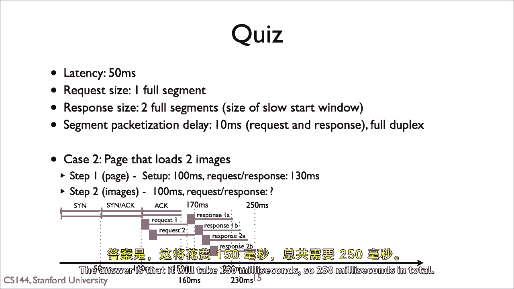
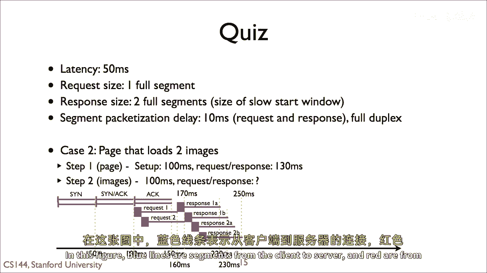
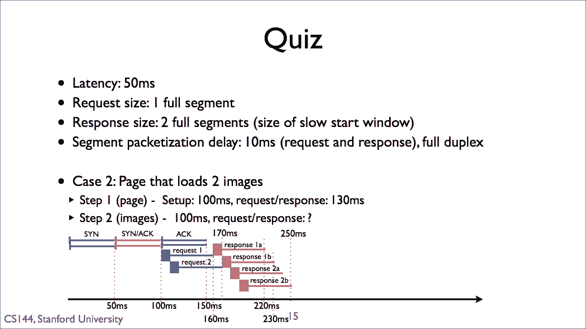
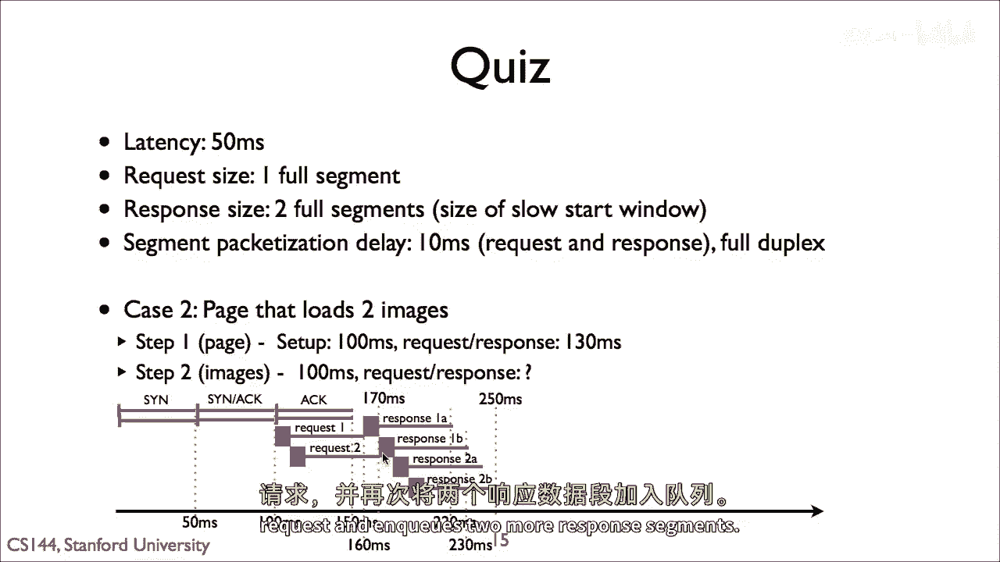
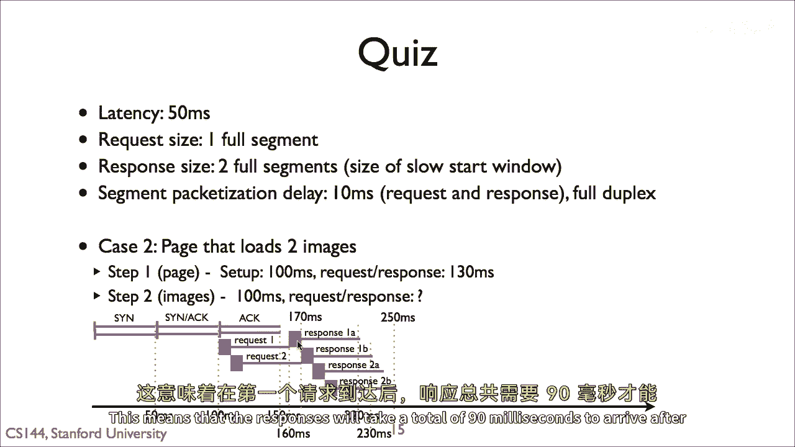
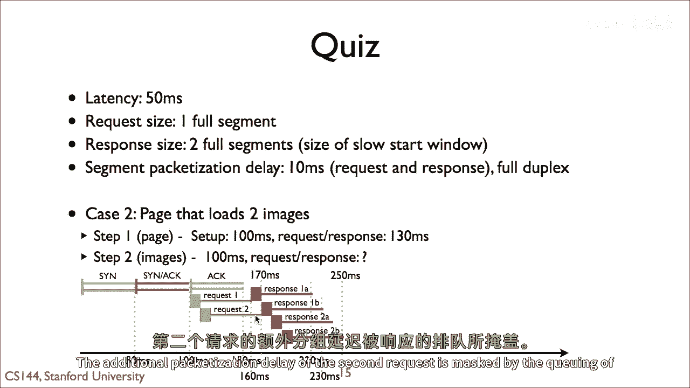
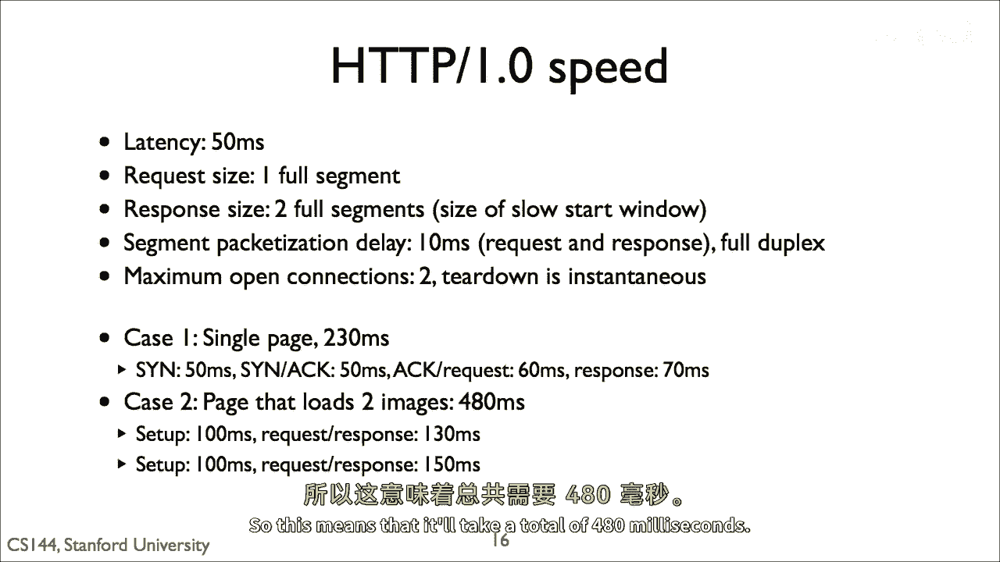
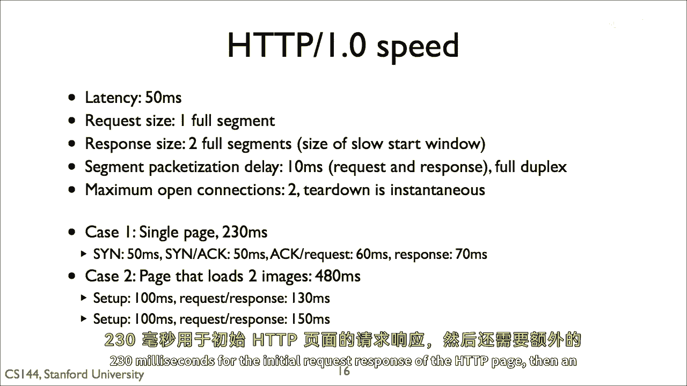

# P74：p73 5-5c HTTP Quiz 1 Explanation - 加加zero - BV1qotgeXE8D

答案是需要一百五十毫秒，所以在这个图中总共需要二百五十毫秒。

蓝色线条是从客户端到服务器的部分。

而红色的是从服务器到客户端的部分，辛辛交换需要一百毫秒。

第一个请求需要六十毫秒到达，这时服务器可以在一百六十毫秒开始发送响应，它为第一个响应部分发送两个部分作为提示，因为第一个响应部分已经通过链接发送。

当服务器收到第二个请求时，它为两个更多的响应部分发送提示。

这意味着响应的总体时间将需要九十毫秒到达。

在第一个请求到达后，第二个请求的额外打包延迟被响应的队列所掩盖。

所以这意味着总共需要四百八十毫秒。

HTTP页面的初始请求响应需要二百三十毫秒。

