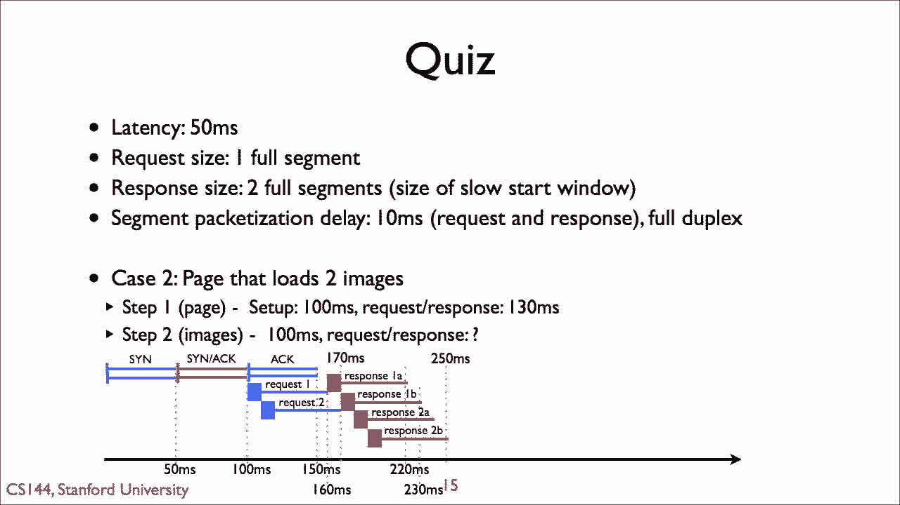
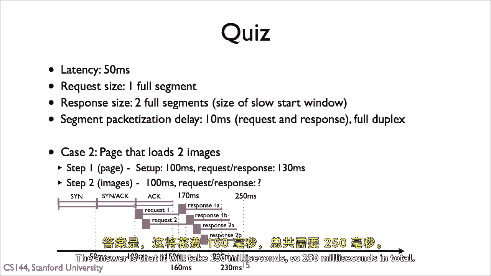
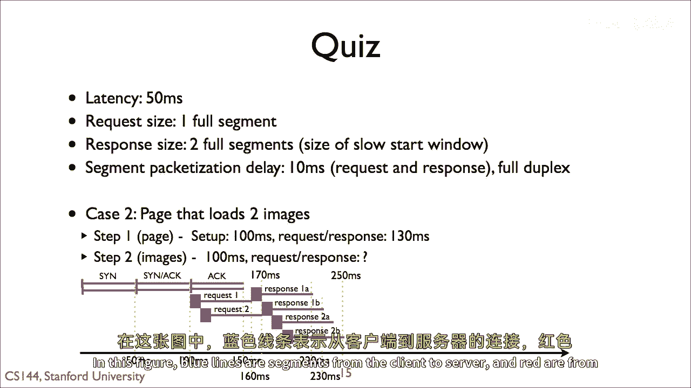
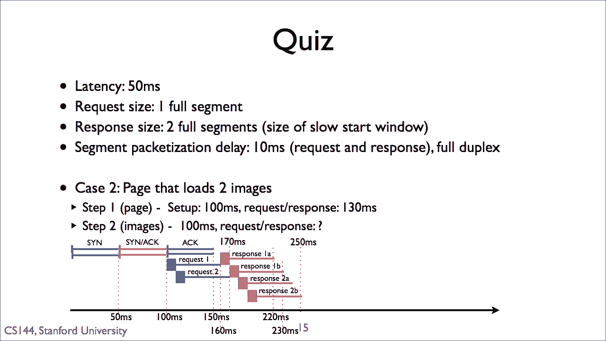
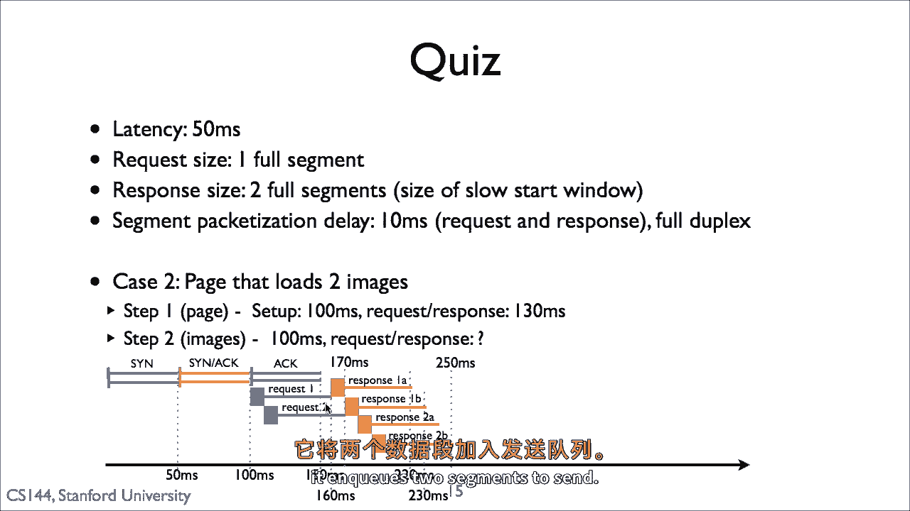
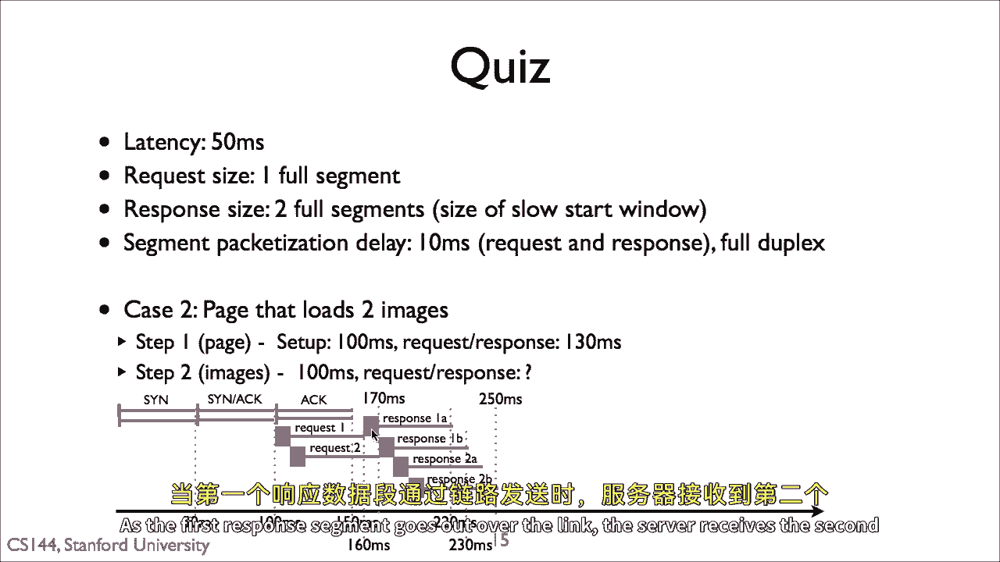
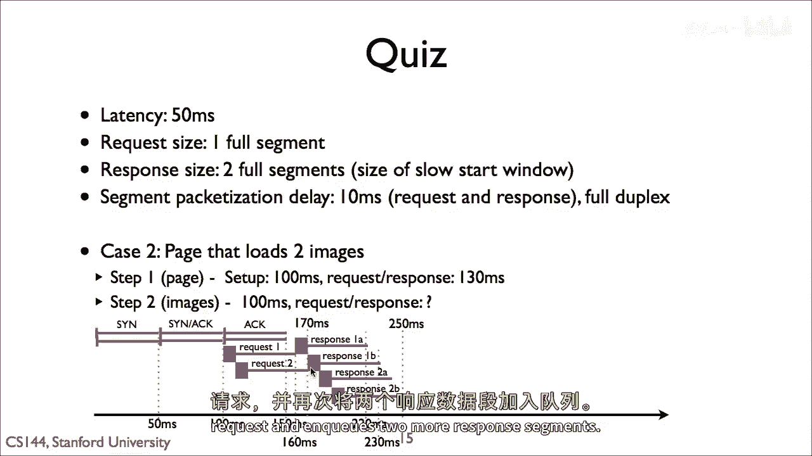
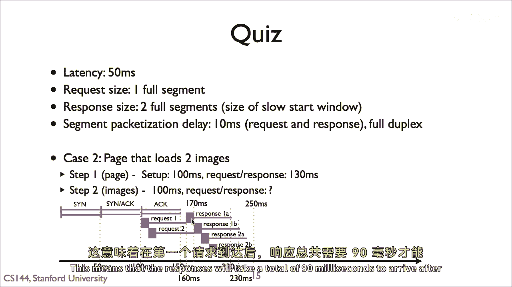
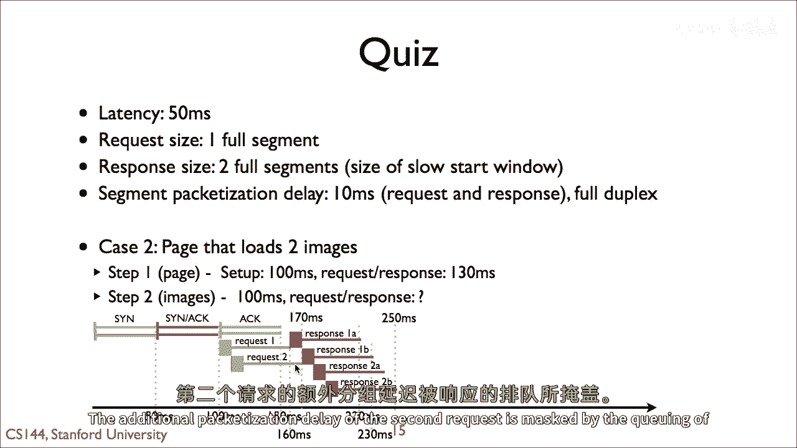
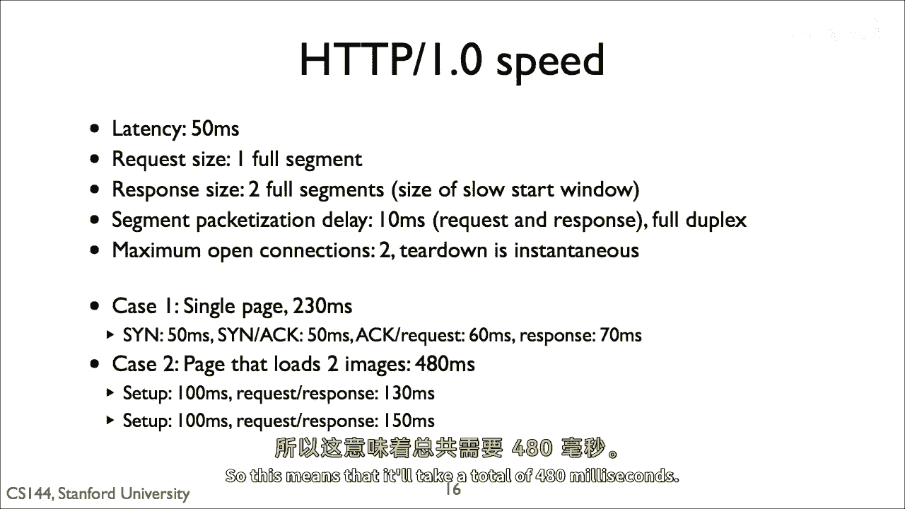

# 课程P74：HTTP Quiz 1 答案解析 📚

在本节课中，我们将详细解析一道关于HTTP请求与响应时间计算的题目。我们将通过分析网络传输的各个阶段，理解总延迟是如何构成的。

---

## 题目总览与答案

题目的答案是**一百五十毫秒**。根据题目提供的图示，整个过程总共需要**二百五十毫秒**。

## 网络传输路径分析

上一节我们得到了总时间，本节中我们来分解这个时间是如何构成的。

图示中的**蓝色线条**代表了数据从**客户端到服务器**的传输路径。

而**红色线条**则代表了数据从**服务器返回客户端**的传输路径。其中，**链路交换**（例如TCP握手）本身需要**一百毫秒**。

## 第一个请求与响应

以下是第一个请求的详细时间线：

*   **0ms**: 客户端发出第一个请求。
*   **60ms**: 第一个请求经过60毫秒的传播延迟后到达服务器。此时，服务器可以开始准备发送响应。
*   **160ms**: 在请求到达100毫秒后（即第160毫秒），服务器开始发送响应的**第一部分**。题目提示，服务器会为第一个响应部分发送两个数据包。

## 第二个请求与并行处理

当服务器正在处理第一个响应时，客户端发送了第二个请求。

以下是第二个请求到达后的处理过程：

*   服务器在收到第二个请求时，会为**另外两个响应部分**发送数据包。
*   这意味着从服务器发出响应到客户端完全接收，总共还需要**九十毫秒**的传输时间。

## 队列延迟与总时间计算

一个关键点是**队列延迟的掩盖**。

在第一个请求到达服务器后，第二个请求所产生的额外“打包”或处理延迟，被**响应的发送队列**掩盖了。也就是说，服务器在处理第一个响应的同时，也在准备第二个请求的响应，没有造成额外的空闲等待。

因此，结合所有阶段，完成整个交互过程总共需要**四百八十毫秒**。

## 初始请求响应时间

特别地，对于HTTP页面的**初始请求-响应周期**（即获取第一个资源），所需的时间是**二百三十毫秒**。

---

## 课程总结

本节课中，我们一起学习了如何分析一个简单的HTTP请求-响应场景的时间线。我们分解了传播延迟、链路交换时间以及服务器并行处理请求如何影响总完成时间，并理解了队列机制如何优化整体性能。核心在于区分不同方向的传输路径，并计算它们之间的重叠与顺序关系。