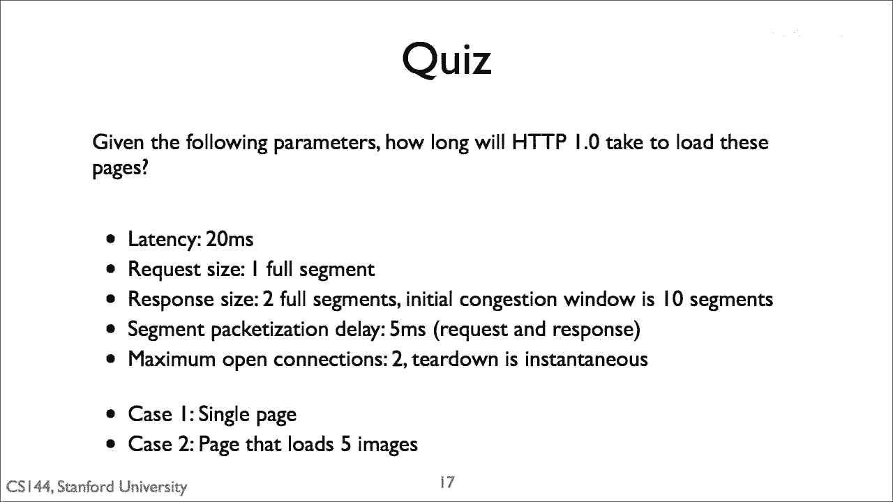
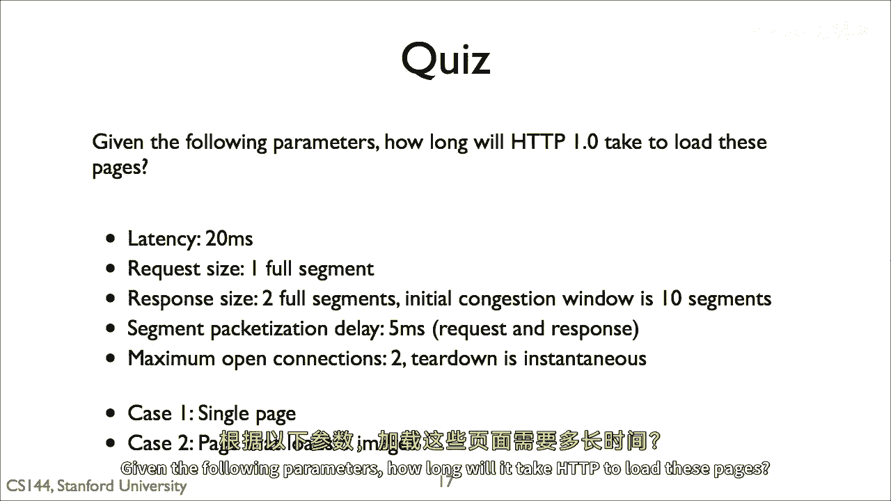
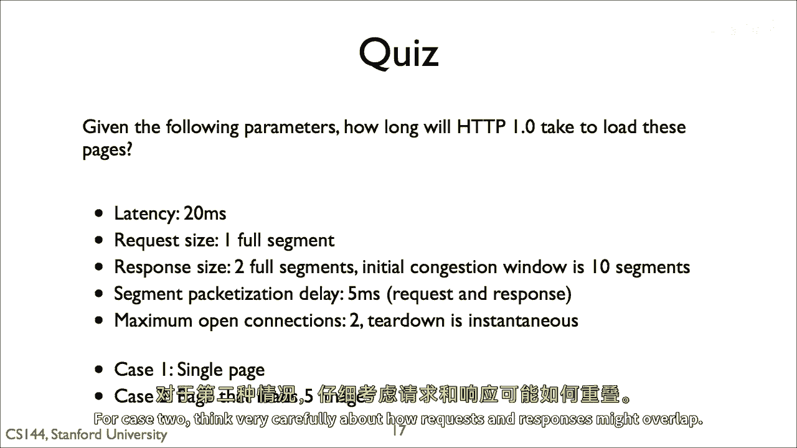

# 课程P75：HTTP测验2解析 🧩

在本节课中，我们将一起分析一个关于HTTP页面加载时间的测验。我们将学习如何根据给定的网络参数，计算在特定情况下加载一个网页所需的总时间。我们会逐步拆解问题，并应用核心的网络延迟公式。

## 概述

本次测验基于一个具体的网络场景：客户端通过HTTP协议请求一个包含1个HTML文件和3张图片的网页。我们已知网络往返时间（RTT）、链接带宽以及文件大小。目标是计算在“情况二”（即非持久HTTP连接且**无并行TCP连接**）下，加载整个页面所需的时间。

上一节我们介绍了HTTP的基本模型，本节中我们来看看如何将理论应用于具体计算。

## 场景与参数

以下是题目中给出的所有已知条件：

*   **往返时间 (RTT):** `4` 秒
*   **链接带宽:** `2` Mbps (即 `2 * 10^6` 比特每秒)
*   **HTML文件大小:** `100` 字节
*   **每张图片大小:** `100` 字节
*   **连接模型:** 非持久HTTP，且每次只建立一个TCP连接（无并行）。

## 核心计算原理

要计算总时间，我们需要理解两个核心组成部分：**建立连接的时间开销**和**传输数据的时间**。

1.  **TCP连接建立:** 在非持久HTTP下，每次传输文件前都需要经历一次“三次握手”来建立TCP连接。这个过程需要 **1个RTT** 的时间。
2.  **文件传输时间:** 文件传输时间由文件大小和链路带宽决定。其计算公式为：
    **传输时间 = 文件大小 / 带宽**
    我们需要确保单位一致（通常将字节转换为比特，1字节 = 8比特）。

## 分步加载过程分析

现在，我们根据“情况二”的规则，一步步模拟加载页面的过程。

整个过程是串行的，即必须等上一个文件完全请求并传输完毕后，才能开始下一个文件的请求。

**第一步：获取HTML文件**
1.  客户端发起TCP连接（1个RTT）。
2.  连接建立后，客户端发送HTTP请求，服务器响应并传回HTML文件。请求和响应时间合计为1个RTT，文件传输也需要时间。
因此，获取基础HTML文件的总时间为：`1 RTT (握手) + 1 RTT (请求/响应) + HTML文件传输时间`。

**第二步：获取第一张图片**
HTML文件加载后，客户端解析发现需要图片，于是开始为第一张图片建立新的TCP连接。过程与第一步完全类似。
获取每张图片的时间均为：`1 RTT (握手) + 1 RTT (请求/响应) + 图片传输时间`。

**第三步：获取剩余图片**
由于没有并行连接，获取第二、第三张图片的过程与第二步完全相同，且必须依次进行。

以下是各阶段时间的具体计算：

*   **计算传输时间**
    带宽 = 2 Mbps = `2 * 10^6` bps。
    文件大小（以比特计） = 100 字节 * 8 = `800` 比特。
    单个文件传输时间 = `800 bits / (2 * 10^6 bits/sec) = 0.0004 sec`。这个值远小于1个RTT（4秒），因此在计算中通常可以忽略不计。

*   **计算总时间**
    1.  获取HTML: `1 RTT (握手) + 1 RTT (请求/响应) = 2 RTT`
    2.  获取图片1: `1 RTT (握手) + 1 RTT (请求/响应) = 2 RTT`
    3.  获取图片2: `2 RTT`
    4.  获取图片3: `2 RTT`
    总RTT数量 = `2 + 2 + 2 + 2 = 8 RTT`。
    总时间 = `8 * 4 sec = 32 sec`。

## 关键点总结

本节课中我们一起学习了如何计算非持久HTTP连接且无并行时的页面加载时间。关键在于理解每个独立文件的获取都需要经历完整的TCP连接建立过程（消耗1 RTT）和请求-响应周期（消耗1 RTT）。当传输时间远小于RTT时，总时间主要由这些网络延迟的累加决定。在本例中，加载一个包含4个小资源的页面总共需要 **32秒**。