# 📘 课程 P76：HTTP 测验 2 解析

在本节课中，我们将详细解析一个关于 HTTP 并行请求与延迟计算的测验。我们将通过具体的案例和图表，理解网络延迟如何影响资源加载时间，以及并行请求如何优化整体性能。

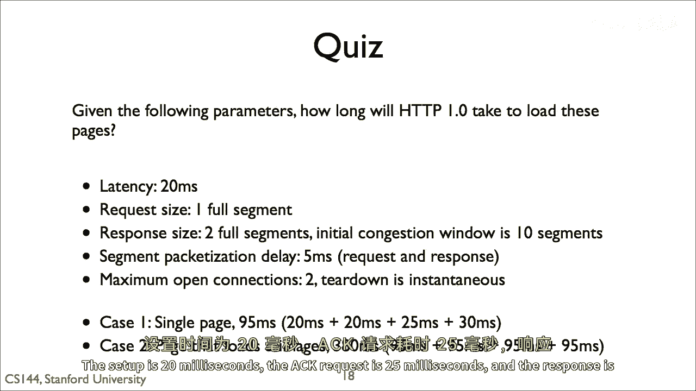

---

## 📊 案例一：单次请求耗时分析

上一节我们介绍了课程背景，本节中我们来看看第一个案例的计算。

案例一的答案是九十五毫秒，其网络设置是二十毫秒的传播延迟。

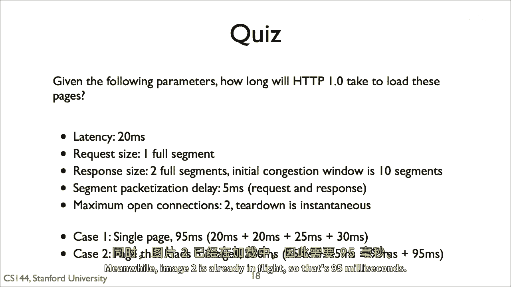

以下是计算过程：
*   客户端发送请求到服务器需要 **25毫秒**（包含传播与处理时间）。
*   服务器返回响应到客户端需要 **30毫秒**。
*   加上初始的页面加载时间，**总耗时是九十五毫秒**。

这个计算可以用一个简单的公式表示：
**总耗时 = 初始页面加载时间 + 请求时间 + 响应时间**

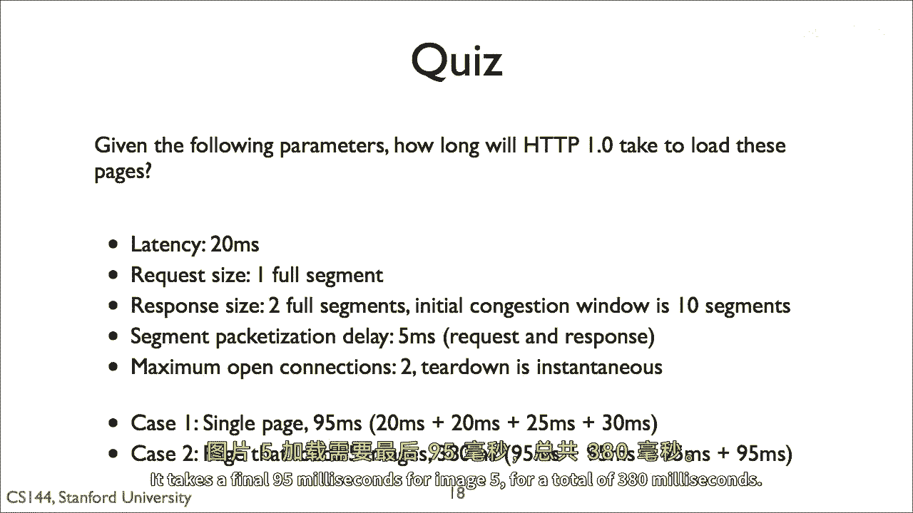

---

## 🔄 案例二：并行请求耗时分析

理解了单次请求后，我们来看看更复杂的并行请求场景。

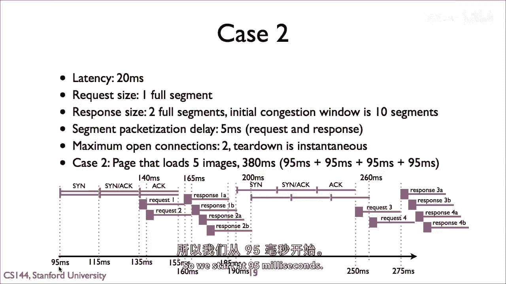

案例二的答案是三百八十毫秒。加载初始页面需要九十五毫秒。随后，图像开始并行加载。

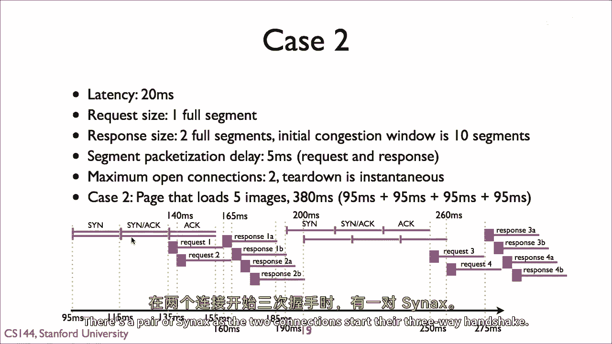

以下是加载过程的分解：
1.  初始页面加载完成（95ms）时，客户端立即请求图像一和图像二。
2.  图像一加载完成（95ms）时，图像三开始请求，与此同时图像二已在传输中。
3.  图像三完成（95ms）时，图像四开始请求，图像二此时已完成。
4.  最后，加载图像五需要另一个九十五毫秒。

因此，总耗时为：`95ms + 95ms + 95ms + 95ms = 380ms`

---

## 📈 图解并行请求流程

为了更直观地理解，让我们通过图表来分析并行请求的时序。

这个图表从初始页面请求后开始，展示了客户端请求多张图像时发生的情况。我们从九十五毫秒的时间点开始观察。

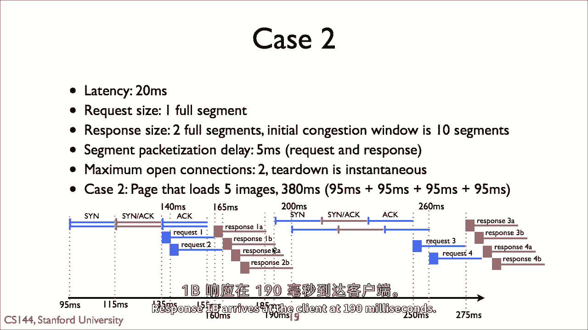

以下是图表中的关键事件序列：
*   **135ms**: 客户端发送请求一。
*   **140ms**: 客户端发送请求二。
*   **165ms**: 请求一到达服务器（包含20ms延迟和5ms排队延迟）。
*   服务器开始发送响应。当请求二到达时，其响应数据段在请求一的响应段之后排队等待发送。
*   **190ms**: 请求一的响应段B到达客户端。

---

## ⚙️ 连接管理与请求轮次

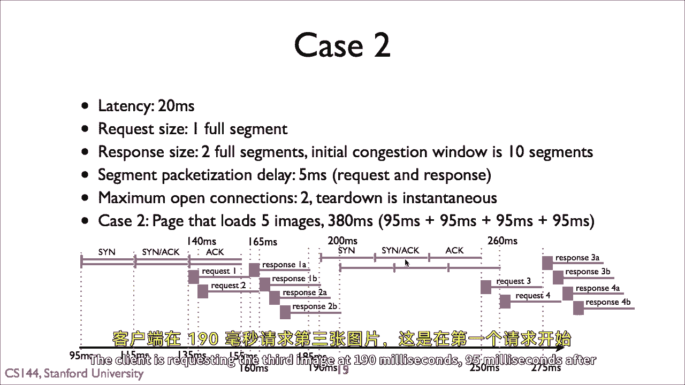

当第一个请求的响应到达后，客户端立即开启新连接请求第三张图像。

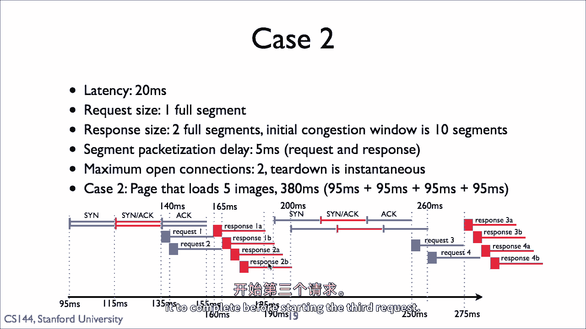

这里有一个重要概念：**因为第二个请求是并行处理的，客户端无需等待它完成即可开始第三个请求**。

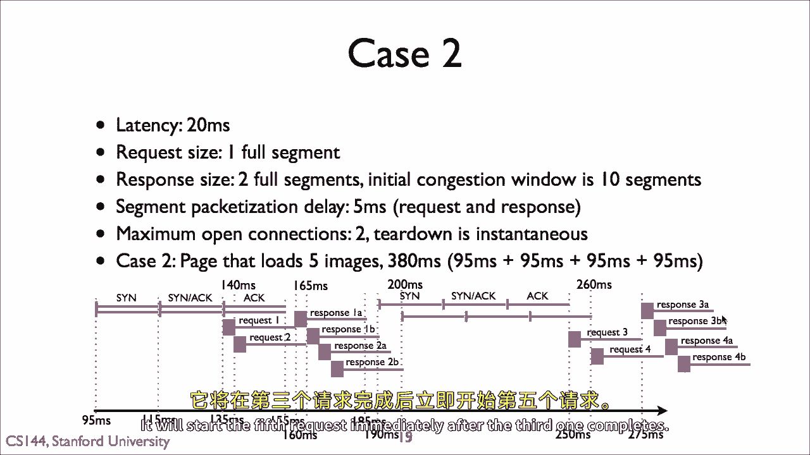

请求会按此模式持续进行：
*   第三个请求完成后，立即开始第五个请求。
*   每个这样的“轮次”大约需要九十五毫秒。
*   如果有六张图像，最后一个轮次将需要额外时间，总时间会延长。

---

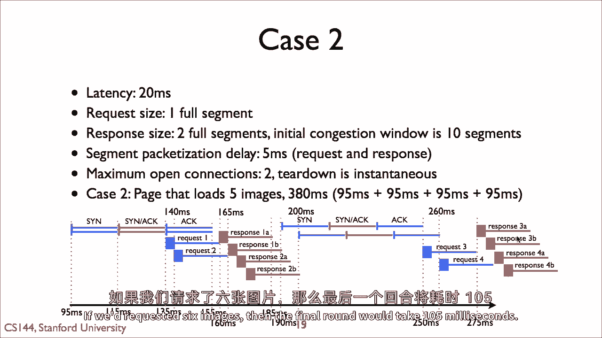

## 💡 核心机制与性能启示

仔细观察图表，直到你理解其运作机制。

核心机制在于：**请求和响应在队列中的延迟导致了它们被自然间隔开，这反而减少了整体的队列拥堵延迟**。

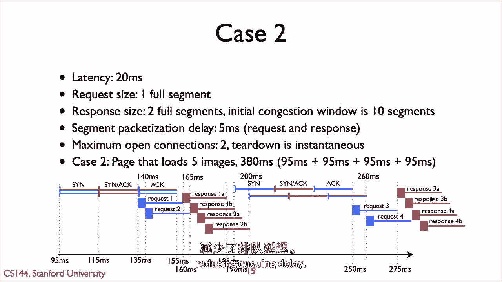

这带来了一个关键性能优势：**因为多个操作并行进行，它们可以掩盖彼此的延迟**。如果你仔细思考这些数字：

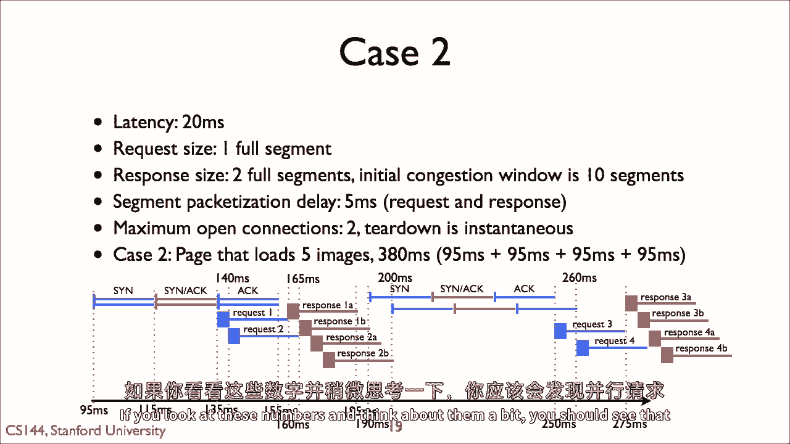

你会发现：**并行请求多个资源，并不比顺序请求单个资源花费显著更长的时间**。

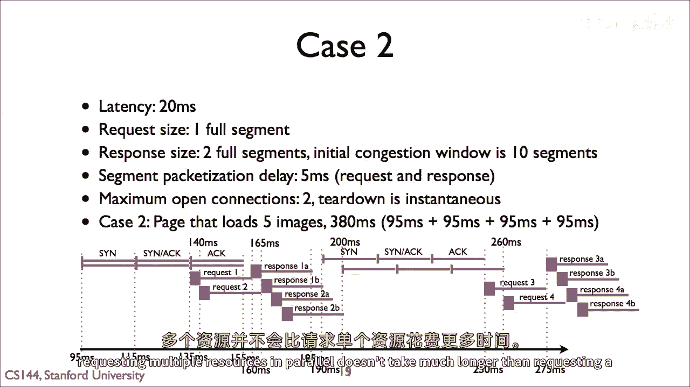

虽然存在额外的数据包处理延迟，但在现代网络中，这部分时间占比很小。单个请求无法充分利用网络带宽，而多个并行请求则可能做到。

---

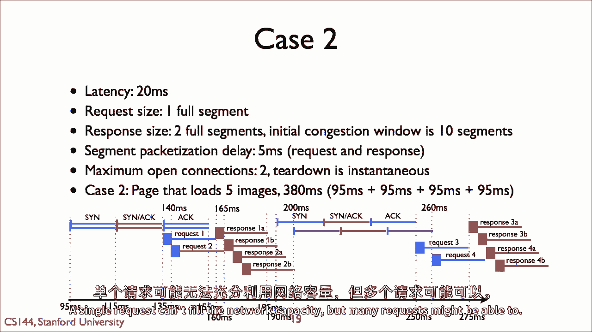

## 🎯 课程总结

本节课中我们一起学习了 HTTP 并行请求的延迟计算模型。

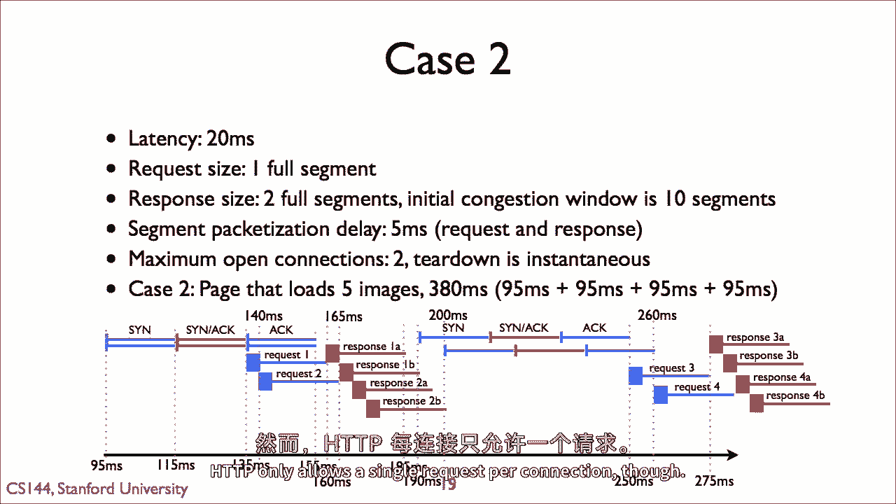

我们通过两个案例，分析了单次请求与并行请求的总耗时，并借助图表理解了请求与响应在队列中的调度机制。最关键的是，我们明白了并行请求如何通过掩盖延迟来提升效率，并且了解到在 HTTP/1.x 中，每个连接只能处理一个未完成请求的限制，这凸显了建立多个连接或使用 HTTP/2 等多路复用技术的重要性。

希望本教程能帮助你清晰地理解网络延迟对网页加载的影响。