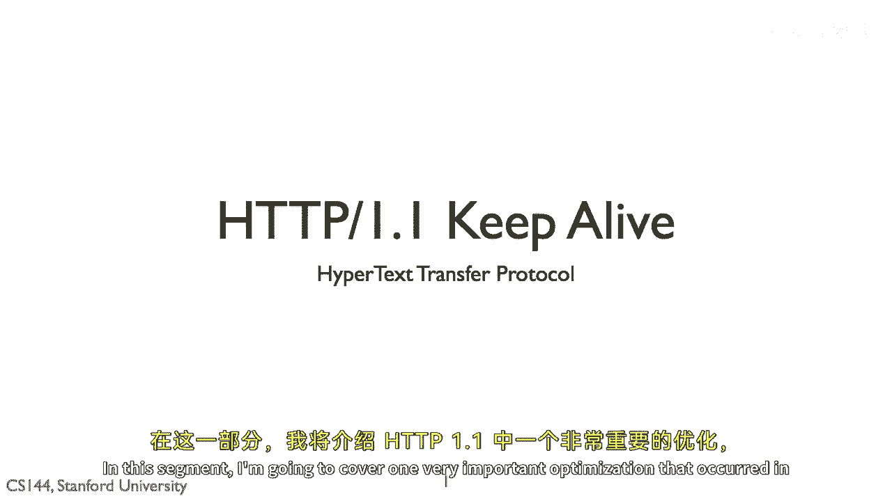
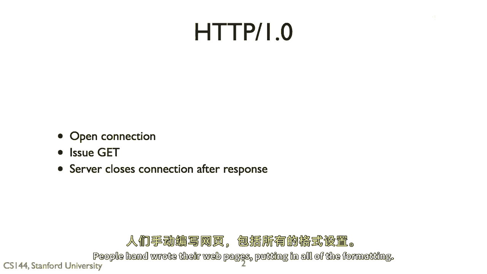
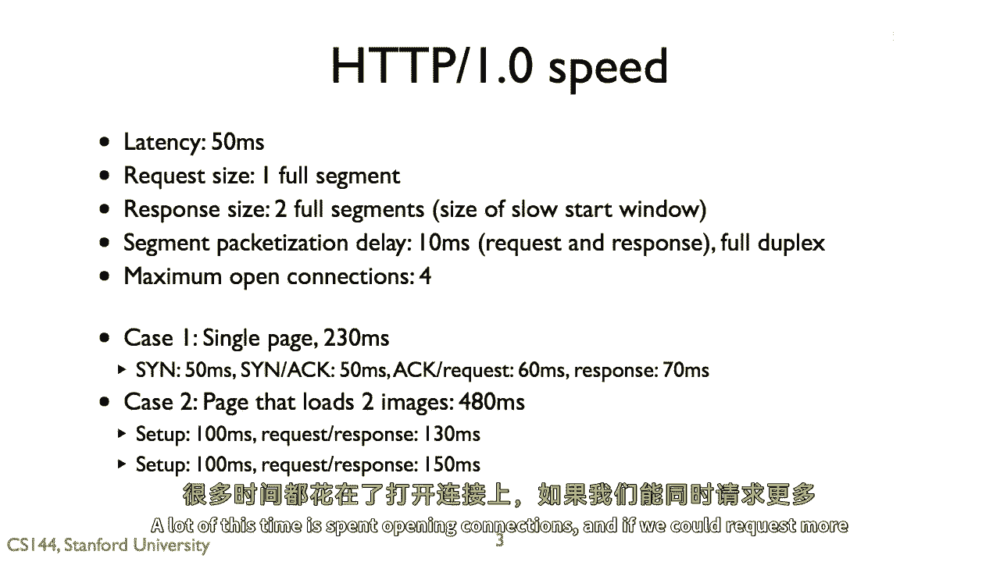
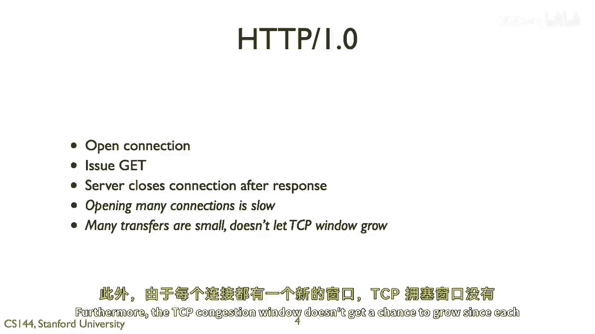
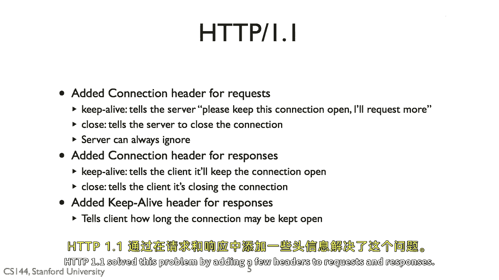
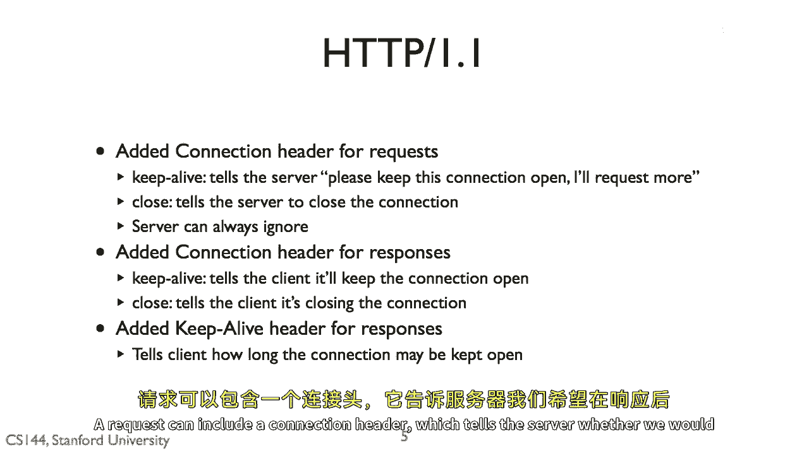
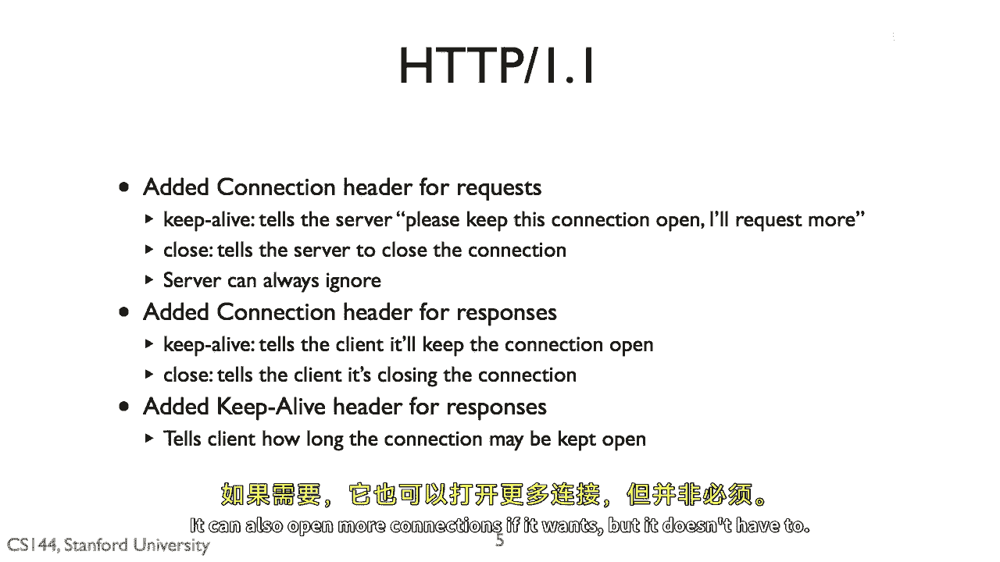
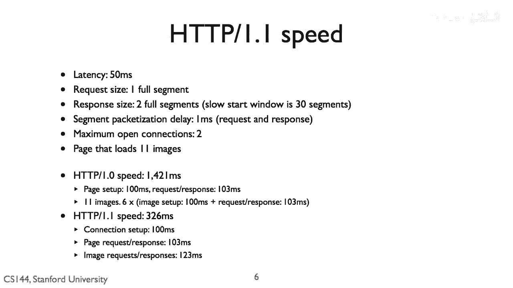
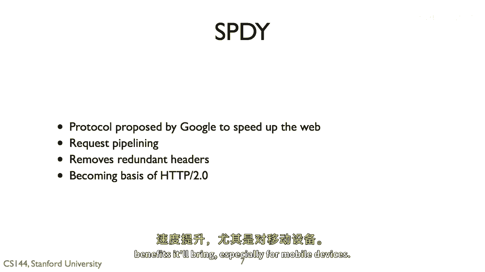

# 课程 P77：HTTP/1.1 持久连接详解 🚀



在本节课中，我们将要学习 HTTP/1.1 协议中一项非常重要的优化技术——持久连接（Keep-alive）。我们将了解它如何解决 HTTP/1.0 的效率问题，并通过对比分析其性能提升。

---

## HTTP/1.0 的局限性



上一节我们介绍了 HTTP 协议的基本请求-响应模型。本节中我们来看看 HTTP/1.0 的工作方式及其效率瓶颈。


HTTP 是一种基本的请求-响应协议。在 HTTP/1.0 中，客户端为了请求一个文档，需要打开一个 TCP 连接。它发送一个 `GET` 请求，服务器响应状态码（例如 `200 OK`）并在响应体中包含文档内容，随后连接立即关闭。

如果客户端需要请求第二个文档（例如网页中的图片），就必须打开第二个全新的连接。在早期网页内容以文本为主、仅包含少量图片时，这种方法尚可接受。



以下是 HTTP/1.0 简单请求的示意代码：
```http
GET /index.html HTTP/1.0
Host: www.example.com
```



然而，根据我们对 HTTP/1.0 的性能分析，使用特定网络参数加载一个包含文本和两张图片的页面需要超过 500 毫秒。其中，大量时间被消耗在反复建立和关闭 TCP 连接上。此外，每个新连接的 TCP 拥塞窗口都处于初始状态，没有机会增长，无法充分利用网络带宽。

因此，HTTP/1.0 的方法可能非常浪费资源。客户端花费大量时间建立连接，且 TCP 性能无法得到优化。



---



## HTTP/1.1 的解决方案：持久连接

为了解决上述问题，HTTP/1.1 引入了持久连接机制。它通过在请求和响应报文中添加特定的头部字段来实现。

一个 HTTP/1.1 的请求可以包含一个 `Connection` 头部。例如：
```http
GET /index.html HTTP/1.1
Host: www.example.com
Connection: keep-alive
```
这个头部用于提示服务器，客户端希望在本次响应结束后保持连接打开，以便发送后续请求。服务器可以根据自身情况决定是否遵从该提示。



相应地，服务器的响应中也会包含 `Connection` 头部，告知客户端其最终决定。如果服务器同意保持连接，它还会通过 `Keep-Alive` 头部（注意拼写）告知连接将保持多久。例如：
```http
HTTP/1.1 200 OK
Content-Type: text/html
Connection: keep-alive
Keep-Alive: timeout=5, max=100
```
此后，客户端可以在同一连接上连续发送更多请求，而无需重新建立连接。当然，客户端仍然可以打开多个并行连接。

---

## 性能对比分析

让我们通过一个更现实的场景来对比 HTTP/1.0 和 HTTP/1.1 的性能。假设一个页面包含 11 张图片，网络延迟较低。

以下是性能计算的核心公式：
**总时间 ≈ 建立连接时间 + (请求数量 × 单次请求-响应延迟)**

*   **对于 HTTP/1.0**：每个资源都需要独立连接。加载主页面和11张图片需要多轮请求。计算表明，总时间可能达到 **1421 毫秒**。
*   **对于 HTTP/1.1**：利用持久连接，所有请求可以在一个连接内连续发送。计算表明，总时间仅需 **326 毫秒**。

因此，在本例中，**HTTP/1.1 比 HTTP/1.0 快了 4 倍以上**。性能提升主要源于避免了重复建立连接的开销，并允许 TCP 拥塞窗口增长，从而提高了数据传输效率。



---

## 后续发展：SPDY 与 HTTP/2

HTTP/1.1 自1997年左右沿用至今。近年来，为了进一步提升性能，出现了新的协议。

谷歌开发的 **SPDY** 协议对 HTTP 做了多项改进：
1.  **请求管道化**：允许同时发送多个请求，无需等待响应。
2.  **头部压缩**：消除了 HTTP/1.1 中大量重复的头部信息，减少了数据传输量。
3.  **服务器推送**：服务器可以预测客户端需求，主动推送资源。

SPDY 协议的成功实践最终成为了 **HTTP/2** 标准的基础。HTTP/2 解决了 HTTP/1.1 中队头阻塞等问题，并广泛采用了头部压缩等特性，能够为现代复杂网页带来显著的速度提升，目前已被大多数网站所采用。

---

## 总结

本节课中我们一起学习了：
1.  **HTTP/1.0 的局限性**：每个资源请求都需要独立的 TCP 连接，导致延迟高、效率低。
2.  **HTTP/1.1 的持久连接**：通过 `Connection: keep-alive` 头部，允许多个请求-响应在同一个 TCP 连接上顺序进行，大幅减少了连接建立开销，提升了性能。
3.  **性能对比**：通过理论计算，展示了在典型场景下 HTTP/1.1 相较于 HTTP/1.0 的巨大速度优势。
4.  **技术演进**：了解了从 HTTP/1.1 到 SPDY，再到现代 HTTP/2 协议的发展脉络，它们致力于解决更复杂的网络性能问题。



持久连接是 Web 性能优化中的一个基础且关键的机制，理解它有助于我们更好地认识现代网络应用的工作原理。