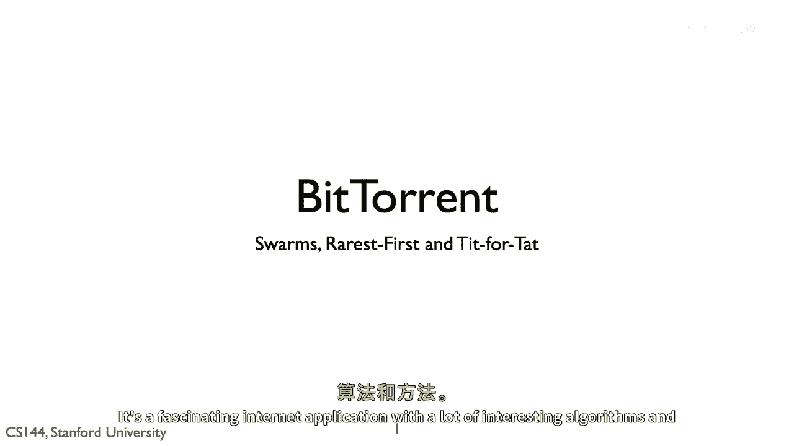
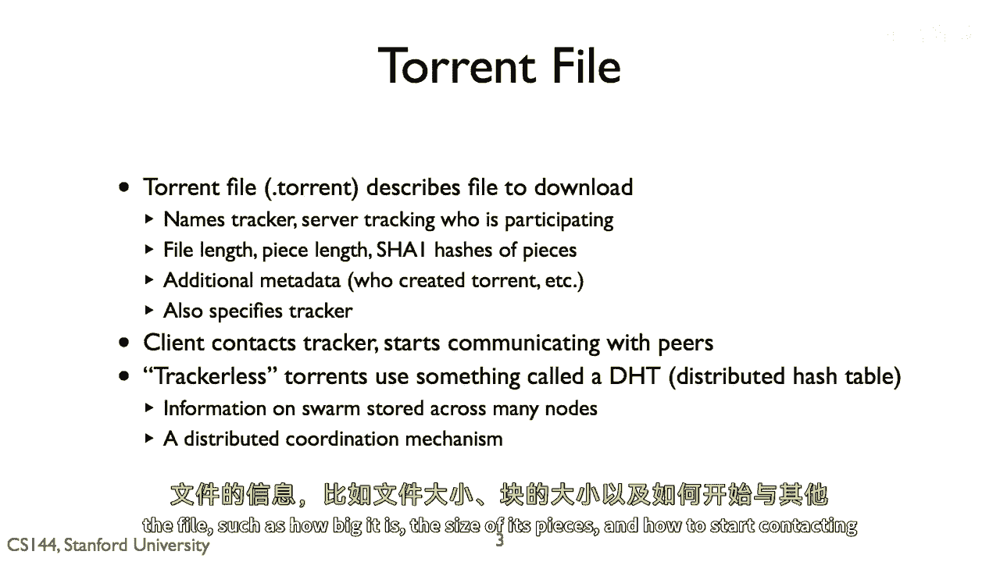
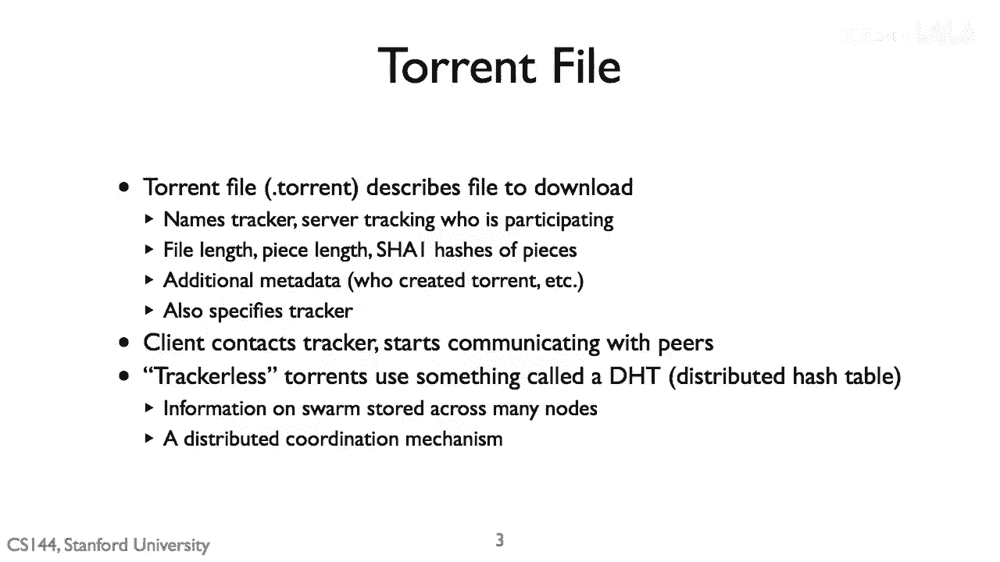
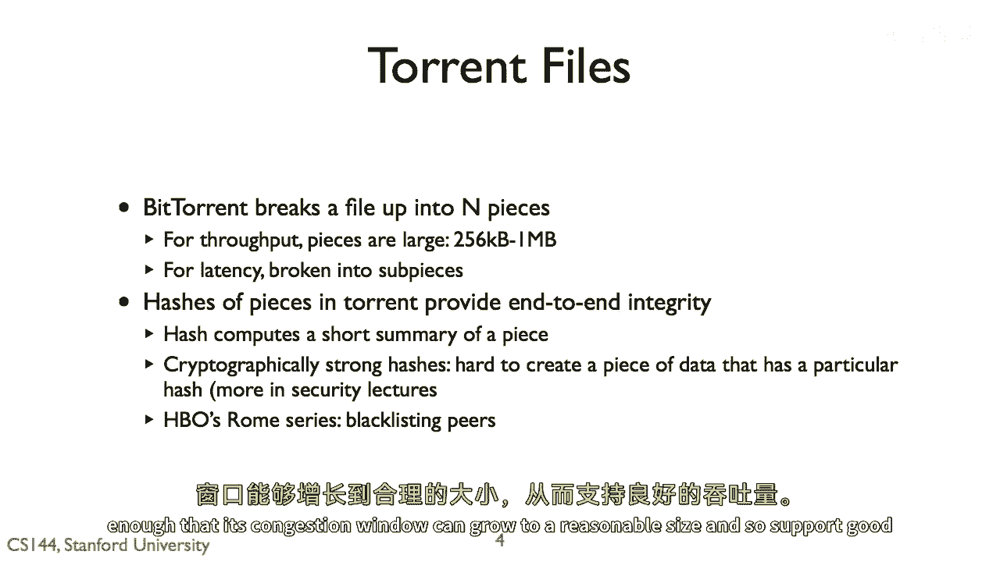
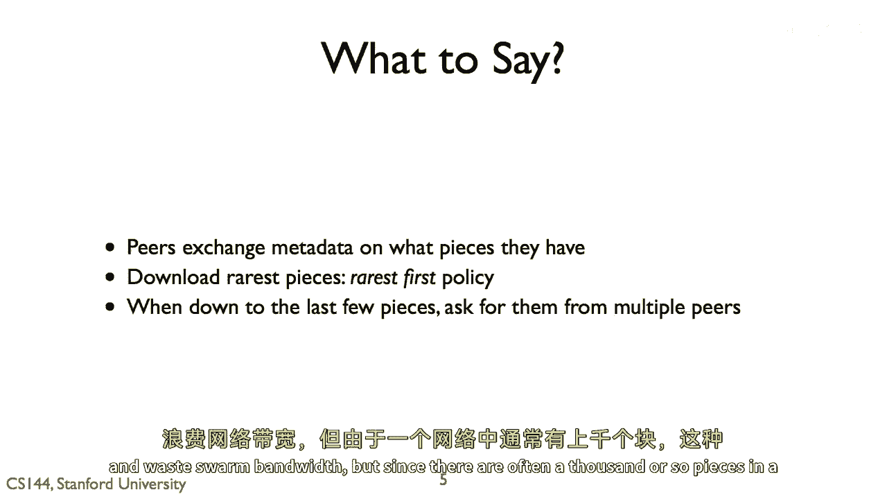
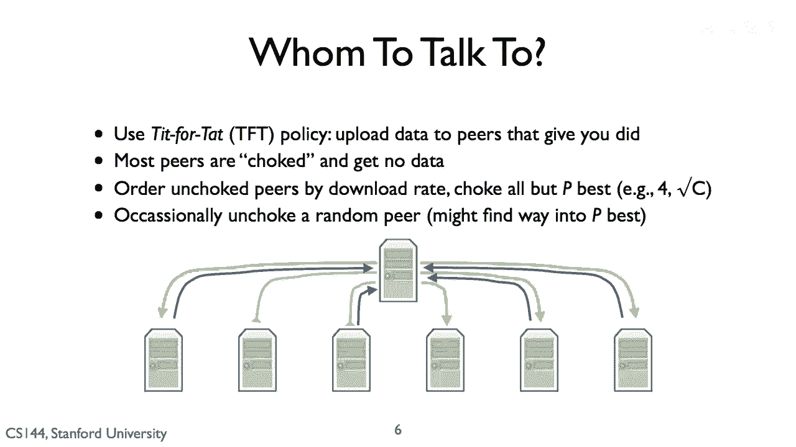
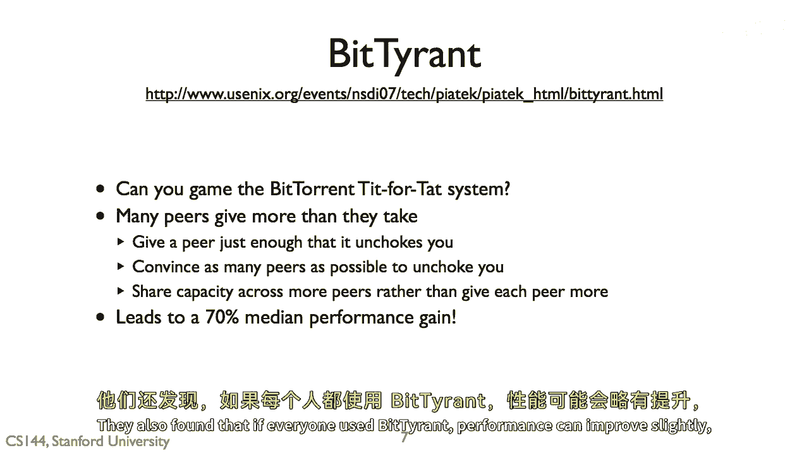

# 课程 P78：BitTorrent 协议详解 🧩



在本节课中，我们将要学习 BitTorrent 协议。这是一种用于高效分发大型文件的点对点（P2P）网络协议。我们将了解其核心工作原理、文件分片机制、节点发现方式以及用于激励共享的算法。

---

## 协议概述与基本原理 🌐

BitTorrent 是一种高效的互联网应用，它允许用户分享和交换大型文件。其核心思想是，一个客户端可以从多个其他客户端并行地请求文件的不同部分。


它将文件分解为称为“片段”的数据块。当一个客户端从另一个客户端下载一个片段后，它会告知其他客户端自己已拥有该片段。这种协作下载文件的客户端集合被称为“蜂群”。

---



## 加入与发现蜂群 🐝

上一节我们介绍了蜂群的概念，本节中我们来看看客户端如何加入一个蜂群。

一个客户端通过下载一个包含文件信息的 `.torrent` 文件来加入蜂群。


这个文件包含了文件大小、片段大小以及如何联系其他客户端等信息。

早期，`.torrent` 文件会指定一个“追踪器”。这是一台负责追踪蜂群中有哪些客户端的服务器。当客户端加入时，它会向追踪器请求一个其他客户端的列表，然后通过 TCP 与这些客户端建立连接。一个 BitTorrent 客户端可以同时打开大约一百个 TCP 连接。

在 2000 年代后期，追踪器开始受到过多关注。目前，大多数客户端已过渡到使用“分布式哈希表”。




DHT 是一种将哈希值映射到节点的方法。支持 DHT 的节点集合可以频繁变化，但你仍然可以找到节点。因此，映射关系实际上分布在所有参与节点上，而不是依赖于一个中央查找表。这是一种让节点协作存储数据（例如，存储蜂群成员列表）的方式。


---



## 文件分片与完整性校验 🔍

了解了如何加入网络后，我们来看看 BitTorrent 如何处理文件本身。

BitTorrent 将文件分成 **N** 个片段，每个片段通常是 256 KB 或更大。

```
文件大小 / 片段大小 = 片段数量 (N)
```


这个尺寸是为了确保每个 TCP 传输流的持续时间足够长，使其拥塞窗口能够增长到一个合理的大小，从而支持高吞吐量。


此外，BitTorrent 还将片段进一步划分为“子片段”。这样它可以从多个对等节点并行请求一个片段的不同部分，从而减少延迟。

片段也是 BitTorrent 用于检查数据完整性的基本单位。一个 `.torrent` 文件包含了每个片段的 SHA-1 哈希值。SHA-1 是一种加密哈希函数，具有一个关键属性：给定一个哈希值 **H**，很难构造出另一个具有相同哈希值 **H** 的数据块。


这意味着，如果 `.torrent` 文件声明片段 5 的哈希是 **H**，那么客户端下载后计算哈希，若结果不是 **H**，则说明数据损坏或被篡改，客户端会丢弃该片段并重新下载。

这种机制曾引发一个有趣的事件。2006年，HBO 的新剧《罗马》有多个热门种子，但许多用户无法下载。调查发现，网络中存在大量提供错误片段的恶意节点，导致客户端陷入不断下载和验证失败的循环。这被认为是版权方的一种干扰手段。

现在，客户端可以将提供大量错误片段的节点加入黑名单。


---

## 片段选择策略：最稀有优先 ⚖️

当客户端连接后，它们会定期交换各自拥有的片段信息。客户端会优先尝试从其邻居节点下载“最稀有”的片段。

这样做的原因是：如果某个片段在整个蜂群中只有极少数节点拥有，那么这些节点就会成为下载瓶颈。一旦这些节点离线，该片段就可能永久丢失，导致整个文件无法被完整下载。“最稀有优先”策略有助于平衡每个片段的可用性。




此策略的一个例外发生在下载接近完成时。当客户端只剩下最后几个片段时，它会同时从多个节点请求这些片段。这是为了防止向一个速度很慢的节点请求最后一片而陷入长时间等待。虽然这可能导致下载一些重复的子片段，浪费少量带宽，但由于整个文件通常包含数千个片段，这个成本很小，是值得的。


---

## 上传激励算法：以牙还牙 🤝

客户端从对等节点请求片段，但如果你向每个节点都上传数据，你会有很多条低速的 TCP 流。BitTorrent 的目标是维持较少但更快的连接。

其核心思想是：你优先向那些给你发送数据的节点上传数据。这创造了一个共享的激励。该算法通过“阻塞”大多数节点来实现。

以下是算法的步骤：

1.  客户端测量从每个邻居节点下载的速度。
2.  选择其中速度最快的 **P** 个节点。**P** 通常是一个小数字，例如 4，或者是邻居总数的平方根。
3.  客户端只向这 **P** 个节点上传数据，而“阻塞”其他节点，不向他们发送数据。

这个算法被称为“以牙还牙”。




---

## 算法优化与随机探索 🔄


“以牙还牙”算法的一个问题是探索不足。网络中可能有一个非常好的节点，能够以极快的速度向你发送数据，但前提是你先开始向它上传一些数据。

为了解决这个问题，BitTorrent 大约每 30 秒会随机解除对一个被“阻塞”节点的限制。这个节点因此有机会进入速度最快的 **P** 个节点列表。


---

## 对算法的博弈：BitTyrant ⚔️

“以牙还牙”算法相当健壮，但它并非完美。2007年的一篇论文提出了一个名为 **BitTyrant** 的自私客户端策略，可以“游戏”系统。


基本观察是：在标准 BitTorrent 中，一个节点会将其上传带宽平均分配给其未阻塞的 **P** 个节点。因此，每个节点获得 **1/P** 的上传带宽。但关键在于，只要你进入了某个节点的前 **P** 名，你就能获得其全部上传带宽。

BitTyrant 的策略是：它精确计算并向每个邻居节点上传“刚好足够”的数据，以进入该邻居的“前 **P** 名”列表，而不会浪费更多上传带宽。然后，它用节省下来的带宽去“贿赂”其他节点，试图进入更多节点的“前 **P** 名”列表。



这样做的目的是最大化那些“不阻塞你”的节点数量，从而最大化自己的下载速度。实验表明，使用 BitTyrant 可以将吞吐量提高约 70%。


研究还发现，如果每个人都使用 BitTyrant，整体性能会有小幅提升，但收益最大的是当只有你一个人使用它时。


> 相关论文链接：[The BitTyrant: Strategic Behavior in BitTorrent](https://conferences.sigcomm.org/sigcomm/2007/paper-tyr.pdf)

---

## 总结 📚

本节课中我们一起学习了 BitTorrent 协议的核心机制。我们来总结一下整个流程：

1.  **启动**：客户端下载一个 `.torrent` 文件（通常通过 HTTP），该文件描述了要下载的文件以及如何找到其他节点（通过追踪器或 DHT）。
    
2.  **分片**：文件被分成多个片段。
3.  **交换**：客户端通过 TCP 连接与其他节点（对等方）通信，交换各自拥有的片段信息。
4.  **选择**：客户端采用“最稀有优先”策略选择要下载的片段，以平衡网络中的资源。
5.  **激励**：客户端使用“以牙还牙”算法，只向下载速度最快的 **P** 个节点上传数据，并定期随机探索新节点，以激励共享并优化连接。
    


通过这些巧妙的机制，BitTorrent 实现了高效、去中心化的大文件分发。