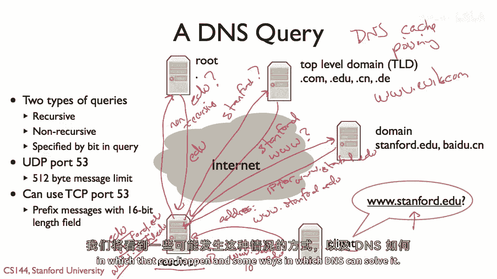

# P79：p78 5-8 DNS 1 - 加加zero - BV1qotgeXE8D

这是关于域名系统或DNS的三个视频之一，让我们再看一个URL一会儿，如果我们看一个基本的URL，就像你会在你的Web浏览器中输入的那样，它由三个基本部分组成，它首先在前面，应用协议导入。

所以这是说我们将请求一个文件过HTTP，并且默认默认这意味着端口八十，TCP，端口八十，你也可以在主机后面添加其他东西来告诉这个URL，说端口一千一百一或者什么，但是默认这意味着端口八十。

名称的中间部分指定主机，所以在这种情况下，Cs one forty four cs dot stanford edis，一个人类可读的名称，由点分隔成四个部分，并指定我们想要联系的实际节点是。

然后文件说HTTP的应用级别，一，HTTP请求我们要的文件的应用水平规范是什么，因此，到目前为止的问题，我们一直在以IP地址谈论互联网，通常我，P，V，当我们输入URL时，有四个地址。

我们有一个描述我们要联系的主机计算机的人类可读名称，问题是我们如何将人类可读的名称翻译成IP地址，很好，原来你可以，当然，而不是使用主机名，而是输入一个URL，只需要输入IP地址，所以你可以。

而不是输入eu。cs。one-four-four。cs。net，你可以实际上输入与该名称相关联的IP地址，如果你愿意，但这些人类可读的名称非常，非常有用，人们从互联网的开始就意识到可读人名的重要性。

所以，在那个互联网还很小的时候，有一个文件叫做host stock text，结果发现，互联网上的每一个主机都在host stock text文件中，由网络信息中心维护，所以，它被维护在sri，所以。

sri nick arpa在这个特定的ip地址，所以，如果你去阅读rc nine fifty two，它稍微谈了一些这个，实际上，如果你是互联网上的一个节点，你所做的就是定期联系这个节点在sri。

并使用文件传输协议下载其新的版本，这个新版本将包含所有有新主机，然后，你将能够将这些主机名称映射到IP地址，当然，如果你没有太多的主机，这不坏，但一般来说，那个规模的n的平方在定期时需要的网络容量。

n个节点将请求长度为n的文件，因此，这不被认为是可扩展的，不是一个长期的好解决方案，对于只有几个主机来说，它很好，但随着互联网的增长，它显然，迅速变成了一个问题。

这就是导致被称为域名系统或dns的东西诞生的原因，dns的基本问题是试图解决基本任务，试图完成的任务是将名称，人类可读的名称映射到地址，或者更一般地说，现在的这些天，映射到值，最初是为了映射IP地址。

现在，你可以用它来做很多事情，并且域名系统有一些设计考虑因素，首先，我们希望能够处理大量的记录，理论上，有2到3个，2个IP地址，我们应该能够以这种顺序映射名称，嗯，此外，我们还希望有分布式控制。

主机文件的一个问题是存在一个单一的中心化仓库，我们应该说，你可以管理这个名称集，你可以管理这个名称集，所以斯坦福，你可以在斯坦福管理名称，但亚马逊，你可以在亚马逊管理名称，此外。

我们希望这个系统对单个节点的失败具有 robust性，失败，它不应该是如果一个节点失败，整个域名系统就崩溃，因为如果是这样，那么我们突然就无法将名称映射到地址，然后很多事情都会停滞不前。

所以你想要 robust，这可能看起来是一个极其挑战性的问题，我们要处理数十亿个记录，分布在整个互联网上的层次结构，这是 robust的，但也有两个事情，最终使这个问题变得可行，使它成为可能的，设计上。

我们可以处理分布式的层次结构，并且对失败具有 robust性，但是有两件事情，最终使这个问题变得可行，使它成为可能的，设计上，我们可以处理分布式的层次结构，并且对失败具有 robust性，第一句是。

这个将名字映射到值的数据库主要是只读或读写混合，并且对它有更新，但你通常期望它会被读得多于被写，感觉，它不是像我们有节点和节点不断进出那样，但与我们查找笔记的速度相比，这一点微不足道，此外。

我们不需要完美的一致性，你可以有一个叫做宽松一致性的东西，所以如果一个节点连接到互联网，或者如果说一个节点，一个名称和地址之间的映射发生变化，没关系，如果所有人都看不到这个变化有一些延迟。

可能会有一些人比其他人更早看到它，没关系，如果有一些延迟，结果发现这两个属性一起，那就是一个主要读的数据库，那就是没关系，如果事情稍微过时，允许DNS具有广泛的缓存，想法是一旦你有结果。

你可以长时间持有它，然后可能当它过期时，请求一个新结果，但而不是有一个地方，说那里必须为所有事情询问，你可以问一个地方一次，然后缓存那个结果并回答它为其他人，所以你可以查找一个名字。

然后可以长期保留结果，然后使用它来回答其他查询，所以记住一个要求是名字必须是层次化的行政，那就是你可以分配名称的管理，为了实现这一点，dns使用名称的层次结构，我们都熟悉这个。

所以最上面有隐含地被称为点，或者被称为dns名称空间的根，它就是它，这就是一个什么也不是的东西，这是一个空名字，所以这些被称为根服务器，只是点，然后在他们下面是什么我叫顶级域名，Tlds，例如eu。

Com org，嗯嗯，法国和中国，然后，在每个顶级域名的下面，有我们通常认为的域名，比如stanford edu，或者cisco dot com或者baidu cn，当然，在这些域名中。

域名的所有者可以分配额外的名字，额外的域名，所以，例如，在stanford，通常，斯坦福下面只有一级名称，所以有cs点，斯坦福edu，嘟嘟嘟嘟点，斯坦福edu，伯克利有另一层，所以有cs伯克利。

有cs域名，然后下面是cs域名下面的名称，类似于www，Cs，伯克利，Edu，同样谷歌有地图，谷歌点，Com，所以现在DNS服务器的工作方式是，存在一种层次化的区域，有根区域，然后TLDs，然后。

就有域名，然后，还可以有子域名，所以，斯坦福，例如，正如你们所见的，它确实有一个由大卫·马齐尔管理的子域名cs，关键的是，每个这些区域都可以单独管理，所以，斯坦福可以给大卫·马齐尔域名cs。

所以它会回答关于cs的问题，然后，大卫可以完全控制cs下面的所有主机名，同样，我也可以授予斯坦福名为斯坦福的名称，但是， then 这就完全取决于斯坦福来管理所有在斯坦福下面的名称，此外。

每个区域都可以由多个复制的服务器提供服务，因此，而不是有一个服务器提供斯坦福的名称，实际上有很多复制的服务器，并且有一些规则关于他们是如何复制的，所以，想法是如果一个服务器崩溃。

有其他服务器可以仍然回答关于斯坦福的问题，因此，结果显示根区，所以，这个区域，你会问嘿，关于欧盟应该问谁，这里有标记为a到m的十三台服务器，它们高度复制，嗯，所以，有一种你电脑的启动过程。

第一次启动时想要询问一个名称，它一无所知，它需要联系根服务器以联系，例如，顶级域名服务器，但它如何找到根服务器，原来这些通常是IP地址，存储在名称服务器文件中的一个名称中，名称服务器出现，嗯。

它有一些根服务器的IP地址，然后第一个到来的查询，让我们假设它是为斯坦福。edu，它知道它需要联系。edu服务器，所以它可以问根服务器，嘿，谁有edu，然后当它得到响应时，谁有edgy。

你可以联系edgy服务器，嘿谁有斯坦福，除了这些十三台不同的服务器，它们通过叫做any cast ip n castle的东西高度复制，结果发现有许多机器有相同的IP地址。

这基本上导致你联系离你最近的一个，这使得根服务器高度、高度 robust，当你听到关于，嗯，嗯，大规模分布式拒绝服务或ddos攻击对根服务器的描述时，这就是他们在谈论的。

人们正在试图攻击dns根服务器以防止，基本上导致dns，dns系统停滞不前，到目前为止，还没有人成功，因为这些服务器太多了，它们如此 robust，而且事实证明，他们的工作如此简单，人们还没有能做到。

但他们一直在尝试，所以，这里有一张地图，嗯，dns根服务器的分布图，a，b，c，d，e，f，g，h，i，j，k，l，嗯，嗯，嗯，J K L M，我的意思是，所以，色彩斑斓的，嗯，所以。

这里有所有这些不同，服务器，或者服务器，A A B A B D E G H L，然后是对于CF的任何实例的cast，i，J KM，你可以看到他们分布在全世界，所以，这意味着说，如果你某人，在。

你知道我们处于，沙特阿拉伯，并且你想要在你的dns服务器上发布它，并且你想要发出dns查询，你不必走很远，有一些非常靠近的，好的，所以这就是基本的命名架构，并且有一种感觉，关于DNS服务器。

以及它们如何结构化这些层次，所以，查询实际上看起来什么样子，所以，DNS查询有两种类型，递归和非递归，递归查询问你联系的服务器来解决整个，整个查询，所以你在问它一个问题，如果问题有多个步骤。

那么它应该问每个步骤，嗯，与非递归查询不同，你将联系服务器的地方，只会回答查询的一步，我会在第二个地方解释这个差异的原因，在查询中你只指定一点，来说明它是递归的还是非递归的。

递归查询所以DNS通常使用UDP端口53，并且有一个512字节的消息限制，你可以使用TCP端口53，然后所有的dna，所有的dns消息都有，嗯，一个十六位长度字段来说，你知道它们有多长。

因为它们不是数据包，它们是一个流，所以让我们说，我是一个客户端，所以这里是我和我想要问一个问题，嘿，www的ip地址是什么，斯坦福 edu，所以使用dhcp，我有一个DNS服务器的地址。

所以让我们在这里简单地叫这个解析器，所以它有一些地址r，所以我发送一个DNS请求或查询，说我需要www的IP地址，斯坦福，edu，我将这个消息发送到解析器，所以我在询问地址，www的，点，斯坦福，点。

edu，我以递归查询的方式问了这个问题，所以解析器将为我递归解决整个查询，嗯，假设我的解析器没有任何缓存，它不知道世界的任何事情，它只有一些根服务器的IP地址哦，首先它会做，它需要找出向eu提问的人。

所以谁，eu的服务器在哪里，所以它向一个根服务器发送查询，说嘿，我应该向谁询问eu，这是一个非递归查询，我不能向根服务器询问根服务器来回答我的，整个查询，开始联系其他人，他们只会回答一步，回答嘿。

我应该向谁询问eu，根服务器会发送响应，说，这里有关于你应该向谁询问的信息，现在解析器知道，好的，现在我有，我可以缓存edges的条目很棒，我可以把它放入我的缓存中，这是IP地址，我应该联系。

如果我有关于eu的问题，让我联系那个IP地址，它会问eu嘿，我应该再次向斯坦福询问谁，这是一个非递归查询，edges服务器会说，好的，你听到一些关于你应该询问关于斯坦福的信息，然后我可以缓存那个结果。

并询问那个服务器是域名服务器，所以现在我要说斯坦福，www的地址是什么，斯坦福可以回应并说，啊哈，这里是地址，对于www那个斯坦福点edu，然后解析器可以缓存这个结果，www点stanford点edu。

现在解析器可以缓存这些值的，如果我想要问关于边缘的问题，我应该与哪个dns服务器交谈，如果我想要问关于stanford edu的问题，我应该与哪个dns服务器交谈。

并且www点stanford点edu的地址是什么，然后它可以将这个结果返回给客户端，这里是www www stanford点e的ip地址，因此，dns查询的基本操作就是这样。

它始于客户端向解析器发送递归查询，解析器可能然后向网络中的服务器发送非递归查询，为了生成它然后发送给客户端的响应，也可能是解析器已经回答了这个问题，所以，而不是去问所有这些服务器。

只是从它的缓存中回答了这些问题，所以如果几分钟后另一个客户端问同样的问题，嘿，www的地址是什么，stanford。edu，这个解析器而不是联系任何人，任何人都可以简单地返回缓存结果。

所以如果你在这里的新闻中听到关于dn的噪音，不是关于dns的噪音，缓存污染，dns有这一方面，这些，嗯，嗯，攻击，试图处理的是，或者试图利用，如果你能成功地将不良记录输入解析器，那么那是什么？

某种方式让它相信你知道www，www，我们斯坦福，edu实际上指向，你知道，www邪恶的点，com，或者是某种这样的东西，如果你试图去斯坦福，并且说你去了一些邪恶的黑客服务器。

如果你能将那个缓存条目放入解析器和污染缓存，任何问这个问题的人都会得到那个答案，所以在课程的后期我们将讨论安全，我们将看到一些这种情况可以发生的方式。

