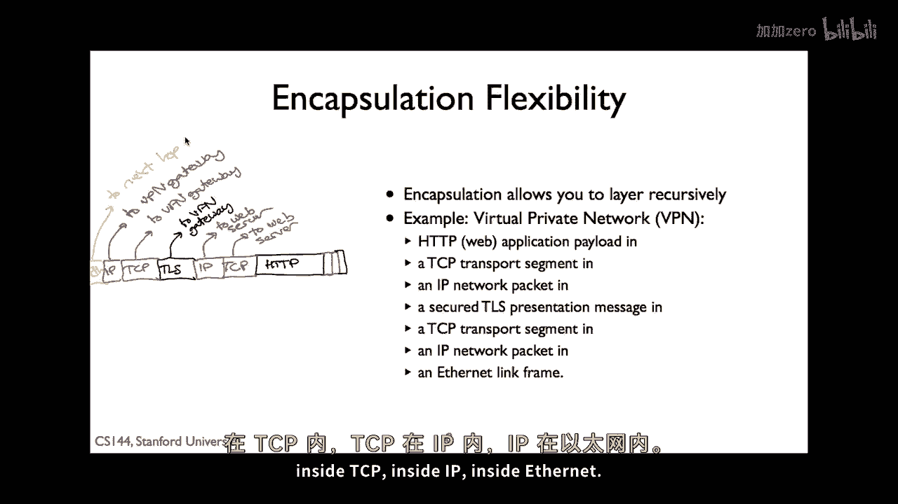
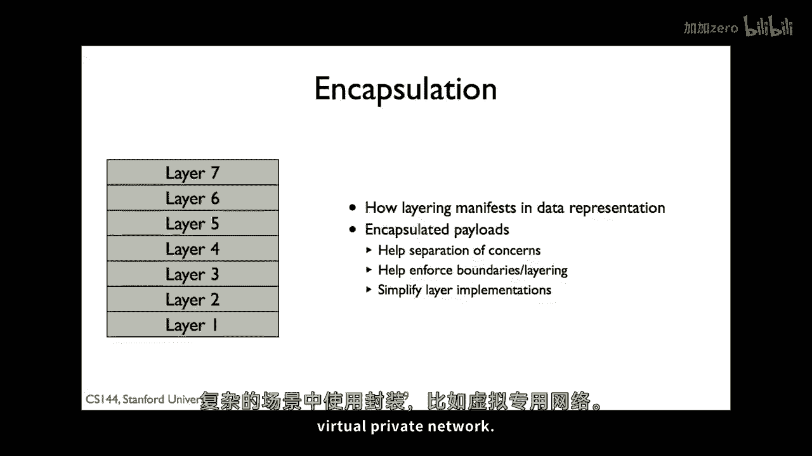

# 计算机网络原理 P8：封装原理 🔄

在本节课中，我们将要学习计算机网络中的一个核心架构原理——封装。封装是分层和分组交换思想结合的产物，它定义了数据如何在网络中被打包和传输。

## 概述 📋

封装是组织分组内信息的原则，它允许我们维护分层的独立性，同时让不同层的数据共享同一个分组。简单来说，封装就是将数据像“俄罗斯套娃”一样，一层一层地包装起来进行发送。

## 什么是封装？ 🧩

上一节我们介绍了分层模型，本节中我们来看看分层思想在数据包中的具体体现——封装。

当您发送数据时，例如一个TCP分段，它并不会单独在网络中旅行。这个TCP分段会被放入一个IP分组中，而IP分组又会被放入一个链路层帧（如以太网帧）中。这个过程就是封装。

**封装** 就是将高层协议的数据单元，作为低层协议数据单元的负载（Payload）进行打包的过程。其核心关系可以表示为：
`高层数据单元` -> 成为 -> `低层数据单元的负载`

## 分层与封装的协作 🤝

分层将复杂系统分解为独立的模块，而封装是实现分层协作的物理机制。

*   **分层的好处**：每层提供特定的服务，并对上层隐藏实现细节。只要接口不变，上层无需关心下层的具体变化。
*   **封装的角色**：封装使得这种“隐藏”成为可能。每一层只处理自己头部/尾部的信息，并将内层传来的整个数据包视为自己的负载。

这种设计带来了巨大的灵活性：
*   **独立进化**：例如，传输层的TCP协议可以优化其算法以应对网络速度提升，而应用层的HTTP协议无需做任何修改。
*   **关注点分离**：网络层（IP）只关心寻址和路由，不关心负载是TCP还是其他内容。

## 封装的数据包结构 📦

那么，封装在数据包中具体是如何表现的呢？每个协议层的数据单元通常由三部分组成：

1.  **头部（Header）**：包含本层协议的控制信息，如地址、序列号等。
2.  **负载（Payload）**：即来自上层协议封装好的完整数据单元。
3.  **尾部（Trailer）**：部分链路层协议有，用于差错校验等。

以下是一个从应用层到链路层的封装示例流程：
```
HTTP GET 请求
    ↓ (封装为 TCP 段的负载)
TCP 段 [TCP头 + HTTP GET]
    ↓ (封装为 IP 包的负载)
IP 包 [IP头 + TCP段]
    ↓ (封装为 WiFi 帧的负载)
WiFi 帧 [帧头 + IP包 + 帧尾]
```
最终在链路上传输的字节流，最外层是WiFi帧的格式。

## 数据包的两种绘制方式 🖍️


在技术文档中，你可能会看到两种不同的数据包绘制方式，这源于不同的技术背景：

1.  **“右边开头”法**：头部画在右侧，数据从左向右发送。第一个发送的位在最右边。这种视角常见于硬件和网络设备设计，侧重于数据流的时序。
    ```
    [ 负载 ... 头部 ]
    ```


2.  **“左边开头”法**：头部画在左侧，数据从内存地址0开始存放。第一个字节在左边。这种视角常见于软件和协议规范（如IETF文档），侧重于内存布局和解析。
    ```
    [ 头部 ... 负载 ]
    ```

两种方式没有对错之分，了解其背景有助于阅读不同资料。

## 实战观察：Wireshark 中的封装 🔍

理论需要实践验证。使用网络封包分析软件（如Wireshark）可以直观地看到封装。

在Wireshark捕获的一个数据包中，你可以清晰地看到层层嵌套的结构：
*   最外层被识别为 **以太网（Ethernet II）帧**。
*   深入一层，看到内部的 **IP 协议包**。
*   再深入，看到 IP 包负载中的 **TCP 段**。
*   最内层，则是 **HTTP 协议**的明文请求（如GET）。

点击每一行协议，Wireshark会在下方的原始字节数据中高亮对应部分，生动展示了“套娃”式的封装结构。

## 封装的强大之处：递归封装 🚀

封装并非一成不变的四层结构，它可以递归进行，实现复杂的网络功能。一个常见的例子是虚拟专用网络。

假设你需要通过公共互联网安全地访问公司内部网络：
1.  你的电脑照常生成 **HTTP** 请求，封装进 **TCP** 段，再封装进目标为内部服务器的 **IP 包**（**内部IP**）。
2.  由于不能直接发送，你的电脑将这个**内部IP包**整个作为负载，用 **TLS** 协议加密保护。
3.  加密后的 **TLS 记录** 被封装进一个新的 **TCP** 段。
4.  这个新的 **TCP 段** 再被封装进一个目标为VPN网关的 **IP 包**（**外部IP**）。
5.  最后，这个**外部IP包**被放入**链路层帧**发送出去。

这个过程形成了递归封装：
`HTTP` ⊂ `内部TCP` ⊂ `内部IP` ⊂ `TLS` ⊂ `外部TCP` ⊂ `外部IP` ⊂ `链路帧`

通过这种灵活的封装，我们仅需保护到VPN网关的通道，就能安全地接入整个内部网络。



## 总结 🎯

本节课中我们一起学习了计算机网络的核心原理之一——封装。

*   **封装** 是将分层和分组交换统一起来的机制，它通过将高层数据作为低层数据的负载来实现。
*   封装保持了各层的**关注点分离**，允许协议独立发展和优化。
*   数据包结构包含**头部、负载和尾部**，从内到外层层嵌套。
*   封装可以**递归**使用，以实现像VPN这样的复杂网络服务，展示了其设计的强大灵活性。



理解封装，是理解数据如何在网络分层模型中流动的关键。