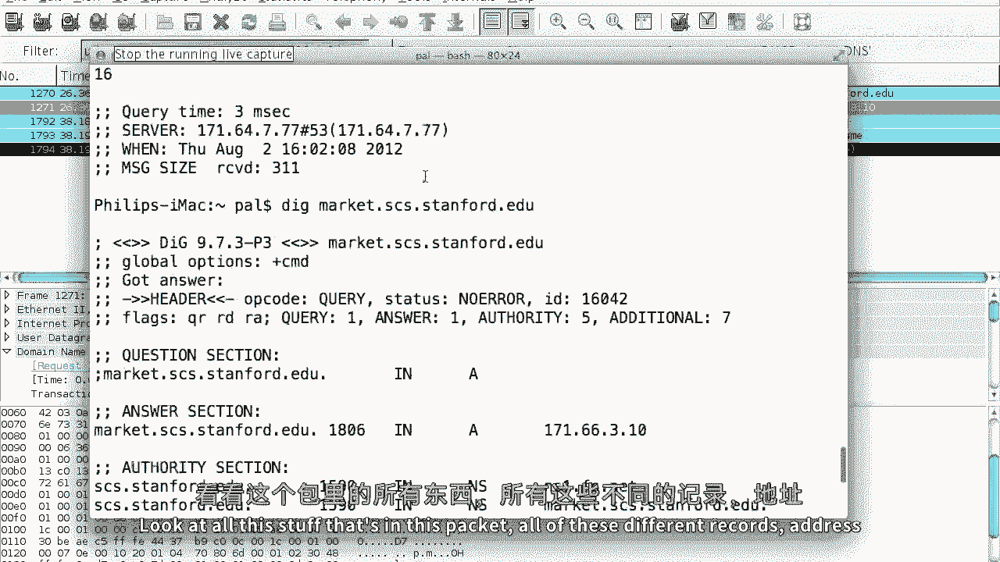

# P80：p79 5-9 DNS 2 - 加加zero - BV1qotgeXE8D

这个视频详细解释了DNS查询的实际外观，以及它们的格式，和结构，所以查询和组成它们的资源记录，以回忆DNS查询，嗯，始于客户端，例如，它询问解析器，www是什么，点斯坦福，edu，这是一个递归查询。

然后解析器可能要么从其缓存中回答，嗯，或者使用缓存条目，如果解析器没有查询任何阶段的缓存条目，它可以向外部服务器提问，那么我应该向谁询问edu，我应该向stanford。edu询问谁，嗯，嘿，www。

stanford。edu是什么，所有这些都是非递归查询，然后解析器将缓存这些结果，所以edu。stanford。edu和www。stanford。edu，这就是一个高层次的查询，但在细节中。

DNS的工作方式是，所有DNS消息中的DNS信息都表示为称为资源记录的东西，我们的资源记录，资源记录的格式通常相当简单，它有一个名称，所以，这是一种资源记录，可以说是这个记录的名称。

与这个记录关联的名称，可以有一个生存时间（TTL）在类中，然后有记录类型，然后是记录数据，所以，例如，嗯，一种资源记录可能是命名为，例如www。stanford。edu，所以这是关于www的记录。

stanford。edu，TTL，这个记录的有效时间有多长，好类，这是对地址类的记录，嗯，通常总是，嗯，我是一或二，它通常是类一，所以对于互联网来说，对于互联网，有记录的类型，然后有数据。

所以接下来我将介绍两种关键的记录类型，资源记录类型，类型a是，一个，IP地址和ns，它是名称服务器，所以a记录告诉你与名称相关联的地址，所以它会说输入a，数据类型是地址，这是与名称相关联的地址。

而名称服务器记录ns记录，嗯，它会告诉你与名称相关联的名称服务器地址，所以这是一种探索的好方法，嗯，DNS和记录看起来什么样子，以及你可以获得的记录类型，是通过使用这种叫做dig的酷工具。

我会多次使用dns消息，嗯，一个实际的dns消息，它的结构按照rfc十三十五中的规定来看是这样的，所以在开始部分有一个头部，它描述了消息中包含的总体内容，这是这消息是为什么而问的，如果是查询。

那么它是查询的问题，如果是响应，那么它是问题的响应，它是对某个问题的响应，然后还有其他部分，这些部分是空的，询问，答案权威，还有其他部分，因此，例如，你可以发送一个包含多个问题的dns查询，如果你愿意。

每个这些部分都可以有多个条目，所以有标题，和问题，答案，权威，并且附加部分都是由资源记录组成的，所以让我们来看看这个例子，所以如果我挖wwwe，www，斯坦福，u，我在问，嗯，我基本上在说。

我想要查询"www"地址的DNS记录，斯坦福大学，"这就是我们看到的"，"回来在这里"，"这是今天的输出，告诉你dig的版本号。"，"这是标题"，"一些标题信息"，"我们稍后再谈谈那个"。

所以这就是我为www。stanford。edu地址记录询问的问题，所以你看，这里有一个资源记录，甚至问题部分，嗯，和答案，嗯，它里面有两个记录，第一个被称为C名称记录，我们稍后会谈谈这个。

但基本上它说www。stanford。edu实际上是那个的规范名称，那么'C name'代表什么，'C name'代表的是www。v6。stanford。edu，所以有六个不同的，也许有六个不同的，嗯。

斯坦福有六个不同的，然后www。v6的地址是，这里是互联网，所以是一，这就像是一个班级，ttl是一千八百，这是一份记录，用于这个地址，嗯，此外，权威部分告诉我谁是权威名称。

这些是斯坦福edu的名称服务器记录，所以这里是所有这些不同的服务器，我可以询问斯坦福的地址，嗯，然后附加部分，然后给我提供了一大堆额外的东西，比如这里是argus的地址记录，这是埃瑞西亚的地址记录。

这是亚特兰大的地址记录，这是亚特兰大，这是阿瓦隆的地址记录，真的要想想DNS经常在做什么，你之所以看到这条消息这么大，是因为，是因为它打算发送一个响应，所以它试图向你发送大量的额外数据，大量的额外信息。

只是为了可能防止你再次询问，因此，这些都是记录，这些是IP地址，V有四个地址，因此，有四个记录，AAA，这些是IP地址，V有六个地址，因此，结果显示斯坦福的DNS服务器正在给我。

不仅提供了斯坦福名称服务器的地址记录，而且，它们不仅提供了A记录，但是，也包括i，P，V，六，如果我想要查询它们，我会使用i，P，V，六，所以，这就是DNS查询响应的样式，所以你可以看到，这里有头部。

这是问题部分，这是答案部分，这是权威部分，然后是附加部分，所以如果你看到头部，嗯在rfc十中指定，嗯三十五，嗯，头部是嗯，十字节长，对不起，长度为12字节，所以相当短，嗯，前两个字节是ID。

你可以将查询和响应配对，嗯，然后第二个，所以前两个字节是ID，后两个字节是一些标志，所以有我提到的那个位，这是否是查询或响应，有操作码，嗯，所以标准查询，嗯，还有返回码，如果有错误码，那么有一堆标志。

嗯，所以这是不是权威的答案，是否截断，所有这些类型的事情，所以你可以在这里看到，并且所需的底部递归和可用的递归都存在，有一些方法你可以，实际上，你可以询问你的决断或者非递归的查询，如果你想要，然后。

在这些第一个四个字节之后，有四个两字节的值，它们告诉我们每个部分中有多少资源记录，所以，有多少查询，有多少嗯答案，有多少，嗯，嗯，现在有多少权威机构，现在又多加了多少记录，然后。

在这些包含资源记录的四个部分中，资源记录很简单，嗯，它有一个可以变长字节数的名称，取决于，它多长，然后有一类型，并且TTL，在rd长度字段中指定，嗯，R数据，所以这里是，基本的DNS名称，然后类型。

然后类，TTL rd长度我们的数据，所以这就是，在网络上以资源记录字节格式出现的数据看起来像这样，现在请注意，资源记录的开始是一个名称，但它没有说名称有多长，这是因为名称的长度是由自己描述的，嗯，结果。

dns做了很多名称压缩，因为它试图把所有的东西都打包在512字节中，然后，通过包中重复的名称，而不是重复它们，只是引用，那么想象一下，如果我在询问关于，例如ww，斯坦福，的信息。

我并不一定想在包中重复很多次，我可以只放一次，然后引用它，所以DNS的第一件事是它将名称分解为单独的标签，与层次结构的步骤有关，所以www。stanford，Edu是三个独立的标签。

WWW斯坦福和edu，然后每个标签都被编码为一个长度，然后文本值，所以长度是以二进制的形式存在的，所以基本上，嗯，一个数字只是一个字节，嗯一个字节，嗯，然后文本是以ASCII的形式存在的，所以例如。

如果我要编码三个WWW，所以W是零x七七，这种方式将被包括在比特中，在包中是零三七七七七七七七七七，这告诉我这些是三个字节，这里是它们，嗯现在有一个技巧，然后名称压缩使用的，为了利用事实，名字将会更长。

在包中重复几次，是如果这里在标签中的长度字段大于192，嗯，这是一些更难的位被设置，然后接下来的14位指定包中的偏移量，所以这种想法是如果我看到这里，长度字段中的前两个位，所以128加64是一。

92是一一，那么这个长度实际上是两个字节长，这个长度字段，和后来的14位指定包中的偏移量，例如，如果我看到零xe000c，这意味着这个标签所指向的名称是这个值，减去嗯，去掉前两位是在第12个包偏移量中。

所以如果我只是去第12个包偏移量，这就是这个标签所指向的，所以，如果我有像斯坦福这样的东西，它长度是8个字符，而不是重复斯坦福，实际上会更多是一个第九个字符，因为他们需要长度，我会是零。

我会是零x008，然后斯坦福的字节，我只能说零乘以零等于零，"然后斯坦福的偏移量将只有2个字节长"，所以有点详细，"但是，当我们遇到时，这一点非常重要。"，"当我打开鲨鱼酒吧来向你展示一些DNS时"。

"问题和回答看起来像"，否则真的很难理解，等待，这些是什么资源记录，"而这些奇怪的值，它们实际上并没有指定名称是什么？"，所以，只是想给你一个概念，所以，DSA是什么。

DNS A 或地址记录看起来什么样子，所以，这就是说对于市场 scs stanford edu，所以，第一个，名称区域会说市场 s stanford edu，这可能会被压缩，所以，它可能会大大缩短。

然后，接下来的两个字节会说一，这是地址记录，接下来的两个字节会说一，这是下一代互联网的，嗯，四字节表示3600，所以这记录的用途，生存时间为一小时，嗯，然后R数据的长度，互联网地址的长度为四字节。

然后这里是四字节，所以如果你看到它打印出来，你说你是否在使用dig，你会看到这样，但是总体记录实际上看起来像这样一个s记录，说scs。stanford。edu的名称服务器记录相似，在这里。

我们使用scs代表eu在名称部分，再次，它可能已被压缩，然后我们有两个，嗯，说明对互联网时间到活的ns记录有一个，三千六百，嗯，然后长度说十，嗯，因为事实证明，cs。stanford。edu被压缩了。

因为 elsewhere 已经有提及，所以实际上，我们有任务一、二、三、四、五、六，嗯，七对吧，然后我们有针对的，任务的长度，然后是两个，它是 cs 压缩的指示，斯坦福大学使用了前两个字节。

而我们的数据将指向 scs。stanford。edu，然后我们有一个字节，表示任务的长度是七，和七个任务字节，总共为十个字节，所以让我们去挖掘市场，Cs at stanford edu，所以只使用工具。

看看会发生什么，所以我们在问，市场s的地址是多少，edu代表什么，我们在询问地址记录，我们得到了答案，嗯，它的地址是17166。310，嗯，点310，这里是生存时间2550。30部分。

这里是回答这个问题的名称服务器，这里有很多，Fs mission to cs dot stanford，edu，这里是对这些名称服务器的一些额外信息地址记录，这就是它看起来的样子，当你问它时。

我们也可以问dig，市场记录是什么，对于s点stanford。edu，所以这里是查询s发送给edu的记录，你看，有很多域名服务器提供服务，Cs代表s三和s一车库市场使命，然后这里是附加部分。

它将给您提供他们的ip地址，其中一些只是IP地址，V，四个地址，其中一些是IP地址，V，四个和IP地址，V，六个地址，因此，我们可以在这里看到有这么多名称服务器，这意味着如果这些中的任何一个崩溃。

我还能表演，我还能去另一个地方，所以即使说这三个名称服务器都崩溃了，让我们假设n s三，嗯，车库和市场，我还能联系，一项任务是询问关于名称和scs的问题，斯坦福edu。

所以现在让我们看看那些查询在wireshark中的样子，所以这里我打开了鲨鱼酒吧，并设置了一个过滤器，EDP端口53，这样DNS端口和IP添加器，我的IP地址将查看DNS，请求和响应，嗯，从我的机器。

所以如果我们问，这个问题是什么，dig market。cs。stanford。edu，我们看到我们收到了一个查询和一个响应，所以这里是一个标准，嗯，DNS查询又对了，互联网协议版本四源。

这是我的DNS服务器，嗯，所以这里是查询，有一个标准查询，有一个问题，没有其他记录，因此，问题来了，market cs是否代表edu，嗯，输入a，所以我在寻找地址记录类，嗯。

market cs在名称中代表edu，输入a，主机地址类，互联网，所以这里，实际上，我们在查看数据包的字节，嗯，这里有关于大小的所有信息，我们可以在这里看到，这些字节是零零零零零，这里是这个。

这是DNS交易ID的头部，在那里，零x三，eea标志，问题，等等，零零，然后这里是查询本身，所以这是查询部分，这是市场cs，斯坦福edu，如果你往下看字节，这字节，第一个市场字节是零六。

这是因为市场有六个字符长，所以我们有零六和m a r k e，然后cs是三个，所以三长，三个s c s，然后斯坦福，这是八个长，所以这里是八s t a n f o r d um，然后三长edu。

然后那就是，然后输入一个零一零的类，我现在是零一零，如果我们看响应，它更复杂得多，因为记住响应中有多少条记录，所以让我们看看这个，所以它在告诉我们，这是为了交易，Id零三eaa和错误响应，有一个问题。

有一个答案，有五个权威，现在是七个附加的，让我们看查询部分，所以这里的查询你可以再次看到，市场点cs点斯坦福，Edu输入一个类，在这里是答案，Marcs代表edu，但这是地址，但现在如果你看这里。

这个资源记录的名称部分只有两个字节长，它使用名称压缩，所以这里是c零零c，它说的是看第一个两比特是一，这是一个压缩的名称，和名称的开始，是在包中的偏移量零c或十二，如果你要计算字节，在dns包中。

你会看到市场从字节十二开始，说这个名字就在这里，然后这里是type a，我是三十等等等，所以你可以看到，所以我们将取市场，Cs如果你想要完全压缩名称，但实际上你可以做其他类型的压缩，所以这里是权威的。

这里是对scs斯坦福eu的答案，我们再次看到，这个对于cs点斯坦福edu的名称是压缩的，所以c零是压缩的十三，所以这是一个地址，一代表十六，所以这是包中的地址十九，或偏移量十九，为什么十九呢。

如果你认为原始的市场cs名称，哪个是偏移量十二，然后有来自市场的长度字节，然后是六个市场的字节，所以总共是七个字节，所以包中的偏移量十九是scs stanford edu。

你可以不仅地址到标签系列的开始，但在那里任何标签，所以你会看到这种情况很多次，所以如果你开始做一些挖掘，一些请求并打开一个酒吧镜头，你会看到这种名称压缩，这在实践中意味着什么，对，是这包。

里面包含了所有这些信息，对，看看这个包中的所有东西，所有这些不同记录，地址记录。

名称，服务器记录，四地址记录，可以fit在三百十一字节中。

