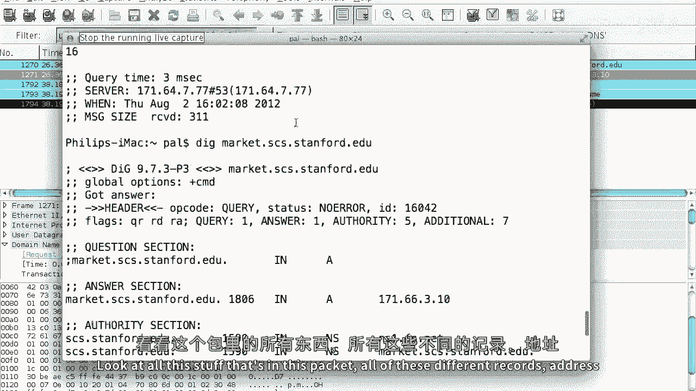

# 课程 P80：DNS 查询与资源记录详解 📡

在本节课中，我们将深入学习 DNS 查询的实际过程、消息格式以及构成 DNS 响应的核心单元——资源记录。我们将通过具体工具和示例，解析 DNS 消息的各个组成部分。

---

## 概述：DNS 查询流程回顾

上一节我们介绍了 DNS 查询的基本流程。本节中，我们来看看查询的具体格式和内部结构。

DNS 查询始于客户端向解析器发起递归查询。解析器可能从其缓存中直接回答，或者代表客户端向外部 DNS 服务器发起一系列非递归查询，最终将结果缓存并返回给客户端。

---

## DNS 消息的核心：资源记录

所有 DNS 消息中的信息都表示为**资源记录**。理解资源记录是理解 DNS 工作原理的关键。

资源记录的通用格式相当简单，包含以下几个字段：
*   **名称**：与此记录关联的域名。
*   **类型**：记录的类型（例如 A 记录或 NS 记录）。
*   **类**：通常为 `1`，代表互联网地址。
*   **生存时间**：记录在缓存中有效的时长。
*   **数据**：记录的具体内容，其长度由 `rdlength` 字段指定。

用代码描述其结构如下：
```
[名称] [类型] [类] [TTL] [rdlength] [rdata]
```

---

## 两种关键的资源记录类型

以下是两种最核心的资源记录类型：

1.  **A 记录**：将域名映射到 IPv4 地址。其**数据**字段包含一个 32 位的 IP 地址。
2.  **NS 记录**：指定负责该域名的权威名称服务器。其**数据**字段包含一个域名。

---

## 使用 `dig` 工具探索 DNS

探索 DNS 记录外观和类型的一个好方法是使用 `dig` 工具。

例如，执行命令 `dig www.stanford.edu` 会返回一个详细的 DNS 响应。这个响应不仅包含了我们请求的 `www.stanford.edu` 的地址信息，还可能包含规范名称记录、权威名称服务器列表以及它们的地址等额外信息。DNS 服务器倾向于在单个响应中提供大量附加数据，以减少客户端后续的查询次数。

---

## DNS 消息的详细结构

一个实际的 DNS 消息结构在 RFC 1035 中定义。其结构如下：

1.  **头部**：长度为 12 字节，包含事务 ID、标志位（如查询/响应、递归可用性等）以及四个计数器，分别指明后续四个部分各有多少条资源记录。
2.  **问题部分**：包含查询的问题，例如查询 `www.stanford.edu` 的 A 记录。
3.  **答案部分**：包含直接回答问题的资源记录。
4.  **权威部分**：列出负责该域的权威名称服务器。
5.  **附加部分**：提供可能与查询相关的额外信息，例如权威名称服务器的 IP 地址。

---

## 名称压缩技术

DNS 报文通常被限制在 512 字节内。为了高效利用空间，DNS 采用了**名称压缩**技术。

DNS 将域名（如 `www.stanford.edu`）分解为标签序列（`www`， `stanford`， `edu`）。每个标签前会有一个长度字节。当同一个域名在报文中多次出现时，后续出现的位置不会重复存储完整的域名字节，而是使用一个**指针**。这个指针占用 2 字节，其前两位设置为 `11`，剩余的 14 位指向报文中该域名第一次出现的位置偏移量。

**公式**表示指针：若长度字节值 `> 192`，则它与下一字节共同构成一个指针：`指针偏移量 = (字节1值 & 0x3F) << 8 + 字节2值`。

这意味着，在查看原始报文数据时，你可能会看到类似 `0xc00c` 的字节，这表示“名称内容位于本报文偏移量 12 字节处”。

---

## 在 Wireshark 中查看 DNS 报文

让我们通过 Wireshark 捕获的报文，直观地看看查询和响应的样子。

当我们执行 `dig market.cs.stanford.edu` 时，Wireshark 会捕获到一个查询报文和一个响应报文。

*   **查询报文**：相对简单，主要在问题部分包含了完整的域名 `market.cs.stanford.edu` 的标签序列。
*   **响应报文**：则复杂得多。在答案、权威和附加部分的资源记录中，其**名称**字段经常不是完整的字符串，而是像 `0xc00c` 这样的压缩指针，指向报文中较早出现的完整域名，从而显著减少了报文大小。

通过这种机制，一个包含了多条 A 记录、NS 记录和 IPv6 地址记录的响应，可以轻松地容纳在几百字节之内。

---

## 总结




本节课中，我们一起学习了 DNS 查询与响应的内部机制。我们深入探讨了构成 DNS 消息的基本单元——资源记录的格式和关键类型（A 记录和 NS 记录）。我们使用 `dig` 工具查看了实际的 DNS 响应，并分析了 RFC 1035 定义的 DNS 消息标准结构，包括头部、问题、答案、权威和附加五个部分。最后，我们揭示了 DNS 为了在 512 字节限制内高效传输而采用的**名称压缩**技术，并通过 Wireshark 验证了其在真实网络报文中的应用。掌握这些细节，有助于你更深入地理解域名解析的全过程。