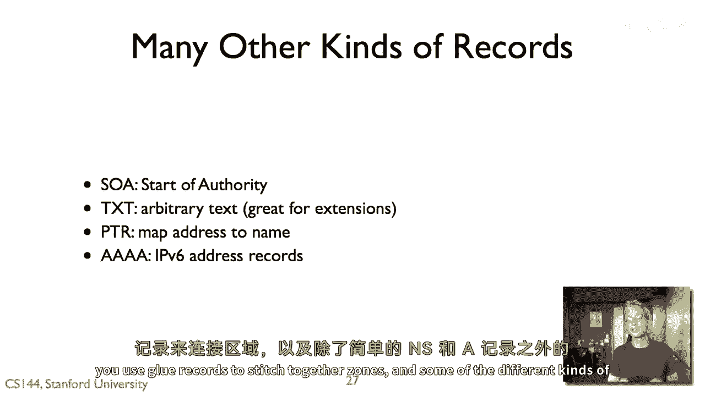

# P81：p80 5-10 DNS 3 - 加加zero - BV1qotgeXE8D

这个视频深入探讨了DNS查询响应序列的实际样子，所以假设你知道资源记录是什么，以及它们的结构是什么，从高层次的角度看，这个客户端发出递归查询的概念，然后非递归地发送到网络中的其他服务器，至于细节。

我的意思是在这个高层次，我有一个想法，即我发出递归查询，然后这导致解析器发出一系列非递归查询，以给我关于斯坦福。edu地址记录的最终答案，但是，它们是什么，这些查询的实际内容是什么。

响应的实际内容是什么，每个服务器需要了解的信息是什么，所以这个问题，在实际设置知识名称系统时，这真的很重要，你实际上是在设置域名，你需要在网络中配置名称服务器，这样你就可以实际提问。

人们可以访问你的机器和你的名字，所以大挑战，一个主要的挑战来自这个遍历区域的概念，嗯，所以有一天，我的名称服务器有一个根缓存文件，所以这就只给了一些根服务器的IP地址，这就是启动过程。

如果我只有这些IP地址，从那里，我可以获取TD TD名称服务器地址，从那里，我可以获取域名名称服务器地址和子域名等，所以，从高层次来看，它大致是有意义的，哦，我询问关于。edu，我问关于斯坦福的事情。

但是结果发现了一些技巧，所以想想NS记录，所以如果你记得DNS记录，如果我问一个域名的名称服务器是什么，DNS记录包含一个主机名，所以例如，如果我问斯坦福。edu的名称服务器是什么，答案是一个主机名。

所以让我们来查找斯坦福的名称服务器，Edu，答案是我们得到四个答案，这些主机名，Avalon stanford edu，August dot stanford edu，在亚特兰大，在斯坦福 edu，嗯。

Thea，Stanford edu，但是问题在于这些都是斯坦福的名字，我们如何获取这些名称服务器的地址，除非我们知道这些名称服务器的IP地址，这些是服务器，我们将询问什么，那些名字是。

所以存在一个鸡和蛋的问题，我们如何开始，考虑到我们被给予主机名，嗯，"因此，在这个域名系统名称系统中的解决方案是"，"有一种东西叫做胶片唱片"，"而且这意思是，当斯坦福连接到欧盟服务器并说嗨时，"。

这些是斯坦福的名称服务器，"它不仅给他们提供了服务器的名称记录"，"但也与记录相关联"，这些胶片记录，"因为这是意味着欧盟的服务器将要提供地址记录"，"斯坦福大学的记录"。

"仅对斯坦福的名称服务器有效"，尽管如此，他们在为stanford edu记录服务，所以，我们再次回到这个例子，你可以看到，一方面我在问，stanford edu的名称服务器是什么，但是。

附加部分还给了我他们的地址记录，这些地址记录存储在eu名称服务器中，所以，让我简单地走一遍，嗯，这个例子，所以我要做的是，我要去，嗯，查找www，stanford。edu的Cs，假设没有现金。

我将明确走一遍将发出的查询序列，我的方式是，使用无架选项，这意味着不要问递归查询，所以，第一步让我们深入挖掘，嗯，所以这要告诉我，我要联系一个根服务器，所以，我会联系一个根服务器，说嗨，嗯。

我该和谁说话，嗯，对于欧洲，因为它是非递归的，然后我会得到响应，响应说，这里是一些可以使用的服务器，所以，让我们假设这里是，嗯，我有一个服务器，所以这些是你可以使用的名称服务器，好的。

所以我要使用a eu服务器，我要说嗨，我应该问谁关于stanford点edu，edu，它会告诉我问argus到stanford，edu，你可以看到它也在给我a记录，嗯，argus的a记录。

所以我实际上有一个ip地址来问，然后我会问argus，嗨，我应该问谁关于那个，我们cs点stanford和argus会回答，哦，你应该问ns one fs点net和嗯。

或者你也可以问mission scs点stanford edu，哦，这里是mission cs点stanford edu的地址记录，所以在它的响应中，我现在知道如何联系这个ip地址。

我可以将这个记录放入我的缓存中，所以如果我然后做mission点dotcs在stanford点edu，我会得到a记录，实际上这就是mission点stanford edu。

dcs点stanford edge，它给我的是wwdotcs点stanford edu的a记录，是时候生活三六零零和ip地址了，地址是一七一六点三六六点九，我们刚刚看到的一个记录，除了a记录。

ns记录被称为c名称记录，或称标准名称，在dns中，c名称记录告诉你的是，嗯，一个名称是一个别名，嗯，正如你之前看到的，如果你dig www stanford edgy。

你会看到那实际上是另一个名称的别名，我说www dash v六点stanford点edu嗯，所以如果有一个c记录对一个名称，就不能有其他记录对它们，它正在告诉你，哦，这只是一个指针，嗯，常常会发生的是。

如果你问一个关于标准名称的查询，就不能有其他记录对它们，它就只是一个指向，它会告诉你，哦，嗯，对于某个别名名称，它会告诉你，哦，这个别名是这个标准名称的别名，然后这里是你想要的标准名称的记录，所以例如。

如果你挖ww stanford edge你，它会告诉你标准名称是这个其他名称，哦，这里是对于这个其他名称的记录，另一种类型的dns记录，而且这种真的很有价值的是，它们全部都很有价值，被称为mx记录。

它是一封邮件交换记录，并告诉你一个域名的邮件服务器，所以例如，没有主机，Cs stanford edgy，你不能ping它试试，但你可以发送电子邮件到cs dot stanford dot edg。

人们在那个域名上有电子邮件地址，所以这就是scs有一个mx记录，stanford edu说，哦，如果你想发送邮件到这个域名，你应该与这个服务器交谈，嗯，此外，mx记录会导致记录处理，所以如果我说嘿。

mx记录是什么，那么它会说，哦，这是邮件服务器的名称，这里是对于这个服务器的a记录，所以例如，让我们挖mx dot cs dot stanford dot edu，我们去看看，答案部分。

cs在stanford edu的mx记录，ttl三六零，它是互联网市场为cs到stanford edu的，此外，market4s在stanford edu的地址记录，是171166310。

并且这个10是一个偏好值来告诉你，如果可能有不同的服务器你想要，嗯，哪一个是最好的，所以，我们可以请求MX记录，所以，这就开始变得复杂一些，嗯，有趣，那么。

如果邮件服务器名称没有uh和MX记录会发生什么，所以，让我们尝试挖掘这个问题，嗯，MX，所以，让我们为您查询mx。s。com的MX记录，它会说，MX记录错误是cs144，cs代表那个边缘你。

但现在我们没有uh的A记录，嗯，对于这个，但是，这很奇怪，我们为什么没有cs一四四的a记录，点斯坦福点edu，那是一个有效的主机名，但是，出于某种原因，名称服务器无法给我们提供a记录，所以。

如果我们查找，让我们只是挖cs一四四，那个cs对你来说并不存在，如果我们在这里查找，原来斯坦福大学的cs one forty four是一个www。dot。cs。to。stanford。u的c名称。

所以它实际上是这个的别名，而且这里是你去探索这些有趣的边缘情况和协议的地方，这些设计方式中的东西，结果发现可能有一些你可能没有预见到的影响，实际上我的意思是，可以说是一种，也许一个，好主意，关键是。

你的mx记录并不是人们正在查看的东西，这是用来机器使用的东西，所以你不应该把它指向别名，如果你把它指向别名，那么你就是在DNS层次结构中强制引入另一个级别的间接性，这对此没有帮助，考虑到这只是机器。

这不是人，这是一个召回，当你查找MX记录时，你也会得到与相关A记录的处理，但是cs one forty four没有a记录，它有一个cum记录，而且它具有c记录的事实意味着它不能具有任其他记录。

因此存在这样的方法，如果你将mx记录指向别名，它将迫使人们进行另一次查找，因此，这是一种创建负激励的方式，嗯，以促使你做出这种选择，因此，这两种记录之间的交互方式是这样的，它们如何处理，嗯。

这是一种构建系统更高效的方法，除了记录之外，还有quad记录，Ns记录，Mx记录和crecords，还有其他各种各样的记录，有起始权威记录，这些记录给你关于DNS信息实际缓存的信息。

有一种叫做文本记录的东西，这是一种将任意文本放入的方法，这样你就可以将任意文本与一个名称相关联，这是对扩展的一种 great 方式，人们已经探索了各种各样的新服务，使用文本记录。

允许你在歌剧和工作网上玩一些东西，然后可能过渡到一种新的、特定的记录类型，嗯，还有一种叫做指针记录的东西，它进行反向映射，你查找一个地址的指针记录，它会给你一个名字，如果存在，嗯，或者它知道它。

然后像我们之前看到的一样，被称为quad a记录，或i，P，V，"六条地址记录"，他们具有428位，我，"P" 的中文翻译是 "P"。"V"的中文翻译是"维"。"它们包含六条地址"，"所以。

这就是那种琐碎的事情。"，"DNS的粗糙细节"，"缓存的信息"，"你怎么使用胶水记录来缝合区域"，并且你们有一些不同种类的记录。

