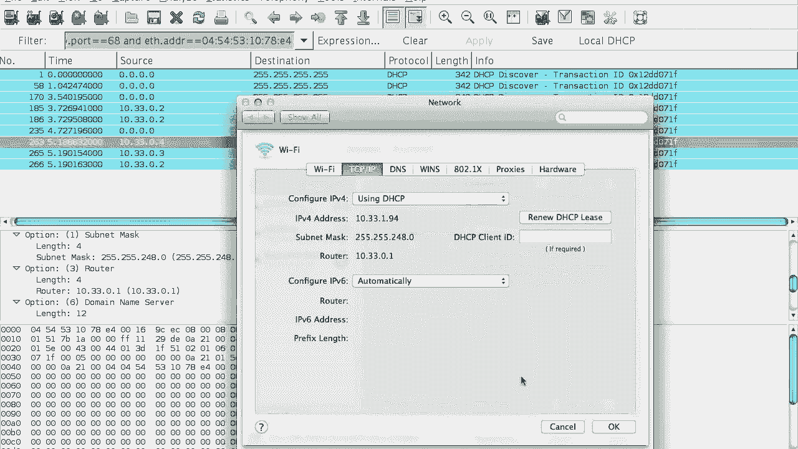

# 计算机网络课程 P82：DHCP 动态主机配置协议 🖧

在本节课中，我们将学习动态主机配置协议（DHCP）。DHCP 是您每天访问互联网时都会用到的协议，它负责自动为网络中的设备分配必要的网络配置信息。

## 概述

主机要在 IP 网络上通信，需要获取几个关键信息。过去，这些信息需要手动配置，效率低下且不灵活。DHCP 协议的出现，解决了这些问题，实现了网络配置的自动化和动态管理。

## 主机通信的必要配置

一台主机要在 IP 网络上进行通信，需要获取以下三样核心信息：

1.  **IP 地址**：主机在网络中的唯一标识，用于发送和接收数据包。
2.  **子网掩码**：用于区分哪些设备属于同一个本地子网。
3.  **网关路由器地址**：当通信目标不在本地子网时，数据包需要发送到的“下一跳”地址。

此外，通常还需要第四样非常有用的信息：

4.  **域名系统服务器地址**：用于将人类可读的域名（如 `www.cnn.com`）转换为机器可读的 IP 地址。

## 手动配置的局限性

在 DHCP 普及之前，网络配置需要手动完成。用户需要从系统管理员处获得一张写有上述四项信息的纸条，然后手动输入到计算机的网络设置中。

这种方法存在几个主要问题：

*   **缺乏灵活性**：如果计算机被移动到另一个网络位置（例如从办公室搬到会议室），原有的配置将失效。
*   **管理效率低下**：IP 地址等资源通常是按年分配的，即使一台机器只使用几天，也会长期占用一个地址，导致资源浪费。
*   **回收困难**：难以有效追踪和回收不再使用的 IP 地址。

## DHCP 的工作原理

DHCP 通过客户端/服务器模型，动态地为客户端分配网络配置。服务器为配置信息设置一个“租期”，客户端可以在租期结束前续租，这使得资源管理变得高效。

以下是 DHCP 交互的基本流程，通常被称为 **DORA** 过程：

1.  **DHCP Discover**：客户端首次加入网络时，会广播一条 **DHCP 发现** 消息，寻找网络中的 DHCP 服务器。
2.  **DHCP Offer**：收到发现消息的 DHCP 服务器会回应一条 **DHCP 提供** 消息，其中包含一个可用的 IP 地址和其他配置参数。
3.  **DHCP Request**：客户端从收到的多个“提供”中选择一个，并向该服务器广播一条 **DHCP 请求** 消息，正式申请该配置。
4.  **DHCP Acknowledge**：被选中的服务器最终发送一条 **DHCP 确认** 消息，正式将配置分配给客户端，租期开始。

此外，还有一个可选步骤：
*   **DHCP Release**：客户端可以主动发送 **DHCP 释放** 消息，提前归还 IP 地址。不过在实践中，客户端通常只是等待租期过期。

## 消息交换示例

让我们通过一个例子来具体看下这个过程。假设网络中有一个客户端和两台 DHCP 服务器（服务器A和服务器B）。

```
客户端 -> 广播: DHCP Discover
服务器A -> 客户端: DHCP Offer (IP: 10.33.1.94)
服务器B -> 客户端: DHCP Offer (IP: 10.33.3.188)
客户端 -> 广播: DHCP Request (请求服务器A的配置)
服务器A -> 客户端: DHCP Ack (确认分配 10.33.1.94)
```

客户端通过广播发送 `DHCP Discover`。服务器A和B都回复了 `DHCP Offer`，提供不同的IP地址。客户端选择了服务器A的提议，并广播 `DHCP Request` 指明选择。最后，服务器A发送 `DHCP Ack` 进行确认。

## 技术细节

在初始阶段，客户端还没有 IP 地址，因此它使用特殊的地址进行通信：
*   **源IP地址**：`0.0.0.0`
*   **目标IP地址**：`255.255.255.255` (广播地址)
*   **传输协议**：使用 **UDP** 协议。
*   **端口号**：客户端从 **UDP 68** 端口发送消息，目的地是服务器的 **UDP 67** 端口。

`DHCP Offer` 消息中不仅包含 IP 地址，还以“选项”的形式包含了其他所有配置信息，例如：
*   `option (1)`：子网掩码 (如 `255.255.248.0`)
*   `option (3)`：路由器/网关地址 (如 `10.33.0.1`)
*   `option (6)`：DNS 服务器地址列表

## 总结




本节课我们一起学习了 DHCP 协议。我们了解了主机网络通信所需的配置信息，回顾了手动配置方式的弊端，并深入探讨了 DHCP 如何通过 **Discover、Offer、Request、Acknowledge** 四个步骤动态分配这些信息。DHCP 通过引入“租期”概念，极大地提高了 IP 地址等网络资源的管理效率和灵活性，是现代网络能够即插即用的基石。