# 课程 P83：应用与NAT回顾 🌐

在本节课中，我们将学习当今互联网上的几种主要应用，以及网络地址转换器如何使这些应用的部署和运行变得复杂。我们将回顾NAT的工作原理、DNS系统、HTTP协议以及BitTorrent等应用的核心机制。

***

## NAT：网络地址转换器 🔄

上一节我们介绍了互联网应用的基本背景，本节中我们来看看网络地址转换器。NAT是一种路由器，它允许多个设备共享一个公网IP地址。其工作原理是重写经过它的数据包。

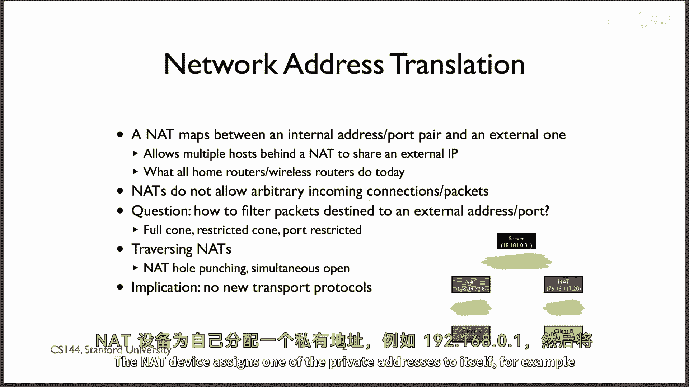

该设备拥有一个用于与外部世界通信的外部地址，这是一个可公开路由的IP地址。同时，它管理着一个私有内部地址子网。

例如，私有地址范围可能包括所有以 `10.*.*.*` 或 `192.168.*.*` 开头的IP地址。NAT设备会为自己分配一个私有地址（如 `192.168.0.1`），并将子网内的其余地址分配给内部网络中的设备。常见的家庭无线路由器通常就扮演着NAT设备的角色。

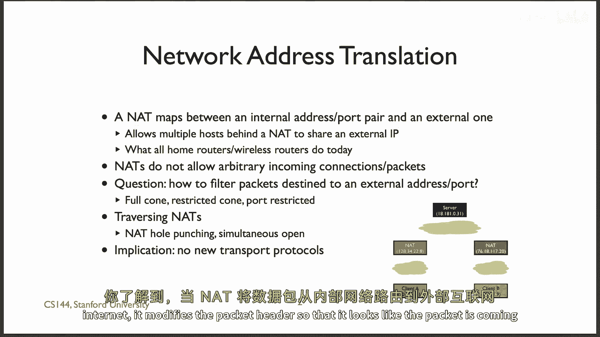

当内部网络中的设备通过NAT向外部互联网发送数据包时，NAT会修改数据包的头部信息，使其看起来像是从NAT的单一外部IP地址发出的。

这实际上是将来自不同内部地址的数据包，用同一个外部IP地址进行“伪装”。为了使这一过程正常工作，NAT需要一种方法来区分从外部返回的响应数据包，以便将其正确转发给内部对应的设备。

NAT设备通过修改传输层（如TCP或UDP）的端口号来实现这一点，用端口号来编码数据包来自哪个内部设备。这意味着NAT需要理解并修改传输层头部信息。

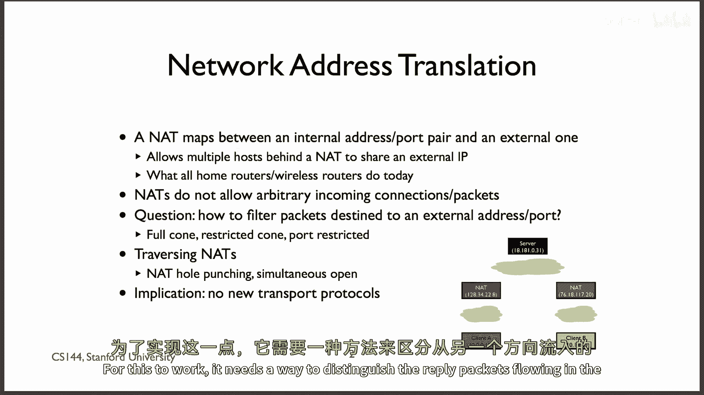

当来自外部互联网的数据包到达时，NAT会检查其目标端口号是否匹配到某个内部设备的映射。如果匹配，NAT会修改数据包并将其转发到内部网络。

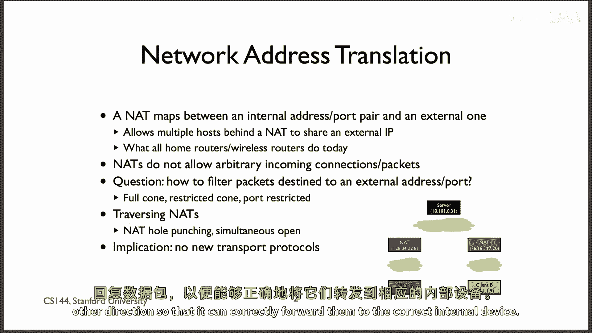

由于NAT设备通常只在数据包流向外部世界时，才创建从内部IP地址和端口到外部端口号的映射，因此它不知道如何处理那些从外部世界主动发往内部设备的连接请求。

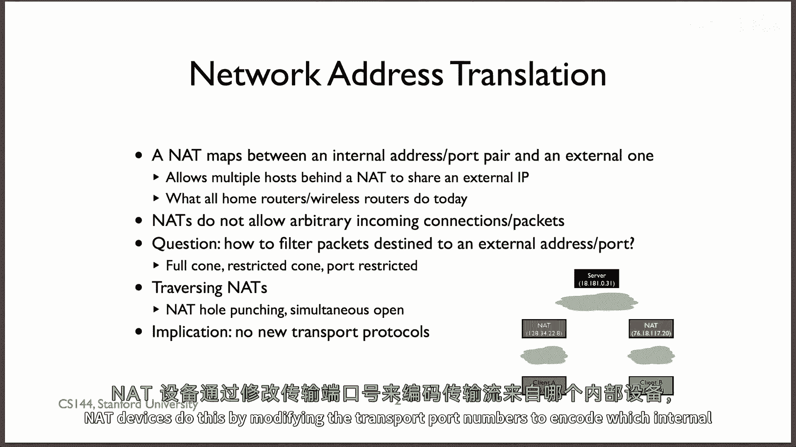

对于某些情况，这是一种安全优势：默认情况下，只能创建向外的连接，这保护了内部设备免受外部世界的直接攻击。但对于需要外部主动发起连接的应用（如某些P2P应用或服务器），这就成了一个麻烦，因为NAT会丢弃这些未经“预约”的TCP包。

***

以下是NAT的一些关键特点：

*   **设计多样性**：存在多种NAT设计，以及将IP地址映射到外部端口号的方法，每种都有其复杂性。
*   **共识**：普遍认为，简单、限制较少的NAT映射更好，因为它们能提供一种端到端连接性的外观。
*   **绕过技术**：人们开发了一些技术来绕过NAT的限制，例如 **NAT打洞** 和 **同时打开**。

***

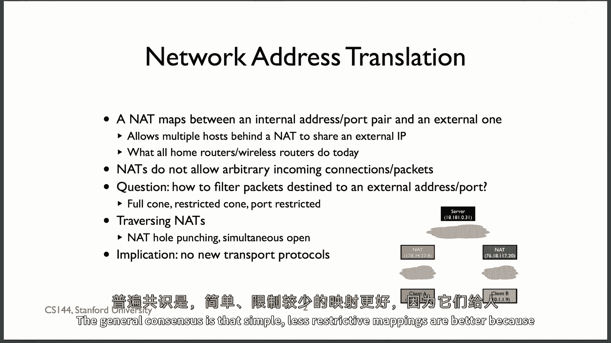

但本单元的核心要点是：**NAT使得在互联网上部署某些应用程序变得困难**。特别是那些需要外部世界主动与NAT后方设备建立TCP连接的应用。同时，部署新的传输协议也很困难，因为NAT设备可能不知道如何处理它们。

因此，当人们创建新的传输协议时，通常会选择伪装成TCP，或者运行在UDP之上。

***

## DNS：域名系统 🗺️

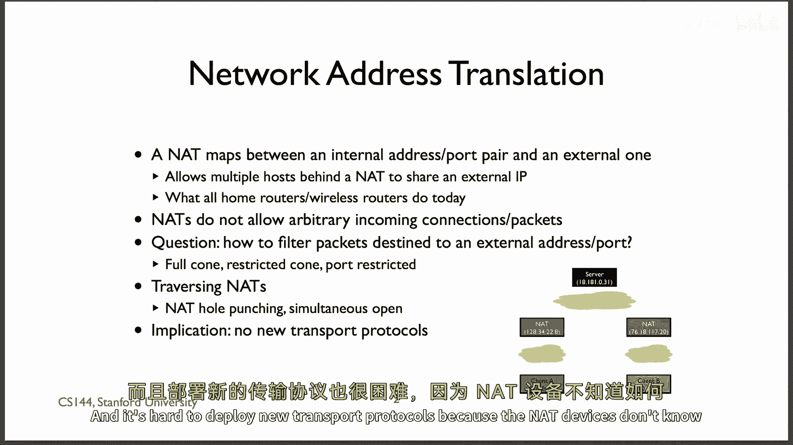

上一节我们探讨了NAT带来的挑战，本节中我们来看看域名系统。DNS是一个运行在UDP之上的关键应用。一方面，它是关键的基础设施，没有它，互联网的实用性将大打折扣。另一方面，它本身也只是一个应用程序。

DNS的基本思想是使用层次化的名称来指向不同类型的信息记录。

例如：
*   你可以查询 `www.stanford.edu` 的 **A记录**（IPv4地址）是什么。
*   你可以查询 `stanford.edu` 的 **NS记录**（名称服务器）是什么。
*   你可以查询 `cs.stanford.edu` 的 **MX记录**（邮件服务器）是什么。

DNS通过一个服务器层次结构来工作。例如，要查找 `www.stanford.edu` 的地址：
1.  首先询问**根服务器**，在哪里可以找到关于 `.edu` 域的信息。
2.  然后询问 `.edu` 服务器，在哪里可以找到关于 `stanford.edu` 的信息。
3.  最后向 `stanford.edu` 的权威服务器询问 `www.stanford.edu` 的地址。

为了减少查询负载，这些记录（地址记录和名称服务器记录）在每个步骤都可以被缓存很长时间。为了使缓存更有效，通常许多客户端会共享一个**解析器**（即为你执行DNS查询的计算机）。这样，解析器可以缓存所有查询结果并分享给客户端。

例如，只需要对 `google.com` 进行一次DNS查找，只要记录在缓存有效期内，所有使用同一解析器的客户端就都能获得结果，而不需要每个设备都去联系Google的DNS服务器。

***

## HTTP：超文本传输协议 🌍

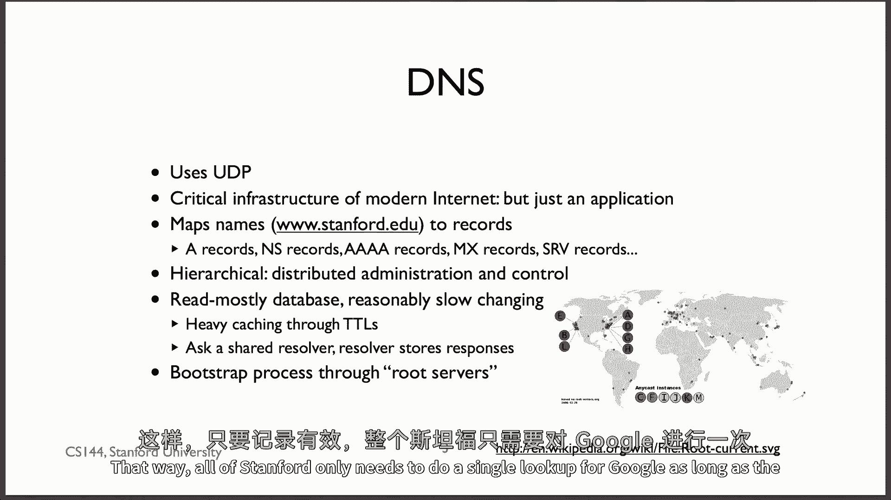

我们一直在使用的HTTP版本是 **HTTP/1.1**，它已经稳定运行了近二十年。HTTP运行在TCP之上，是一个请求-响应协议。请求和响应都是ASCII文本，这使得它易于阅读和调试。

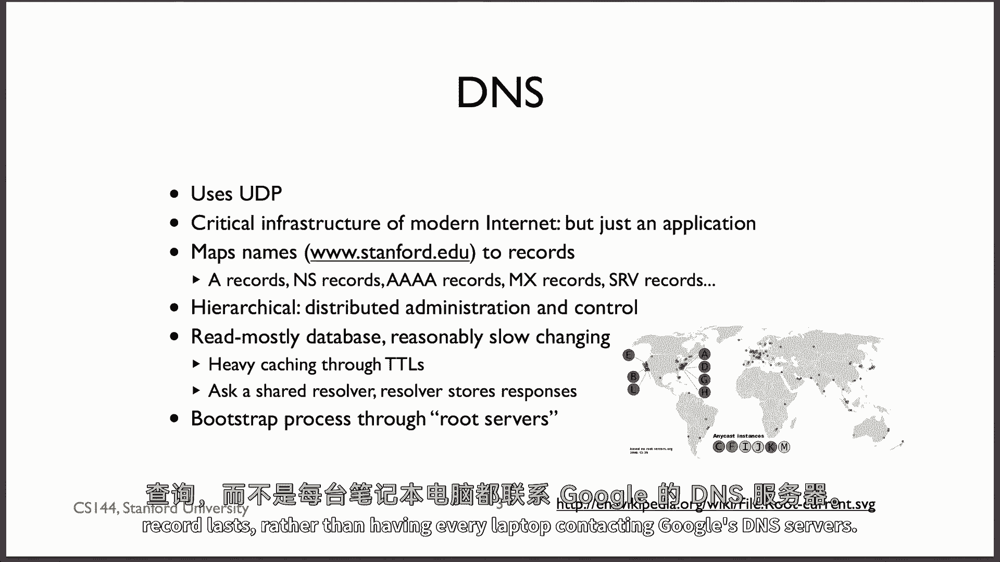

HTTP/1.1 相对于 HTTP/1.0 的一个重大改进是引入了**持久连接**。在HTTP/1.0中，每个请求都需要一个独立的TCP连接。这意味着下载一个包含40个资源的页面，客户端需要打开40个TCP连接。

而HTTP/1.1允许客户端在同一连接上请求多个资源。这减少了用于TCP握手的时间开销，并且TCP连接有更多时间来增大其拥塞窗口，从而提升传输效率。

你可以利用这些知识大致计算下载一个完整页面及其所有资源所需的时间。你会发现，对于仅传输少量数据的连接，TCP连接建立时间可能是一个显著的开销。

最后，我们还简要了解了 **SPDY** 协议，它后来成为了 **HTTP/2** 的基础，旨在进一步解决HTTP/1.1的效率和延迟问题。

***

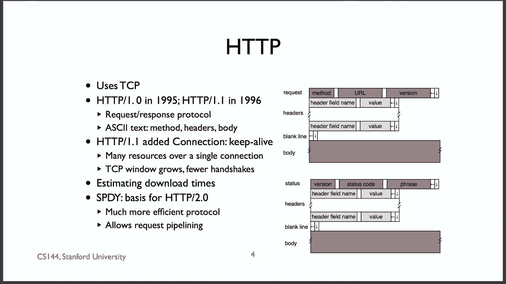

## BitTorrent：对等文件共享 ⚡

你学到的第三个应用是像BitTorrent这样的对等文件共享协议。BitTorrent使用TCP，但与HTTP这种客户端-服务器模型不同，BitTorrent是由许多协作的客户端（称为**群**）组成的大型集合。

为了共享大型文件（例如100MB），BitTorrent将文件分解为较小的片段，称为**块**。

每个BitTorrent客户端会与数十个（有时甚至上百个）其他客户端建立连接。客户端采用**最稀缺优先**的策略从其他客户端请求数据，即优先请求在群中最稀有的块，以避免该块从群中消失，同时也能消除传输瓶颈。

尽管BitTorrent乐于从许多对等节点请求数据，但在决定向谁发送数据时却非常谨慎。它试图建立一个激励系统：你想要获得数据，就需要贡献数据。

其工作方式是：一个节点会优先向那些给自己发送数据最多的对等节点发送数据。这样，从该节点获取数据的最佳方式就是先向它发送数据。偶尔，它也会开始向一个新的随机对等节点发送少量数据，以便在交换中发现新的潜在优质伙伴。这个算法被称为 **“以牙还牙”算法**。

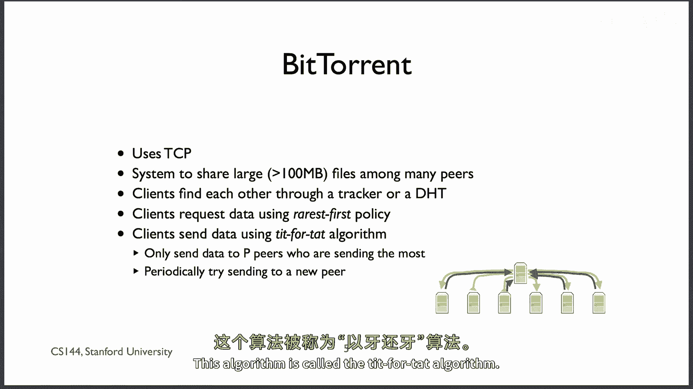

***

## 总结 📚

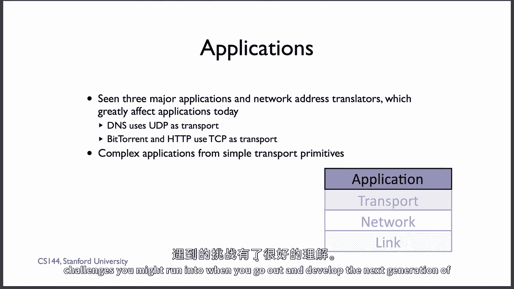

本节课中，我们一起回顾了当今互联网上的三种主要应用：DNS、HTTP和BitTorrent。我们看到了简单的UDP和TCP抽象如何以复杂而有趣的方式被应用。同时，我们也深入学习了网络地址转换器如何通过使对等节点发现和连接建立变得困难，从而复杂化了应用部署，并了解了一些绕过这些限制的技巧。现在，你应该对构建和理解网络应用所能使用的技术有了良好的基础认识。