# P85：p84 6-1 Routing - Flooding source routing and spanning trees - 加加zero - BV1qotgeXE8D

在接下来的几个视频中，我们将探讨网络中包传输的多种不同方式，包如何在网络中跨越边界进行四舍五入，在这个视频中，我将从路由的一些基本概念和原理开始，无论我们是基于第三层还是IP地址来路由包。

还是使用以太网地址和以太网交换机。

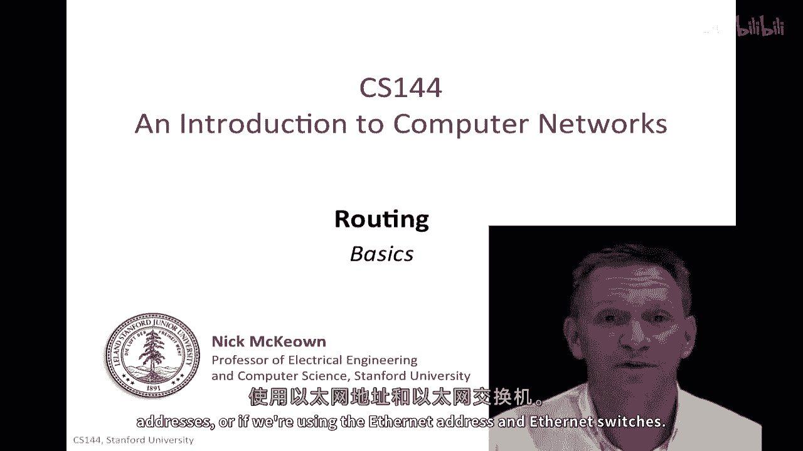

当我们尝试解决路由包的基本问题时，包应如何从A路由到B，路径应由终点主机A在这里选择，通过中间网络，或者是通过其他实体，那么，他们应该选择什么样的路径，对他们来说，最重要的指标是什么。

他们是否应该选择最短的路径，选择最不拥堵的路径，随机选择的路径，最安全、最可靠的路径，这重要吗，所以，在接下来的几分钟里，我们将查看一些解决基本问题的不同技术。

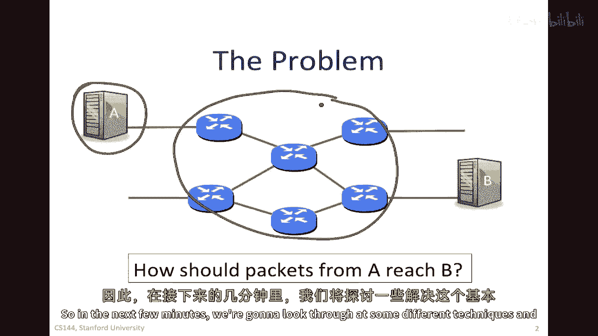

并查看一些解决这个问题的不同指标，所以我将查看许多不同的方法和洪水源，路由，转发表和生成树，我们将查看一些指标，然后我将描述什么是最短路径生成树，嗯。

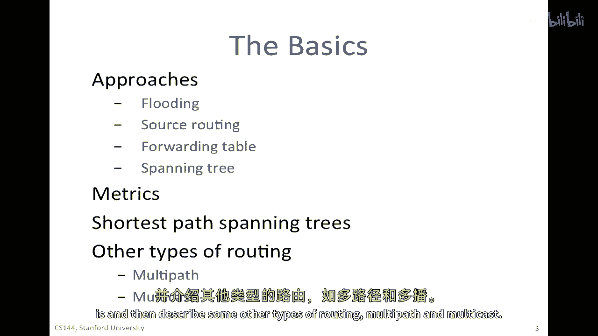

他们描述了其他类型的路由，多路径和广播，洪水可能是最简单的方法，以确保至少一份数据包被送达网络中的所有目的地，因此，以确保数据包想要到达的目的地也收到，每个路由器都将将数据包转发到所有接口。

如果a正在发送数据包，假设它正在发送数据包到b，所以它有b的地址，当它到达第一个路由器时，它将从所有接口发送它，除了它到达的接口，下一个路由器也会发生这种情况，所以它会从这些接口发送出去，它会降到这里。

这会从这里发送出去，从这里发送出去，然后它会从这里发送出去，然后这个会从这里发送出去，但它也会朝这个方向走，它会在这里来回，在这里来回，你可以很快看到，在中间会形成一个循环，包会一直循环下去。

但是在这种情况下我们可以确定，因为每个包都将至少被送到一次，到每个叶子节点，所以它将到达每个目的地，并且如果它包含b的地址，它确实包含，那么我们可以确定b可以找到包。

或者通过简单地过滤出匹配其地址的包来接收包，这些显然非常低效，所有的包都将穿越每个链路，可能多次，并且数据包可以永远循环，因此，使用跳数或生存时间字段是很常见的。

就像我们在IP协议中停止数据包永远循环一样，但我们至少可以确定数据包最终将到达其目的地，我们可以绝对确定这一点，所以，洪水很好，很简单，它不需要路由器的状态，嗯，它不，它不需要网络拓扑结构的理解。

所以非常非常简单，但由于其效率低下，它实际上只在某些情况下使用，当我们不知道拓扑结构时，或者我们不能信任我们对它的知识，并且我们需要能够到达每个节点，所以我们稍后会看到这些例子，特别是在过渡时期。

当我们还不太清楚正在发生的事情时，所以总的来说，在链接使用上效率低下，"数据包可以无限循环"，"当我们不知道或无法信任当前拓扑结构时，我们会使用它。"，"让我们来看看另一种叫做源路由的方法"。

"源路由是指源节点向数据包中填充一系列跳点"，"它将在其路径上停留"，"所以如果我们给这些路由器命名"，让我们叫他们r一r二，"R三"，四五和十六，"因此，如果a向b发送数据，使用源路由"，它可能。

例如，在头部写入r one，嗯三，嗯六，以指示它想要包通过那个序列，在它到达之前，所以这将只说去r one first，去r三r六，然后到b i我只需要将它们按照他们将被访问的顺序绘制。

那取决于我们如何使用源路由，稍后我们会看到，但它在这里特定地击中，A知道拓扑结构，它知道它想要路由器按什么顺序访问，并正在给最终目的地，以确保它工作并到达B，同样地，洪水路由器不需要在先进行转发表填充。

所有决策都是由终点主机做出的，这实际上是端到端原则在实际中的例子，嗯，功能在终点实现，主机A是知道路线的，所以它选择了，将被采取的路径，这样我们就可以确保它做得正确，但这对终点来说是很多工作。

主机和数据包长度可变，可能携带很多地址，从表面上看，它是一种好方案，但我们显然希望做一些对终点不那么重的事情，所以它是一个端到端解决方案，不需要网络支持，数据包处理是变量的，可能包含很长的地址列表。

主机必须知道拓扑结构并选择路线，这是用于当终点主机想要控制路线时。

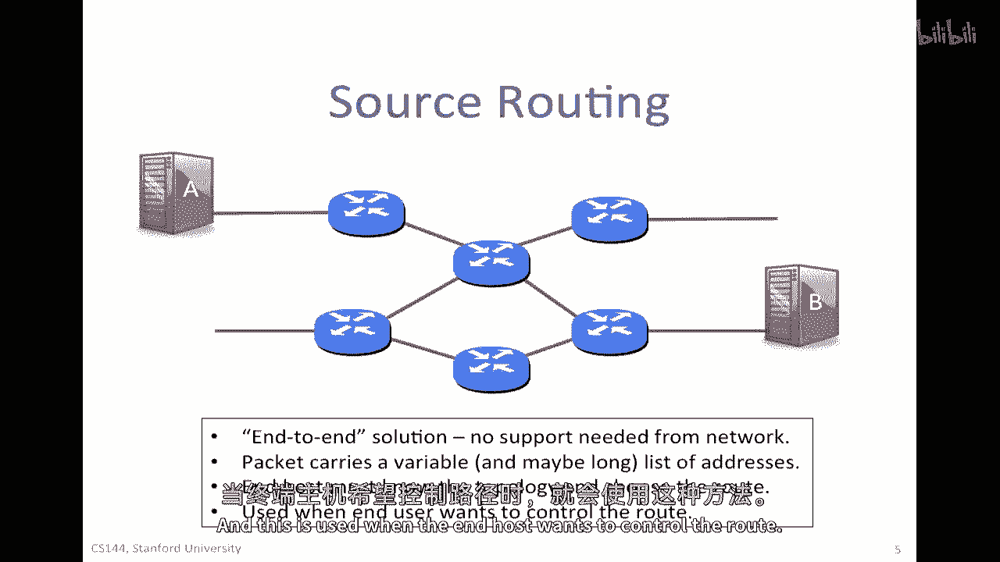

所以现在让我们看看网络已经知道的方法，这是这个，当我们实际上有一个在整个网络中用于路由数据包的转发表时，跳转跳转，正如你已经知道，我会快速地通过这一点，如果我们从A发送一个包到B沿着这条路线。

S1 S2 S4，然后B的转发表情况，我们在每个跳转中使用转发表，以便决定包将去哪里，我们已经见过这个例子，你可以真正认为这是一种优化，它是在优化的意义上，即在。

尽管我们可以正确地使包具有使用源路由的行为，但我们已经决定让网络承担这个功能来优化它，因为它是一个对所有使用网络的人都很常见的功能，所以它是在优化的意义上，网络将处理跳转，由跳转路由代表所有人。

它确实需要转发表的填充，所以我们需要一个方法来填充这些转发表，我们将在下几个视频中看到，我们如何可以填充这个表，各种我们如何可以填充这个表的方法，所以从 now on，我们将假设我们在使用转发表。

并且我们需要一种方法来填充这张表，以便决定路由将如何进行，网络中有目的地址状态，因为我们将为每个 uh，的目的地，需要在表中填充下一个跳转地址，虽然我们不一定需要每条流的状态，网络中的所有流量。

无论其目的地相同，都可以使用相同的条目。

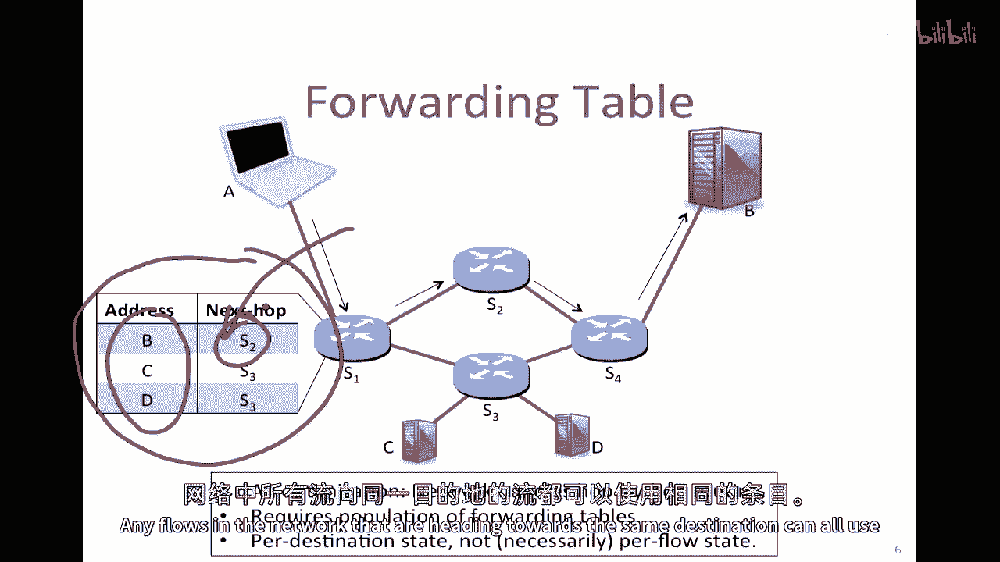

当我在转发表中添加条目时，常常目标是创建我们称为生成树的东西，我们将看到许多生成树在这个意义上扩展的例子，那就是它触及所有有叶节点，而且在意义上它是一棵树，因为它没有环。

所以我们要确保我们可以到达每个目的地，或每个源可以到达特定的目的地，我们要确保没有环，让我给你一个例子，想象一下，我们要创建一个生成树，包括a、b、c和d。

顶部的主机将使用此方法来将包发送到底部的目的地，因此，以便其包可以遵循此路径，蜜蜂可能会遵循此路径，C的可能会遵循此路径，并且D的可能会遵循那条路径，所以你可以看到我已经在x处创建了一个树。

并且它覆盖了可能发送到它的所有源，从意义上说，它是一棵树，因为它没有循环，这将通过填充路由，R一台的前向表以条目来实现，如果我想去x，那么我会作为下一个跳点去r三，这就是在这里告诉它做什么的。

同样在r三，我们将有一个条目说，如果我想去x，那么我会直接去x类似地，在这里在我们的四，我会说如果我要去x，那么我会通过r七去那里，因此，使用生成树来创建路由条目。

以便我们可以填充转发表并因此沿着该生成树路由路径，在计算生成树时，我们需要知道我们的目标是什么或者我们的成功指标是什么，我们如何知道所有可能的生成树中。

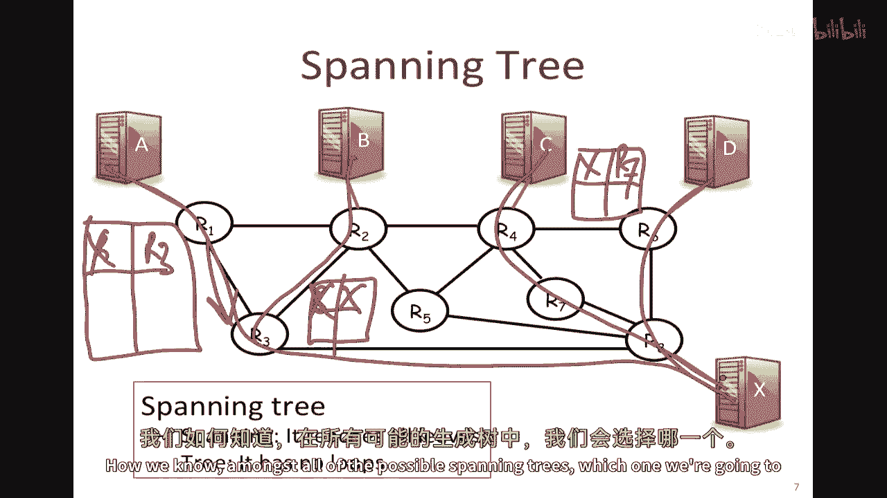

哪一个我们将选择，因此，这取决于我们的指标，所以让我们来看看一些我们可能选择的选择，我们可能会选择选择距离最小的生成树，这可能是地理距离，或者他们最小化源和目的地之间的链接长度，例如。

注意到这里的链接很长，我们可能，我们可能，嗯，嗯，决定这条路实际上比这里下方的这条路更短，因此我们更喜欢它，我们可能也会选择跳数最少的路线，所以我之前给你展示的例子通常遵循最短跳数，例如。

D将走这条路线，因为它是最少的跳数，它也将最小化延迟，我从图中无法直接告诉，什么将最小化延迟，但这可能是我可以在 recent past 测量的，哪些链接经历了最小延迟。

因此我会优先使用那些最大化通量的链接，它们可能在最不拥堵的，或负载最少的路径，或可能是最可靠的路径，在 recent past 中最少失败的，较少，这可能是我的度量，也可能是最低成本的路径。

我可能有一个与使用任何一条链接相关的价格或成本，我想要最小化它，或可能是最安全的路径，最近有最少安全攻击的，或我可能有一条虚拟专用网络运行在上面，等等，我可以使用许多许多度量，实际上。

我可以实际上使用任何那些度量的组合。

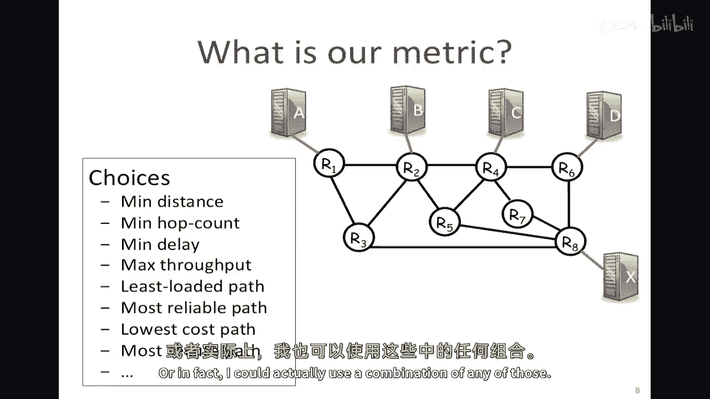

所以通常我们，我们如何做这是这样的，我们首先创建一个标记的图，使用我们选择的成本度量，我可以选择任何那些，所以我们可以表示我们的度量为一个使用链接的成本，这是一组我虚构的成本，例如，一般来说。

成本在每个方向上可能不同，只是因为拥堵，可能在一个方向上更多，或者通量可能不同，但由于方便绘制，我在这里只显示每个链接的一个数字，一个自然的选择是尝试从每个主机到 x 找到最短路径。

我可能会尝试找到成本最小的那个，在这种情况下，我将将其称为最小生成树，在这个例子中，解决方案相当明显，让我们来看看那意味着什么，从x来，那将是什么，如果我来自b，那么最小成本将是从这里走这条路。

因为这条路的成本是四，当我来自c，最小成本将是这条路，这条路的成本是五，从D来，三加二，它很容易，它将在这里，A稍微有点微妙，它不是这条路，最低成本的一条路是这条路，它成本为五，所以这是我的最小生成树。

这里是一个例子的绘制，所以在这种情况下，计算它非常简单，我们需要一种方法，可以在更复杂的网络中工作。

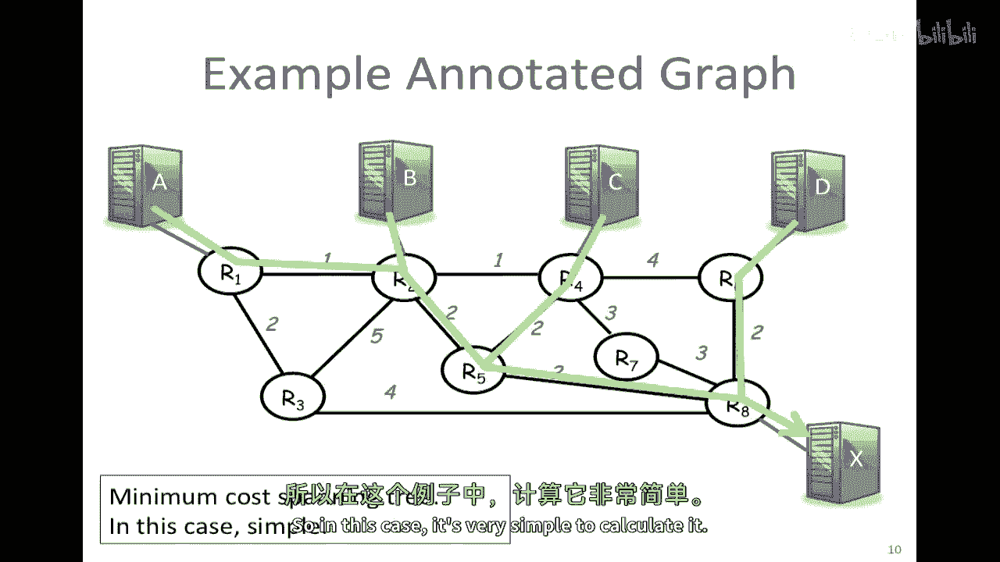

例如，这个明显超出了人类在头脑中能做的事情，这是互联网骨干的拓扑图图片，我无法在我的头脑中做这件事，也许你可以，所以我们需要自动化算法来计算路线，并将必要的转发条目放入路由器的前转发表中。

所以来计算路线，路由器将与彼此交换关于当前拓扑的信息，它们所知道的，这是我们所谓的，路由算法或路由协议的工作，在某些情况下，计算路线的算法被包裹在状态交换本身中，在其他情况下，它们分开。

我们将看到这两种类型的例子，回到概述，我们已经到达最短路径生成树，在接下来的几个视频中，我们将看到这种情况的几个例子，我只想告诉你关于两种，其他常用路由类型的事情，第一种是多路径。

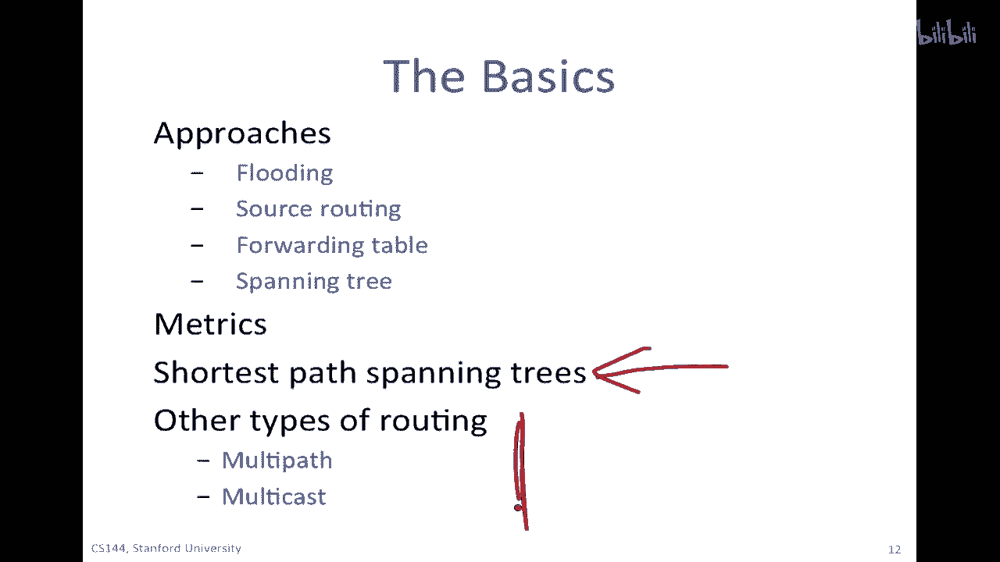

到目前为止，我们假设所有发往特定目的地的包都将遵循同一路径，特别是最短路径生成树，最短路径生成树的缺点是，一些链接可能会变得非常受欢迎，多路径路由的优点是，它可以分散流量，减少对任何单一路径的依赖。

因此，它可以提高网络的可靠性和可用性，我们看到之前有一条从这里下去的路，有一条从这里下去的路，你可以看到这里整个区域都可能变得非常受欢迎，可能会变得拥挤，所以这意味着我们可能需要不断适应算法。

另一种选择是，而不是适应算法，是从一开始就，将所有的交通分散在所有的长度上，所以这与最短路径生成树有很大的不同，嗯，这可能是一个我们发送一些从a到x的包这样走的情况，我们可能会选择这样发送一些。

我们可能会选择这样发送一些他们，我们可能会选择这样发送一些他们，这叫做多路径，我们在多个路径上分散数据包到目的地，本质上我们在一些或可能所有的路径上负载均衡流量，我会稍后查看详细信息。

但现在知道它可能看起来像什么，我画的那个，所以，原则上数据包可以走不同的长度，"不同长度的路径"，"并命令得到"，所以，可能我这个例子中就是这样，"这条路径上的包裹"，可能会比一个人早得多到达那里。

"走这条路线"，因此，给我相对于它的序列，"现在，互联网并不保证按顺序交付"，嗯，"这是tcp的工作，将它们放回正确的顺序"，但是稍后我们会看到，那个，在实际应用中。

确保给定应用流中的包不乱序是很常见的，只是为了让tcp的生活稍微容易一些，但这只是在网络中的真正优化，所以多路径是指我们将包分散到多个链路上，以便我们能够在网络中均匀地分散负载，另一种路由类型。

另一种方法是叫做广播，另一种方法是叫做多播，到目前为止，我们假设所有的包都是要发送到一个单一目的地的，我们称之为单播，例如，这些包，在最近的几个例子中。

已经显示了它们从一个点到另一个点作为一个单个包发送，在一些应用中，一个终点主机可能想要发送包到一个主机集的，例如，A可能想要，可能想要发送一个包到B，这个包会被送达B，C和x，可能但并不是d。

可能想要这样做的应用程序可以是像广播一样，目前bc和x正在听的电视广播站，如电视或广播站，A可以是对所有主机的自动更新，例如，汽车公司每晚更新其库存到所有经销商，或者是在交易室里更新股票价格。

你想要所有人都在同一时间收到更新，所以为什么我们可以显然地将每个包一个接一个地发送到其目的地，"那很好"，"你可以将单个包发送到b"，"C和x"，"询问网络是否能够提供帮助是自然的，是否可以"。

"是否应该为我们进行复制"，所以，例如，"A可以发送一个包"，"它可能会降到达到b的程度"，"然后它就可以被复制"，一个包往这个方向走，还有一个包往这个方向走，还有一个包继续往c走。

并且在网络的每个分支点都是这样，所以现在我们发送一个包，它会被送到每个人，我们正在使用网络的图结构来为我们复制，所以请注意，为了发送从a到b的包，我基本上绘制了一个生成树，这将证明非常有趣。

后来我有一个跨越目的地集的生成树，我们将看到一些例子，说明这是如何工作的，我们现在只需要知道，嗯，这只是一种路由数据包的方式，我们稍后会看到如何在互联网上具体实现这一点。

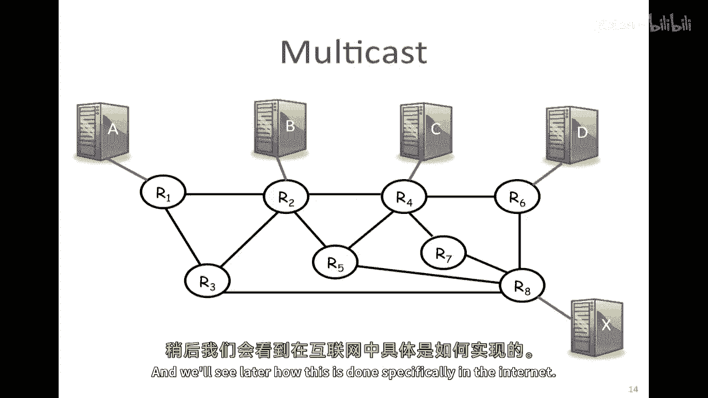

所以总的来说，在网络上有许多路由数据包的方法。

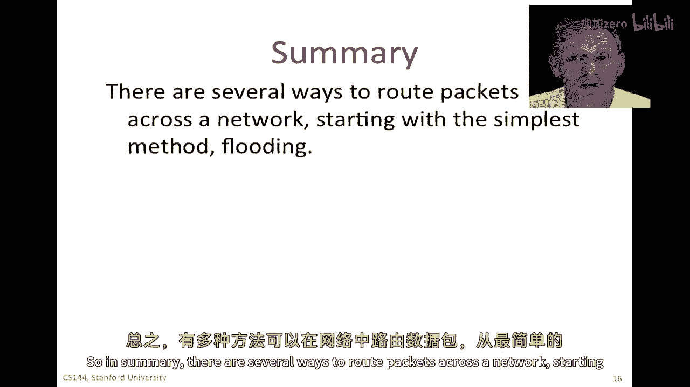

从最简单的方法开始，洪水，所以在实践中我们使用路由算法，或者也被称为路由协议来计算路线并填充转发表，算法通常计算到目的地的最小生成树。

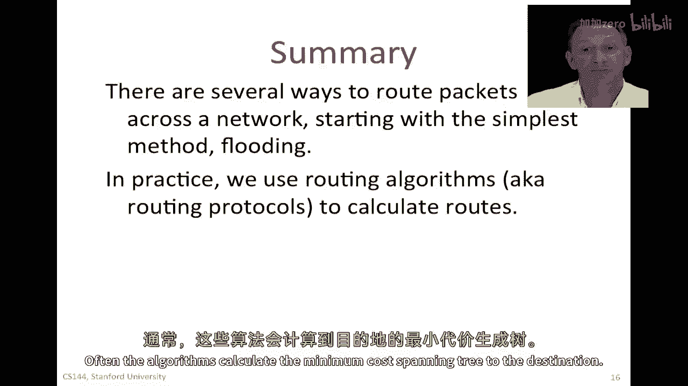

我们很快就会看到很多那样的例子，其他类型的路由包括多路径，以在链接上分散流量，并使用广播将多个发送到多个终端主机。

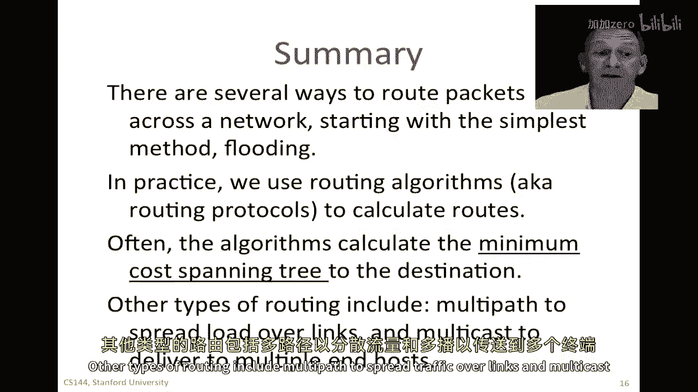

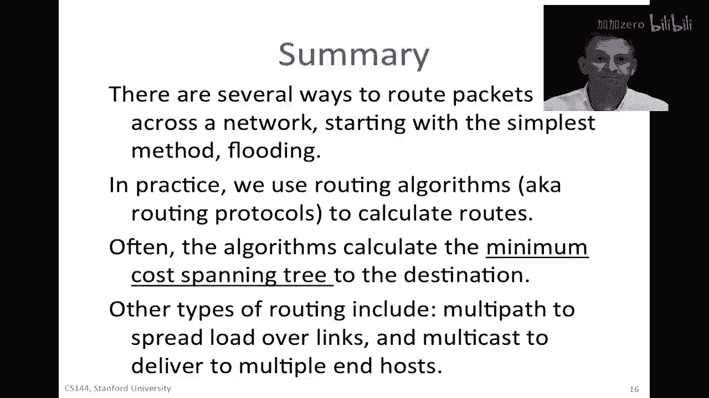