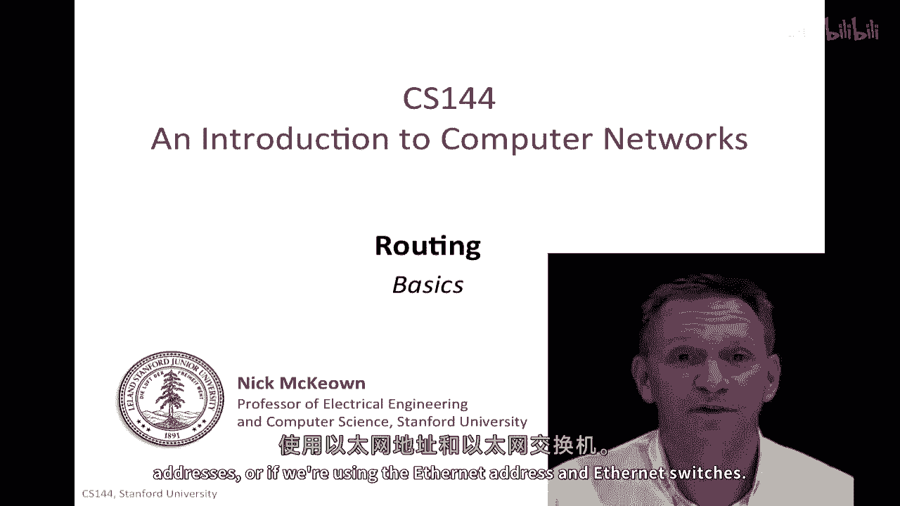
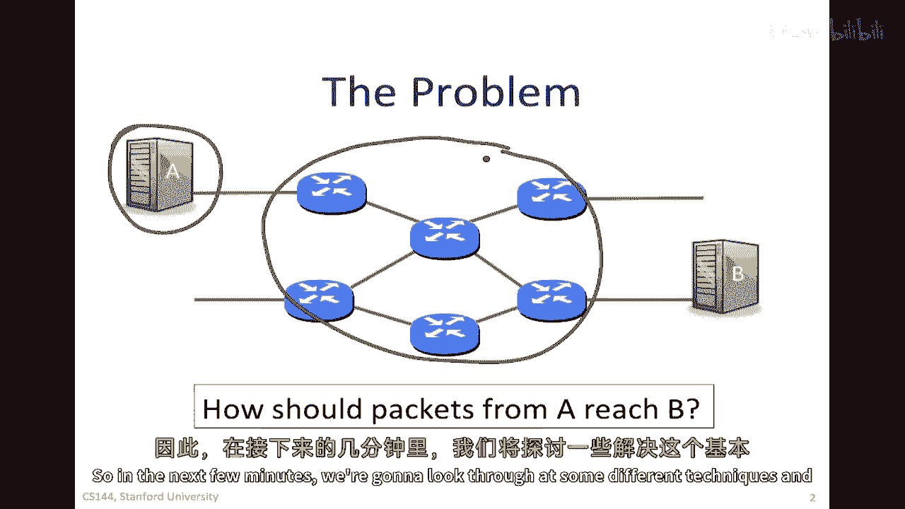
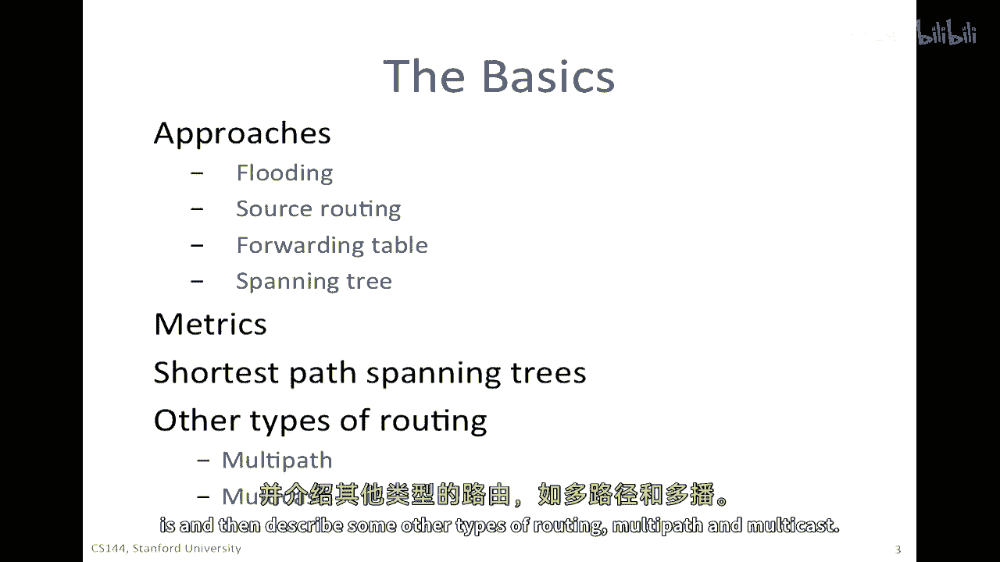
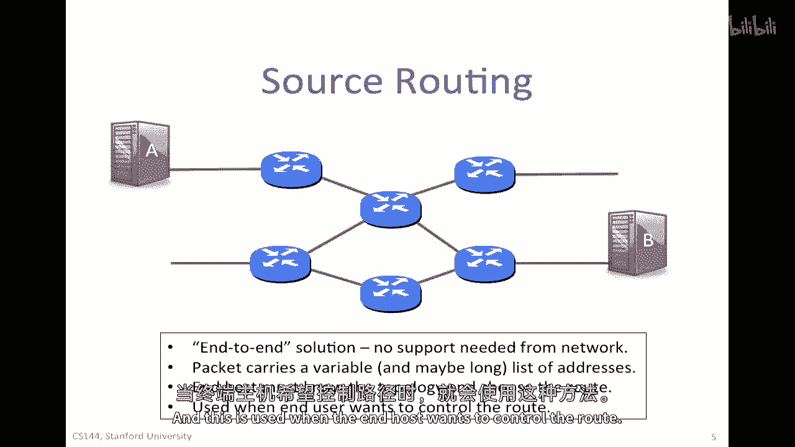
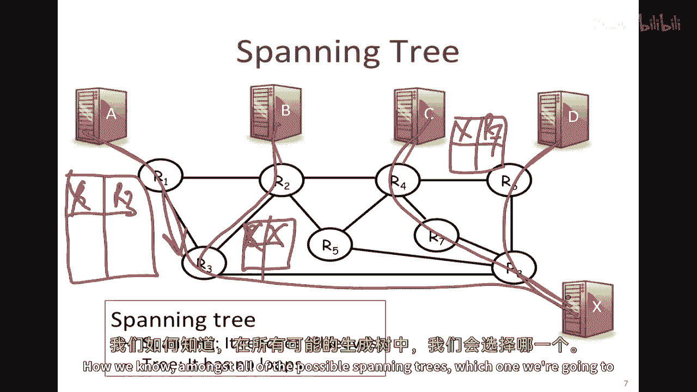
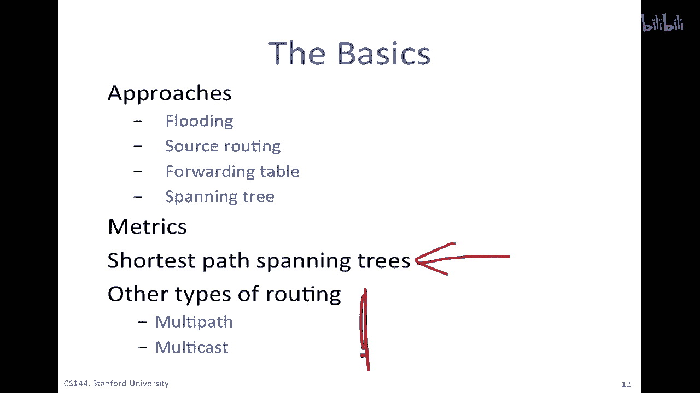
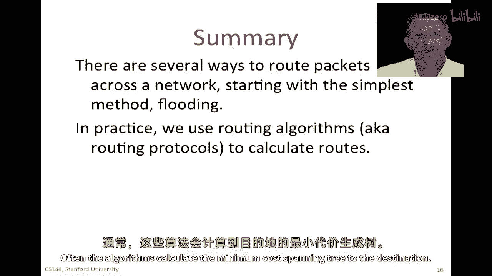
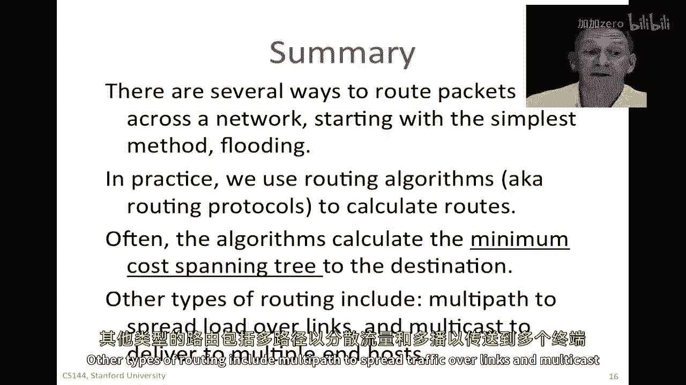
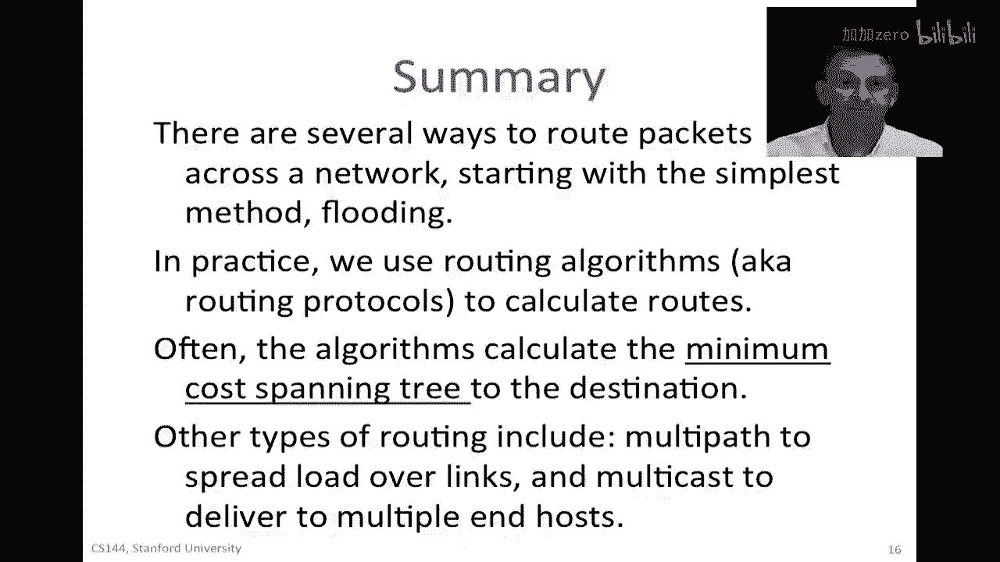

# 课程P85：路由基础 - 洪泛、源路由与生成树 🌳

在本节课中，我们将探讨数据包在网络中传输的几种基本方式。我们将从路由的核心概念和原理开始，了解数据包如何从源点A到达终点B，以及决定路径选择的各种考量因素。

## 概述 📋

无论我们使用第三层的IP地址进行路由，还是使用第二层的以太网地址和交换机，核心问题都是相同的：数据包应该如何选择路径？路径应该由源主机A选择，还是由网络中的其他实体决定？在选择路径时，最重要的指标是什么？是最短路径、最不拥堵的路径、随机路径，还是最安全可靠的路径？在接下来的内容中，我们将介绍几种解决这个基本问题的技术，并探讨不同的路径选择指标。

## 洪泛路由 🌊

洪泛可能是确保数据包至少能到达网络中所有目的地（包括目标B）的最简单方法。

以下是洪泛路由的工作原理：
*   每个路由器在收到数据包后，会将其从**所有接口**转发出去（除了数据包到达的那个接口）。
*   这个过程会逐跳重复，数据包会迅速扩散到整个网络。
*   这种方法效率很低，所有链路都可能被重复使用多次，并且数据包可能形成环路，永远循环下去。

为了防止数据包无限循环，通常会使用**跳数限制**或**生存时间（TTL）**字段，就像IP协议中所做的那样。

洪泛路由的优点是简单，不需要路由器维护网络拓扑状态。但由于其效率低下，通常只在特定情况下使用，例如当网络拓扑未知或不可信时，或者在某些过渡时期。

## 源路由 🧭

上一节我们介绍了由网络设备决定的洪泛路由，本节我们来看看由发送方主机决定的源路由。

源路由是指**源节点**在数据包头部填充它希望数据包经过的一系列路由器（即路径）。

例如，如果主机A要向主机B发送数据，它可能将路径指定为 `R1 -> R3 -> R6`。这样，沿途的路由器只需按照这个列表依次转发即可。

源路由是**端到端原则**的一个实际例子，所有路径决策都由终端主机做出。这意味着：
*   网络本身不需要支持复杂功能。
*   主机必须知晓网络拓扑并自行选择路径。
*   数据包处理是变长的，可能携带很长的地址列表。

因此，源路由主要用于终端主机希望严格控制路径的场景。

## 转发表与逐跳路由 🗺️

现在让我们看看网络本身已经知晓路径的方法，即使用**转发表**进行**逐跳路由**。

如果我们从A发送一个包到B，路径是 `S1 -> S2 -> S4 -> B`。那么每个路由器（S1, S2, S4）的转发表中都需要有相应的条目，指明去往目的地B的**下一跳**地址。

你可以将这种方式视为对源路由的一种**优化**。虽然源路由也能让包到达目的地，但让网络来承担这个常见的路由功能更为高效。当然，这需要一种方法来填充所有路由器的转发表，我们将在后续课程中学习。

## 生成树与路径选择指标 📏

在填充转发表时，一个常见的目标是创建**生成树**。生成树是一张覆盖网络中所有节点的图，并且它是一棵“树”，意味着其中没有环路。这确保了我们可以到达每个目的地，同时避免数据包陷入循环。

在计算生成树时，我们需要一个标准来决定选择哪一棵。这取决于我们的**路径选择指标**。以下是一些常见的指标：
*   **最短距离**：最小化地理距离或链路物理长度。
*   **最少跳数**：最小化经过的路由器数量。
*   **最低延迟**：选择历史延迟最小的路径。
*   **最大吞吐量**：选择负载最轻或最不拥堵的路径。
*   **最高可靠性**：选择历史故障最少的路径。
*   **最低成本**：选择使用成本（如资费）最低的路径。
*   **最安全**：选择安全记录最好的路径。

实际上，我们可以使用以上任意一种或多种指标的组合。

## 最短路径生成树 🧮

通常，我们会根据选定的成本指标，为网络中的每条链路赋予一个**成本（Cost）**，从而创建一个带权图。

一个自然的选择是为每个源到目的地的组合，寻找**成本总和最小**的路径，由此计算出的就是**最短路径生成树**。

例如，如果我们为图中的链路赋予了成本，那么从各个主机到目的地X的最短路径可能如图所示。计算简单网络的最短路径生成树是直观的，但对于像互联网骨干网这样复杂的拓扑，我们需要**自动化的路由算法**来完成计算。

路由器之间会交换网络状态信息（这称为**路由协议**），并运行**路由算法**来计算最优路径，最终将正确的转发条目填入各自的转发表中。

## 其他路由类型 🔄

除了单播（一对一）和最短路径树，还有其他重要的路由类型。

### 多路径路由

到目前为止，我们假设去往特定目的地的所有数据包都走同一条路径（如最短路径生成树）。但这可能导致某些链路负载过重。

**多路径路由**允许将去往同一目的地的流量分散到**多条路径**上。这可以平衡网络负载，提高可靠性和资源利用率。需要注意的是，不同路径的延迟可能不同，可能导致数据包乱序到达，这通常由更高层的协议（如TCP）来处理。

### 广播与组播

之前我们讨论的都是**单播**，即一个包发送给一个目的地。但在某些应用中，一个主机可能需要将同一个包发送给**多个目的地**。
*   **广播**：发送给网络中的所有主机。
*   **组播**：发送给一组特定的主机（例如，一个视频流发送给所有订阅者）。

一种低效的方法是源主机为每个目的地单独发送一个包。更高效的方法是让**网络协助复制**数据包。例如，源主机发送一个包，网络路由器在必要的分支点进行复制，并沿着一个覆盖所有目标主机的**生成树**进行转发。这大大节省了带宽和源主机的处理开销。

## 总结 🎯

本节课我们一起学习了网络中数据包路由的几种基础方法：
1.  **洪泛路由**：简单可靠但效率低下，用于拓扑未知等特殊场景。
2.  **源路由**：由发送方主机指定完整路径，体现了端到端原则。
3.  **转发表与逐跳路由**：网络通过转发表优化路由过程，这是当前主流方式。
4.  **生成树与指标**：构建无环路径需要依据延迟、成本、跳数等多种指标。
5.  **最短路径生成树**：基于链路成本计算最优路径，需要路由协议和算法自动完成。
6.  **其他类型**：**多路径路由**用于负载均衡，**广播/组播**用于一对多通信。

在实践中，我们主要使用**路由协议**和**算法**来计算最短路径并填充转发表。理解这些基础概念，是学习更复杂路由技术（如RIP、OSPF、BGP）的关键。