# P86：p85 6-2 Routing - Bellman Ford - 加加zero - BV1qotgeXE8D

在本视频中，我们将继续我们的路由主题，我将向您介绍一种距离向量协议，距离向量协议是一种路由器维护它们到其他路由器距离的向量的协议，到给定的其他路由器，或者到所有的其他路由器，然后，通过分布式算法迭代。

它们会收敛于找到最短路径或最低成本生成树，从它们到每个其他路由器，我们将看到这种特定例子，被称为贝尔曼-福特算法，这是在这些距离向量协议中最常用的算法。

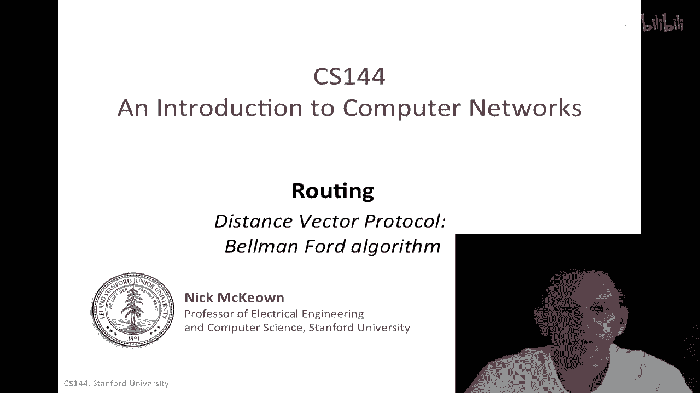

所以，我们要解决的问题是，路由器如何一起找到最小生成树，我在这里展示了一个绿色的例子，对于这个特定的图，最小生成树是。

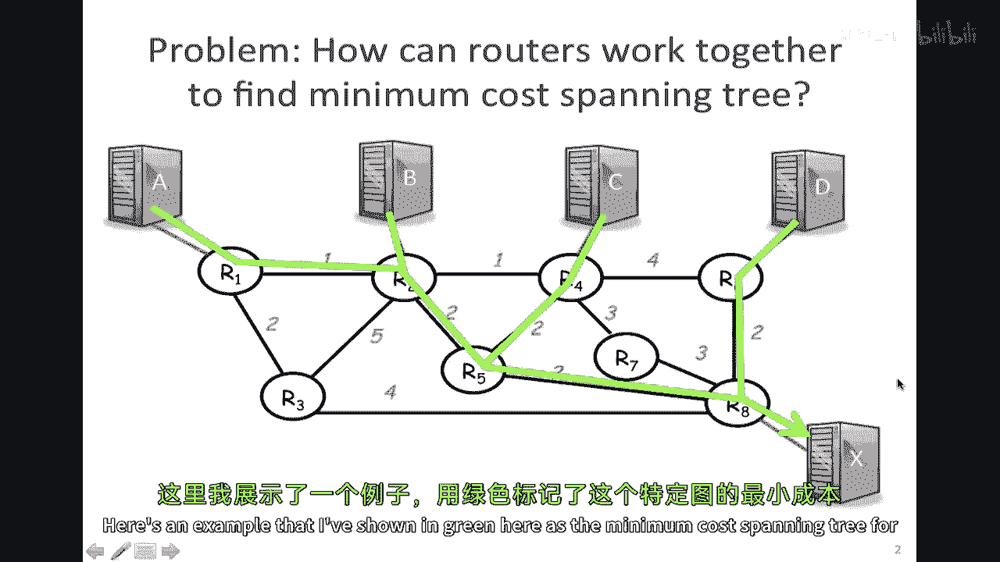

注意，这与仅在路由器中找到最小生成树是等价的。

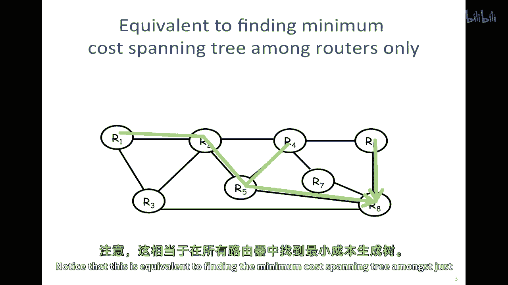

无论我包括终端主机与否。

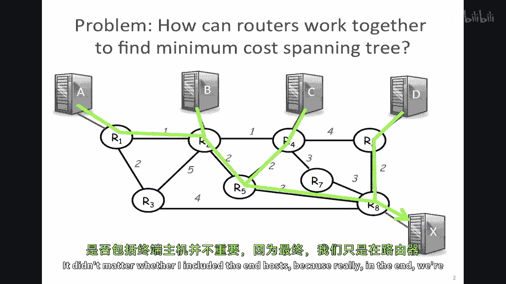

因为在最后，我们只是在路由器之间构建生成树，所以在其余的例子中。

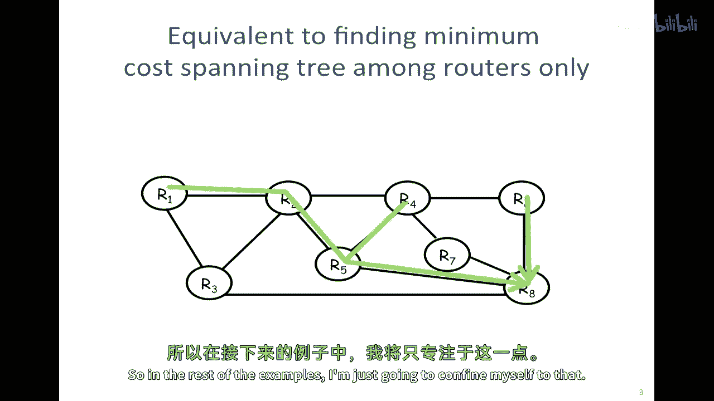

我只会限制自己于那个，所以现在我们来看看分布式贝尔曼-福特算法，在这个例子中，我们将使用，一个尝试找到从八个节点到最小成本生成树的案例。

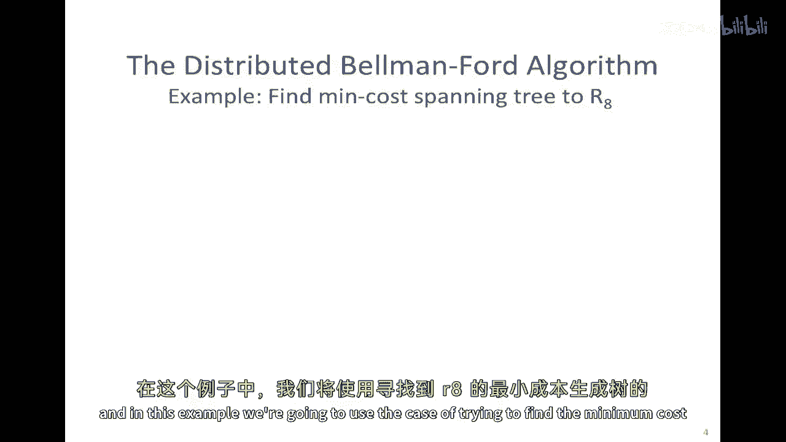

只是为了提醒您在上一滑片中，这是底部右下角的路由器，所以这里显示的绿色生成树是每个人都可以到达我们的八个的最小成本生成树，所以记住，一般来说，所有的路由器都将构建最低成本生成树，以到达其他所有路由器。

所以我们只是在这里讨论一个找到从八个节点到最小成本生成树的特定案例。

所以，在贝尔曼-福特算法中，我们将假设路由器知道链接的成本，向他们的邻居，因此，有一个度量和与使用该链接相关的成本，我们将假设路由器rsubi，将维护到达我们八个的最小成本的值，在任何一个时刻。

它将保持到达我们sub八的最小当前成本的感觉，所以rara，它的值将是csubi，因此我们将有一个向量c，这将包含到达我们八个的路由器的七个成本，他们当前的r1到r7的成本，以到达我们八个。

这是到达我们八个的最优距离向量，最初，算法将设置此向量为所有无限的值，然后，每t秒，所以从第一个t秒后开始，Ri将发送ci到其邻居，换句话说，每个路由器都将将其到达我们八个的成本发送到其每个邻居。

如果ri在任何时间学习到更低的路径，它将更新此值c，但c sub i，如果经过t秒后，它听到到达我们八个的更低成本路径，它将更新其值，然后我们将重复，我们就会一直重复下去，好的。

让我们看看这个如何在图中工作，记住，我们可以自然地扩展计算这个从r1到r7，我们只是嗯，嗯，交换所有价值。

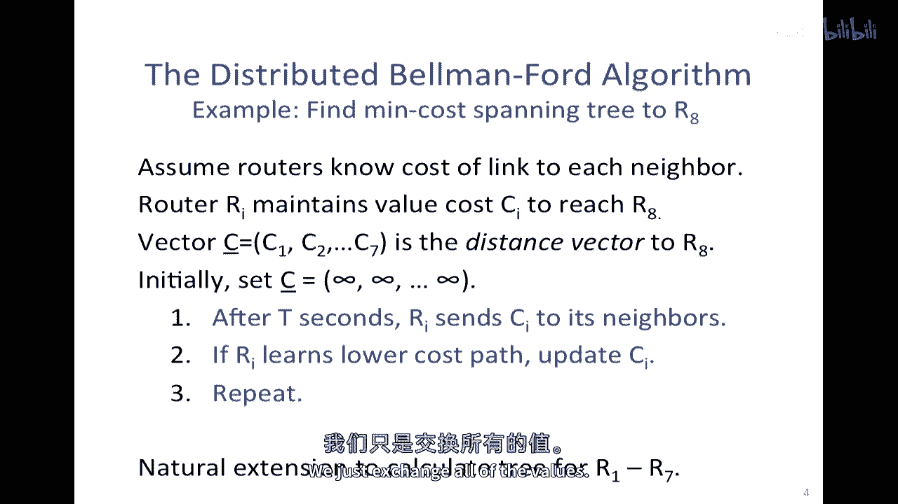

我已经在这里展示了一个例子现在，我们来看一个具体的例子，并且我们将看看这个特定的图在这里，我已经在上面标注了一些成本，它们与以前的成本不同，无论具体的值是多少，或者它们如何工作，它们如何产生。

无论是为了代表，使用链接的延迟，还是使用链接的价格，它们只是值，我们将尝试找到最小生成树，使用贝尔曼-福德算法，所以记住在贝尔曼-福德算法中，我们开始时将距离向量设置为从所有值到达我们的八个的初始距离。

所有值都被设置为无穷大，所以r1认为，嗯，开始时r2和其他值都认为距离是无穷大的，它们所有都认为为了到达我们的八个，距离是无穷大的，好的，这就是我们要开始的地方，然后我们将遍历并查看信息波通过。

以便我们可以更新这些，并逐渐收敛于最小生成树的成本，以便达到我们的八个，所以在下一步中，这些信息将从我们的八个向外传播，所以这里的信息将告诉我们在第一波中，嗯，我们的八个可以在一个跳中到达。

从这些路由器跳，R three 将要学习到它可以在四个步内到达那里，那是直接路径上的距离，R five 将要学习到它可以在六个步内到达那里，我们这里的六号将要学习到它可以在两步内到达那里。

并且我们的七号将要学习到它可以在一步内到达那里，所以这是他们在第一步中的成本，因此 r three 将会更新自己的值为四，六，分别为一和二，所以信息将传播到这里，到下一个跳点，因此。

路由器r4将在下一个学习，在算法的下一次迭代中，以便以成本2通过路由器r7到达那里，因此，通过路由器r7的成本为2，你是否也能以成本6通过路由器r6到达那里，这是一个更高的值，因此，它将忽略那个。

我们的2可以通过路由器r6和1的成本7+1到达那里，因此，通过路由器r5的成本为7，我们的1将学习它可以通过路由器r3以成本8到达那里，好的，因此，到这个点，我们可能会认为已经完成了。

因为每个路由器都已经听说过价值，但是，当然，这将继续下去，因为信息将继续传播，下一次这个消息将这样传播，这个消息将这样传播，这个消息将这样传播，等等，所以每个人都将在下一轮中听到更多的价值。

让我为了澄清而说明一下，看看下一轮会发生什么，这就是我刚刚，嗯，我刚刚向您展示的值，仅作为示例，路由器r1已经学习到，如果您记得，它可以通过路由器r3以成本8到达路由器r8。

所以它有通过路由器r3的价值8，例如，好的，所以现在发生了什么，你可以看到我们已经发现了所有两跳信息，所以这实际上是下一轮的两跳信息，我们将找到三跳信息，让我们看看这是什么三跳信息，基于这个。

我将改变那些我之前标记为红色的，让我们专注于这些，它们之前认为最低成本的路径是成本7，通过路由器r5，它将学习到这个三跳路径，因为路由器r4将向它广告，价值6，所以它将听到关于这个值的信息。

它可以通过路由器r4以成本6到达那里，所以这将成为新的价值，这就是这里，同样，我们的路由器r5将学习到通过路由器r4的三跳路径，它将学习到这个路径在这里，所以它将学习到这个值，通过路由器r4的成本为6。

所以这就是它，类似地，我们的路由器r6将学习到通过路由器r4的三跳路径，它将学习到这个路径在这里，它将学习到这个值，所以之前最便宜的路径是一个值六，现在它将学习一个值四，成本四，通过r四的路径。

所以这就是它刚刚学到的条目，所以实际上第一个三跳路径比两个两跳路径的成本更低，让我们看看下一轮会发生什么，在算法的下一轮中，好消息正在进一步传播到四跳路径，在四跳路径中，例如。

r1将学习到去一、二、三、四的四跳路径，这是一条成本七的路径，因为r2将传播有关它可以以成本六到达的信息，所以六加一等于七，所以如果它通过r2走，它可以以成本七到达，所以这就是这里，r2已经。

嗯已经学习了在这个下一跳中存在一个更好的路径，我们可以看到这一条，我将用绿色来绘制这条，以使它更清晰，它通过这里走，并且这是一条成本一、二、三、四、五的路径，所以它正在学习它可以以五到达。

如果它通过r5走，对，所以这里有一个有趣的事情，这些两段信息实际上是不一致的，嗯，因为算法还没有收敛，这个特定机会的消息还没有到达r1，所以我们将在下一步看到，在下一步，r1将学习到更新的值。

哪是嗯通过，嗯，它可以以成本六到达，在这里，一、二、三、四、五、六，通过这条路径，成本六通过r2，哦，我犯了一个小错误那里，好的，那应该是通过r2，所以现在看起来我们完成了，我们如何知道我们完成了呢。

我们可以看它，并看到我们不能找到任何更低成本的路径，这告诉我们我们完成了，但你也可以看到这将完成，它不能再走了，只要只要我们已经探索了网络中的最大跳数，并且这里的最大跳数是。

那么只要只要我们已经探索了网络的最大跳数，并且这里的最大跳数是，五十，你可以看到，有一条更长的路线，像这样走，这可能是最长的，所以这是一二三四五六，所以这将是另一条信息传播的另一条路径。

所以它是最长的环路自由路径，我们知道，有一条包含环路的路径，其成本必须更高，所以我们永远不会选择这条路线，所以只要我们已经走了与最长环路自由路径相同的跳数，我们就知道我们会完成问题。

我们如何知道我们会以正确的答案结束。

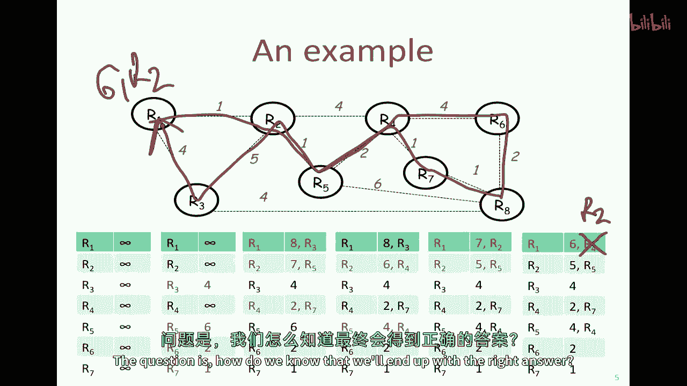

实际上，这里有几个值得在这里问的问题，第一个问题是算法的最大运行时间是多少，刚刚告诉你，它将是最长的环路自由路径，它将是最长的环路自由路径的跳数，算法是否总是直觉地收敛，实际上，它必须收敛。

我们开始时的值是无限的，我们只替换它们为更低的值，我们一直减少值，直到算法运行完成，所以我们只替换一个值为一个更低的成本值，最终我们应该听到所有邻居的最低成本路径，因此，最终我们将达到最低值并收敛。

所以算法总是收敛，这是算法聪明的地方，当链接成本改变时发生什么，或当链接和路由器失败时，我们将在下一分钟看到一个例子，当这种情况发生时，事情可能会出错，但在一般情况下，它将继续收敛，因为当某事物失败时。

如果突然出现一条更低的成本路径，那么它将找到它并开始使用它，当事物失败时，事情会变得稍微复杂一些，并且不再有一条通往某处的路径。

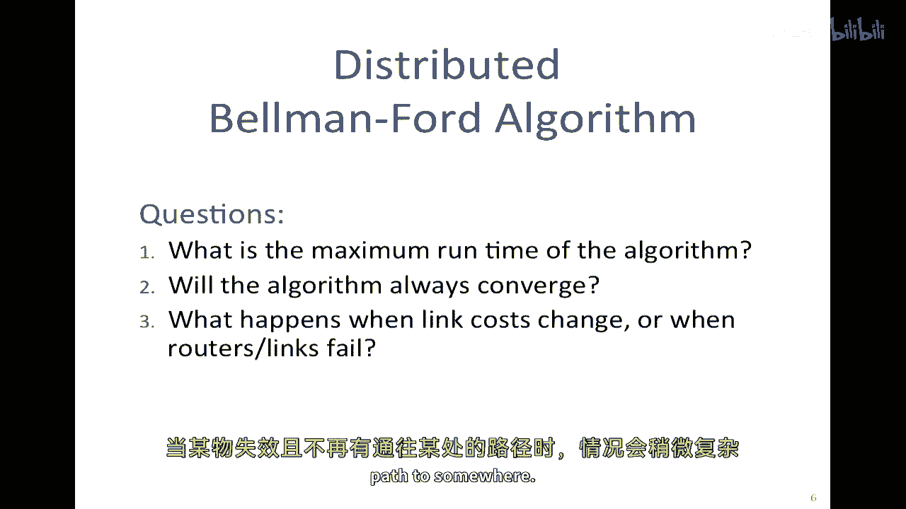

我将在这里看到一个例子，嗯，目前，贝尔曼-福特算法的这个问题是众所周知的，有时被描述为坏消息传播缓慢，让我们看看这里发生了什么，我们将看看这个非常简单的路由器网络，它们全部连接成一条线。

从路由器到下一个路由器的成本是一，所以这是一个非常简单、微不足道的例子，最初一切都正常工作，在时间零时，我们已收敛到这些值在这里，我们恰好知道我们可以到达我们的四，所以这是关于到达我们的四的成本，嗯。

在这个情况下，我们了解到r1可以以成本三到达，如果通过r2走，r2以2的成本可以到达那里，这就是这个加上这个，如果通过r3走，r3以1的成本可以到达那里，它直接连接到我们的4，所以一切都很好，但是突然。

3到4的链接要断开，所以这里的链接断了，接下来会发生什么，那么会发生什么，他们是否会继续广告他们的成本，我们的3开始广告嘿，我原以为我可以以1的成本到达那里，这是这里，但我不再有这个链接。

我知道这个链接断了，但我从r2听说，r2以2的成本可以到达那里，我现在只有一步之遥到r2，因此我必须能以3的成本到达那里，如果我把我的包发送到r2，显然这是错误的，r3是自欺欺人，真的不能做那个。

但由于从r2听到的这个价值，说，如果你，如果你把我的包发送给我，我会将我们的4送达给你，成本为2，加上我从你到的成本，因此成本为3，我们的1不知道失败情况，然而，让我们看看下一步会发生什么，所以问题是。

它会最终收敛并稳定在正确的值上吗，在下一步，因为r3现在广告其成本为3，如果通过r2走，这个消息会到达r2和r2会说嘿，你之前告诉我它是3的成本，但你现在抱歉，1的成本，你现在告诉我它是3的成本。

因此它必须花费我4的成本到达那里，是你广告给我的3成本，加上1，因此花费我4的成本到达那里，如果我通过r3走，你可以看到即将发生的事情，这是不是要逐渐的，他们将逐渐相互喂养，错误的信息迭代。

并且每一步都会增加，这就是要失控的螺旋，所以在下一轮，我们的三个r two将说嘿，你告诉我我可以在四步内到达那里，再加上我从你到我的成本，那就是五，如果我向你发送数据包，然后它就变成了五。

然后你知道它会变成六，以此类推，随着我们旋转，它只会不断增加，这被称为无限计数，问题或坏消息传播缓慢。

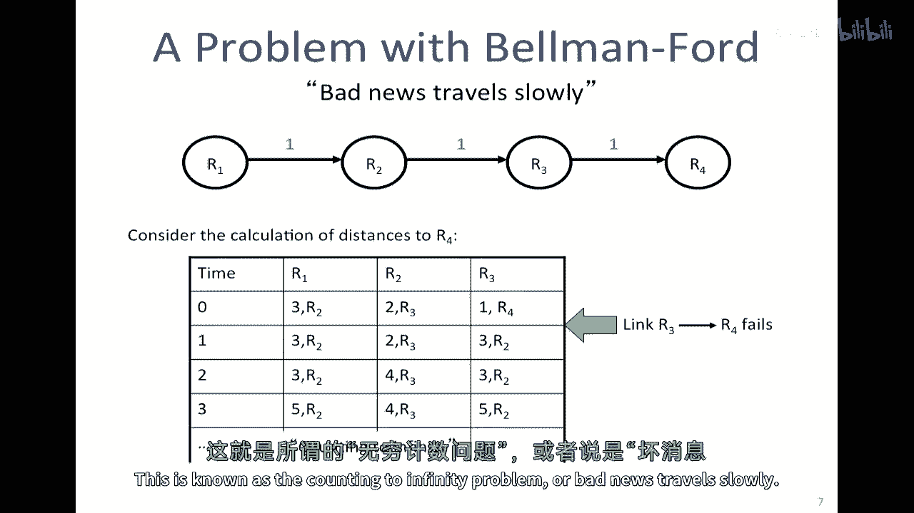

这个问题有一个相当简单的解决方案，那就是，它看起来有点笨拙，但我们可以将无限设置为一个小数字，并说十六，然后停止当你达到十六的计数时，如果你达到十六的计数，实际上意味着没有任何路径，有其他几种方法。

有一种被称为分割水平面的方法，你会在教科书中找到这个描述，嗯，基本上因为r two从r three收到了最低的成本路径，它不广告r three到r two的成本，换句话说。

因为r two最初从r three收到了最低的成本路径，它不发送这些，嗯，广告，r three和r two，所以r three永远不会认为它可以通过r two到达r four，这就是一种方法。

另一种方法是分割水平面与毒逆转，在这种情况下，所以它说，嗯，因为我从你听到了最低的成本路径，我将主动向你发送无限值，所以你绝对永远不会认为可以通过我来到达那里，所以这些都是对，真正优雅的算法的修复。

但在实践中，需要许多像这样的东西才能使其工作。

让我们看看贝尔曼-福特在实践中的表现，贝尔曼-福特是距离向量算法的一个例子，换句话说，有一个距离向量，由所有路由器维护，从他们到每个其他路由器的距离，然后他们迭代地收敛到正确的答案，换句话说。

正确的最小成本距离，这是因此距离因素算法的一个例子，并形成了其中一个的核心，嗯，这个，互联网上最初使用的路由协议，被称为rep和rip，rip代表路由信息协议，并且它被广泛使用很长时间。

这是因为它在路由器上需要很少的计算，它可以分布式计算，只需要很少的负担，每个路由器的计算负担，我们知道它最终会通过在这里进行一些小的修复来收敛，比如分割水平面技术和防止它随着时间的推移计数到无穷。

尽管它被其他算法取代，其他收集每个路由器上整个网络状态的技术，然后独立地根据他们自己计算最短路径树，所以不再是一个分布式算法，并在另一个视频中看到dykstra的最短路径优先算法的示例。

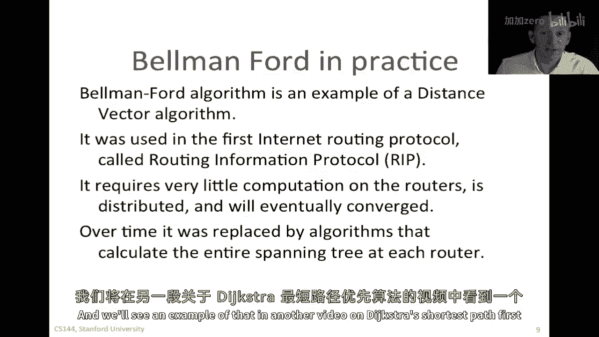