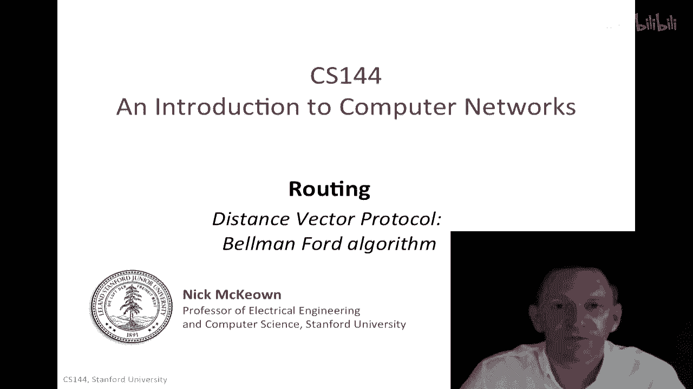
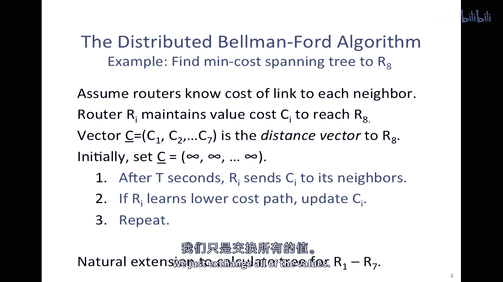
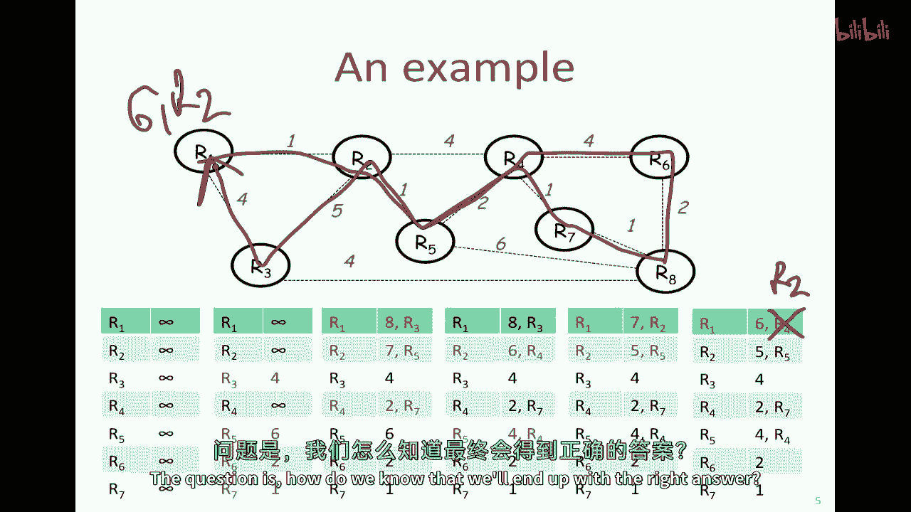
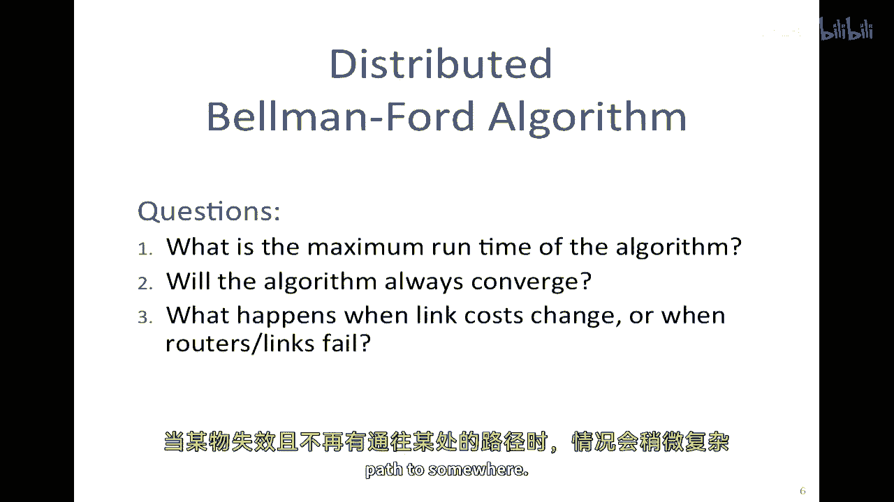
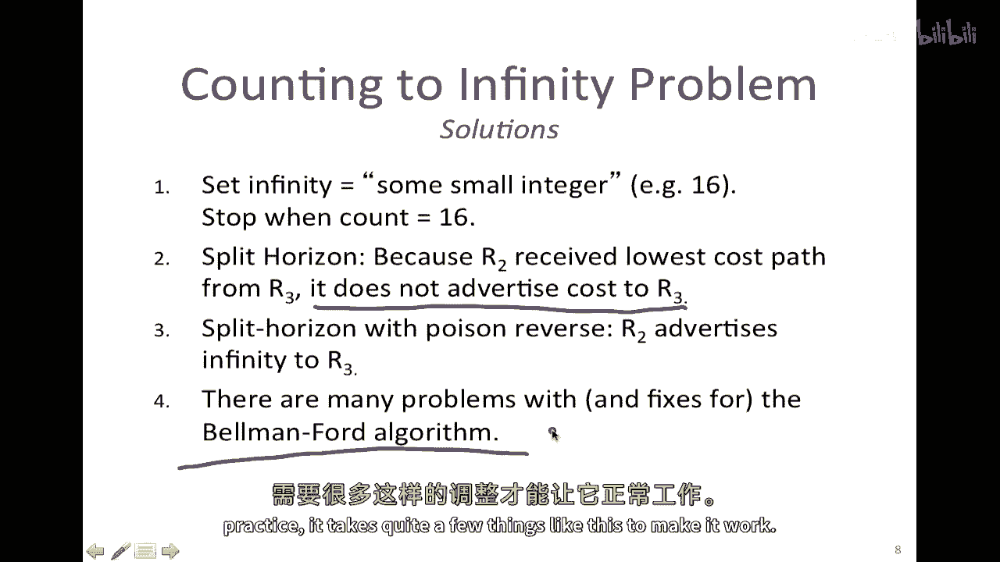

# 课程P86：距离向量路由与贝尔曼-福特算法 🧭

在本节课中，我们将学习一种名为“距离向量”的路由协议。我们将重点介绍其核心算法——贝尔曼-福特算法，了解路由器如何通过分布式协作，逐步找到通往网络中所有其他节点的最短路径。

## 概述

在上一节我们介绍了路由的基本概念，本节中我们来看看一种具体的分布式路由算法。距离向量协议的核心思想是：每个路由器维护一个“距离向量”，即它自己到达网络中所有其他路由器（或特定目标）的当前已知最短距离。路由器之间通过周期性地交换这些向量信息，并利用贝尔曼-福特算法进行迭代更新，最终所有路由器都能收敛，计算出到达每个目的地的最低成本路径（即最短路径树）。

## 问题定义：寻找最小成本生成树

我们要解决的核心问题是：一组路由器如何协同工作，找到连接所有节点的最小成本生成树？请注意，寻找路由器之间的最小生成树，与寻找包含所有终端主机的生成树是等价的，因为最终我们构建的是路由器之间的连通树。在后续例子中，我们将专注于路由器之间的路径计算。

## 分布式贝尔曼-福特算法详解

上一节我们定义了问题，本节中我们来看看贝尔曼-福特算法如何分布式地解决它。我们将通过一个具体案例来理解算法过程：计算从网络中所有其他路由器到达目标路由器R8的最小成本生成树。

算法基于以下设定和步骤：

*   **初始状态**：每个路由器`Ri`维护一个值`Ci`，代表它当前所知到达目标路由器R8的最小成本。初始时，所有`Ci`都被设置为无穷大（∞）。
*   **核心公式/更新规则**：每隔固定时间`t`秒，每个路由器`Ri`会执行以下操作：
    1.  向所有邻居路由器发送自己的当前`Ci`值。
    2.  同时，从每个邻居`Rj`那里接收对方告知的、邻居`Rj`到达目标R8的成本`Cj`。
    3.  根据收到的信息更新自己的`Ci`。更新规则是：`Ci = min( Ci, cost(Ri, Rj) + Cj )`，其中`cost(Ri, Rj)`是路由器`Ri`到其邻居`Rj`的直接链路成本。
*   **收敛**：只要学习到更低的路径成本，路由器就会更新自己的`Ci`。这个过程不断重复，直到所有路由器的`Ci`值不再变化，此时算法收敛，每个路由器都找到了到达R8的最短路径。

### 算法执行示例

以下是算法在示例网络中逐步运行的图示过程。我们将看到信息如何像波纹一样从目标R8向外扩散，并最终收敛。

（此处应插入图示，展示从初始∞状态，到第一跳、第二跳、第三跳信息传播后，各路由器`Ci`值的更新过程。图中会显示某些路径虽然跳数更多，但总成本可能更低，体现了算法寻找“最小成本”而非“最少跳数”的特性。）

通过示例可以看到，算法可能需要多轮迭代才能发现那些跳数更多但总成本更低的路径。当信息传播的跳数等于网络中**最长无环路径**的跳数时，算法必然能探索完所有可能路径，从而确保收敛到正确结果。

## 算法的特性与挑战

我们已经看到了贝尔曼-福特算法如何工作，现在我们来探讨它的一些重要特性及其面临的挑战。

### 收敛性与运行时间

*   **收敛性**：算法总是收敛。因为初始值为无穷大，每次更新只会用更小的值替换当前值，成本值只会下降或保持不变。最终，所有路由器都会获知所有邻居通告的最低成本路径，从而稳定下来。
*   **最大运行时间**：算法收敛所需的最大轮数（迭代次数）等于网络中**最长无环路径**的跳数。

### “坏消息传播慢”问题

然而，贝尔曼-福特算法有一个著名的缺陷，即“坏消息传播慢”或“无穷计数”问题。当网络中出现链路失效时，算法可能需要很长时间才能收敛到新的正确状态，甚至会产生路由环路。

**问题场景**：
假设有一条简单的线性拓扑路由器链：R1—R2—R3—R4，每条链路成本为1。初始时，R1知道通过R2到达R4的成本为3。
当R3与R4之间的链路断开后：
1.  R3发现直连链路失效，但它从R2处听说“我能以成本2到达R4”。于是R3错误地更新自己的成本为 `cost(R3,R2) + 2 = 1+2 = 3`，并通告出去。
2.  R2收到R3的新通告“我能以成本3到达R4”，于是R2更新自己的成本为 `cost(R2,R3) + 3 = 1+3 = 4`。
3.  此过程会持续下去，R3和R2相互“喂给”对方逐渐增大的错误成本值（4,5,6...），直到成本值增加到某个上限。

### 解决方案

为了解决“无穷计数”问题，实践中采用了以下几种技术：

以下是几种常见的修复方案：
*   **设置最大跳数**：定义一个较小的最大值（如RIP协议中的16），当成本计数值达到该上限时，路由器即认为目标网络不可达。
*   **水平分割**：路由器不会向某个邻居通告从该邻居学来的路由信息。这防止了环路中两个路由器相互依赖对方的信息。
*   **带毒性逆转的水平分割**：路由器会主动向提供最佳路径的邻居通告该目的地的成本为无穷大，明确告知对方“不要通过我再去往那个目的地”。

## 实践应用与总结

贝尔曼-福特算法是**距离向量路由算法**的一个典型代表。这类算法的特点是每个路由器只维护一个到所有目的地的距离向量，并通过与邻居交换信息来分布式地、迭代地收敛到正确答案。

**路由信息协议（RIP）** 就是基于距离向量算法的经典协议，它曾在互联网上被广泛使用。其优点是实现简单，对路由器计算资源要求低。

然而，由于收敛速度慢和可能产生环路等问题，RIP等距离向量协议在大型网络中逐渐被**链路状态路由协议**（如OSPF）所取代。链路状态协议要求每个路由器收集整个网络的拓扑信息，然后独立地运行**迪杰斯特拉最短路径优先算法**来计算最短路径树，这通常能提供更快的收敛速度和更优的路径选择。

**本节课中我们一起学习了**：
1.  距离向量路由协议的基本思想。
2.  贝尔曼-福特分布式算法的详细步骤与更新规则。
3.  通过示例理解了算法的迭代收敛过程。
4.  认识了算法“坏消息传播慢”的核心缺陷及其常见解决方案（如水平分割、毒性逆转）。
5.  了解了该算法在历史上的实际应用（如RIP协议）及其在现代网络中被链路状态协议替代的原因。