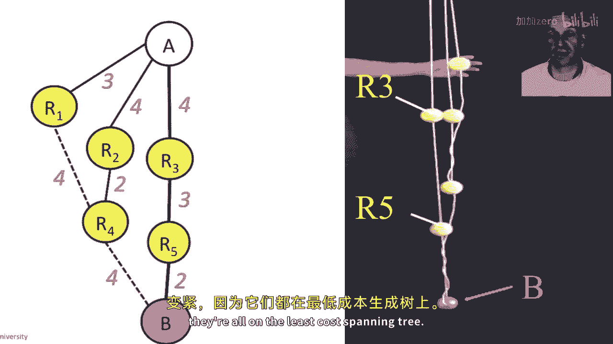

# 课程 P87：链路状态路由与Dijkstra算法详解 🧭

在本课程中，我们将深入探讨路由协议中的链路状态算法，重点学习**Dijkstra最短路径优先算法**。我们将了解路由器如何通过交换网络拓扑信息，并独立计算出到达网络中所有其他节点的最短路径树。

---

## 链路状态算法概述

上一节我们介绍了距离向量路由的基本概念。本节中，我们来看看另一种重要的路由算法——链路状态算法。

在链路状态算法中，路由器首先会向网络中的所有其他路由器广播关于网络拓扑的全部信息。这些信息包括哪些链路是连通的、哪些是中断的，以及每条链路的成本。通过这种方式，每个路由器都能获得一张完整的网络拓扑图。

## Dijkstra最短路径优先算法

Dijkstra最短路径优先算法是链路状态算法的一个典型代表。一旦路由器拥有了完整的网络拓扑图，它就会独立运行Dijkstra算法，计算出从自身出发，到达网络中所有其他路由器的最小成本生成树。

以下是Dijkstra算法的核心步骤：

1.  **初始化**：将源节点（例如路由器R8）加入“最短路径树”集合。计算所有直接邻居节点到源节点的路径成本。
2.  **选择节点**：从尚未加入树的节点中，选择一个到源节点路径成本最低的节点。
3.  **更新路径**：将这个新节点加入最短路径树。然后，检查通过这个新节点，是否能以更低的成本到达其他尚未加入树的邻居节点。如果可以，则更新这些节点的路径成本。
4.  **重复**：重复步骤2和步骤3，直到所有节点都加入了最短路径树。

我们可以用伪代码来描述这个过程：

```python
# 伪代码示例
def dijkstra(graph, source):
    # 初始化距离字典，所有节点距离设为无穷大，源节点距离设为0
    distance = {node: float('infinity') for node in graph}
    distance[source] = 0
    # 初始化最短路径树集合和待处理节点集合
    shortest_path_tree = set()
    all_nodes = set(graph.nodes)

    while all_nodes:
        # 选择当前距离最小的节点
        current_node = min(all_nodes, key=lambda node: distance[node])
        all_nodes.remove(current_node)
        shortest_path_tree.add(current_node)

        # 更新邻居节点的距离
        for neighbor, weight in graph[current_node].items():
            new_distance = distance[current_node] + weight
            if new_distance < distance[neighbor]:
                distance[neighbor] = new_distance

    return distance, shortest_path_tree
```

## 算法实例演示

让我们通过一个具体的网络拓扑来演示Dijkstra算法的执行过程。假设我们有一个包含8个路由器（R1-R8）的网络，链路及其成本标注如下。

我们将以R8为源节点，计算其最短路径树。

以下是算法执行的迭代过程：

*   **步骤0**：起始集合包含R8。候选节点为R3、R5、R6、R7。其中R7到R8的成本最低（成本1），因此首先将R7加入树中。
*   **步骤1**：最短路径树包含{R8, R7}。候选节点更新为R3、R5、R6（原候选）以及R4（通过R7可达）。R4和R6到R8的成本均为2（例如，R8->R7->R4 成本为1+1=2）。我们选择R6加入。
*   **步骤2**：最短路径树包含{R8, R7, R6}。继续从候选节点（R3, R5, R4）中选择成本最低的节点加入。以此类推，直到所有节点都被加入树中。

通过这样一步步地添加节点，最终我们就能得到从R8到所有其他路由器的最小成本生成树。

## 算法的特性与实际问题

关于Dijkstra算法，有几个重要的特性需要了解：

*   **时间复杂度**：算法需要运行n次迭代（n为网络中的路由器数量），每次迭代选择一个节点。在最简单的实现中，其时间复杂度为 **O(n²)**。
*   **应对网络变化**：当链路状态发生变化（如链路故障或成本改变）时，发现变化的路由器会将此信息**广播**给网络中的所有其他路由器。所有路由器在收到更新后，会**重新运行**Dijkstra算法，基于新的拓扑图计算最短路径树。这种机制避免了“坏消息传播慢”的问题。
*   **实际应用**：Dijkstra算法是**OSPF（开放最短路径优先）** 协议的基础，该协议在互联网中被广泛使用。

## 一个直观的理解方式

理解Dijkstra算法还有一种非常直观的方法。想象每个路由器是一个球，每条链路是一根绳子，绳子的长度等于链路的成本。将所有球放在平面上，并用对应长度的绳子连接它们。


当我们提起源节点（比如球A）时，整个结构会被拉起来。最终被拉紧的绳子，就构成了从A到所有其他节点的最短路径树。而那些松弛的、未被拉紧的绳子，则不在最短路径树上。这个物理模型生动地展示了算法“寻找最短路径”的本质。

---




**本节课总结**：我们一起学习了链路状态路由的核心——**Dijkstra最短路径优先算法**。我们了解了路由器如何通过交换链路状态信息来获取全网拓扑，并独立运行该算法，计算出以自身为根、到达所有目的地的最小成本路径树。我们还探讨了算法的步骤、特性及其在实际协议（如OSPF）中的应用。最后，通过一个形象的“球与绳子”模型，加深了对算法原理的理解。