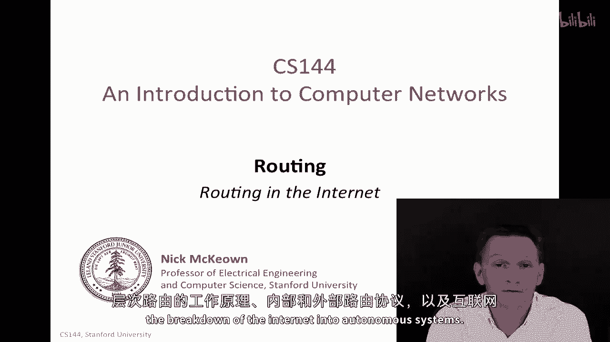
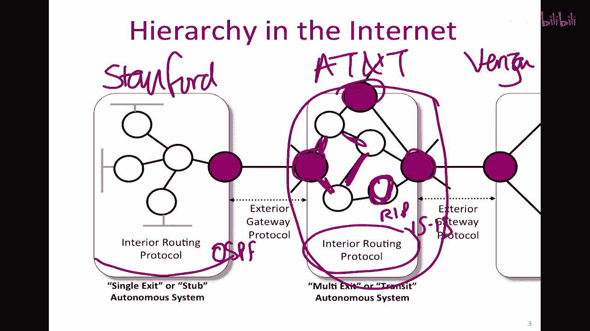
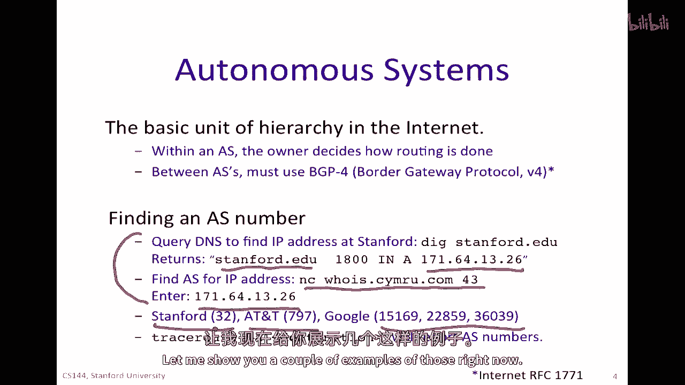
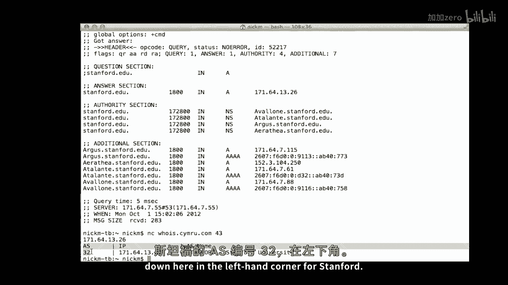
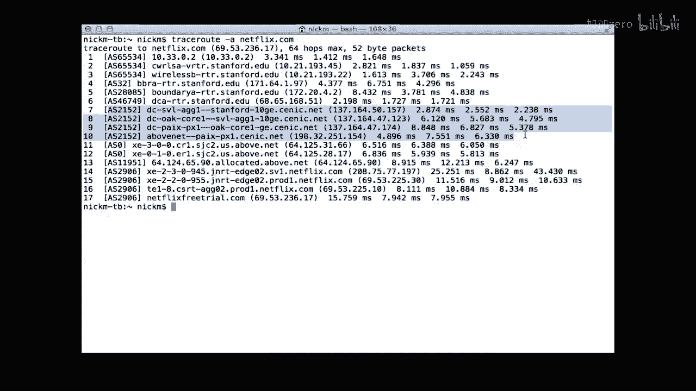
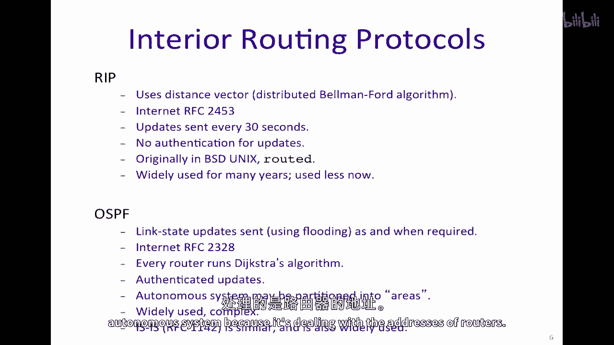
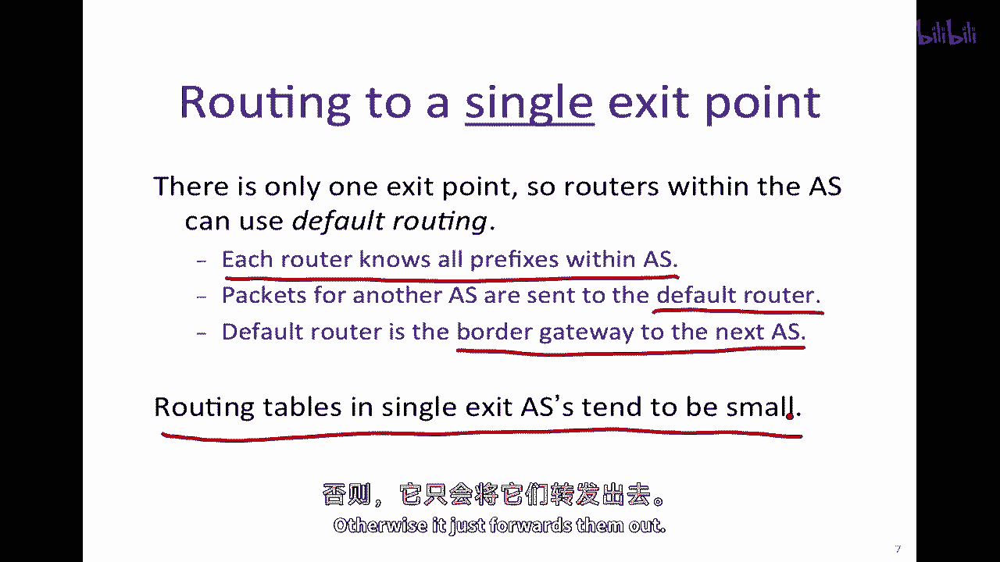
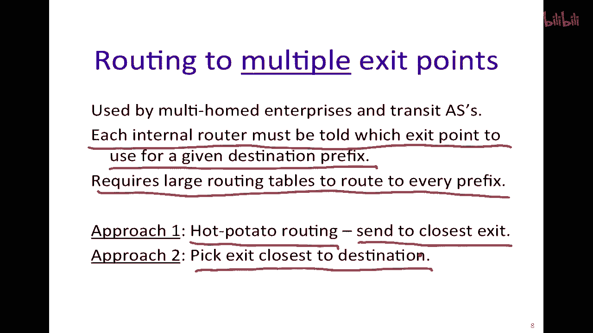
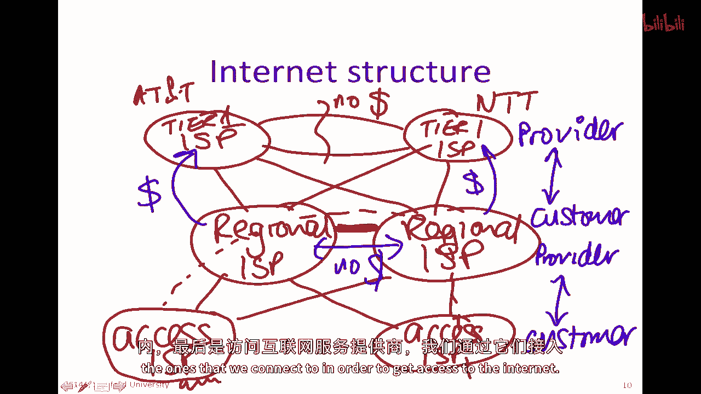
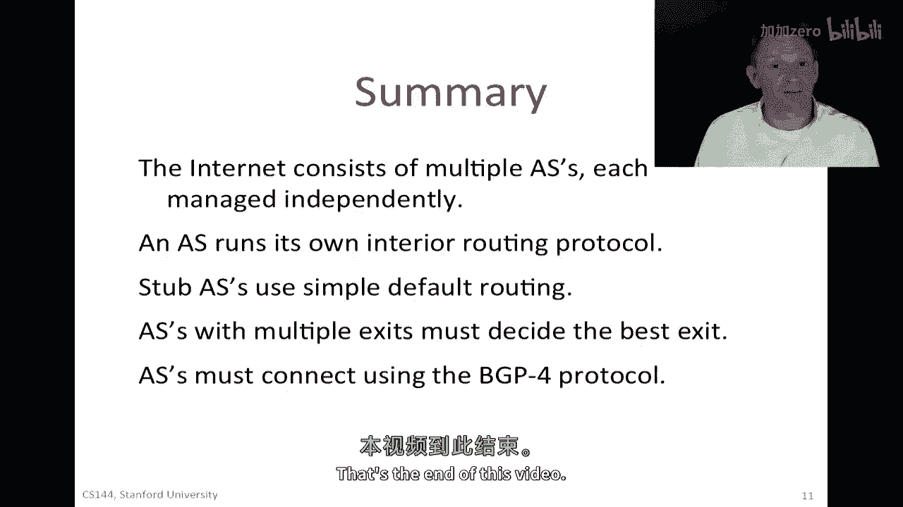

# P88：p87 6-4 Routing - Internet (RIP OSPF) ASs - 加加zero - BV1qotgeXE8D

现在我们已经学习了路由的基本知识，洪水，最短路径生成树等，我们还学习了距离向量协议，贝尔曼-福特算法，在这个视频中，我们学习了链路状态协议或迪杰斯特拉的最短路径优先算法，我将把它们 all 结合起来。

告诉你互联网的结构，如何工作分层路由，关于内部和外部路由协议，以及互联网被分解为自治系统的情况。

我将谈论三个主要事项，首先，是关于层次结构和互联网分解为自治系统的问题，其次，在这些自治系统内部，我们如何使用我们已经见过的距离向量和链接状态算法，以及第三个是关于互联网结果的结构。

让我们从层次结构开始，当我们学习距离向量和链接状态算法时，我们考虑网络是一个由路由器组成的单一集合，这实际上是这实际上是，不实际的，互联网由数百万台路由器通过数十亿不同的用户相互连接而成，因此。

仅仅出于规模的原因，我们需要将路由分解为较小的集，所以我们这样做以扩大规模，嗯，在拥有大量路由器的情况下，路由器之间交换路由信息的巨大规模，以及保持其最新状态，使这变得难以实现，我的意思是。

想象与百万其他路由器交换链路状态信息，网络将始终被更新淹没，距离向量算法永远不会收敛，因此，分解将发生在不同的，嗯，自主系统中，这里有例子，这将是一个自主系统，这个自主系统包含不同的路由器，这些是。

这个特定的有一个出口点，然后我们将在一分钟内看到那个的重要性，在那个自治系统中，系统可以自由选择自己的内部路由协议，换句话说，来决定如何在这个自治系统中包是如何路由的。

所以这种特定的自治系统被称为单一出口或stub自治系统，还有一种自治系统被称为多出口或多出口，嗯，自治系统，例如，这一位置，这是一处，在这种特定情况下，有三处出口，再次，这是一个自主系统，因此。

他们可以自由决定在自主系统中数据包的路由方式，使用他们选择的内部路由协议，这是因为他们正在尝试，嗯，互联网被设计来给予行政自主权，嗯，互联网是由许多不同实体构建的，所以这里一个实体可能是斯坦福的网络。

而那里可能是，例如，像a&t这样的提供商，他们是，嗯，他们将我们的数据包路由到其他网络，因为随着时间的推移，许多不同的实体成长起来，而且，所有这些都有自己独特的目标和欲望。

互联网的原始目标之一是允许每个组织，独立决定如何运行自己网络的一部分，允许其有机增长，而且在许多方面，这是互联网有机增长的一个重要因素，特别是在九十年代，并允许每个一个决定在其网络中使用哪种路由协议。

所以这意味着，例如，在斯坦福，我们可能会使用内部路由协议ospf来路由我们的数据包，而在内部网络中，他们可能会使用rip，或者他们可能会使用另一个被称为isis的协议，它允许本地定制，它导致差异化。

所以，在这里，verizon可能会与这里竞争，他们可以通过差异化并提供不同的服务来区分自己，对我来说，希望如此，最终客户可以得到更好的服务，因此，通过运营商之间的竞争，并且通过允许本地定制。

这意味着路由器供应商也可以提供不同种类的功能和特性，因此这也导致了路由器供应商之间的竞争，因此出于所有这些原因，互联网被划分为自治系统。

自治系统或ais是互联网的基本单位，在ais中，所有者决定如何进行路由，而在s之间，我们必须使用bgp four，这是边界网关协议，它由互联网rfc一七七一定义，这就允许所有不同的区域之间保持一致。

对所有不同的区域都有一个一致的通信方法，稍后我们将在视频中学习bgp，如果你想找到as号，嗯，你可以用多种方式做，一种方法是，实际上最简单的就是直接对特定目的地进行tracer route。

加上-a选项，嗯，这将给你作为数字的结果，嗯，大多数或许多企业之间的那些将会有一个单一的，例如，斯坦福的，如果你，嗯，如果你发现它会是三个二个在t是七九七。

一些企业选择将他们自己的网络分解为多个自治系统，例如，谷歌报告有三种，一些网络甚至甚至有几十种，这是一种稍微复杂的查找方式，但是，具体查询的方式是这样的，那就是使用netcat nc进行查询。

如果你这样做，所以，本质上是去这个特定的who is provider，然后输入一个特定的ip地址，它会告诉你哪个自治系统，嗯，这个IP地址属于so，如果你想找到斯坦福的AS号。

首先你需要进行一个DNS查找，点edu，在A记录中找到它，这是主要地址，然后你可以找到那个特定IP地址的自主系统，通过这样做，通过在这里输入它，然后那将会返回AS为32的三位。

让我来给你展示一些那些的例子。

假设我想要找到斯坦福的as号，我可以从查找斯坦福的记录开始，在这里我们可以看到它，主要的as记录地址，然后我可以，嗯，做到查找到，使用netcat到，这是谁这只是，嗯，提供我喜欢的特定一种人，嗯。

如果我在这里输入斯坦福的嗯地址，然后我们看看这里返回的截至三十二的信息，在斯坦福的左上角。

同样，如果我想要找到沿路径从计算机到Netflix。com的路由器的AS号，以及从计算机到Netflix。com的路径上的网络号，我可以使用trtrust root减去trace route。

减去一个选项，让我们开始，我们来看看这个，所以在顶部我们看到，或接近顶部我们看到对应于斯坦福的AS32，在底部我们看到对应于Netflix的AS2906，嗯，我们看到这里有一个，它是AS65，534。

这基本上意味着它是私有地址，133。0。2。10，因为它以10开头，是斯坦福内部使用的私有IP地址，所以， given它是私有地址，它不能返回，和AS号，在这里中间我们看到2152，这是一个美丽的。

这是连接我们之间斯坦福和外部提供商的加利福尼亚网络。

现在我们知道基本结构，让我们看内部路由协议，我已经提到了rip或路由信息协议，这是互联网上第一个广泛使用的内部路由协议，它使用距离向量，特别是在分布式贝尔曼-福特算法中，它由互联网RFC描述。

这实际上是rip的第二版，这是广泛使用的一版，它每30秒发送更新，并会确定路由器不可用，如果它没有在180秒或3分钟内听到，没有更新认证，这意味着肯定有一些，使用rip时，有一些安全影响开始变得流行。

因为它最初在BSD版本的Unix中，有一个广泛可用的恶魔，用于使用rip的路由器，嗯，它的发音是route d，你可以在网络上找到许多关于它的参考，所以它被广泛使用很多年，很多年，它现在用得稍微少一些。

由于人们发现与重复路由相关的收敛问题，并且它通常被ospf或isis所取代，这是一种，这与我们的spf非常相似，所以ospf在互联网上被定义，RFC 2383，RFC 2488，它是一种链路状态算法。

所以链路状态更新使用广播发送，嗯，以防我在我们开始使用洪水之前没有说这一点，因为在我们试图找到网络拓扑结构的时候，我们不知道如何到达任何人，所以我们没有任何拓扑信息，这就是为什么我们在洪水链路状态信息。

以便我们不能将链路状态信息路由到每个路由器，因为我们不知道路径，所以洪水是最简单的路由表，一种无障碍的方法，以确保网络中的每个路由器都能找到链路状态，这就是为什么洪水被使用，它运行迪杰斯特拉算法。

正如我们所知，更新是经过验证的，这意味着我们确定它们属于路由器，我们，嗯，我们正在与，因为某些自治系统非常大，将它们分割成区域是非常常见的，所以，我们这里的斯坦福校园网络被分割成了ospf区域。

它被广泛使用，这相当复杂，在这里是一个粗略的简化，但它给我们介绍了ospf的基本工作原理，所以只要我们知道如何在自治系统中路由数据包，就值得问一个问题。

如何在自治系统中从一个自治系统路由到另一个自治系统，所以它们如何首先离开自治系统，因为内部路由协议不会直接告诉我们，我们如何从自治系统中退出，因为它处理的是位于这个自治系统之外的路由器地址。

所以，我们需要考虑的真正情况有两个，一个是当我们路由到单个出口点时，所以，这将是从一个实际上只有单个出口点的stub自治系统，在这种情况下比在有多个出口点的更一般情况下更容易，所以，如果只有一个出口点。

自治系统内的路由器可以使用被称为默认路由的东西，每个路由器都知道其自治系统内的所有前缀，所以它知道自治系统内的所有前缀，对于另一个自治系统的包，将被发送到被称为默认路由器的地方。

并且默认路由器是通往下一个自治系统的边界网关，所以这很方便和简单，它本质上说，如果你在包中看到一个你不知道如何处理的地址，那么只需将其转发给默认路由器，和默认路由，意味着单个出口路由器的路由表通常很小。

因为每个路由器只需要持有其自治系统内部的前缀地址，否则它就将它们转发出去。

很方便和简单，当我们需要路由到多个出口点时，生活变得更加复杂，所以这将在一个过渡自主系统或一个有多个出口点的系统中出现，实际上，在过去的几年里，这已经成为一种更常见的情况，因为几乎所有大型企业。

如斯坦福，都会连接到多个出口点，以连接不同的服务提供商，所以，我们可能会提供我们可能会连接到一个教育骨干，一个研究和教育网络，然后，我们将连接到一到两个商业提供商，以防止他们中的一个崩溃。

其中一个可能是暂时不可用的，其中一个可能是对于特定路线来说太昂贵的，它允许我们选择并控制，所以多路径路由非常常见，现在我们需要为每个出站包选择它将使用的出口点。

所以这里的问题是每个内部路由器都必须被告诉使用哪个出口点，对于给定的目的前缀，这是问题的本质，意味着当它看到前缀时，这个前缀不在自治系统内部，它必须知道使用哪个出口点，所以这意味着它需要非常大的路由表。

以便可能路由到每个前缀，因此，一个具有多个出口点的自治系统的路由表通常非常大，数千到数十万的前缀条目，这可以实际上被做得稍微简单一些，如果自主系统使用被称为热土豆路由的方式，热土豆路由是当。

而不是在包和目的地的最佳利益下做出明智的选择，它简单地发送到最近的出口点，换句话说，它对任何给定的路由器说，它发送它到离它最近的出口点，如果它决定不在自主系统中，一，热，土豆路由也被视为一定程度的卸载。

自主系统的自私行为，因为它可以以最快的速度卸载数据包，以便成为别人的问题，并且在其相邻的自主系统中并不很受欢迎，但实际上在今天的互联网上被广泛使用，出于商业原因和简化的原因。

更复杂的方法是选择离目的地最近的出口，或是最便宜的路径到达最终目的地，那就是需要在自治系统中传播更多的信息，以便做出那个决定。

现在我们已经了解了一些自治系统内部路由是如何进行的，我现在想要解释一下外部路由协议，Bgp四，互联网上的每个自治系统都必须使用bgp与其他自治系统互联，Bgp四，就像我们必须使用ip来传递我们的包一样。

这就是互联网使用的，路由协议的薄片是bgp用于的，换句话说，"那就是我们必须 all 的都"，"所以，我将在另一个视频中描述bgp四"，"但是我只是想告诉你一些关于BGP的问题"，"旨在尝试解决"。

首先，它是嗯，它具有极大的，"对于外部路由协议来说，这个问题与内部路由协议有很大的不同"，"特别是"，"当我们考虑拓扑学时"，"互联网是一个由许多相互独立的系统组成的非常复杂的网状结构。"。

并且它几乎没有结构，你看过这张图片，它是这个课程的标志，我们以后也会看到，它是一个非常无结构的互联连接网状结构，所以我们试图利用这一点，嗯，任何结构都不能让我们走很远，每个自主系统都独立控制。

所以它们可能会以非常不同的方式定义链接成本，所以不可能找到最低成本路径，我们仅仅需要找到一套路径，基于他们通过的自主系统数量，我们还需要考虑的一件事是信任，当我们在自主系统之间移动时。

我们会发现一些自主系统不愿意信任其他系统，也许他们不信任他们来推广好的路线，例如他们可能，他们可能，他们可能竞争对手，或者他们，他们可能想要保护他们的交通隐私，"因此。

他们可能不想通过另一个自主系统发送流量。"，例如，这可能是一个交战的国家，"另一个导致BGP4的原因或事项是"，"嗯"，"出发去解决的问题是独立的政策问题"，"所以，不同的自主系统有不同的目标"。

"他们可能会尝试选择跳转次数最少的路径，有些人可能更倾向于一个提供商而不是另一个"，他们可能与一个供应商有比另一个供应商更低的成本安排，所以他们有本地政策，可能不想与他人分享，一般来说，这些政策被保密。

所以，Bg b four 设计成能够在一种方式下工作，允许该政策成为当地的，自主系统的私人事务，所以我们会看看那个，我们将在另一个视频中详细讨论 bgp，最后，我想告诉你关于互联网结构的一点。

正如我们所见，所以首先，在，最顶层，有，嗯，我们可能会，我们所有人都会识别为互联网服务提供商的，他们可能是像at&t这样的公司，嗯，他们可能在日本，这可能是，大约有十几种这种，所谓的第一层，第一层。

ISPs，他们被定义为完全相互连接的ISPs，相互连接，并且彼此之间没有收费，他们之间进行零费用互连，被称为零结算互连，换句话说，没有金钱流动，嗯，穿过这个，嗯，他们之间的这个接口。

然后他们连接到被称为通常被称为区域isp的东西，这可能对应于一个州、一个县或一个国家的一个地区，而那些反过来连接到他们下面的，嗯，被称为接入isp的东西，所以这里会有许多接入isp。

这些就是我们作为用户连接的，所以用户在这些接入服务提供商的下面，而且他们可能会在这里的接入服务提供商连接到多个区域接入服务提供商，而区域接入服务提供商通常会连接到多个一级接入服务提供商。

所以这种层次结构是一种，在这些之间有一种明确的关系，这些实体，所以总的来说，在上面是提供者，在下面是客户，所以供应商正在向客户提供服务，这样一直往下走，所以在往下走，这是供应商，这是客户，一般来说。

供应商会向客户收费，换句话说，为了从区域到级别发送数据包，然后收取结算费用，他们通常跟踪在那里发送的所有数据，如一个月，然后，在那段时间后他们会结算，所以从那边会收取费用，但是这边没有资金流入。

所以为了节省资金，地区ISP们通常在这里有连接，以便于访问ISP之间的数据包，如果流量量大，这些数据包实际上可以通过地区ISP而不必通过顶级ISP，因此他们不需要，嗯来支付那个。

所以这就是基本的互联网基础设施，第一层ISP在全球范围内大约有十几家，然后，区域ISP通常在一个国家或一个国家的区域内，然后，接入ISP连接到我们连接的ISP，以便获取互联网访问权。

所以，总的来说，互联网由多个自治系统AS组成，每个都独立管理，运行自己的内部路由协议，换句话说，它选择要运行的一个，和，嗯，在，对于stub ais的情况，他们使用简单的默认路由，因此它们非常简单。

有多个出口点的ais必须决定使用最佳的出口，当路由数据包到其他自治系统时，ais必须相互连接，使用bgp四协议，这是我们将在未来视频中学习的。

