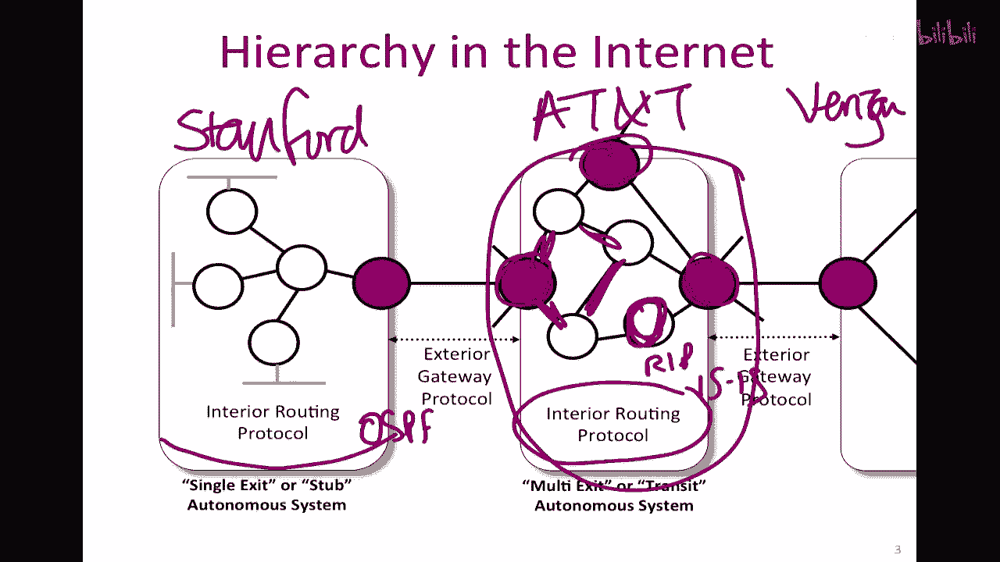
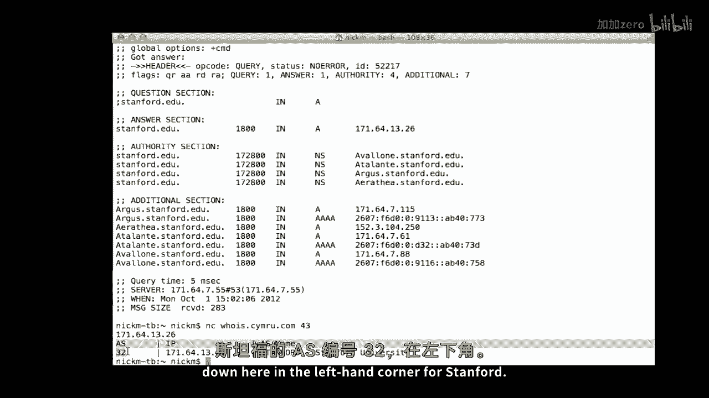
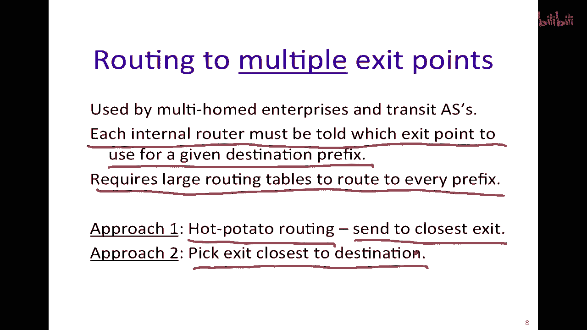

# 课程P88：互联网路由与自治系统 🌐


在本节课中，我们将学习互联网如何通过分层路由来组织，特别是通过将网络划分为**自治系统**。我们将探讨自治系统内部使用的路由协议（如RIP和OSPF），以及它们之间如何通过外部协议（如BGP）进行互联。课程将帮助你理解互联网的基本结构和路由决策过程。

---

## 互联网的层次结构与自治系统 🏗️

上一节我们介绍了基本的路由算法。本节中我们来看看互联网的实际结构。由于互联网规模庞大，包含数百万台路由器，因此需要一种方法来管理路由信息的规模。

互联网被划分为多个**自治系统**。每个AS是一组由单一机构管理、使用共同路由策略的路由器网络。这种划分带来了管理上的自主性和可扩展性。

以下是关于自治系统的关键点：



*   **自主权**：每个AS可以自由选择其内部使用的路由协议。
*   **类型**：AS主要分为两类：
    *   **单出口AS**：只有一个连接点通往其他AS。
    *   **多出口AS**：有多个连接点通往其他AS。
*   **目的**：这种结构支持互联网的有机增长，允许不同组织（如大学、ISP）独立管理自己的网络，并通过差异化服务促进竞争。

---

## 自治系统内部路由协议 🔄


了解了AS的基本概念后，我们来看看AS内部是如何进行路由的。AS内部使用的协议称为**内部网关协议**。



以下是两种主要的内部路由协议：

1.  **RIP**
    *   全称：**路由信息协议**。
    *   类型：基于**距离向量**算法，使用**贝尔曼-福特算法**。
    *   特点：每30秒广播一次路由更新。如果180秒未收到邻居更新，则认为该路径失效。
    *   公式：`距离向量更新规则：D_x(y) = min_v { c(x,v) + D_v(y) }`，其中`c(x,v)`是节点x到邻居v的成本，`D_v(y)`是邻居v到目标y的距离。


2.  **OSPF**
    *   全称：**开放最短路径优先**协议。
    *   类型：基于**链路状态**算法，使用**迪杰斯特拉算法**计算最短路径。
    *   特点：路由器通过**洪泛**方式广播链路状态信息，使所有路由器构建一致的网络拓扑图，然后各自计算最短路径树。
    *   代码逻辑（简化）：
        ```python
        # 迪杰斯特拉算法核心思想
        初始化所有节点距离为无穷大，起点距离为0
        while 存在未访问节点:
            u = 未访问节点中距离最小的节点
            标记u为已访问
            for u的每个邻居v:
                如果 通过u到达v的距离 < v的当前距离:
                    更新v的距离
                    记录u为v的前驱节点
        ```

---

## 数据包如何离开自治系统 🚪

现在我们知道如何在AS内部路由，那么数据包如何路由到其他AS呢？这取决于AS是单出口还是多出口。

*   **单出口AS（默认路由）**：
    *   对于目标地址不在本AS内的数据包，AS内的所有路由器将其转发给一个指定的**默认路由器**（即边界网关）。
    *   优点：路由表小，配置简单。


*   **多出口AS（出口选择）**：
    *   内部路由器需要为每个外部目标前缀选择使用哪个出口点。
    *   这导致路由表非常庞大（包含数万甚至数十万条目）。
    *   常见的出口选择策略有：
        *   **热土豆路由**：将数据包发送到**离本路由器最近**的出口点，以最快速度将包送出本AS。
        *   **基于目的地的路由**：选择**离最终目的地最近**或**成本最低**的出口点，但这需要在AS内传播更多外部路由信息。

---


## 自治系统间的互联：BGP 🌉

AS内部的路由协议无法处理AS间的路由。因此，所有AS必须使用统一的外部网关协议进行互联，这就是**边界网关协议**。

BGP（当前版本为BGP-4）的设计是为了解决互联网这个复杂、无严格层次结构的网状网络中的特殊问题：

*   **策略性**：各AS有不同的商业目标和策略（如偏好某个供应商、成本考虑），BGP允许这些策略保持本地化和私有。
*   **可达性优于最优性**：目标更多是找到一条**可达的路径**，而非计算理论上的“最短”路径，因为各AS对链路成本的衡量标准不同。
*   **信任与安全**：AS之间可能存在竞争或不完全信任的关系，BGP需要在这种环境下工作。



BGP的详细机制将在后续课程中深入探讨。

---

## 互联网的整体结构图 🗺️

综合以上内容，我们可以描绘出互联网的大致分层结构：

1.  **第一层ISP**：位于顶层，数量很少（全球约十几个）。它们之间完全互联，通常采用**免费对等互联**，互不结算费用。
2.  **区域ISP**：位于中层，覆盖一个国家或地区。它们向上连接一个或多个第一层ISP，向下连接多个接入ISP。
3.  **接入ISP**：位于底层，直接为最终用户（家庭、企业）提供互联网接入服务。

这种结构形成了“提供商-客户”关系链，数据流量通常自上而下流动，并伴随结算关系。为了节省成本，同层的ISP之间也可能直接建立连接。

---

## 总结 📚

本节课中我们一起学习了互联网路由的核心组织方式。我们了解到：


*   互联网由众多**自治系统**组成，每个AS独立管理，运行自己的内部路由协议（如RIP或OSPF）。
*   **单出口AS**使用简单的默认路由，而**多出口AS**需要复杂的机制来选择数据包的最佳出口点。
*   所有AS通过**BGP-4**协议相互连接，以交换路由信息并实现全球互联。
*   互联网整体呈现分层结构，包括第一层ISP、区域ISP和接入ISP，这种结构支撑着全球网络的运行与商业模型。


理解AS和分层路由是理解互联网如何作为一个整体工作的关键基础。